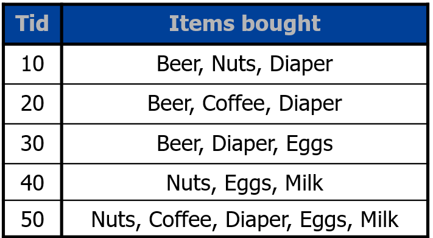
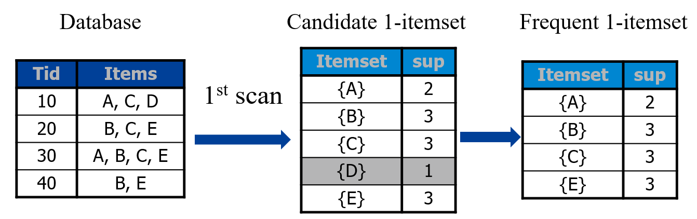
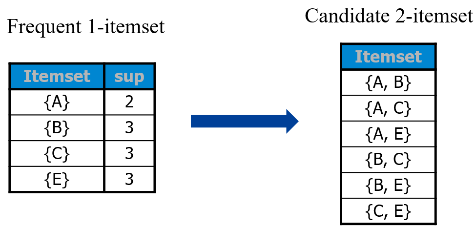
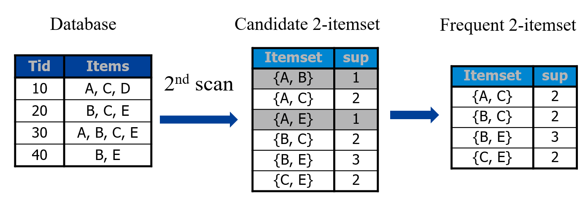
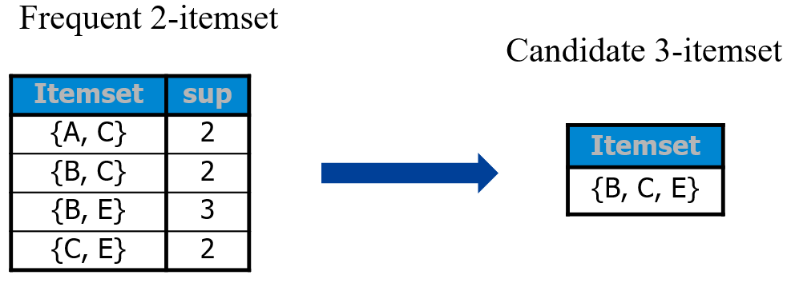
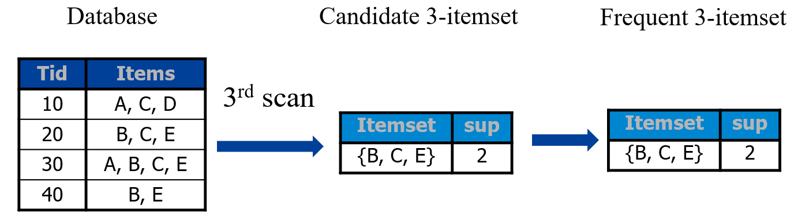
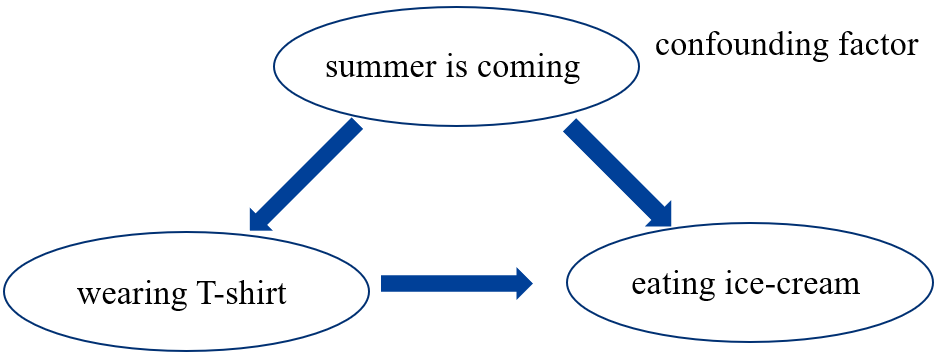
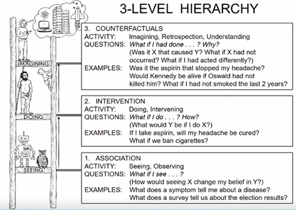
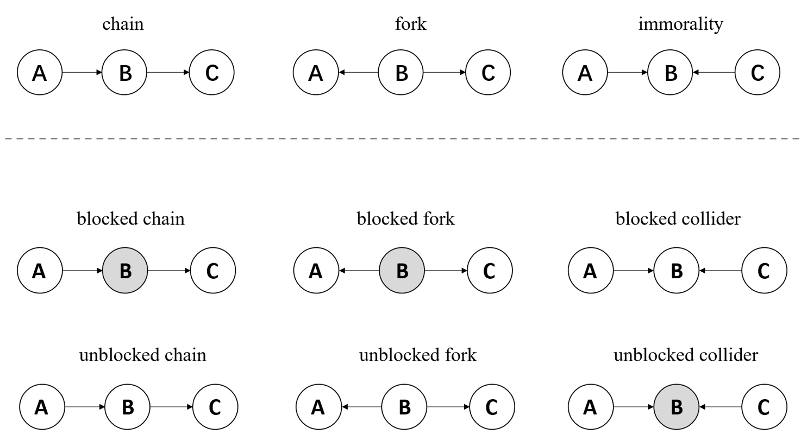

## Correlation
### Frequent pattern
如果 A 和 B 两个东西经常同时出现，那么我们认为它们之间有相关性，或者说它们之间的相关性比较强。

Frequent pattern 意为经常同时出现的一组元素。以下图为例：

通过这个交易清单，可以看出哪些商品是同时被交易的。
* Itemset：每个商品称为一个 item，一个或者多个 item 则称为 itemset。
* Support of $X$：定义了 $X$ 这个 itemset 出现的的频率(频次)

假如 $X$ 的 support 超过了我们定义的某个阈值，那么我们称其为频繁的(frequent)。比如上图中，{Beer, Diaper} 这个 itemset 总共出现了 $3$ 次，如果我们将阈值设置为 $3$，那么这个 itemset 就是频繁的。

容易看出，一个 itemset $X$ 如果是频繁的，那么它的子集 $Y \subseteq X$ 也一定是频繁的。

#### Apriori algorithm
一个常见的 data mining 的算法，给定一个表单，这个算法用于挖掘其中的 frequent itemset。

算法流程：
1. Initialize $k=1$ and candidate $1$-itemsets.
2. Repeat until no frequent set can be generated:
   1. Scan database to get frequent $k$-itemsets based on candidate $k$-itemsets.
   2. Generate candidate $(k+1)$-itemsets from frequent $k$-itemsets.
   3. $k=k+1$

比如对于下面的情况，先定义阈值 threshold=2。

### Correlation
相关性可以分类为：正相关、不相关、负相关。假如有两组数据
$$
\begin{aligned}\mathbf{x}=[x_1,x_2,\dots,x_n]\quad\mathbf{y}=[y_1,y_2,\dots,y_n]\end{aligned}
$$

可以得到相关性：
$$
\begin{aligned}
corr(\mathbf{x},\mathbf{y})& =\frac{cov(\mathbf{x},\mathbf{y})}{\sigma_x\sigma_y}  \\
&=\frac{\sum_{i=1}^n\frac{(x_i-\bar{x})(y_i-\bar{y})}{n}}{\sqrt{\sum_{i=1}^n\frac{(x_i-\bar{x})^2}{n}}\sqrt{\sum_{i=1}^n\frac{(y_i-\bar{y})^2}{n}}} \\
&=\frac{(\mathbf{x}^T-\bar{\mathbf{x}}^T)(\mathbf{y}-\bar{\mathbf{y}})}{\sqrt{(\mathbf{x}^T-\bar{\mathbf{x}}^T)(\mathbf{x}-\bar{\mathbf{x}})}\sqrt{(\mathbf{y}^T-\bar{\mathbf{y}}^T)(\mathbf{y}-\bar{\mathbf{y}})}} \\
&=\frac{\tilde{\mathbf{x}}^{T}\tilde{\mathbf{y}}}{\sqrt{\tilde{\mathbf{x}}^{T}\tilde{\mathbf{x}}}\sqrt{\tilde{\mathbf{y}}^{T}\tilde{\mathbf{y}}}}
\end{aligned}
$$

$corr(\mathbf{x},\mathbf{y})$ 接近 $1$，为正相关；接近 $0$，为不相关；接近 $-1$，为负相关。

#### Canonical Correlation Analysis (CCA)
如果每个样本不是 scalar 而是 vector，那么需要重新定义 correlation。此时两组数据为：
$$
\mathbf{X}=[\mathbf{x}_1,\mathbf{x}_2,\ldots,\mathbf{x}_n]\quad\mathbf{Y}=[\mathbf{y}_1,\mathbf{y}_2,\ldots,\mathbf{y}_n]
$$

这种情况可能应用于多模态中，比如有一组图片和一组文字，每张图片可以提取一个特征 $\mathbf{x}_i$，每段文字同样提取特征 $\mathbf{y}_i$，这样就能够得到 $n$ 对 $\mathbf{x}_i,\mathbf{y}_i$。此时考虑图像和文本特征之间的相关性，就需要引入 CCA。

这个方法的核心思想是学习投影向量，然后把 vector 投影到 scalar，就可以沿用计算 correlation 的方法。
1. 将 $\mathbf{X}$ 和 $\mathbf{Y}$ 去中心化
2. 学习 $\mathbf{w}_{x}, \mathbf{w}_{y}$，使得 $\mathbf{X}$ 和 $\mathbf{Y}$ 之间的 correlation 最大化。记 $\bar{\mathbf{X}}=\mathbf{w}_{x}^{T}\mathbf{X}, \mathrm{~}\bar{\mathbf{Y}}=\mathbf{w}_{y}^{T}\mathbf{Y}$
$$
\max_{\bar{\mathbf{X}},\bar{\mathbf{Y}}}\frac{\bar{\mathbf{X}}\bar{\mathbf{Y}}^T}{\sqrt{(\bar{\mathbf{X}}\bar{\mathbf{X}}^T)(\bar{\mathbf{Y}}\bar{\mathbf{Y}}^T)}}\quad\longrightarrow\max_{\mathbf{w}_x,\mathbf{w}_y}\frac{\mathbf{w}_x^T\mathbf{X}\mathbf{Y}^T\mathbf{w}_y}{\sqrt{(\mathbf{w}_x^T\mathbf{X}\mathbf{X}^T\mathbf{w}_x)(\mathbf{w}_y^T\mathbf{Y}\mathbf{Y}^T\mathbf{w}_y)}}
$$

#### Kernel Canonical Correlation Analysis (KCCA)
为了解决样本向量为无穷维的情况，将 correlation 进一步拓展，对每个样本做 kernel 映射，即：
$$
\mathbf{x}=[x_1,x_2,\ldots,x_n]\quad\mathbf{y}=[y_1,y_2,\ldots,y_n]\\
\downarrow \\
\phi(\mathbf{X})=[\phi(\mathbf{x}_1),\phi(\mathbf{x}_2),\ldots,\phi(\mathbf{x}_n)]\quad\phi(\mathbf{Y})=[\phi(\mathbf{y}_1),\phi(\mathbf{y}_2),\ldots,\phi(\mathbf{y}_n)]
$$

由于维度为无穷，那么我们无法直接写出 $\mathbf{w}_{x}, \mathbf{w}_{y}$。但是利用 representation theorem，我们知道：$\mathbf{w}_x\leftarrow\phi(\mathbf{X})\boldsymbol{\alpha}_x,\mathbf{w}_y\leftarrow\phi(\mathbf{Y})\boldsymbol{\alpha}_y$，因此 CCA 中学习 $\mathbf{w}_{x}, \mathbf{w}_{y}$ 在这里变成了学习 $\alpha_x,\alpha_y$：
$$
\begin{gathered}
\max_{\mathbf{w}_x,\mathbf{w}_y}\frac{\mathbf{w}_x^T\phi(\mathbf{X})\phi(\mathbf{Y})^T\mathbf{w}_y}{\sqrt{(\mathbf{w}_x^T\phi(\mathbf{X})\phi(\mathbf{X})^T\mathbf{w}_x)(\mathbf{w}_y^T\phi(\mathbf{Y})\phi(\mathbf{Y})^T\mathbf{w}_y)}} \\
\downarrow \\
\begin{aligned}
\operatorname*{max}&\quad\frac{\boldsymbol\alpha_{x}^{T}\phi(\mathbf{X})^{T}\phi(\mathbf{X})\phi(\mathbf{Y})^{T}\phi(\mathbf{Y})\boldsymbol\alpha_{y}}{\sqrt{(\boldsymbol\alpha_{x}^{T}\phi(\mathbf{X})^{T}\phi(\mathbf{X})\phi(\mathbf{X})^{T}\phi(\mathbf{X})\boldsymbol\alpha_{x})(\boldsymbol\alpha_{y}^{T}\phi(\mathbf{Y})^{T}\phi(\mathbf{Y})\phi(\mathbf{Y})^{T}\phi(\mathbf{Y})\boldsymbol\alpha_{y})}} \\
&=\frac{\boldsymbol\alpha_x^TK(\mathbf{X})K(\mathbf{Y})\boldsymbol\alpha_y}{\sqrt{(\boldsymbol\alpha_x^TK(\mathbf{X})K(\mathbf{X})\boldsymbol\alpha_x)(\boldsymbol\alpha_y^TK(\mathbf{Y})K(\mathbf{Y})\boldsymbol\alpha_y)}}\end{aligned} 
\end{gathered}
$$

### Correlation and independence
不相关 (uncorrelation)：
$$
\begin{aligned}
corr(\mathbf{x},\mathbf{y})& \begin{aligned}=\frac{cov(\mathbf{x},\mathbf{y})}{\sigma_x\sigma_y}=\frac{\sum_{i=1}^n\frac{(x_i-\bar{x})(y_i-\bar{y})}{n}}{\sigma_x\sigma_y}\end{aligned}  \\
&\begin{aligned}&=\frac{\frac{1}{n}\sum_{i=1}^nx_iy_i-\bar{x}\frac{\sum_{i=1}^ny_i}{n}-\bar{y}\frac{\sum_{i=1}^nx_i}{n}+\bar{x}\bar{y}}{\sigma_x\sigma_y}\end{aligned} \\
&=\frac{\mathbb{E}(\mathbf{x}\mathbf{y})-\mathbb{E}(\mathbf{x})\mathbb{E}(\mathbf{y})}{\sigma_x\sigma_y} \\
&corr(\mathbf{x},\mathbf{y})=0\Rightarrow\mathbb{E}(\mathbf{xy})=\mathbb{E}(\mathbf{x})\mathbb{E}(\mathbf{y})
\end{aligned}
$$

独立 (independence)：
$$
p(\mathbf{x},\mathbf{y})=p(\mathbf{x})p(\mathbf{y})
$$

两者关系为：独立 $\rightarrow$ 不相关；不相关 $\not \rightarrow$ 独立。

证明：
如果两个随机变量 $\mathbf{x}, \mathbf{y}$ 有 $p(\mathbf{x},\mathbf{y})=p(\mathbf{x})p(\mathbf{y})$，那么
$$
\begin{aligned}
\mathbb{E}(\mathbf{xy}) &= \sum_{\mathbf{x},\mathbf{y}} \mathbf{x}\mathbf{y}\cdot p(\mathbf{x},\mathbf{y}) = \sum_{\mathbf{x},\mathbf{y}} \mathbf{x}\mathbf{y}\cdot p(\mathbf{x}) p(\mathbf{y}) \\
&= \sum_{\mathbf{x}}\mathbf{x} p(\mathbf{x}) \sum_{\mathbf{y}} \mathbf{y} p(\mathbf{y}) \\
&= \mathbb{E}(\mathbf{x})\mathbb{E}(\mathbf{y})
\end{aligned}
$$

但反之不成立，比如 $\mathbf{x},\mathbf{y}$ 均匀分布在一个圆上。

### Conditional independence
$\mathbf{x}$ 和 $\mathbf{y}$ 在给定 $\mathbf{z}$ 的条件下独立，可以记为：
$$
\mathrm{x}\perp\mathrm{y}|\mathrm{z}
$$

条件独立有两个等价的形式，为：
$$\begin{aligned}
&p(\mathbf{x}|\mathbf{y},\mathbf{z})=p(\mathbf{x}|\mathbf{z}) \\
&\Leftrightarrow  \begin{aligned}\frac{p(\mathbf{x},\mathbf{y},\mathbf{z})}{p(\mathbf{y},\mathbf{z})}=\frac{p(\mathbf{x},\mathbf{z})}{p(\mathbf{z})}\end{aligned}  \\
&\Leftrightarrow  \begin{aligned}\frac{p(\mathbf{x},\mathbf{y},\mathbf{z})}{p(\mathbf{z})}=\frac{p(\mathbf{x},\mathbf{z})}{p(\mathbf{z})}\frac{p(\mathbf{y},\mathbf{z})}{p(\mathbf{z})}\end{aligned}  \\
&\Leftrightarrow  p(\mathbf{x},\mathbf{y}|\mathbf{z})=p(\mathbf{x}|\mathbf{z})p(\mathbf{y}|\mathbf{z}) 
\end{aligned}$$

#### Some properties
$$
\begin{aligned}
&\mathbf{x}\perp\mathbf{y}|\mathbf{z}&&p(\mathbf{x},\mathbf{y}|\mathbf{z})=p(\mathbf{x}|\mathbf{z})p(\mathbf{y}|\mathbf{z})\\
&\mathbf{x}\perp\mathbf{y}&&p(\mathbf{x},\mathbf{y})=p(\mathbf{x})p(\mathbf{y})\\
&\mathbf{x}\perp\mathbf{y},\mathbf{z}&&p(\mathbf{x},\mathbf{y},\mathbf{z})=p(\mathbf{x})p(\mathbf{y},\mathbf{z})
\end{aligned}
$$

1. $\mathbf{x}\perp\mathbf{y},\mathbf{z}\Rightarrow\mathbf{x}\perp\mathbf{y}\quad\text{and}\quad\mathbf{x}\perp\mathbf{z}$
2. $\mathbf{x}\perp\mathbf{y},\mathbf{z}\Rightarrow\mathbf{x}\perp\mathbf{y}|\mathbf{z}\quad\text{and}\quad\mathbf{x}\perp\mathbf{z}|\mathbf{y}$
3. $\mathbf{x}\perp\mathbf{y}|\mathbf{z} \quad\text{and} \quad x \perp \mathbf{z} \Rightarrow x\perp \mathbf{y}, \mathbf{z}$

## Causation
相比 correlation 应用场景更少。

比如物理学中，力和运动之间不是 causation，力不导致运动，而是使得运动状态变化。但是两者之间可以有 correlation。

### Correlation or causation
**Positive correlation** between the number of people wearing T-shirts and the number of people eating ice-cream. But no **causation** between them.

### How to infer causation?
* Intervention
* Counterfactual

### Causal graph
下面的图中灰色的节点表示该节点被赋值；白色的节点表示值未知。节点间的箭头表示。

* chain: $p(A,C|b) = p(A|b) p(C|b)$
* fork: $p(A,C|b) = p(A|b)p(C|b)$
* collider: $p(A,C) = p(A)p(C)$

