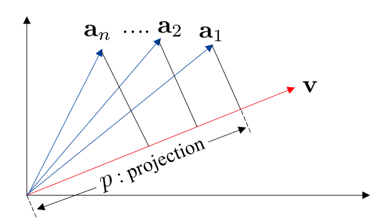
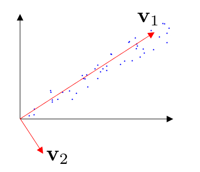
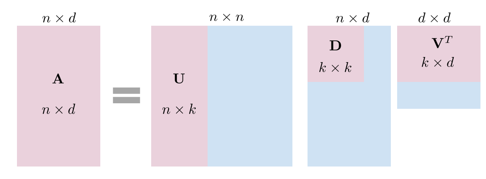
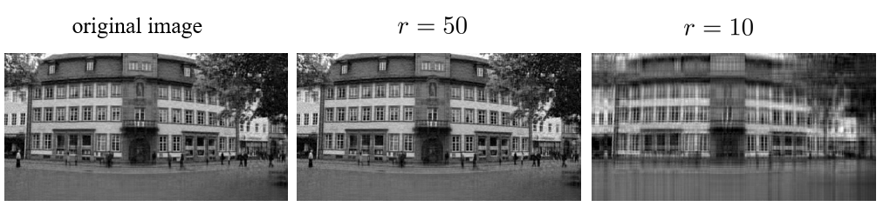
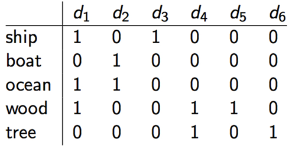
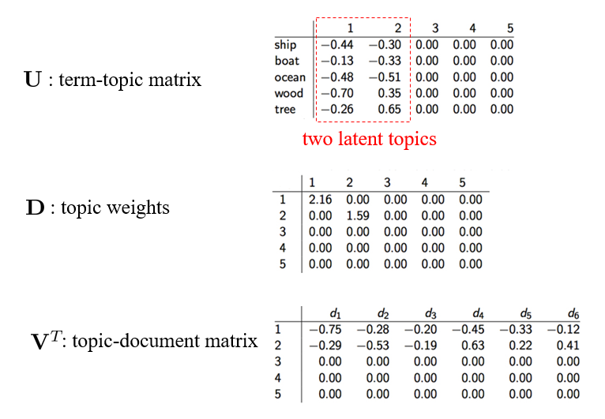
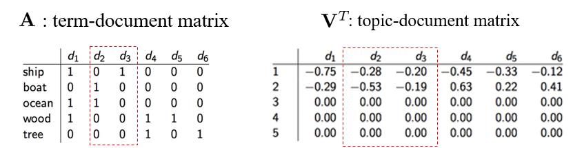

## Singular Value Decomposition (SVD)
### Projection
考虑有 $n$ 个 $d$ 维的向量 $\mathbf{a}_1,\mathbf{a}_2, \ldots \mathbf{a}_n$，这些向量可以用矩阵 $\mathbf{A}=[\mathbf{a}_1^{\mathrm{T}}; \ldots ;\mathbf{a}_n^{\mathrm{T}}]$ 来表示，$\mathbf{A}\in \mathbb{R}^{n\times d}$。同时有一个 $d$ 维的投影向量 $\mathbf{v}$。

寻找投影向量的目标为：最大化投影后的长度的平方和，即：
$$
\mathbf{v}^*=\arg\max_{\|\mathbf{v}\|=1}\sum_ip_i^2=\arg\max_{\|\mathbf{v}\|=1}\sum_i(\mathbf{a}_i^T\mathbf{v})^2=\arg\max_{\|\mathbf{v}\|=1}\|\mathbf{A}\mathbf{v}\|^2
$$

* PCA：我们可以发现这个目标和 PCA 非常相似，PCA 只是多了一个将矩阵 $\mathbf{A}$ 去中心化的操作。
* 特征值分解：如果对于矩阵 $\mathbf{A}^{\mathrm{T}}\mathbf{A}$
  $$
  \begin{aligned}
  &&&\mathbf{A}^{T}\mathbf{A}\mathbf{v}=\lambda\mathbf{v}\\
  &\Rightarrow&&\mathbf{v}^{T}\mathbf{A}^{T}\mathbf{A}\mathbf{v}=\lambda\\
  &\Rightarrow&&\|\mathbf{A}\mathbf{v}\|^{2}=\lambda
  \end{aligned}
  $$

  可以看出相当于求 $\Sigma = \mathbf{A}^{\mathrm{T}}\mathbf{A}$ 的特征向量。

在寻找投影向量的过程中，我们可以要求各个投影向量正交，从而得到一组投影向量，这一组投影向量可以构成一个子空间。

$$
\begin{aligned}
\mathbf{v}_1&=\arg\max_{\|\mathbf{v}\|=1}\|\mathbf{A}\mathbf{v}\|^2\\
\mathbf{v}_2&=\arg\max_{\substack{\|\mathbf{v}\|=1 \\ \mathbf{v} \perp \mathbf{v}_1}}\|\mathbf{A}\mathbf{v}\|^2\\
 &  \quad \dots \\
\mathbf{v}_k &= \argmax_{\substack{\left\| \mathbf{v} \right\|_{}=1 \\ \mathbf{v} \perp \mathbf{v}_1,\mathbf{v}_2, \ldots ,\mathbf{v}_{k-1}}} \left\| \mathbf{A}\mathbf{v} \right\|_{}^{2}
\end{aligned}
$$

在二维情况下得到的结果可能如图所示。

同时当 $k=\operatorname{rank}(\mathbf{A})+1$ 时，有：
$$
\argmax_{\substack{\left\| \mathbf{v} \right\|_{}=1 \\ \mathbf{v} \perp \mathbf{v}_1,\mathbf{v}_2, \ldots ,\mathbf{v}_{k-1}}} \left\| \mathbf{A}\mathbf{v} \right\|_{}^{2} = 0
$$

上述贪婪算法找到的其实就是全局最优解：
$$
\mathbf{V}=\arg\max_{\substack{\|\mathbf{v}_i\|=1,\forall i\\\mathbf{v}_i\perp\mathbf{v}_j,\forall i\neq j}}\sum_{i=1}^k\|\mathbf{A}\mathbf{v_i}\|^2
$$

### Notation
$$
\begin{aligned}
\mathbf{A}&=[\mathbf{a}_1^T;\ldots;\mathbf{a}_n^T] \\
\mathbf{V}&=[\mathbf{v}_1,\ldots,\mathbf{v}_k]
\end{aligned}
$$

* $\mathbf{A}\mathbf{v}_i$: projection of  $\mathbf{A}=[\mathbf{a}_1^T;\ldots;\mathbf{a}_n^T]$ on $\mathbf{v}_i$
* $d_i = \left\| \mathbf{A}\mathbf{v}_i \right\|_{}$: norm of projection $\Rightarrow \mathbf{D}=\begin{bmatrix}d_1&\ldots&0&0\\\vdots&\ddots\\0&&d_{k-1}&0\\0&&0&d_k\end{bmatrix}$
* $\mathbf{u}_i = \frac{\mathbf{A}\mathbf{v}_i}{\left\| \mathbf{A}\mathbf{v}_i \right\|_{}} = \frac{1}{d_i}\mathbf{A}\mathbf{v}_i$: normalized projection $\Rightarrow \mathbf{U}=[\mathbf{u}_1,\ldots,\mathbf{u}_k]$

可以证明
$$
\mathbf{A}=\mathbf{U}\mathbf{D}\mathbf{V}^T=\sum_{i=1}^kd_i\mathbf{u}_i\mathbf{v}_i^T
$$

* $\mathbf{U}$: left singular vectors
* $\mathbf{D}$: singular values
* $\mathbf{V}$: right singular vectors

图中 $k=\operatorname{rank}(\mathbf{A})$，蓝色部分为 $0$。

#### Proof
下面开始证明：
**引理**：矩阵 $\mathbf{A}$ 和 $\mathbf{B}$ 相同，当且仅当对于所有向量 $\mathbf{v}$，有 $\mathbf{A}\mathbf{v}=\mathbf{B}\mathbf{v}$。

利用 $\mathbf{v}_{i}^{T}\mathbf{v}_{j}=0$ 和 $\mathbf{v}_{i}^{T}\mathbf{v}_{i}=1$，有
$$
\sum_{i=1}^kd_i\mathbf{u}_i\mathbf{v}_i^T\mathbf{v}_j=d_j\mathbf{u}_j
$$

带入 $\mathbf{u}_j=\frac{1}{d_j}\mathbf{A}\mathbf{v}_j$
$$
\sum_{i=1}^kd_i\mathbf{u}_i\mathbf{v}_i^T\mathbf{v}_j = A \mathbf{v}_j
$$

由于任意向量 $\mathbf{v}$ 都可以被 $\mathbf{v}_1, \ldots \mathbf{v}_k$ 以及 null space 中的 $\tilde{\mathbf{v}}$ 表示 (这里利用了 $k=\operatorname{rank}(\mathbf{A})$)，因此

$$
\sum_{i=1}^kd_i\mathbf{u}_i\mathbf{v}_i^T\mathbf{v} = A \mathbf{v}
$$

根据引理，得到
$$
\mathbf{A}=\sum_{i=1}^kd_i\mathbf{u}_i\mathbf{v}_i^T
$$

### Norm based on SVD
矩阵的 norm 是利用 SVD 分解得到的矩阵 $\mathbf{D}$ 定义的。矩阵的 $l_p$ norm 可以写成：
$$
\mathbf{A}=\mathbf{UDV}^T=\sum_{i=1}^kd_i\mathbf{u}_i\mathbf{v}_i^T\\\mathcal{N}_{p}(\mathbf{A})=\left(\sum_{i=1}^kd_i^p\right)^{\frac1p}
$$

下面是几个比较重要的 $p$：
* $p=0$：$\mathbf{A}$ 的秩
* $p=1$：nuclear norm $\left\| \mathbf{A} \right\|_{*} = \sum_{i=1}^{k}d_i$
  * nuclear norm 通常用于估计矩阵的秩，因为其在优化问题中更容易求解。比如要最小化秩，那么在目标函数中可以最小化 nuclear norm。
* $p=2$：Frobenius norm $\|\mathbf{A}\|_F=\sqrt{trace(\mathbf{A}\mathbf{A}^T)}=\sqrt{\sum_{i=1}^kd_i^2}$
* $p=\infty$：spectral norm $\|\mathbf{A}\|_2=\max_id_i$
  * spectral normalization 在深度学习中为一种较为常用的 normalization 的方法。

### Application of SVD
#### rank-k appoximation
原矩阵 $\operatorname{rank}(\mathbf{A})=k$，我们希望找到一个新的矩阵 $\mathbf{\tilde{A}}$，有 $\operatorname{rank}(\mathbf{\tilde{A}}) = r<k$，即：
$$
\begin{aligned}\min_{\tilde{\mathbf{A}}}&&\|\tilde{\mathbf{A}}-\mathbf{A}\|_{F}^{2}\\\mathrm{s.t.}&&rank(\tilde{\mathbf{A}})=r\end{aligned}
$$

该目标存在闭式解：
1. 对 $\mathbf{A}$ 做 SVD 分解：$\mathbf{A}=\mathbf{U}\mathbf{D}\mathbf{V}^{\mathrm{T}}$
2. 将 $\mathbf{D}$ 中的第 $r+1, \ldots k$ 个奇异值置零，得到 $\mathbf{\tilde{D}}$
3. $\mathbf{\tilde{A}}=\mathbf{U}\mathbf{\tilde{D}}\mathbf{V}^{\mathrm{T}}$ 即为解。

该技术可以被用在图像压缩中，比如原图 $\mathbf{A}$ 的体积为 $n\times m$；变成 $\mathbf{\tilde{A}}=\mathbf{U}\mathbf{\tilde{D}}\mathbf{V}^{\mathrm{T}}$ 后，矩阵 $\mathbf{U},\mathbf{\tilde{D}},\mathbf{V}$ 的形状分别为 $n\times r, r\times r, r\times m$，又 $\mathbf{\tilde{D}}$ 为对角阵，因此总体积为 $r\times (1+n+m)$。

以下为一张 $n=400,m=765$ 的图片，如果压缩至 $r=50$，压缩率为：
$$
\frac{50\times(1+400+765)}{400\times765}\approx0.19
$$

压缩后效果如图：

#### latent semantic analysis
SVD 还可以用于做语义分析。假如 $\mathbf{A}$ 为如下 term-document matrix：

对其作 SVD 分解得到：

其中的 $1,2,3,4,5$ 可以理解为不同的 topic。如果想要分析两个 document 之间的相关性，仅仅考虑 term 是不合适的，还需要挖掘其中 topic 的关系。

比如只考虑矩阵 $\mathbf{A}$，那么
$$
Sim_{cos}(\mathbf{d}_2,\mathbf{d}_3)=\frac{0\times1+1\times0+1\times0}{\sqrt{1+1}\times\sqrt{1}}=0
$$

但是如果得到了 $\mathbf{V}^{\mathrm{T}}$，那么
$$
Sim_{cos}(\mathbf{d}_2,\mathbf{d}_3)=\frac{0.28\times0.20+0.53\times0.19}{\sqrt{0.28^2+0.53^2}\times\sqrt{0.20^2+0.19^2}}\approx0.94
$$

可以看出得到了完全不同的结果。

## Eigen Decomposition
对于矩阵 $\mathbf{M}\in \mathbb{R}^{n\times n}$，有 $\mathbf{M}\mathbf{v}=\lambda \mathbf{v}$，$\lambda$ 为特征值，$\mathbf{v}$ 为特征向量。

### Relation to SVD
如果 $\mathbf{M}$ 为对称矩阵，那么可以写成 $\mathbf{M}=\mathbf{A}^{\mathrm{T}}\mathbf{A}$。对 $\mathbf{A}$ 做 SVD 分解，得到：
$$
\mathbf{A} = \mathbf{U}\mathbf{D}\mathbf{V}^{\mathrm{T}}
$$

那么有 
$$
\begin{aligned}
\mathbf{M} &= \mathbf{A}^{\mathrm{T}}\mathbf{A} = (\mathbf{V}\mathbf{D}^{\mathrm{T}}\mathbf{U}^{\mathrm{T}})(\mathbf{U}\mathbf{D}\mathbf{V}^{\mathrm{T}}) \\
&= \mathbf{V}(\mathbf{D}^{\mathrm{T}}\mathbf{D})\mathbf{V}^{\mathrm{T}} \\
&\equiv \mathbf{V} \mathbf{\Sigma} \mathbf{V}^{\mathrm{T}}
\end{aligned}
$$

$$
\Rightarrow \mathbf{M}\mathbf{V} = \mathbf{V} \mathbf{\Sigma} \mathbf{V}^{\mathrm{T}}\mathbf{V} = \mathbf{V} \mathbf{\Sigma} \\
M \mathbf{v} = \lambda \mathbf{v}
$$

由 $\mathbf{D}^{\mathrm{T}}\mathbf{D}=\mathbf{\Sigma}$ 知 $\lambda=d^{2}$，且特征向量 $\mathbf{v}$ 即为 $\mathbf{V}$ 中的列向量。

或者也可以从向量投影的角度理解，这一点已经在 [Projection](#projection) 一节中提及。

### Eigen Decomposition
$$
\mathbf{Mx}=\lambda\mathbf{x}\Rightarrow(\mathbf{M}-\lambda\mathbf{I})\mathbf{x}=\mathbf{0}
$$

想要求解 $\lambda$，即求解方程 $\det (\mathbf{M}-\lambda \mathbf{I})=0$

相关性质：
$$
trace(\mathbf{M})=\sum_i\lambda_i\\
\det(\mathbf{M})=\prod_i\lambda_i
$$

### Application
可以用于 PCA 和 CCA。

#### Canonical Correlation Analysis
CCA 目标为：
$$
\begin{aligned}&\max_{\boldsymbol{\alpha},\boldsymbol{\beta}}&&\frac{\sum_i\boldsymbol{\alpha}^T\mathbf{x}_i\mathbf{y}_i^T\boldsymbol{\beta}}{\sqrt{(\sum_i\boldsymbol{\alpha}^T\mathbf{x}_i\mathbf{x}_i^T\boldsymbol{\alpha})(\sum_i\boldsymbol{\beta}^T\mathbf{y}_i\mathbf{y}_i^T\boldsymbol{\beta})}}\\&\text{s.t.}&&\frac1N\sum_i\boldsymbol{\alpha}^T\mathbf{x}_i\mathbf{x}_i^T\boldsymbol{\alpha}=1,\\&&&\frac1N\sum_i\boldsymbol{\beta}^T\mathbf{y}_i\mathbf{y}_i^T\boldsymbol{\beta}=1.\end{aligned}
$$

写出拉格朗日函数：
$$
\mathcal{L}_{\boldsymbol{\alpha},\boldsymbol{\beta},\lambda_{1},\lambda_{2}}=\sum_{i}\alpha^{T}\mathbf{x}_{i}\mathbf{y}_{i}^{T}\beta-\lambda_{1}(\sum_{i}\alpha^{T}\mathbf{x}_{i}\mathbf{x}_{i}^{T}\boldsymbol{\alpha}-N)-\lambda_{2}(\sum_{i}\boldsymbol{\beta}^{T}\mathbf{y}_{i}\mathbf{y}_{i}^{T}\boldsymbol{\beta}-N)
$$

然后分别求导：
$$
\frac{\partial\mathcal{L}}{\partial\boldsymbol{\alpha}}=\mathbf{0}\Rightarrow\sum_i\mathbf{x}_i\mathbf{y}_i^T\boldsymbol{\beta}=2\lambda_1\sum_i\mathbf{x}_i\mathbf{x}_i^T\boldsymbol{\alpha}\\\frac{\partial\mathcal{L}}{\partial\boldsymbol{\beta}}=\mathbf{0}\Rightarrow\sum_i\mathbf{y}_i\mathbf{x}_i^T\boldsymbol{\alpha}=2\lambda_2\sum_i\mathbf{y}_i\mathbf{y}_i^T\boldsymbol{\beta}
$$

可以证明 $\lambda_1=\lambda_2$，因此方程组可写成：
$$
\begin{bmatrix}\mathbf{0}&\sum_{i}\mathbf{x}_{i}\mathbf{y}_{i}^{T}\\\sum_{i}\mathbf{y}_{i}\mathbf{x}_{i}^{T}&\mathbf{0}\end{bmatrix}\begin{bmatrix}\mathbf{\alpha}\\\mathbf{\beta}\end{bmatrix}=2\lambda\begin{bmatrix}\sum_{i}\mathbf{x}_{i}\mathbf{x}_{i}^{T}&\mathbf{0}\\\mathbf{0}&\sum_{i}\mathbf{y}_{i}\mathbf{y}_{i}^{T}\end{bmatrix}\begin{bmatrix}\mathbf{\alpha}\\\mathbf{\beta}\end{bmatrix}
$$

$$
\Rightarrow 
\boxed{\begin{bmatrix}\sum_i\mathbf{x}_i\mathbf{x}_i^T&\mathbf{0}\\\mathbf{0}&\sum_i\mathbf{y}_i\mathbf{y}_i^T\end{bmatrix}^{-1}\begin{bmatrix}\mathbf{0}&\sum_i\mathbf{x}_i\mathbf{y}_i^T\\\sum_i\mathbf{y}_i\mathbf{x}_i^T&\mathbf{0}\end{bmatrix}}
\begin{bmatrix}\alpha\\\beta\end{bmatrix}=2\lambda\begin{bmatrix}\mathbf{\alpha}\\\mathbf{\beta}\end{bmatrix}
$$
