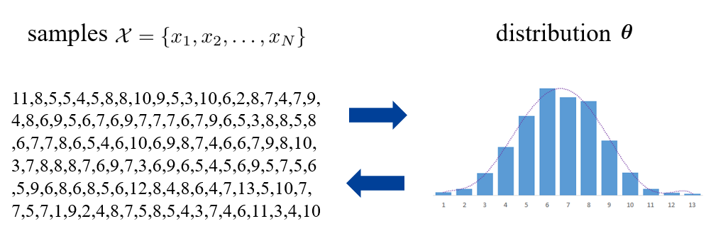
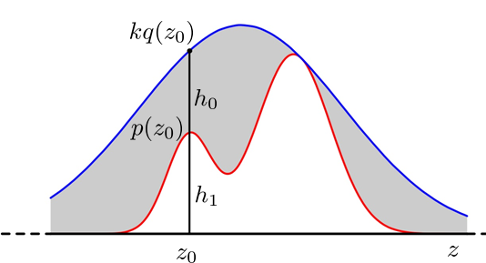
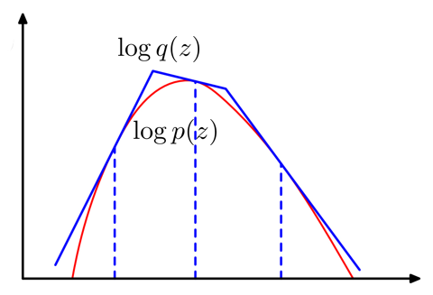

在应用中，用于训练的源数据(source domain)和测试的目标数据(target domain)之间的分布可能会有所不同，因此需要研究两者的分布。

本章研究的就是采样到的数据 $\mathcal{X}=\{x_{1},x_{2},\ldots,x_{N}\}$ 和数据分布 $\theta$ 之间的关系。比如对于高斯分布而言，给定一系列采样数据，我们可以估计出其参数；而如果给定参数，我们又可以对其进行采样。

## From sample to distribution
1. 首先要知道分布类型。常见分布有
   1. 二项分布：$p(k|n,p)=\frac{n!}{k!(n-k)!} p^{k}(1-p)^{n-k}$
   2. 泊松分布：$p(k|\lambda)=\frac{e^{-\lambda}\lambda^{k}}{k!}$
   3. 高斯分布：$p(x|\mu, \Sigma)= \frac{1}{\sqrt{2\pi \sigma^{2}}}\exp \left[ - \frac{(x-\mu)^{2}}{2\sigma^{2}} \right]$
2. 然后得到参数
   1. 假如有足够的先验信息，比如知道数据如何产生，那么就能直接得到参数
   2. 如果没有先验信息，那么可以根据样本进行估计。常用的估计方式为最大似然估计。

### Maximum Likelihood Estimation (MLE)
但是如果对数据没有任何先验知识，那么还需要假设一个分布，通常我们假设数据为高斯分布。然后我们可以使用最大似然估计来估计高斯分布的参数：
$$
p(x_1,x_2,\dots,x_N|\boldsymbol{\theta})=\prod_{i=1}^Np(x_i|\mu,\sigma)=(\frac{1}{2\pi\sigma^2})^{\frac{N}{2}}\exp\left(-\frac{\sum_{i=1}^N(x_i-\mu)^2}{2\sigma^2}\right)
$$

然后将上述似然函数分别对参数 $\mu$ 和 $\sigma$ 求导：
$$
\begin{aligned}&\frac{\partial\log p(x_1,x_2,...,x_N|\boldsymbol{\theta})}{\partial\mu}=0\longrightarrow\hat{\mu}=\frac{1}{N}\sum_{i=1}^{N}x_{i}\\&\frac{\partial\log p(x_1,x_2,...,x_N|\boldsymbol{\theta})}{\partial\sigma}=0\longrightarrow\hat{\sigma}^2=\frac{1}{N}\sum_{i=1}^N(x_i-\hat{\mu})^2\end{aligned}
$$

### Biased estimation
对分布进行参数估计之后，还可以分析估计的参数是否有偏。这里同样以高斯分布为例，假设真实分布的参数为 $\mu$ 和 $\sigma$，而极大似然估计得到的参数为：
$$
\hat{\mu} = \frac{1}{N} \sum_{i=1}^{N} x_i \quad \hat{\sigma}^{2} = \frac{1}{N} \sum_{i=1}^{N} (x_i-\hat{\mu})^{2} 
$$

对于参数 $\hat{\mu}$:
$$
\mathbb{E}[\hat{\mu}] = \mathbb{E} \left[ \frac{1}{N} \sum_{i=1}^{N} x_i \right] = \frac{1}{N} \sum_{i=1}^{N} \mathbb{E}[x_i] = \mu
$$

为无偏估计。而对于参数 $\hat{\sigma}^{2}$:
$$
\begin{aligned}
\mathbb{E}[\hat{\sigma}^{2}] &= \mathbb{E}\left[ \frac{1}{N} \sum_{i=1}^{N} (x_i-\hat{\mu})^{2}  \right] \\
&= \mathbb{E}[x^{2}] - 2\mathbb{E}\left[ \frac{1}{N}\sum_{i=1}^{N}x_i \hat{\mu} \right] + \mathbb{E}[\hat{\mu}^{2}] \\
&= \mathbb{E}[x^{2}] - \mathbb{E}[\hat{\mu}^{2}] \\
&= \operatorname{Var}[x] + \mathbb{E}[x]^{2} - \operatorname{Var}[\hat{\mu}] - \mathbb{E}[\hat{\mu}]^{2} \\
&= \operatorname{Var}[x] - \frac{1}{N} \operatorname{Var}[x] \\
&= \frac{N-1}{N} \sigma^{2}
\end{aligned}
$$

因此参数 $\hat{\sigma}^{2}$ 的估计为有偏估计。但是在采样过程中，只要 $N\rightarrow\infty$，那么 $\hat{\sigma}^{2}$ 就会接近无偏估计。

### Gaussian Mixture Model
如果数据的分布较为复杂，那么仅仅使用一个高斯分布显然是不够的，因此需要引入混合高斯分布(Gaussian Mixture Model, GMM)。GMM 的建模与求解此处略去，具体可见文章[Clustering](https://zhuxz0299.github.io/posts/e292886a.html)的最后一节。

## From distribution to sample
已知数据分布，想要得到数据，就需要进行采样。而目前只有特定几种简单的分布有高效的采样方式，比如对于范围在 $[v_l,v_h]$ 的均匀分布，采样方式为：
$$
x=v_l+rand(0,1)(v_h-v_l)
$$

而较为复杂的采样则需要通过一些技巧解决。
### Rejection sampling
对于分布 $p(z)$
1. 首先找到一个简单的分布 $q(z)$，使得 $\forall z$，有 $kq(z)\ge p(z)$。此时 $q(z)$ 称为 envelope distribution。
2. 对 $q$ 进行采样 $z_0 \sim q$
3. 对于采样值 $z_0$，以 $\frac{h_{1}}{h_{0}+h_{1}}=\frac{p(z_{0})}{kq(z_{0})}$ 的概率接收。

### Adaptive rejection sampling
但有时候，envelope distribution 并不容易找到。

和 rejection sampling 类似，只是这里的 envelope distribution 变成了分段形式。只要 $p(z)$ 满足 log concave，那么就能找到
$$
q(z)=k_i\lambda_i\exp\{-\lambda_i(z-z_{i-1})\},\quad z_{i-1}<z\leq z_i
$$

如下图所示：

### Importance sampling
还有时候，我们的目的并不是采样 $x \sim  p$，而是希望求出期望 $\mathbb{E}_{x\sim p}[f(x)]$
$$
\begin{aligned}
\int f(x)p(x)dx& =\int f(x)\frac{p(x)}{q(x)}q(x)dx  \\
&\approx\frac1S\sum_{s=1}^Sf(x^s)\frac{p(x^s)}{q(x^s)}
\end{aligned}
$$

此时仅仅在分布 $x^{s}\sim q$ 上采样即可

### Markov Chain Monte Carlo (MCMC)
MCMC 是一种通用的策略，通过有偏的随机游走(biased random walk)来近似采样，随机游走的规则根据 $p(x)$ 来设计。比如需要采样下图中的高斯分布，除去初始几个噪音点，后面游走到的点可作为采样点。

#### Metropolis–Hastings algorithm (unit-variate)
这是一种针对单变量的MCMC算法。算法流程为：
1. 初始话
   1. 选择初始状态 $x_0$
   2. 设置 $t=0$
2. 迭代
   1. 根据分布 $g(\cdot |x_t)$，生成一个 candidate state $x'$。其中分布 $g$ 类似于 kernel，是一个需要事先规定好的条件概率。
   2. 计算接受概率 $A(x',x_t)=\min\left(1,\frac{p(x')}{p(x_t)}\frac{g(x_t|x')}{g(x'|x_t)}\right)$
   3. 以概率 $A$ 接收 $x_{t+1}=x'$，否则 $x_{t+1}=x_t$
   4. $t = t+1$

#### Gibbs sampling
该采样针对高维变量。整体思想为将 $d$ 维向量分成两部分，相互生成。记第 $i$ 个采样到的样本为 $\mathbf{x}_i=(x_i^1,x_i^2,\ldots,x_i^d)$
1. 初始化
   1. 选择初始状态 $\mathbf{x}_0=(x_0^1,x_0^2,\ldots,x_0^d)$
   2. 设置 $t=0$
2. 迭代
   1. 令 $j=mod(t,d)$
   2. 根据条件概率 $p(x^j|x_t^1,\ldots,x_t^{j-1},x_t^{j+1},\ldots,x_t^d)$ 生成 $x_{t+1}^{j}$
   3. $\mathbf{x}_{t+1}=(x_{t}^{1},\ldots,x_{t}^{j-1},x_{t+1}^{j},x_{t}^{j+1},\ldots,x_{t}^{d})$
   4. $t=t+1$

