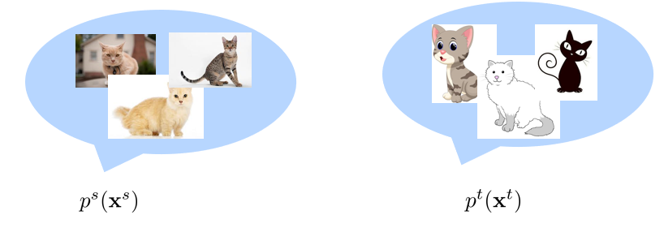
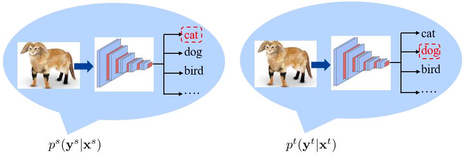
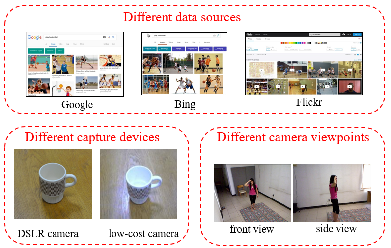
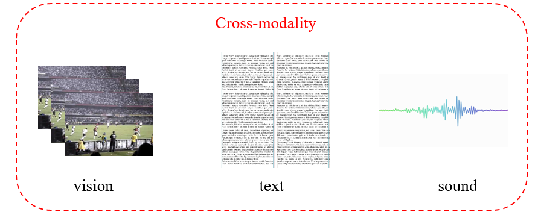
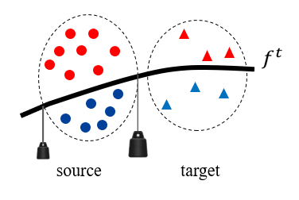
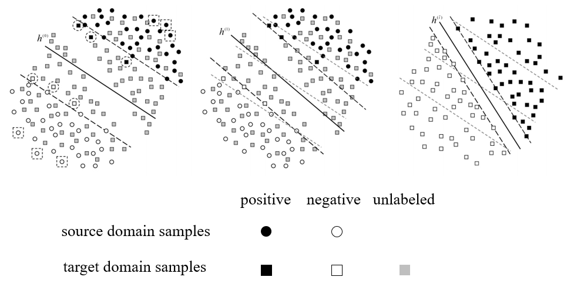
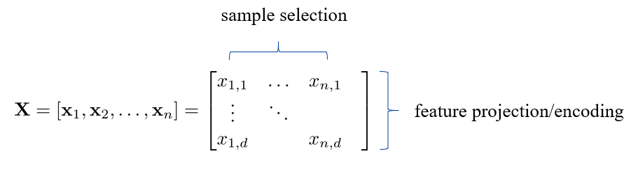
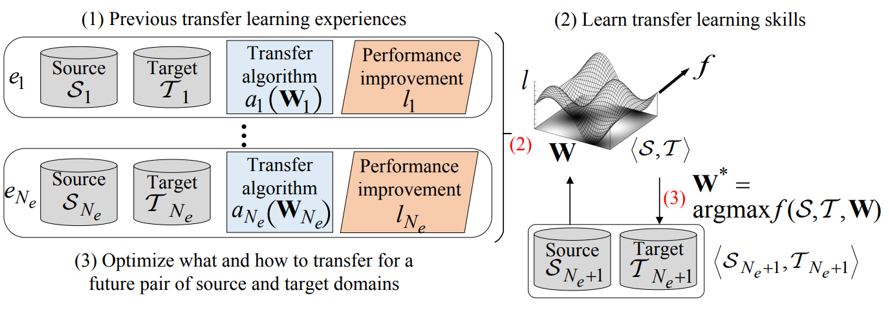

## Introduction to Data Distribution Mismatch
### Source domain and target domain
我们将源数据(source domain)记为 $\mathcal{S}=\{\mathbf{x}^s,\mathbf{y}^s\}$，目标数据(target domain)记为 $\mathcal{T}=\{\mathbf{x}^t,\mathbf{y}^t\}$。通过在数据集上训练，我们可以得到 $p^{s}(\mathbf{y}^{s}|\mathbf{x}^{s})$，但是在测试上进行预测时，$p^s(\mathbf{y}^t|\mathbf{x}^t)$ 并不一定能够得到正确的结果。

### Data distribution mismatch 
由于 $p^s(\mathbf{x}^s,\mathbf{y}^s)=p^s(\mathbf{y}^s|\mathbf{x}^s)p^s(\mathbf{x}^s)\quad p^t(\mathbf{x}^t,\mathbf{y}^t)=p^t(\mathbf{y}^t|\mathbf{x}^t)p^t(\mathbf{x}^t)$
因此 data distribution mismatch 分为
* $\begin{matrix}p^s(\mathbf{x}^s)&\text{v.s.}&p^t(\mathbf{x}^t)\end{matrix}$
  * 数据边缘分布的差异 
  * 
* $p^s(\mathbf{y}^s|\mathbf{x}^s)\quad\text{v.s.}\quad p^t(\mathbf{y}^t|\mathbf{x}^t)$
  * 数据集标签的差异，比如人工标注时同一张图片可能有两个结果
  * 

### Domain adaptationb
例如在 classification 问题中，假如训练集和测试集之间有较小的差异，可以通过正则化等方式来解决 overfitting 的问题。但是如果训练集和测试集的数据完全不同，那么就需要使用 domain adaptation，使得在训练集上得到的 classifier 在测试集上能够使用。

### Different domains
#### Different homogeneous domains
训练和测试的数据可能来源不同，虽然在人看来差异不大，但是；计算机提取出的特征可能差别较大。这导致了 source domain 和 target domain 的不同。

#### Different heterogeneous domains
有时候数据的类型可能就完全不同。

### Application of domain adaptation
* Autonomous driving：自动驾驶采集到的图像会随时间，场景等改变
* Medical diagnosis：医学数据通常为不能共享的隐私数据，而不同的病人之间差异又比较大。
* Video surveillance：监控摄像头需要在成本和性能之间做 tradeoff，我们希望在某一种摄像头上采集到的数据训练得到的模型能够应用于所有摄像头上。

## Domain Adaptation Method
domain adaptation 可以按如下方式分类：
* Traditional era
  * Projection to common subspace
  * Sample selection
* Early deep era
  * Deep feature + traditional method
  * Deep network + traditional idea
  * Batch normalization based
  * Adversarial learning
* GAN era
  * Paired GAN
  * Unpaired GAN
  
### Projection to common subspace
将 source 和 target 都投影到同一空间，使得数据分布相近。需要考虑的问题：如何进行投影、如何度量数据分布的差异。

#### Domain Invariant Projection (DIP)
source domain 和 target domain 分别记为：
$$
\mathbf{X}_s=[\mathbf{x}_1^s,\mathbf{x}_2^s,\ldots,\mathbf{x}_{n_s}^s]\quad\mathbf{X}_t=[\mathbf{x}_1^t,\mathbf{x}_2^t,\ldots,\mathbf{x}_{n_t}^t]
$$

DIP 中使用两个分布中心点的距离来衡量两个分布的差异。
DIP 的基本思想为：先使用投影矩阵处理数据，然后再用投影函数 $\phi$ 来进一步投影($\phi$ 和 kernel trick 中的函数相似，都是使用核函数实现从低维到高维的投影)。
$$
\begin{aligned}
d(\mathbf{W}^{T}\mathbf{X}_{s},\mathbf{W}^{T}\mathbf{X}_{t})^{2}& =\|\frac{1}{n_s}\sum_{i=1}^{n_s}\phi(\mathbf{W}^T\mathbf{x}_i^s)-\frac{1}{n_t}\sum_{i=1}^{n_t}\phi(\mathbf{W}^T\mathbf{x}_i^t)\|^2  
=tr(\mathbf{K_WL})
\end{aligned}
$$

式中：
$$
\mathbf{K}_{\mathbf{W}}=\begin{bmatrix}\mathbf{K}_{ss}&\mathbf{K}_{st}\\\mathbf{K}_{ts}&\mathbf{K}_{tt}\end{bmatrix}L_{i,j}=\left\{\begin{array}{ll}\frac{1}{n_s^2},&\text{if }i,j\in\mathcal{S}\\\frac{1}{n_t^2},&\text{if }i,j\in\mathcal{T}\\-\frac{1}{n_sn_t},&\text{otherwise}\end{array}\right.
$$

于是 DIP 可以写成：
$$
\begin{array}{cc}\min_\mathbf{W}&&tr(\mathbf{K_WL})\\\mathrm{s.t.}&&\mathbf{W}^T\mathbf{W}=\mathbf{I}.\end{array}
$$

在得到了 $\mathbf{W}$ 之后，$\phi(\mathbf{W}^{\mathrm{T}}X_s)$ 和 $\phi(\mathbf{W}^{\mathrm{T}}\mathbf{X}_t)$ 就有相近的分布。

#### Transfer Component Analysis (TCA)
与 DIP 相反，TCA 是先使用核函数，然后再用矩阵投影。

首先
$$
d(\mathbf{X}_s,\mathbf{X}_t)^2=tr(\mathbf{KL}),
$$

其中
$$
\mathbf{K}=\begin{bmatrix}\mathbf{K}_{ss}&\mathbf{K}_{st}\\\mathbf{K}_{ts}&\mathbf{K}_{tt}\end{bmatrix}L_{i,j}=\left\{\begin{array}{ll}\frac{1}{n_s^2},&\text{if }i,j\in\mathcal{S}\\\frac{1}{n_t^2},&\text{if }i,j\in\mathcal{T}\\-\frac{1}{n_sn_t},&\text{otherwise}\end{array}\right.
$$

记 $\tilde{\phi}(\mathbf{X}_{st}) \equiv \mathbf{K}^{-\frac{1}{2}}\mathbf{K}$，则 $\mathbf{K}$ 可以写成：
$$
\mathbf{K}=\tilde{\phi}(\mathbf{X}_{st})^T\tilde{\phi}(\mathbf{X}_{st})
$$

$\tilde{\phi}(\mathbf{X}_{st})$ 称为 fake representation。引入矩阵 $\tilde{\mathbf{W}}$ 对其进行操作
$$
\tilde{\mathbf{K}}=(\tilde{\phi}(\mathbf{X}_{st})^T\tilde{\mathbf{W}})(\tilde{\mathbf{W}}^T\tilde{\phi}(\mathbf{X}_{st}))=\mathbf{K}\mathbf{W}\mathbf{W}^T\mathbf{K}
$$

其中 $\mathbf{W}=\mathbf{K}^{-\frac{1}{2}}\tilde{\mathbf{W}}$。然后利用 $tr(\tilde{\mathbf{KL}})=tr(\mathbf{KWW}^T\mathbf{KL})=tr(\mathbf{W}^T\mathbf{KLKW})$，得到最后优化目标为：
$$
\begin{aligned}\min_{\mathbf{W}}\quad&tr(\mathbf{W}^{T}\mathbf{KLKW})\\\mathrm{s.t.}\quad&\mathbf{W}^{T}\mathbf{W}=\mathbf{I}.\end{aligned}
$$

#### Subspace Alignment (SA)
可以理解为先将向量投影到子空间，然后再做对齐操作。比如有数据集：$\mathbf{X}_s=[\mathbf{x}_1^s,\mathbf{x}_2^s,\ldots,\mathbf{x}_{n_s}^s]\quad\mathbf{X}_t=[\mathbf{x}_1^t,\mathbf{x}_2^t,\ldots,\mathbf{x}_{n_t}^t]$ 分别通过 PCA 之后得到投影矩阵 $\mathbf{P}_s$ 和 $\mathbf{P}_t$。然后再引入矩阵 $\mathbf{M}$ 缩小 $\mathbf{P}_s$ 和 $\mathbf{P}_t$ 之间的差距：
$$
\begin{aligned}&&&\min_{\mathbf{M}}\|\mathbf{MP}_s-\mathbf{P}_t\|_F^2\\&=&&\min_{\mathbf{M}}\|\mathbf{MP}_s\mathbf{P}_s^T-\mathbf{P}_t\mathbf{P}_s^T\|_F^2\\&=&&\min_{\mathbf{M}}\|\mathbf{M}-\mathbf{P}_t\mathbf{P}_s^T\|_F^2\end{aligned}
$$

$$
\Rightarrow \mathbf{M}=\mathbf{P}_{t}\mathbf{P}_{s}^{T}
$$

然后选择子空间中比较主要的几个成分，得到 $\mathbf{\bar{P}}_{s}$ 和 $\mathbf{\bar{P}}_{t}$，此时 $\mathbf{M}=\bar{\mathbf{P}}_{t}\bar{\mathbf{P}}_{s}^{T}$。那么最终有
$$
\bar{\mathbf{X}}_s=\bar{\mathbf{P}}_t\bar{\mathbf{P}}_s^T\bar{\mathbf{P}}_s\mathbf{X}_s\quad\bar{\mathbf{X}}_t=\bar{\mathbf{P}}_t\mathbf{X}_t
$$

#### CORrelation ALignment (CORAL)
之前的方法对齐的都是一阶信息，该方法则是对齐二阶信息。记 $\mathbf{C}_t$ 和 $\mathbf{C}_s$ 分别为 $\mathbf{X}_t$ 和 $\mathbf{X}_s$ 的协方差矩阵。我们对 source domain 上的数据做变换，有 $\mathbf{A}^{\mathrm{T}}\mathbf{X}_s$，从而得到新的 $\hat{\mathbf{C}}_{s}$

那么我们的目标为：
$$
\min_{\mathbf{A}}\|\hat{\mathbf{C}}_{s}-\mathbf{C}_{t}\|_{F}^{2}\\=\quad\min_{\mathbf{A}}\|\mathbf{A}^{T}\mathbf{C}_{s}\mathbf{A}-\mathbf{C}_{t}\|_{F}^{2}
$$

对协方差矩阵做特征值分解：$\mathbf{C}_s=\mathbf{U}_s\mathbf{\Sigma}_s\mathbf{U}_s^T\quad\mathbf{C}_t=\mathbf{U}_t\mathbf{\Sigma}_t\mathbf{U}_t^T$

该优化目标有闭式解：
$$
\begin{aligned}&\mathbf{A}^{*}=\mathbf{U}_{s}\mathbf{\Sigma}_{s}^{-\frac{1}{2}}\mathbf{U}_{s}^{T}\mathbf{U}_{t}[1:r]\mathbf{\Sigma}_{t}[1:r]^{\frac{1}{2}}\mathbf{U}_{t}[1:r]^{T}\\&r=\operatorname*{min}(rank(\mathbf{C}_{s}),rank(\mathbf{C}_{t}))\end{aligned}
$$

### Sample selection
#### Kernel Mean Matching (KMM)
同样考虑样本中心距离：
$$
d(\mathbf{X}_s,\mathbf{X}_t)^2=\|\frac{1}{n_s}\sum_{i=1}^{n_s}\phi(\mathbf{x}_i^s)-\frac{1}{n_t}\sum_{i=1}^{n_t}\phi(\mathbf{x}_i^t)\|^2
$$

而 model selection 方法的目标是给不同的 source domain 样本分配不同的权重，直观上，距离 target domain 近的权重就大，反之更小。该得到的权重将被使用于后续的模型训练，这里以SVM为例:
* step 1: 得到权重
    $$
    \text{Step l:}\quad\min_{\beta_i}\|\frac{1}{n_s}\sum_{i=1}^{n_s}\beta_i\phi(\mathbf{x}_i^s)-\frac{1}{n_t}\sum_{i=1}^{n_t}\phi(\mathbf{x}_i^t)\|^2
    $$
* step 2：训练模型
    $$
    \begin{aligned}\min_{\mathbf{w},b,\xi_{i}}&\frac{1}{2}\|\mathbf{w}\|^{2}+C\sum_{i}\beta_{i}\xi_{i}\\
    \mathrm{s.t.}\quad &y_{i}(\mathbf{w}^{T}\phi(\mathbf{x}_{i})+b)\geq1-\xi_{i},\quad\forall i,\\&\xi_{i}\geq0,\quad\forall i.\end{aligned}
    $$

这种方法可以形象地理解为：

距离 target domain 更近的数据上挂的秤砣更大，因此分类器更向 target domain 一方倾斜。

#### Selective Transfer Machine (STM)
该方法将 KMM 的两步直接合并为一步。还是以 SVM 为例：
$$
\begin{aligned}
\operatorname*{min}_{\mathbf{w},b,\xi_{i},\beta_{i}}& {\frac{1}{2}}\|\mathbf{w}\|^{2}+C\sum_{i}\beta_{i}\xi_{i}+\|{\frac{1}{n_{s}}}\sum_{i=1}^{n_{s}}\beta_{i}\phi(\mathbf{x}_{i}^{s})-{\frac{1}{n_{t}}}\sum_{i=1}^{n_{t}}\phi(\mathbf{x}_{i}^{t})\|^{2}  \\
 \mathrm{s.t.}\quad & y_{i}(\mathbf{w}^{T}\phi(\mathbf{x}_{i})+b)\geq1-\xi_{i},\quad\forall i,  \\
&\xi_{i}\geq0,\quad\forall i, \\
&\beta_{i}\geq0, \\
&\sum_i\beta_i=1.
\end{aligned}
$$

相当于直接将两个目标函数相加。优化的算法为：
* 固定 $\mathbf{w}$，更新 $\beta_i$，此时为一个 Quadratic Programming (QP) problem
* 固定 $\beta_i$，更新 $\mathbf{w}$，记为解决带权重的 SVM 问题。

#### Domain Adaptation SVM (DASVM)
1. 初始状态：只考虑 source domain 上的有标签数据(target domain 的标签是我们要求的)
2. 迭代：
   1. 使用当前数据做 SVM
   2. 将 target domain 上那些置信度较高的样本赋予标签，加入数据集
   3. 将 source domain 上那些置信度较低的样本从数据集中除掉
3. 最终只剩下 target domain 的数据，并且已经得到了标签

### Summary
下图展示了 sample selection 和 feature projection 这两种方法的关系：一者是在数据维度操作；另一者是在特征维度操作。

#### Learning to transfer
这个方法是对前面方法的选择。即：当我们有一个 source domain $\mathcal{S}$ 和一个 target domain $\mathcal{T}$ 的时候，该如何选择 domain adaptation 的方法 $\mathbf{W}$。

Learning to transfer 是通过计算之前每次 domain adaptation 的提升 $l$，来学习一个 $f$，希望能够预测 $l_i=f(\mathcal{S}_i,\mathcal{T}_i,\mathbf{W}_i)$。那么在出现新的 source domain 和 target domain 时，就可以选择一个合适的 domain adaptation 的方法：
$$
\mathbf{W}^*=\arg\max_\mathbf{W}f(\mathcal{S}_{N_e+1},\mathcal{T}_{N_e+1},\mathbf{W})
$$

<!-- TODO 尚未完成 -->