## How to represent a cluster
比如把全班同学的身高作为一个cluster：
* 可以把所有人的身高都记下来
  * 无法知道数据的特征
* 可以使用平均值
  * 有信息的丢失，但是能够抓住一定特征
  * 用平均值代表一堆点，误差最小

### How to define error?
平方误差是误差的常用度量方式
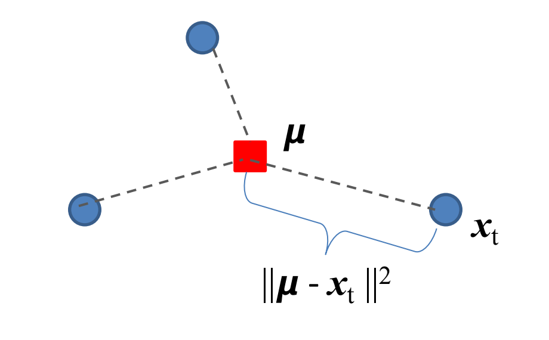

如果定义误差
$$
J(\bm{\mu})=\sum_{t=1}^{N}\left\| \bm{x_t}-\bm{\mu} \right\|_{}^{2}
$$

可以证明当 $\bm{\mu}$ 是所有数据点的均值时，误差最小。

* 证明 1 (配方):
    $$
    \begin{aligned}
    J(\bm{\mu})&=\sum_{t=1}^{N}\left\| \bm{x_t}-\bm{\mu} \right\|_{}^{2} \\
    &= \sum_{t=1}^{N} (\bm{\mu}-\bm{x_t})\cdot (\bm{\mu}-\bm{x_t}) \\
    &= \sum_{t=1}^{N} (\left\| \mu \right\|_{}^{2}+\left\| \bm{x_t} \right\|_{}^{2}-2\bm{\mu}\cdot \bm{x_t}) \\
    &= n \left\| \bm{\mu} \right\|_{}^{2} - 2\bm{\mu}\cdot \sum_{t=1}^{N} \bm{x_t} + \sum_{t=1}^{N} \left\| \bm{x_t} \right\|_{}^{2} \\
    &= n(\bm{\mu} - \frac{1}{n}\sum_{t=1}^{N}\bm{x_t})^{2} + C
    \end{aligned}
    $$

    因此 $\bm{\mu}=\frac{1}{n}\sum_{t=1}^{N}\bm{x_t}$ 的时候误差最小。

* 证明 2 (求导):
    $$
    \begin{aligned}
    \left\| \bm{x_t}-\bm{\mu} \right\|_{}^{2} &= (\bm{x_t}-\bm{\mu})^{\mathrm{T}}(\bm{x_t}-\bm{\mu}) \\
    &= \bm{x_t}^{\mathrm{T}}\bm{x_t} - \bm{x_t}^{\mathrm{T}}\bm{\mu} - \bm{\mu}^{\mathrm{T}}\bm{x_t} + \bm{\mu}^{\mathrm{T}}\bm{\mu} \\
    &= \bm{x_t}^{\mathrm{T}}\bm{x_t} - 2\bm{\mu}^{\mathrm{T}}\bm{x_t} + \bm{\mu}^{\mathrm{T}}\bm{\mu}
    \end{aligned}
    $$

    上式利用了 $\bm{x_t}^{\mathrm{T}}\bm{\mu}=(\bm{x_t}^{\mathrm{T}}\bm{\mu})^{\mathrm{T}}=\bm{\mu}^{\mathrm{T}}\bm{x_t}$

    同时对于向量的导数，如 $f(\bm{x})=\bm{a}^{\mathrm{T}}\bm{x}$，其中 $\bm{x}=\begin{pmatrix} x_1 \\ x_2 \\ \vdots \\ x_n \end{pmatrix}$, $\bm{a} = \begin{pmatrix} a_1 \\ a_2 \\ \vdots \\ a_n \end{pmatrix}$，那么定义导数为：
    $$
    \frac{\partial f(\bm{x})}{\partial \bm{x}} = \begin{pmatrix} 
        \frac{\partial f}{\partial x_1} \\ \frac{\partial f}{\partial x_2} \\ \vdots \\ \frac{\partial f}{\partial x_n} 
    \end{pmatrix} = \bm{a}
    $$

    同理，对于 $f(\bm{x})=\bm{x}^{\mathrm{T}}\bm{A}\bm{x}=\sum_{i,j}x_i a_{ij} x_j$
    $$
    \frac{\partial f(\bm{x})}{\partial \bm{x}} = \bm{A}\bm{x} + \bm{A}^{\mathrm{T}}\bm{x}
    $$

    此处可以理解为对 $f(\bm{x})$ 求微分
    $$
    \begin{aligned}
    \mathrm{d}f(\bm{x}) &= \mathrm{d}Tr(\bm{x}^{\mathrm{T}}\bm{A}\bm{x})  \\
    &= Tr(\mathrm{d}(\bm{x}^{\mathrm{T}}\bm{A}\bm{x})) \\
    &= Tr(\mathrm{d}\bm{x}^{\mathrm{T}}(\bm{A}\bm{x})+\bm{x}^{\mathrm{T}}\bm{A}\mathrm{d}\bm{x}) \\
    &= Tr((\bm{A}\bm{x})^{\mathrm{T}}\mathrm{d}\bm{x}+\bm{x}^{\mathrm{T}}\bm{A}\mathrm{d}\bm{x}) \\
    &= Tr \left[ (\bm{A}\bm{x}+\bm{A}^{\mathrm{T}}\bm{x})^{\mathrm{T}}\mathrm{d}\bm{x} \right] \\
    &= (\bm{A}\bm{x}+\bm{A}^{\mathrm{T}}\bm{x})^{\mathrm{T}}\mathrm{d}\bm{x}
    \end{aligned}
    $$

    此处利用了 $Tr(\bm{A}^{\mathrm{T}})=Tr(\bm{A})$ 的性质。

    最终考虑此处误差求导
    $$
    \frac{\partial J}{\partial \bm{\mu}} = \sum_{t=1}^{N} (-2\bm{x_{t}}+2\bm{\mu}) = 0
    $$

    $$
    \Rightarrow \bm{\mu}=\frac{1}{n}\sum_{t=1}^{N}\bm{x_t}
    $$

## Clustering the data
比如我们希望把数据分为两堆点，那么延续上面的思路，我们可以用两个点来代表这两个 cluster。
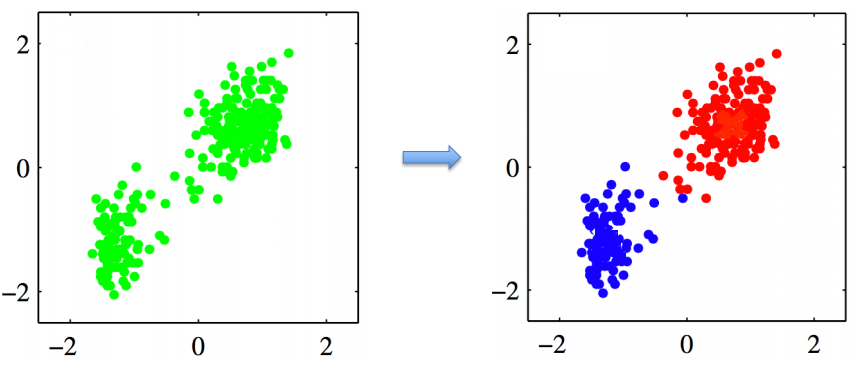

### Minimize the sum of square distance J
定义这两个点为 $\bm{\mu_1},\bm{\mu_2}$，继续使用平方误差。

首先对于最普遍的 $K$ 个点的情形，有
$$
J=\sum_{n=1}^{N}\sum_{k=1}^{K}r_{nk}\left\| \bm{x_n}-\bm{\mu_k} \right\|_{}^{2}
$$

其中当点 $\bm{x_n}$ 被归属到 cluster $k$ 时，$r_{nk}=1$，其他时候 $r_{nk}=0$。

那么对于此处的二聚类情形，即有 $K=2$。对于前面 $K=1$ 的情形，可以直接求导得出结果，但是当 $K=2$ 时，无法得到解析解，就需要利用机器学习的算法。

#### If we know $r_{n_1}$ , $r_{n_2}$ for all $n=1,…,N$
很显然此时 $\bm{\mu_1},\bm{\mu_2}$ 应当分别取 cluster1 和 cluster2 的平均值。即：
$$
\bm{\mu_k}=\frac{\sum_{n}r_{nk}\bm{x_n}}{\sum_{n}r_{nk}}
$$

我们称该过程为 **M step**。

#### If we know $\mu_1$, $\mu_2$
为了使得 $J$ 更小，显然当 $\left\| \bm{x_n}-\bm{\mu_1} \right\|_{}^{2}<\left\| \bm{x_n}-\bm{\mu_2} \right\|_{}^{2}$ 时，应当有 $r_{n_1}=1, r_{n_2}=0$。即：
$$
r_{nk}=\begin{cases}1&\text{if }k=\arg\min_j\|\mathbf{x}_n-\boldsymbol{\mu}_j\|^2\\0&\text{otherwise.}\end{cases}
$$

我们称该过程为 **E step**。

## K-mean Algorithms
1. 首先随机初始化 $\bm{\mu_1},\bm{\mu_2}$
2. 进行一次 E step，即划分 cluster
3. 根据此时的两个 cluster，利用 M step 更新 $\mu_1,\mu_2$。
4. 若收敛，则停止；反之继续步骤 2.

伪代码如下：
$$
\begin{aligned}
&\text{Initialize~}\boldsymbol{m}_{i},i=1,\ldots,k,\mathrm{for~example},\text{to }k\text{ random }\boldsymbol{x}^{t} \\
&\text{Repeat} \\
&\quad \text{For~all~}\boldsymbol{x}^{t}\in\mathcal{X} \\
&\quad \quad b_i^t\gets
  \begin{cases}
  &1 \quad \text{if }\|\boldsymbol{x}^t-\boldsymbol{m}_i\|=\min_j\|\boldsymbol{x}^t-\boldsymbol{m}_j\|\\
  &0\quad\mathrm{otherwise}
  \end{cases} \\
&\quad \text{For all } \bm{m_i}, i=1, \ldots k  \\
&\quad \quad \boldsymbol{m}_{i}\leftarrow\sum_{t}b_{i}^{t}\boldsymbol{x}^{t}/\sum_{t}b_{i}^{t} \\
&\text{Until~} \bm{m_i} \text{~converage}
\end{aligned}
$$

直观过程图如下：
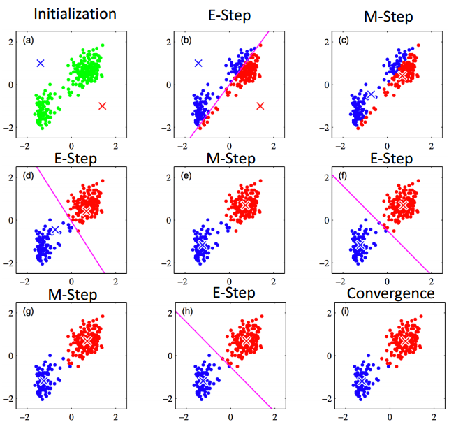

### Questions
* How many possible assignments for K-mean clustering?
  * $k^{n}$
* Can K-mean algorithm always converge? Why?
  * 目标函数单调递减且有界，因此一定收敛。
* Possible limitations of K-mean clustering?
  * 可能收敛到的是*局部最优解*。比如有两堆点，但是初始化的时候 $\bm{\mu_1},\bm{\mu_2}$ 中的某个点初始值离两堆点都会非常远，那么会导致最终一个 cluster 占据了所有点；另一个 cluster 没有点。

## Hierarchical Clustering
1. 首先把每一个点都视作一个单独的 group
2. 查找两个最近的 group，把它们合成一个
3. 当所有的点都被合成一个 cluster 时，算法终止。

### Distance Measure
此时需要考虑什么叫 “离得最近的两个 group”。我们记两个点 $a$ 和 $b$ 的距离为 $d(a,b)$

两个 group $A,B$ 的距离可以定义为：
* single-linkage
  * $\displaystyle d(A,B) = \min_{a\in A,b\in B} d(a,b)$ 
* complete-linkage
  * $\displaystyle d(A,B) = \max_{a\in A,b\in B} d(a,b)$
* average-linkage
  * $\displaystyle d(A,B) = \frac{\sum_{a\in A,b\in B}d(a,b)}{\left\vert A \right\vert \cdot \left\vert B \right\vert }$

### Dendrogram
经过 hierarchical clustering 之后，可以得到树状图用于形象地展示 cluster 的过程
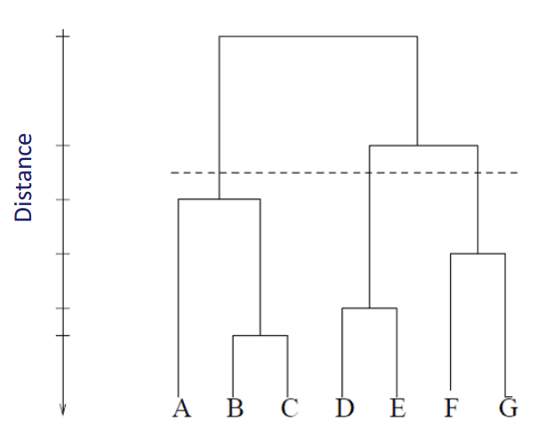

从这里可以看出这种算法的层级结构。

### Question
* What are the advantage and limitations of hierarchical clustering?
  * 优点：
    * 便于理解层级结构。
    * 不用随机初始化，不会像 K-mean 算法那样陷入局部最优。
  * 缺点：
    * 计算复杂度高，每一步的计算复杂度为 $O(n^{2})$；而 K-mean 每一步为 $O(kn)$。
    * 依然不知道一堆点该取多少 cluster。

## Adaptive learing(online learning)
假如不能像之前一样一次性知道所有数据，数据是逐个来的，那么就需要新的算法。

### Competitive learning
用 $m_1,m_2$ 两个点代表两个 cluster。当新来的点 $x$ 离 $m_1$ 更近，那么把 $x$ 归入 cluster 1；反之归入 cluster 2。
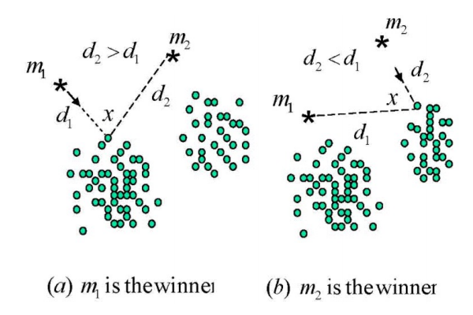

同时在新的点进入后，我们希望通过调整 $m_1,m_2$ 让这两个点能够被新的点影响。
$$\begin{gathered}
\varepsilon_{t}(\theta_{j})=\|x_{t}-m_{j}\|^{2} \\
c=argmin_{j}\varepsilon_{t}(\theta_{j}). \\
\left.p_{j,t}=\left\{\begin{array}{ll}{1,}&{\mathrm{if}\quad j=c,}\\{0,}&{\mathrm{otherwise};}\end{array}\right.\right. \\
m_{j}^{new}=m_{j}^{old}+\eta p_{j,t}(x_{t}-m_{j}^{old}). 
\end{gathered}$$

可以看出此处对 $m_j$ 的更新类似于梯度下降法。

#### bad initialization
类似 K-mean，假如 $m_1,m_2$ 中的一个点初始化不合适，同样会陷入局部最优解。即某个点成为了所有数据的中心。
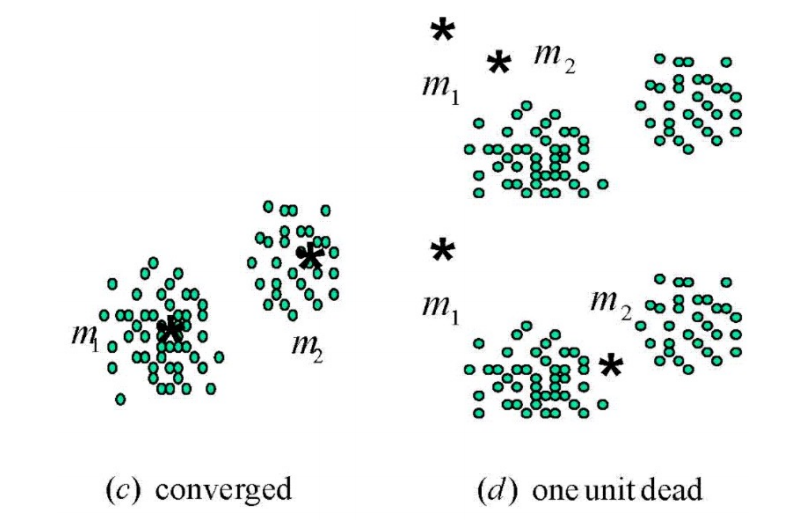

### Frequency sensitive competitive learning (FSCL)
即假如某个点已经包括了多个数据，那么后面的新数据被这个点包括的难度会增大(penalize the frequent winner)
$$
\varepsilon_t(\theta_j) = \alpha_j \left\| x_t - m_j \right\|_{}^{2}
$$

但是这种算法在指定的中心多余实际的中心时会出问题。比如一堆数据聚成 $4$ 个类更为合适，但是给了 $5$ 个中心点。

### Rival penalized competitive learning (RPCL)
与 FSCL 相比，RPCL 引入了对于竞争次优点的惩罚，解决了指定中心与实际中心数量不匹配的问题。即每次竞争之后让竞争胜利者之外的最优点离新数据远一些。
$$
\left.p_{j,t}=\begin{cases}1,&\text{if~}j=c,\\-\gamma,&\text{if~}j=r,\\0,&\text{otherwise},\end{cases}\left\{\begin{array}{l}c=argmin_j\varepsilon_t(\theta_j),\\r=argmin_{j\neq c}\varepsilon_t(\theta_j),\end{array}\right.\right.
$$

其中 $\gamma$ 大约是 $0.05$ 到 $0.1$ 之间的值。
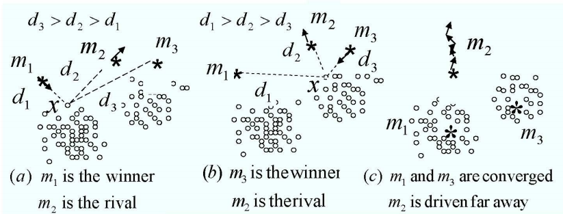

### Question
* Are competitive learning (CL) and K-mean equivalent?
  * 对于 K-mean，求均值有 $\displaystyle \mu=\frac{1}{N}\sum_{t=1}^{N}x_t=\bar{x}_{N}$，即 $\displaystyle \bar{x}_{t+1} = \bar{x}_{t} + \frac{1}{t+1}(x_{t+1}-x_t)$
  * 对于 CL，有 $m_{j}^{new}=m_{j}^{old}+\eta p_{j,t}(x_{t}-m_{j}^{old})$
  * 因此只要使得 $\eta=\frac{1}{t+1}$ 时，两者的计算方式可以相同。
* Could you come up with new algorithms to tackle the "bad initializaion" problem of competitive learning? (or K-mean)?
* Can you design a K-mean version of RPCL?

## Gaussian Mixture Models (GMM)
### Preliminaries
#### Binary variables
比如说抛硬币，每一个样本 $x\in \{0,1\}$。
$$
\begin{aligned}
p(x=1|\mu) &= \mu \\
p(x=0|\mu) &= 1-\mu
\end{aligned}
$$

也可以简写为
$$
Bern(x|\mu) = \mu^{x}(1-\mu)^{1-x}
$$

易得 $\mathbb{E}[x]=\mu, var[x]=\mu(1-\mu)$

假如有 $N$ 个点，独立同分布，$\mathcal{D}=\{x_1,\ldots,x_N\}$，我们可以写出似然函数：
$$
p(\mathcal{D}|\mu)=\prod_{n=1}^Np(x_n|\mu)=\prod_{n=1}^N\mu^{x_n}(1-\mu)^{1-x_n}
$$

有时为方便计算，写成：
$$
\ln p(\mathcal{D}|\mu)=\sum_{n=1}^N\ln p(x_n|\mu)=\sum_{n=1}^N\left\{x_n\ln\mu+(1-x_n)\ln(1-\mu)\right\}
$$

#### Multinomial variables
伯努利分布仅有两种情况，但是假如像掷骰子，可能会有 $K=6$ 中情况。这里考虑有 $K$ 中情况时的概率分布问题。样本记为 $\mathbf{x}$，有 $x_i=1$，$\sum_{k=1}^{K}x_k=1$，表示选中第 $i$ 种情况。比如 $K=6$，样本可能为 $\mathbf{x}=(0,0,1,0,0,0)^\mathrm{T}$。

Multinomial distribution
$$
p(\mathbf{x}|\boldsymbol{\mu})=\prod_{k=1}^K\mu_k^{x_k}\quad\quad\boldsymbol{\mu}=(\mu_1,\ldots,\mu_K)^\mathrm{T}\quad\mu_k\geqslant0\\
\sum_k\mu_k=1
$$

期望为 $\mathbb{E}[\mathbf{x}|\boldsymbol{\mu}]=\sum_\mathbf{x}p(\mathbf{x}|\boldsymbol{\mu})\mathbf{x}=(\mu_1,\ldots,\mu_M)^\mathrm{T}=\boldsymbol{\mu}$。

同样写出似然函数
$$
p(\mathcal{D}|\boldsymbol{\mu})=\prod_{n=1}^N\prod_{k=1}^K\mu_k^{x_{nk}}=\prod_{k=1}^K\mu_k^{(\sum_nx_{nk})}=\prod_{k=1}^K\mu_k^{m_k} \quad m_k=\sum_{n}x_{nk}
$$

#### Gaussian distribution
$$
\mathcal{N}(x|\mu,\sigma^2)=\frac1{\left(2\pi\sigma^2\right)^{1/2}}\exp\left\{-\frac1{2\sigma^2}(x-\mu)^2\right\}
$$

#### Multivariate Gaussian
$$
\mathcal{N}(\mathbf{x}|\boldsymbol{\mu},\boldsymbol{\Sigma})=\frac1{(2\pi)^{D/2}}\frac1{|\boldsymbol{\Sigma}|^{1/2}}\exp\left\{-\frac12(\mathbf{x}-\boldsymbol{\mu})^\mathrm{T}\boldsymbol{\Sigma}^{-1}(\mathbf{x}-\boldsymbol{\mu})\right\}
$$

其性质有：
$$
\begin{aligned}
&\mathbb{E}[\mathbf{x}]=\boldsymbol{\mu}\\
&\mathbb{E}[\mathbf{x}\mathbf{x}^\mathrm{T}]=\boldsymbol{\mu}\boldsymbol{\mu}^\mathrm{T}+\boldsymbol{\Sigma}. \\
&\mathrm{cov[x]=\mathbb{E}\left[(x-\mathbb{E}[x])(x-\mathbb{E}[x])^T\right]=\boldsymbol{\Sigma}.}
\end{aligned}
$$

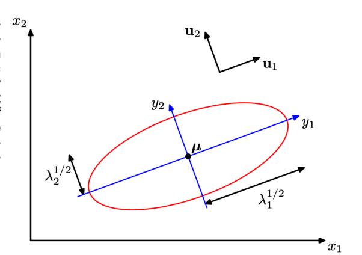

#### Mahalanobis distance
对于欧氏距离，每个维度都是同等重要的。但是在某些应用场景下，每个维度并不是等同的，比如一座山，在某些方向坡度更陡，某些方向坡度更缓，那么在移动相同水平距离的情况下难度时不同的。因此可以引入新的距离度量的方式。

* 在欧氏距离中，假如有两点 $\mathbf{x},\mathbf{y}$，距离可以写成 $d^{2}(\mathbf{x},\mathbf{y})=(\mathbf{y}-\mathbf{x})^{\mathrm{T}}(\mathbf{y}-\mathbf{x})$
* 而马氏距离则为 $d^{2}(\mathbf{x},\mathbf{y})=(\mathbf{y}-\mathbf{x})^{\mathrm{T}}\mathbf{A}(\mathbf{y}-\mathbf{x})$. ($d(\vec{x},\vec{y})=\sqrt{(\vec{x}-\vec{y})^T\Sigma^{-1}(\vec{x}-\vec{y})}$)

以二维向量为例，考虑点 $\mathbf{x}$ 到原点
$$
\left\| \mathbf{x}-0 \right\|_{}^{2} = x_1^{2}+x_2^{2}=
\begin{pmatrix} 
    x_1 \\ x_2 
\end{pmatrix} ^{\mathrm{T}}
\begin{pmatrix} 
    1 & 0 \\ 0 & 1 
\end{pmatrix} 
\begin{pmatrix} 
    x_1 \\ x_2 
\end{pmatrix} 
$$

但假如某个维度更加重要，中间矩阵可以写为 $\begin{pmatrix} 1 & 0 \\ 0 & 2  \end{pmatrix}$，可以看出此时数据的“等高线”为一个椭圆。如果还希望这个椭圆能够旋转，那么可以再在两侧加上旋转矩阵 $\mathbf{R}$。因此 $\mathbf{A}=\mathbf{R}\boldsymbol{\Lambda}\mathbf{R}^{\mathrm{T}}$

#### From distance to probability
从距离表示一个东西和从概率表示一个东西，在概念上可以是一致的。

$$
D_M(x)=\sqrt{(x-\mu)^T\Sigma^{-1}(x-\mu)} \rightarrow \frac{1}{\sqrt{(2\pi)^k|\boldsymbol{\Sigma}|}}\exp\left(-\frac{1}{2}(\mathbf{x}-\boldsymbol{\mu})^\mathrm{T}\boldsymbol{\Sigma}^{-1}(\mathbf{x}-\boldsymbol{\mu})\right)
$$

概率相当于是对距离的 normalize。

一种距离对应一种分布，从上面可以看出，欧氏/马氏距离对应了高斯分布；绝对值距离则对应 Laplace 分布：
$$
\left\vert x-\mu \right\vert \rightarrow e^{-\gamma \left\vert x-\mu \right\vert }
$$

### Issues for K-mean algorithm
* If Euclidean distance is not good for some data, do we have other choices?
* Can we assign each data point to the clusters probabilistically?
* If K (the total number of clusters) is unknown, can we estimate it from the data?

### Gaussian Mixture Model
在 K-mean 算法中，我们希望最小化 $\boldsymbol{\mu}$ 到所有样本的欧氏距离 $\min_{\boldsymbol{\mu}}\sum_{t=1}^{N}\left\| \mathbf{x}_t-\boldsymbol{\mu} \right\|_{}^{2}$，而为了解决 K-mean 没有考虑 cluster 形状(可能为椭圆形)，以及无法使用概率来划分样本点的问题，我们考虑使用 GMM。

在 GMM 中，每个 cluster 都有一个概率分布
$$
\mathcal{N}(\mathbf{x}|\boldsymbol{\mu},\boldsymbol{\Sigma})=\frac{1}{\sqrt{(2\pi)^{k}|\boldsymbol{\Sigma}|}}\exp\left(-\frac{1}{2}(\mathbf{x}-\boldsymbol{\mu})^{\mathrm{T}}\boldsymbol{\Sigma}^{-1}(\mathbf{x}-\boldsymbol{\mu})\right)
$$
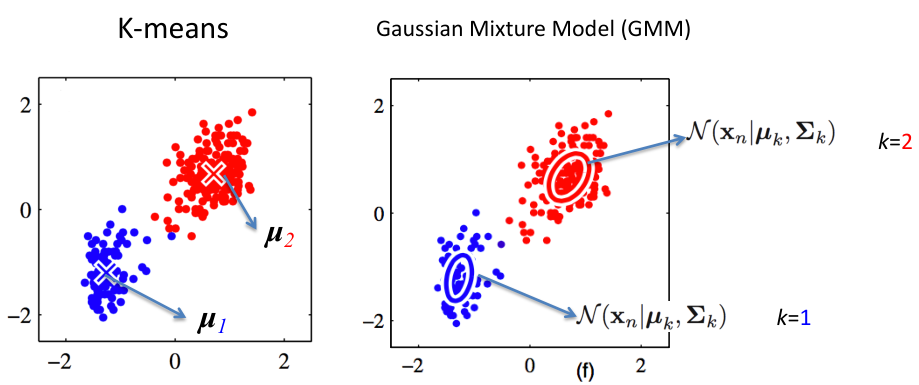

同时我们使用 $z_k=1$ 表示样本 $\mathbf{x}$ 属于第 $k$ 个 cluster。
$$
\mathbf{z}=(z_1,\ldots,z_K)\quad z_k\in\{0,1\}\quad\sum_kz_k=1
$$

利用每个 cluster 的概率分布，可以写出
$$
p(\mathbf{x}|z_k=1)=\mathcal{N}(\mathbf{x}|\boldsymbol{\mu}_k,\boldsymbol{\Sigma}_k)
$$

然后再考虑先验概率
$$
p(z_k=1)=\pi_k \quad 0\le \pi_{k} \le 1 \quad \sum_{k=1}^{K}\pi_{k}=1
$$

最后可以得到样本点的概率分布函数：
$$
p(\mathbf{x})=\sum_\mathbf{z}p(\mathbf{z})p(\mathbf{x}|\mathbf{z})=\sum_{k=1}^K\pi_k\mathcal{N}(\mathbf{x}|\boldsymbol{\mu}_k,\boldsymbol{\Sigma}_k)
$$

#### Maximum likelihood
此时问题可以转化为最大化似然函数
$$
p(\mathbf{X}|\boldsymbol{\mu}, \boldsymbol{\Sigma}, \boldsymbol{\pi})
$$

其中
$$\begin{gathered}
\mathbf{X}=\{x_{1},...,x_{N}\} \\
\boldsymbol{\pi}=\{\pi_{_1},...,\pi_{_K}\} \\
\boldsymbol{\mu}=\{\mu_{_1},\ldots,\mu_{_K}\} \\
\boldsymbol{\Sigma}=\{\Sigma_{_1},...,\Sigma_{_K}\}
\end{gathered}$$

首先假设先验概率已知。为方便计算，将似然函数取对数：
$$
\ln p(\mathbf{X}|\boldsymbol{\mu},\boldsymbol{\Sigma})=-\frac{ND}{2}\ln(2\pi)-\frac{N}{2}\ln|\boldsymbol{\Sigma}|-\frac{1}{2}\sum_{n=1}^N(\mathbf{x}_n-\boldsymbol{\mu})^\mathrm{T}\boldsymbol{\Sigma}^{-1}(\mathbf{x}_n-\boldsymbol{\mu})
$$

首先计算 $\boldsymbol{\mu}$:
$$
\frac\partial{\partial\boldsymbol{\mu}}\ln p(\mathbf{X}|\boldsymbol{\mu},\boldsymbol{\Sigma})=\sum_{n=1}^N\boldsymbol{\Sigma}^{-1}(\mathbf{x}_n-\boldsymbol{\mu})=0\quad\longrightarrow\quad\boldsymbol{\mu}_\mathrm{ML}=\frac1N\sum_{n=1}^N\mathbf{x}_n
$$

然后计算 $\boldsymbol{\Sigma}$
$$
\begin{aligned}
\mathrm{d}\ln p(\mathbf{X}|\boldsymbol{\mu},\boldsymbol{\Sigma}) &= 0- \frac{N}{2}\operatorname{Tr}(\boldsymbol{\Sigma}^{-1}\cdot \mathrm{d}\boldsymbol{\Sigma}) - \frac{1}{2} \operatorname{Tr}(\sum_{t=1}^{N} (\mathbf{x}_t-\boldsymbol{\mu})^{\mathrm{T}}(-\boldsymbol{\Sigma}^{-1}\cdot \mathrm{d}\boldsymbol{\Sigma}\cdot \boldsymbol{\Sigma}^{-1})(\mathbf{x}_{t}-\boldsymbol{\mu})) \\
&= - \frac{N}{2}\operatorname{Tr}(\boldsymbol{\Sigma}^{-1}\cdot \mathrm{d}\boldsymbol{\Sigma}) - \frac{1}{2} \operatorname{Tr}(\sum_{t=1}^{N} (\mathbf{x}_{t}-\boldsymbol{\mu})(\mathbf{x}_t-\boldsymbol{\mu})^{\mathrm{T}}(-\boldsymbol{\Sigma}^{-1}\cdot \mathrm{d}\boldsymbol{\Sigma}\cdot \boldsymbol{\Sigma}^{-1})) \\
&= - \frac{N}{2}\operatorname{Tr}(\boldsymbol{\Sigma}^{-1}\cdot \mathrm{d}\boldsymbol{\Sigma}) + \frac{1}{2} \operatorname{Tr}(\sum_{t=1}^{N} \boldsymbol{\Sigma}^{-1}(\mathbf{x}_{t}-\boldsymbol{\mu})(\mathbf{x}_t-\boldsymbol{\mu})^{\mathrm{T}}\boldsymbol{\Sigma}^{-1}\cdot \mathrm{d}\boldsymbol{\Sigma})
\end{aligned}
$$

(此处利用了 $\operatorname{Tr}(ABC)= \operatorname{Tr}(CAB)$ 的性质) 

$$
\frac{\partial \ln p(\mathbf{X}|\boldsymbol{\mu},\boldsymbol{\Sigma})}{\partial \boldsymbol{\Sigma}} =0 \Rightarrow - \frac{N}{2} \boldsymbol{\Sigma}^{-1}+ \frac{1}{2} \boldsymbol{\Sigma}^{-1} (\mathbf{x}_{t}-\boldsymbol{\mu})(\mathbf{x}_t-\boldsymbol{\mu})^{\mathrm{T}} \boldsymbol{\Sigma}^{-1} =0
$$

得到
$$
\boldsymbol{\Sigma_\mathrm{ML}}=\frac{1}{N}\sum_{n=1}^{N}(\mathbf{x}_{n}-\boldsymbol{\mu_\mathrm{ML}})(\mathbf{x}_{n}-\boldsymbol{\mu_\mathrm{ML}})^\mathrm{T}
$$

即样本的样本协方差 (sample covariance matrix)。

#### Matrix-cook-book
$$\begin{aligned}
\partial\mathbf{A}& \begin{array}{cc}=&0\end{array} & (\mathbf{A}\text{ is a constant})  \\
\partial(\alpha\mathbf{X})& =\quad\alpha\partial\mathbf{X}  \\
\partial(\mathbf{X}+\mathbf{Y})& =\quad\partial\mathbf{X}+\partial\mathbf{Y}  \\
\partial(\mathrm{Tr}(\mathbf{X}))& =\quad \operatorname{Tr}(\partial\mathbf{X})  \\
\partial(\mathbf{X}\mathbf{Y})& =\quad(\partial\mathbf{X})\mathbf{Y}+\mathbf{X}(\partial\mathbf{Y})  \\
\partial(\mathbf{X}\circ\mathbf{Y})& =\quad(\partial\mathbf{X})\circ\mathbf{Y}+\mathbf{X}\circ(\partial\mathbf{Y})  \\
\partial(\mathbf{X}\otimes\mathbf{Y})& =\quad(\partial\mathbf{X})\otimes\mathbf{Y}+\mathbf{X}\otimes(\partial\mathbf{Y})  \\
\partial(\mathbf{X}^{-1})& =\quad-\mathbf{X}^{-1}(\partial\mathbf{X})\mathbf{X}^{-1}  \\
\partial(\det(\mathbf{X}))& =\quad\det(\mathbf{X})\text{Tr}(\mathbf{X}^{-1}\partial\mathbf{X})  \\
\partial(\ln(\det(\mathbf{X})))& =\quad\mathrm{Tr}(\mathbf{X}^{-1}\partial\mathbf{X})  \\
\partial\mathbf{X}^{T}& =\quad(\partial\mathbf{X})^T  \\
\partial\mathbf{X}^{H}& =\quad(\partial\mathbf{X})^H 
\end{aligned}$$

### Expectation-Maximization (EM) for maximum likelihood
#### E step
在 K-mean 算法中，对于第 $n$ 个样本点的分类，我们有：
$$
\gamma_{nk} = \begin{cases}
  1; \quad k=\argmin_{j} \left\| \mathbf{x}_n-\boldsymbol{\mu}_j \right\|_{} \\
  0 ; \quad \text{otherwise}
\end{cases}
$$

在引入了概率之后，我们则认为
$$
\gamma_{nk} = p(k|\mathbf{x}_n) = \frac{p(\mathbf{x}_n,k)}{p(\mathbf{x}_n)} = \frac{p(k)p(\mathbf{x}_n|k)}{p(\mathbf{x}_n)} = \frac{\pi_{k}G(\mathbf{x}_n|\boldsymbol{\mu}_k,\boldsymbol{\Sigma}_k)}{\sum_{j}\pi_j G(\mathbf{x}_n|\boldsymbol{\mu}_j,\boldsymbol{\Sigma}_j)}
$$

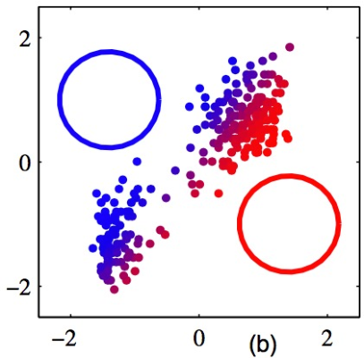

#### M step
$$
\pi_k=\frac{N_k}N\quad N_k=\sum_{n=1}^N\gamma(z_{nk})
$$

$$
\begin{gathered}
\boldsymbol{\mu}_k=\frac1{N_k}\sum_{n=1}^N\gamma(z_{nk})\mathbf{x}_n \\
\boldsymbol{\Sigma}_{k}=\frac{1}{N_{k}}\sum_{n=1}^{N}\gamma(z_{nk})(\mathbf{x}_{n}-\boldsymbol{\mu}_{k})(\mathbf{x}_{n}-\boldsymbol{\mu}_{k})^{\mathrm{T}} 
\end{gathered}
$$

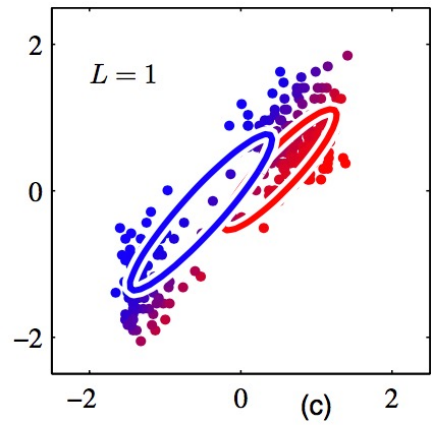

### Summary for the EM algorithm for GMM
* Does it find the global optimum?
  * No, like K-means, EM only finds the nearest local optimum and the optimum depends on the initialization
* GMM is more general then K-means by considering mixing weights, covariance matrices, and soft assignments.
* Like K-means, it does not tell you the best K.

### Questions
* How can EM for GMM degenerate back to k-mean algorithm
  * 指定 $\boldsymbol{\Sigma}$ 为 $k\mathbf{I}$
  * E-step 时让 $\gamma_{nk} \in \{0,1\}$
* Can you design a variant algorithm between k-mean and EM?
