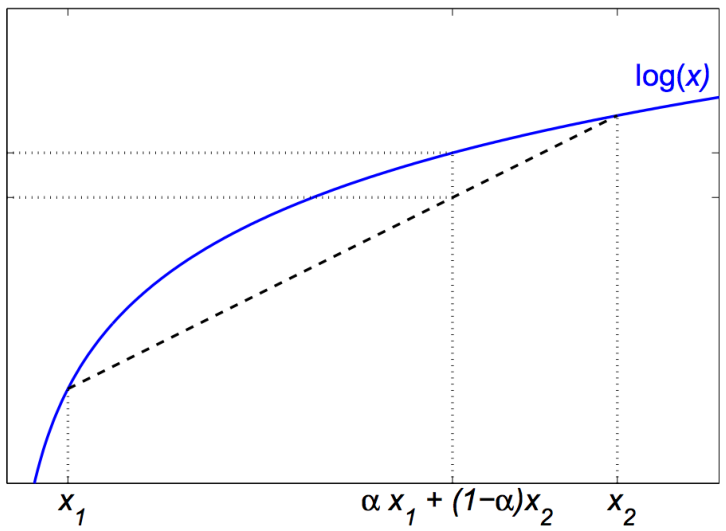
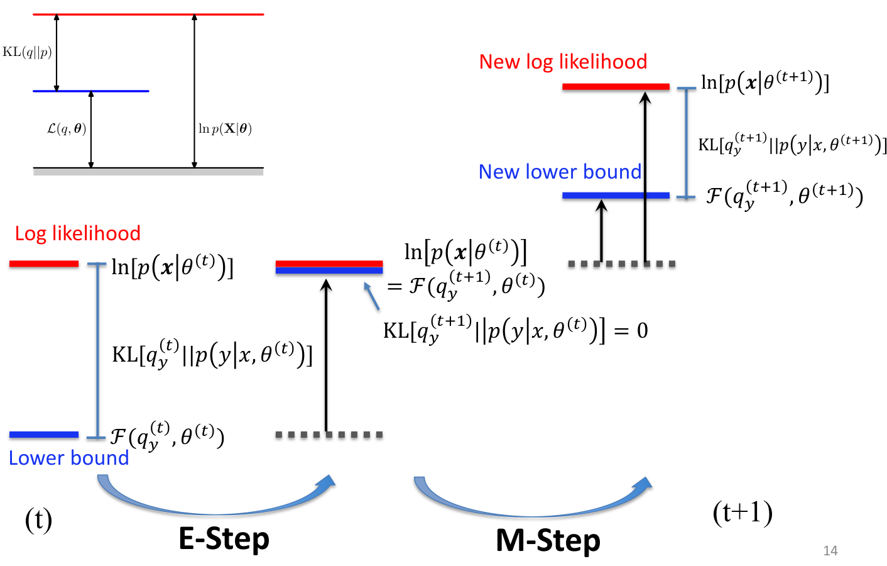
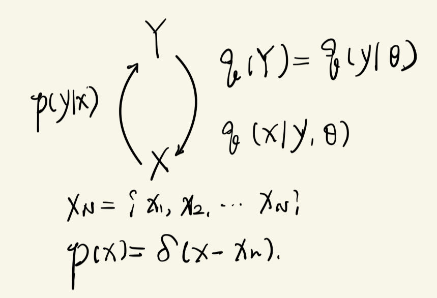

## GMM-From generation process perspective
### Introduce a latent variable
我们认为在分类任务中，每个点本身就隐含了属于哪个类的信息，只是我们没有观察到。EM 算法的 E-step 就相当于使用后验概率来求这个信息。我们使用 $\mathbf{z}$ 来表示这个信息，$z_k=1$ 表示某个点 $\mathbf{x}$ 属于 cluster $k$。
$$
\mathbf{z}=(z_{1},\ldots,z_{K})\quad z_{k}\in\{0,1\}\quad\sum_{k}z_{k}=1
$$

这个变量称为**隐变量**(latent variable)。

在概率模型中，我们记样本点属于某个 cluster 的概率为 $p(z_k=1)=\pi_k$，或者写为
$$
p(\mathbf{z})=\prod_{k=1}^{K} \pi_k^{z_k}
$$

假如一个样本已经能够确定属于某个类，我们假设其满足高斯分布：
$$
p(\mathbf{x}|z_k=1)=\mathcal{N}(\mathbf{x}|\boldsymbol{\mu}_k,\boldsymbol{\Sigma}_k)
$$

但是如果我们并没有该样本点属于某个类的信息，则其概率分布为高斯分布的加权
$$
p(\mathbf{x})=\sum_{\mathbf{z}}p(\mathbf{z})p(\mathbf{x}|\mathbf{z})=\sum_{k=1}^{K}\pi_{k}\mathcal{N}(\mathbf{x}|\boldsymbol{\mu}_{k},\boldsymbol{\Sigma}_{k})
$$

### EM algorithm for maximum likelihood
#### Details of the EM Algorithm for GMM
1. 初始化均值 $\mathbf{\mu}_k$，协方差矩阵 $\mathbf{\Sigma}_k$ 以及混合系数(mixing coefficients) $\pi_k$，并且计算 log likelihood 的初始化值
2. **E step**。
$$
\gamma(z_{nk})=\frac{\pi_{k}{\mathcal N}(\mathbf{x}_{n}|\boldsymbol{\mu}_{k},\boldsymbol{\Sigma}_{k})}{\sum_{j=1}^{K}\pi_{j}{\mathcal N}(\mathbf{x}_{n}|\boldsymbol{\mu}_{j},\boldsymbol{\Sigma}_{j})}
$$
3. **M step**。
$$
\begin{array}{rcl}
\mathbf{\mu}_k^\mathrm{new}&=&\frac1{N_k}\sum_{n=1}^N\gamma(z_{nk})\mathbf{x}_n\\\\
\mathbf{\Sigma}_k^\mathrm{new}&=&\frac1{N_k}\sum_{n=1}^N\gamma(z_{nk})\left(\mathbf{x}_n-\mathbf{\mu}_k^\mathrm{new}\right)\left(\mathbf{x}_n-\mathbf{\mu}_k^\mathrm{new}\right)^\mathrm{T}\\\\
\pi_k^\mathrm{new}&=&\frac{N_k}N
\end{array}
$$
其中
$$
N_k = \sum_{n=1}^{N} \gamma(z_{nk})
$$
4. 计算 log likelihood 以检查是否收敛
$$
\ln p(\mathbf{X}|\boldsymbol{\mu},\boldsymbol{\Sigma},\boldsymbol{\pi})=\sum_{n=1}^N\ln\left\{\sum_{k=1}^K\pi_k\mathcal{N}(\mathbf{x}_n|\boldsymbol{\mu}_k,\boldsymbol{\Sigma}_k)\right\}
$$

#### The general EM algorithm
给定联合概率分布 $p(\mathbf{X},\mathbf{Z}|\boldsymbol{\theta})$，其中 $\mathbf{X}$ 为所有观测到的样本数据，$\mathbf{Z}$ 为隐变量，$\boldsymbol{\theta}$ 为所有参数。算法的目标是调整参数 $\boldsymbol{\theta}$ 最大化似然函数 $p(\mathbf{X}|\boldsymbol{\theta})$
1. 选择初始化参数 $\boldsymbol{\theta}^{old}$
2. **E step**。计算后验概率 $p(\mathbf{Z}|\mathbf{X},\boldsymbol{\theta}^{old})$
$$
p(\mathbf{Z}|\mathbf{X}, \boldsymbol{\theta}^{old}) = \frac{p(\mathbf{Z})p(\mathbf{X}|\mathbf{Z},\boldsymbol{\theta}^{old})}{p(\mathbf{X}|\boldsymbol{\theta})}
$$
3. **M step**。更新参数
    $$
    \boldsymbol{\theta^\mathrm{new}}=\underset{\theta}{\operatorname*{\arg\max}}\mathcal{Q}(\boldsymbol{\theta},\boldsymbol{\theta^\mathrm{old}})
    $$

    其中
    $$
    \mathcal{Q}(\boldsymbol{\theta},\boldsymbol{\theta^\mathrm{old}})=\sum_\mathbf{Z}p(\mathbf{Z}|\mathbf{X},\boldsymbol{\theta^\mathrm{old}})\ln p(\mathbf{X},\mathbf{Z}|\boldsymbol{\theta}).
    $$
4. 检查收敛性，更新参数
$$
\boldsymbol{\theta}^\mathrm{old}\leftarrow\boldsymbol{\theta}^\mathrm{new}
$$

#### Derive an EM algorithm for BMM
这里将 EM 算法用于伯努利分布上。

首先写出伯努利分布：$Bern(x|\mu_j) = \mu_j^{x} (1-\mu_j)^{1-x}$。
BMM：$p(x|\theta)=\sum_{j=1}^{K}\alpha_j B(x|\mu_j)$。
记 $\theta$ 为参数的集合，即 $\theta=\left\{ \alpha_j,\mu_j|j=1,2, \ldots ,K , \sum_{j=1}^{K}\alpha_j=1\right\}$

E-step:
$$
\begin{aligned}
&P(\mathbf{Z}|\mathbf{X}, \theta) = \prod_{t=1}^{N} P(z_t|x_t, \theta)  \\
&P(z_t=j|x_t, \theta) \equiv  P(j|x_t, \theta) = \frac{\alpha_j B(x_t|\mu_j)}{P(x_t|\theta)} \bigg|_{\theta=\theta^{old}}
\end{aligned}
$$

M-step:
$$
\begin{aligned}
Q(\theta,\theta^{old}) & = \sum_{\mathbf{Z}}P(\mathbf{Z}|\mathbf{X},\theta^{old})\ln P(\mathbf{X},\mathbf{Z}|\theta) \\
& =  \sum_{\mathbf{Z}}P(\mathbf{Z}|\mathbf{X},\theta^{old})\ln \prod_{t=1}^{N} P(x_t,z_t|\theta) \\ 
& = \sum_{t=1}^{N}\sum_{\mathbf{Z}}P(\mathbf{Z}|\mathbf{X},\theta^{old})\ln P(x_t,z_t|\theta) \\
& = \sum_{t=1}^{N} \sum_{z_t} P(z_t|x_t, \theta^{old}) \ln P(x_t,z_t|\theta) \quad (\text{use~} P(\mathbf{Z}|\mathbf{X}, \theta) = \prod_{t=1}^{N} P(z_t|x_t, \theta) \text{~and~} \sum_{\mathbf{Z}}=\sum_{z_1}\sum_{z_2}\cdots \sum_{z_{K}}) \\
& = \sum_{t=1}^{N} \sum_{j=1}^{K} P(j|x_t,\theta^{old}) \ln [\alpha_j B(x_t|\mu_j)] \\
& = \sum_{t=1}^{N} \sum_{j=1}^{K} P(j|x_t,\theta^{old}) [\ln \alpha_j+ \ln B(x_t|\mu_j)] \\
& = \sum_{t=1}^{N} \sum_{j=1}^{K} P(j|x_t,\theta^{old}) [\ln \alpha_j+ x_t \ln \mu_j + (1-x_t)\ln (1-\mu_j)] \\
\end{aligned}
$$

接下来通过最大化 $Q$ 来求 $\mu$ 和 $\alpha$。
$$
\begin{aligned}
\frac{\partial Q}{\partial \mu_j} &= \sum_{t=1}^{N} P(j|x_t,\theta^{old}) (\frac{x_t}{\mu_j}-\frac{1-x_t}{1-\mu_j}) = \sum_{t=1}^{N} P(j|x_t,\theta^{old}) \frac{x_t-\mu_j}{\mu_j(1-\mu_j)} = 0 \\
\Rightarrow \mu_j &= \frac{\sum_{t=1}^{N}x_t P(j|x_t,\theta^{old})}{\sum_{t=1}^{N} P(j|x_t,\theta^{old})}
\end{aligned}
$$

对于 $\alpha$，由于 $\alpha$ 还有一个约束，即 $\sum_{j=1}^{K}\alpha_j=1$，因此使用拉格朗日乘子法，记 $Q' = Q + \lambda (\sum_{j=1}^{K} \alpha_j - 1)$
$$
\begin{aligned}
& \begin{cases}
    \displaystyle \frac{\partial Q'}{\partial \alpha_j} = \sum_{t=1}^{N} P(j|x_t,\theta^{old}) \alpha_j^{-1} + \lambda =0 \\
    \displaystyle \sum_{j=1}^{K} \alpha_j = 1
\end{cases} \\ 
\Rightarrow 
& \begin{cases}
    \displaystyle \lambda = -\sum_{t=1}^{N} \sum_{j=1}^{K} P(j|x_t,\theta^{old}) = -N \\
    \displaystyle \alpha_j = - \frac{1}{N} \sum_{t=1}^{N} P(j|x_t,\theta^{old})
\end{cases}
\end{aligned}
$$

### Why EM never decreases the (log)-likelihood?
#### Jensen's Inequality
一个凸函数的性质，这里应用在 $\log$ 函数上

对于 $\alpha_i\ge 0, \sum \alpha_i=1$，并且 $x_i>0$，有
$$
\log \left( \sum_{i}\alpha_i x_i \right) \ge  \sum_{i}\alpha_i \log(x_i)
$$

#### KL divergence
$$
KL(p||q) = \sum_{i}q_i \log \frac{q_i}{p_{i}} \quad \text{or} \quad \int p(x)\log \frac{p(x)}{q(x)}\mathrm{d}x \ge 0
$$

通常用于度量两个分布之间的距离。

**证明 1 (Jenson's Inequality)**：
$$
KL(q||p) = \sum_{i}q_i \log \frac{q_i}{p_{i}} = - \sum_{i} q_i \log \frac{p_{i}}{q_i}
$$

利用 Jenson's Inequality，
$$
\sum_{i} q_i \log \frac{p_{i}}{q_i} \le \log(\sum_{i}q_i \cdot \frac{p_{i}}{q_i}) = 0 
\Rightarrow KL(p||q) \ge 0
$$

**证明 2 (Lagrange multiplier)**：
$$
\begin{aligned}E&\stackrel{\mathrm{def}}{=}\textbf{KL}[q\|p]+\lambda\big(1-\sum_iq_i\big)=\sum_iq_i\log\frac{q_i}{p_i}+\lambda\big(1-\sum_iq_i\big)\end{aligned}
$$

$$
\left.
    \begin{array}{rcl}
    \displaystyle \frac{\partial E}{\partial q_i}&=&\log q_i-\log p_i+1-\lambda=0\Rightarrow\color{red}{q_i=p_i\exp(\lambda-1)}\\ \\
    \displaystyle \frac{\partial E}{\partial\lambda}&=&1-\sum_iq_i=0\Rightarrow\color{red}{\sum_iq_i=1}
    \end{array}
\right\}
\Rightarrow q_i=p_i
$$

#### EM as maximizing a variational lower bound
根据 Jensen's Inequality，$E[\log(x)]\le  \log (E[x])$

$$
\begin{aligned}
\log(P(\mathbf{x}|\theta)) & = \log(\sum_{\mathbf{y}}P(\mathbf{x},\mathbf{y}|\theta)) \\
& =\log(\sum_{\mathbf{y}}q(\mathbf{y})\frac{P(\mathbf{x},\mathbf{y}|\theta)}{q(\mathbf{y})})  \\
&\geq E_{q} [\log(\frac{P(\mathbf{x},\mathbf{y}|\theta)}{q(\mathbf{y})})] \\
&= E_q[\log(\frac{P(\mathbf{y}|\mathbf{x},\theta)P(\mathbf{x}|\theta)}{q(\mathbf{y})})] \\
&= E_q[\log(P(\mathbf{x}|\theta))]-E_q[\log(\frac{q(\mathbf{y})}{P(\mathbf{y}|\mathbf{x},\theta)})] \\
&= E_q[\log(P(\mathbf{x}|\theta))]-KL(q(\mathbf{y})\|P(\mathbf{y}|\mathbf{x},\theta)) \\
&= \log(P(\mathbf{x}|\theta)) - KL(q(\mathbf{y})\|P(\mathbf{y}|\mathbf{x},\theta))
\end{aligned}
$$

从上式可以看出，$E_{q} [\log(\frac{P(\mathbf{x},\mathbf{y}|\theta)}{q(\mathbf{y})})]$ 和似然函数 $\log(P(\mathbf{x}|\theta))$ 差了一个 $KL(q(\mathbf{y})\|P(\mathbf{y}|\mathbf{x},\theta))$，那么可以将 $E_{q} [\log(\frac{P(\mathbf{x},\mathbf{y}|\theta)}{q(\mathbf{y})})]$ 看作是 $\log(P(\mathbf{x}|\theta))$ 的下界。对于 Expectation Step，我们做的是让 $q(\mathbf{y})=P(\mathbf{y}|\mathbf{x},\theta)$，即让下界等于似然函数。

然后考虑
$$
\begin{aligned}
\log(P(\mathbf{x}|\theta))& \geq E_{q}[\log(\frac{P(\mathbf{x},\mathbf{y}|\theta)}{q(\mathbf{y})})]  \\
& = E_q[\log(P(\mathbf{x},\mathbf{y}|\theta))]-E_q[\log(q(\mathbf{y}))] \\
& = E_q[\log(P(\mathbf{x},\mathbf{y}|\theta))]+H(q(\mathbf{y}))
\end{aligned}
$$

可以发现式中 $E_q[\log(P(\mathbf{x},\mathbf{y}|\theta))]$ 即为我们在 Maximization Step 中优化的 $Q$ 函数。通过改变 $\theta$ 来最大化 $Q$ 函数，这就相当于提升了似然函数的下界 $E_{q} [\log(\frac{P(\mathbf{x},\mathbf{y}|\theta)}{q(\mathbf{y})})]$，同时 $\theta$ 的改变导致了 $P(\mathbf{y}|\mathbf{x},\theta)$ 的变化，使得似然函数再次大于它的下界。

该过程可由下图展示，其中 $\mathcal{F}$ 函数即为下界 $E_{q} [\log(\frac{P(\mathbf{x},\mathbf{y}|\theta)}{q(\mathbf{y})})]$.

## An alternative view of EM
### Overview
记模型的隐变量为 $Y$，观察到的变量为 $X$，$X$ 和 $Y$ 之间一一对应。

或者从产生式的模型来理解，给定参数 $\theta$，$Y$ 能够得到分布 $q(Y)=q(y|\theta)$；同时在有了 $Y$ 之后，能够再产生 $X$，同样是按照一个分布来生成 $q(x|y,\theta)$。有了上面两点模型假设，理论上就可以得到联合概率分布：$q(x,y|\theta)=q(x|y,\theta)q(y|\theta)$，以及 $x$ 的概率分布 $q(x|\theta)=\int q(x,y|\theta)\mathrm{d}y$

建立了模型之后，我们希望能够拿模型来拟合数据，使得误差最小，即 likelihood 最大。

将数据记为 $\mathbf{X}_{N}=\left\{ x_1,x_2, \ldots x_{N} \right\}$，那么可以利用 $\delta$ 函数写出数据的分布：$p(x)=\delta(x-x_n)$。得到了数据之后，我们希望能够回推，即使用 $X$ 来推得 $Y$。将这个逆过程记为分布 $p(y|x)$。

此时可以得到两个联合概率分布：
$$
p(y|x)p(x) \quad q(x|y,\theta) q(y|\theta)
$$

其中 $p(x)$ 给定，$q(x|y,\theta) q(y|\theta)$ 由模型给出，而 $p(y|x)$ 未知。由于我们希望模型能够刻画数据，因此两个联合概率分布的距离要尽量小。此时就可以使用 KL divergence 来刻画这件事：
$$
\min_{p(y|x), \theta} KL(p(y|x)p(x) || q(x|y,\theta)q(y|\theta))
$$

再利用贝叶斯，$q(x|y,\theta) q(y|\theta) = q(x|\theta)q(y|x,\theta)$。那么从直观上看，可以让 $q(x|\theta)$ 和 $p(x)$ 匹配，让 $q(y|x,\theta)$ 和 $p(y|x)$ 匹配。

### E-step and M-step
首先单独考察 $q(x|\theta)$ 和 $p(x)$
$$
\begin{aligned}
& \min_{\theta} KL(p(x)||q(x|\theta)) \\
= & \int p(x) \log \frac{p(x)}{q(x|\theta)} \mathrm{d}x \\
= & \int p(x) \log p(x) \mathrm{d}x - \int p(x) \log q(x|\theta) \mathrm{d}x
\end{aligned}
$$

考虑到 $p(x)$ 为 $\delta(x-x_n)$ 的形式，以及 $\int p(x) \log p(x) \mathrm{d}x$ 为常数，则
$$
-\int p(x) \log q(x|\theta) \mathrm{d}x = -\log q(x_n|\theta)
$$

但是以上最大似然的形式通常不好求，因此再考虑对 $p(y|x)p(x)$ 和 $q(x|y,\theta)q(y|\theta)$ 求 KL divergence。
$$
\begin{aligned}
KL(p||q) & = KL(p(y|x)p(x) || q(x|y,\theta)q(y|\theta)) \\ 
& = \int p(y|x) p(x) \log \frac{p(y|x)p(x)}{q(x|y,\theta)q(y|\theta)}\mathrm{d}y \mathrm{d}x \\
& = \int p(y|x) p(x) \log \frac{p(y|x)p(x)}{q(y|x,\theta)q(x|\theta)} \mathrm{d}y \mathrm{d}x \\
& = \int_{x} p(x) \int_{y} p(y|x) \log \frac{p(y|x)}{q(y|x,\theta)}\mathrm{d}y \mathrm{d}x + \int_{x} p(x) \int_{y} p(y|x) \log \frac{p(x)}{q(x|\theta)} \mathrm{d}y \mathrm{d}x \\
& = \int_{x} p(x) \int_{y} p(y|x) \log \frac{p(y|x)}{q(y|x,\theta)}\mathrm{d}y \mathrm{d}x + \int_{x} p(x) \int_{y} p(y|x) \left( \log p(x) - \log q(x|\theta) \right) \mathrm{d}y \mathrm{d}x \\
& = \int_{x} p(x) [KL(p(y|x) || q(y|x,\theta)) - \log q(x|\theta)] \mathrm{d}x + \int_{x} p(x) \log p(x) \mathrm{d}x
\end{aligned}
$$

**E-step** 的目标就是将上式中 $KL(p(y|x) || q(y|x,\theta))$ 最小化。同时上式还可以写成
$$
-KL(p||q) = \int p(y|x_n) \log \frac{q(x_n|y,\theta)q(y|\theta)}{p(y|x_n)} \mathrm{d}y + \int p(y|x) p(x) \log \frac{1}{p(x)} \mathrm{d}y \mathrm{d}x
$$

可以看出式子的第一项就是 Q-function 的形式，**M-step** 最大化 Q-function，也即是在最小化 $p,q$ 之间的 KL divergence。

### Question
* If in the E-step, the posterior $p(y|x)$ cannot be computed analytically, then do you have any ideas to tackle this problem?

在 E-step 中，后验通常不好计算，因为
$$
q(y|x,\theta) = \frac{q(x|y,\theta)q(y|\theta)}{q(x|\theta)}
$$

中，分布通常需要积分才能获得，很有可能得不到解析解。

1. 一种近似的方式是 sampling，即使用计算机进行分布的模拟，然后采样得到概率分布。
2. 可以给 $p(y|x)$ 假设一个简单的分布 $p(y|x,\phi)$，比如假设为高斯分布 $G(y|\mu(x),\Sigma(x))$。此时优化问题就从原来的 $\min_{p(y|x), \theta} KL(p(y|x)p(x) || q(x|y,\theta)q(y|\theta))$ 转变为 $\min_{\phi, \theta} KL(p(y|x)p(x) || q(x|y,\theta)q(y|\theta))$。

* If in the M-step, the optimization by the Q function cannot be solved by letting the derivative equation equal to zero, then do you have any ideas to tackle this problem?

虽然无法使得 $\frac{\partial Q}{\partial \theta}=0$，但是可以用梯度下降法来优化 $\theta$。

## Bayesian learning, Maximum A posterior (MAP)
### Two philosophical point of view
* 频率学派：
  * 数据的产生存在一个真实的 $\theta^{*}$，我们的工作是通过 $\max_{\theta}P(x|\theta)$ 来接近这个真实的 $\theta^{*}$。
  * 引入置信区间 (confidence internal)：$[a,b]$，比如说 $95\%$ 的置信度
  * 同时认为 $\hat{\theta}(x) \xrightarrow{N \rightarrow +\infty} \theta^{*}$，为无偏估计。
* 贝叶斯学派
  * 认为 $\theta$ 可能是取值空间中的任何值，不管 $\theta^{*}$ 是否存在。

### Bayesian Learning
贝叶斯定理：
$$
P(\theta|x) = \frac{P(x|\theta)P(\theta)}{P(x)}
$$

其中 $P(\theta)$ 为参数 $\theta$ 的先验分布。先验分布可能来自：
* 已有的知识
* 均匀分布 (先验基本没有影响)
* 共轭先验 (conjugate priors)：后验和先验有相同的形式，比如都为高斯分布。

贝叶斯学习的工作是最大化后验 (MAP, maximum a posterior) 
$$
\max_{\theta}p(\theta|x)
$$

等价于
$$
\log p(x,\theta) = \log p(x|\theta) + \log p(\theta)
$$

可以理解为和似然相比，多了先验知识的影响。在一些机器学习的模型中，会使用到正则项，这些正则项就相当于一些先验知识，即认为模型的参数不会太大。

### Example
考虑一堆点，假如只是一个高斯分布 $p(x|\theta)=G(x|\mu,\Sigma)$ 来表示，那么使用最大似然求解，可以得到 ${\mu}$ 即为均值，${\Sigma}$ 即为协方差。

但是如果使用贝叶斯学习求解，并且有先验 $p(\mu)=G(\mu|\mu_0,\sigma_0^{2})$，此时得到的 $\mu$ 就会有所不同。
$$
\begin{aligned}
P(\mu|X) &\propto P(X|\mu,\Sigma)P(\mu|\mu_0,\sigma^{2}I) = \prod_{t=1}^{\infty} P(x_t|\mu,\Sigma)\cdot G(\mu|\mu_0,\sigma^{2}I) \\
\log P(\mu|X) &\propto \sum_{t=1}^{N} \log G(x_t|\mu,\Sigma) + \log G(\mu|\mu_0,\sigma^{2} I) \\
&= \sum_{t=1}^{N} \left \{ - \frac{d}{2} \log 2\pi - \frac{1}{2} \log \left\vert \Sigma \right\vert - \frac{1}{2}(x_t-\mu)^{\mathrm{T}} \Sigma^{-1} (x_t-\mu) \right\} \\
& \quad - \frac{d}{2} \log 2\pi - \frac{1}{2}\log \left\vert \sigma^{2}I \right\vert - \frac{1}{2}(\mu-\mu_0)^{\mathrm{T}}(\sigma^{2}I)^{-1}(\mu-\mu_0)
\end{aligned}
$$

然后对 $\mu$ 求偏微分
$$
\begin{aligned}
\frac{\partial }{\partial \mu} P(\mu|X) &= \sum_{t=1}^{N} \left \{ - \frac{1}{2} \Sigma^{-1}(x_t-\mu)(-1) \right \} - \frac{1}{2} \times 2\sigma_0^{-2}(\mu-\mu_0) \\
&= \Sigma^{-1}(N \bar{x}-N \mu) - \sigma_0^{-2}\mu + \sigma_0^{-2}\mu_0 \\
&= 0
\end{aligned}
$$

$$
\Rightarrow \mu = (\Sigma^{-1} + \frac{1}{N\sigma_0^{2}}I)^{-1}(\Sigma^{-1}\bar{x}+\frac{1}{N\sigma_0^{2}}\mu_0)
$$

讨论：
* 当 $N\rightarrow +\infty$，有 $\mu \rightarrow \bar{x}$
  * 当样本足够大时，likelihood 项占主要作用
* 当 $N\ll +\infty, \sigma_0^{2}\ll_1$，有 $\mu \rightarrow \mu_0$
  * 当先验足够强，那么结果会更接近先验。

## Model Selection
不难发现，K-mean 算法和 GMM 算法都无法确定 cluster 的数量 $K$ 取多少合适，如果仅从优化结果来看，两者都是当 $K$ 越大时效果越好。因此我们需要一个算法来选择 $K$。

类比日常生活，做一件事时，我们希望使用更少的时间精力来达到比较好的效果，即边际效应。在模型中，使用足够多的高斯 (以GMM为例) 固然使得 likelihood 更大，但是会增加模型复杂度，增加了计算成本以及过拟合的风险。因此可以把模型的复杂度作为 penalty。

* Akaike’s Information Criterion (**AIC**): $\ln p(X_n|\hat{\Theta}_{K})-d_k$
* Bayesian Information Criterion (**BIC**): $\ln p(X_n|\hat{\Theta}_{K})-\frac{1}{2}d_k \ln N$
  * $d_k$: number of free parameters
  * $N$: sample size

算法的工作流程为：
1. 对于 $k=1,2, \ldots ,K_{\max_{}}$，计算最大似然：
$$
\widehat{\Theta}_{ML}(k)=\operatorname{argmax}\log[P(X|\Theta,k)]
$$
2. 在确定了参数之后，再选择 $k$ 使得 selection criterion (AIC, BIC) 最大：
$$
K^*=\underset{k}{\operatorname*{argmax}}J(\widehat{\Theta}_{ML}(k))
$$

### BIC
在 EM 算法中，我们通过最大化 $P(X|\theta)$ 来寻找合适的参数 $\theta$，那么同理，也可以考虑通过最大化 $P(X|K)$ 来找到合适的 cluster 的数量 $K$，即 $\max_{K}P(X|K)$。

当确定了一个 $K$ 之后，参数 $\theta$ 可能取任意的值，因此当我们需要将所有的 $\theta$ 都考虑一遍。这是从贝叶斯的角度考虑问题。形式化的
$$
P(X|K) = \int P(X|\theta,K) P(\theta|K) \mathrm{d}\theta
$$

其中 $P(\theta|K)$ 为参数的先验分布。$P(X|K)$ 称为 marginal likelihood。但是需要注意到：
$$
(\theta|k=1) = \{ \mu,\Sigma \} \\
(\theta|k=2) = \{ \alpha_1,\mu_1,\Sigma_1,\alpha_2, \mu_2,\Sigma_2 \} \\
\cdots 
$$

可以看出想要通过积分得到 $P(X|K)$ 是非常困难的，因此我们需要一些近似的方法。

$$
P(X|K) = \int e^{\log [P(X|\theta,K)P(\theta|K)]} \mathrm{d} \theta
$$

将 $Q\equiv \log [P(X|\theta,K)P(\theta|K)]$ 在 $\hat{\theta}=\argmax_{\theta}Q(\theta)$ 处做泰勒展开。在 $\hat{\theta}$ 处展开是为了让展开后的一次项为 $0$，而二次项可以进行高斯积分，所以我们展开到二次进行近似。
$$
Q \thickapprox \log P(X|\hat{\theta},K)P(\hat{\theta}|K) + \left. (\theta-\hat{\theta})^{\mathrm{T}}\nabla Q \right \vert_{\theta=\hat{\theta}} + \frac{1}{2}(\theta-\hat{\theta}) H_{\theta} (\theta-\hat{\theta})
$$

其中 $\displaystyle H_{\theta}=\frac{\partial ^{2}Q}{\partial \theta \partial \theta^{\mathrm{T}}}$ 称为 Hessian Matrix。由于 $\hat{\theta}$ 为极大值点，因此 $H_{\theta}$ 在 $\hat{\theta}$ 处是负定 (negative definate) 的。由此
$$
\begin{aligned}
P(X|K) &\thickapprox P(X|\hat{\theta},K)P(\hat{\theta}|K) \times \int e^{-\frac{1}{2}(\theta-\hat{\theta})^{\mathrm{T}}(-H_{\theta})(\theta-\hat{\theta})}\mathrm{d}\theta \\
&= P(X|\hat{\theta},K)P(\hat{\theta}|K) \times (2\pi)^{d_k / 2} \left\vert -H_{\theta}^{-1} \right\vert ^{\frac{1}{2}}
\end{aligned}
$$

其中 $d_k=dim(\theta)$。

从而可以得到 
$$
\log P(X|K) = \log P(X|\hat{\theta},K) + \log P(\hat{\theta}|K) + \frac{d_k}{2} \log (2\pi) + \frac{1}{2} \log \left\vert -H_{\theta}^{-1} \right\vert
$$

上式中第一项对应的最大似然，第二项对应了先验。如果不考虑先验，比如说令 $P(\theta|K)=1$，即取为均匀分布，那么
$$
-H_{\theta} = - \frac{\partial^{2} \log P(X|\theta,K) }{\partial \theta \partial \theta^{\mathrm{T}}} = \left[ - \frac{\partial^{2} \log P(X|\theta,K)}{\partial \theta_i \partial \theta_j} \right]_{i,j}
$$

如果观测到的数据 $x_1,x_2, \ldots x_n$ 都是独立同分布 (i.i.d) 的，可以得到
$$
\log P(X|\theta,K) = \frac{1}{N} \sum_{t=1}^{N} N \log (x_t|\theta,K) \xrightarrow{N \rightarrow +\infty} E[N \log (x|\theta,k)]
$$

那么 
$$
-H_{\theta} \xrightarrow{N \rightarrow +\infty} - \left . N \frac{\partial^{2} E[N \log (x|\theta,k)] }{\partial \theta \partial \theta^{\mathrm{T}}} \right \vert_{\theta = \hat{\theta}} \setminus N I_{\theta}
$$

$I_{\theta}$ 称为 Fisher Information Matrix。最终有
$$
\begin{aligned}
\log P(X|K) &= \log P(X|\hat{\theta}, K) + \frac{d_k}{2} \log(2\pi) + \frac{1}{2} \log \left\vert N I_{\theta} \right\vert  \\
&=  \log P(X|\hat{\theta}, K) + \frac{d_k}{2} \log(2\pi) - \frac{d_k}{2} \log N - \frac{1}{2} \log \left\vert I_{\theta} \right\vert 
\end{aligned}
$$

式子中的第一项和第三项为主导项，可以发现此时即为 BIC。

### VBEM
模型：
$$
p(\mathbf{Z}|\boldsymbol{\pi})=\prod_{n=1}^N\prod_{k=1}^K\pi_k^{z_{nk}}\quad p(\mathbf{X}|\mathbf{Z},\boldsymbol{\mu},\boldsymbol{\Lambda})=\prod_{n=1}^N\prod_{k=1}^K\mathcal{N}\left(\mathbf{x}_n|\boldsymbol{\mu}_k,\boldsymbol{\Lambda}_k^{-1}\right)^{z_{nk}}
$$

先验：
$$
\begin{aligned}
&p(\boldsymbol{\pi})=\mathrm{Dir}(\boldsymbol{\pi}|\boldsymbol{\alpha}_{0})=C(\boldsymbol{\alpha}_{0})\prod_{k=1}^{K}\pi_{k}^{\alpha_{0}-1}\\
&p(\boldsymbol{\mu},\boldsymbol{\Lambda})= p(\boldsymbol{\mu}|\boldsymbol{\Lambda})p(\boldsymbol{\Lambda})\\
&=\prod_{k=1}^{K}\mathcal{N}\left(\boldsymbol{\mu}_{k}|\mathbf{m}_{0},(\beta_{0}\boldsymbol{\Lambda}_{k})^{-1}\right)\mathcal{W}(\boldsymbol{\Lambda}_{k}|\mathbf{W}_{0},\nu_{0})
\end{aligned}
$$

