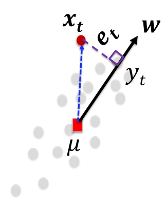
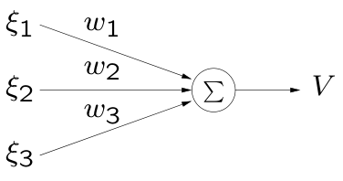
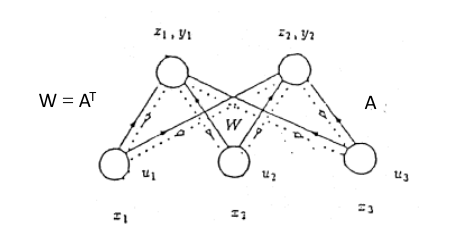
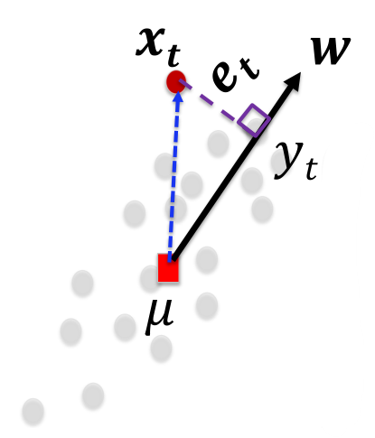
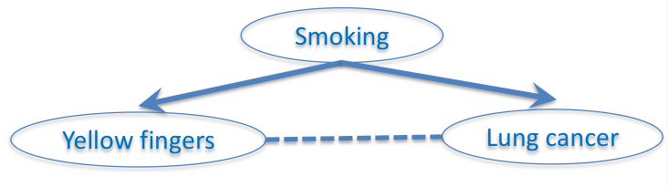
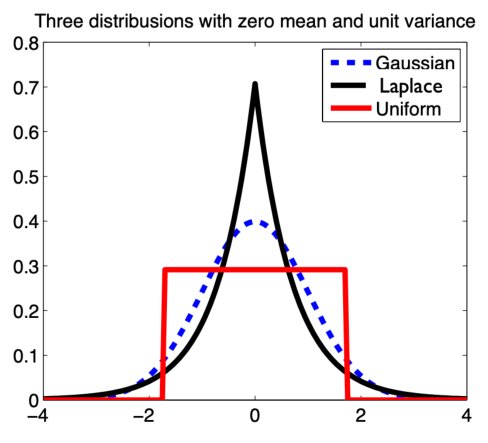
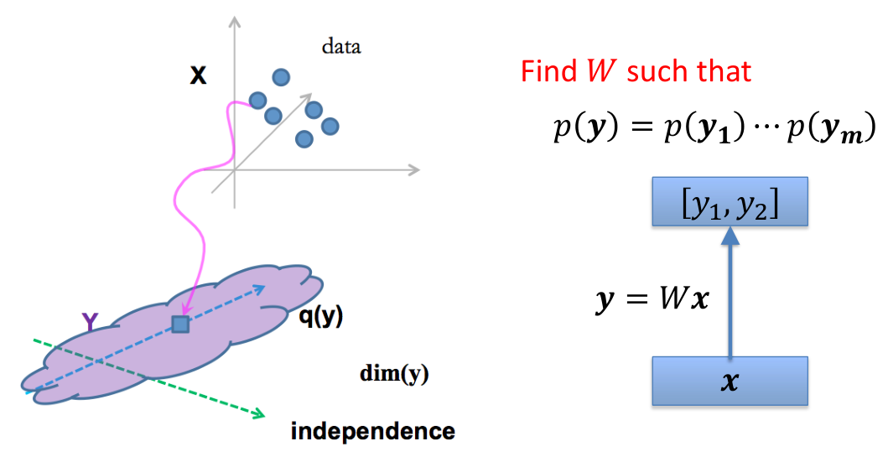
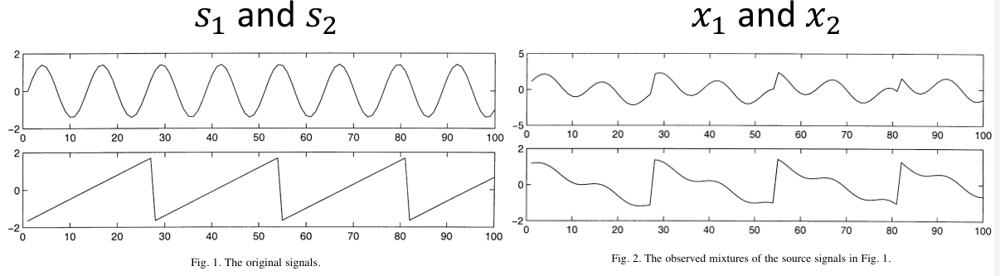
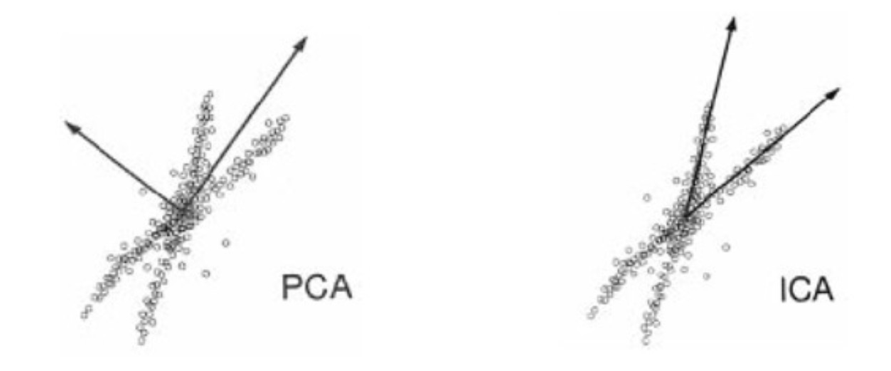

## Some mathematical background
### Inner product
向量内积 (Inner product):
$$
\langle x,y\rangle=x^Ty=\sum_{i=1}^nx_iy_i,\quad\text{for }x,y\in\mathbf{R}^n
$$

二范数 ($\ell_{2}$ norm):
$$
\|x\|_2=(x^Tx)^{1/2}=(x_1^2+\cdots+x_n^2)^{1/2}
$$

形如 $\mathbb{R}^{m\times n}$ 矩阵内积：
$$
\langle X,Y\rangle=\mathrm{tr}(X^TY)=\sum_{i=1}^m\sum_{j=1}^nX_{ij}Y_{ij},\quad\mathrm{for~}X,Y\in\mathbb{R}^{m\times n}
$$

两个向量的距离 (distance)
$$
dist(x,y) = \left\| x-y \right\|_{}
$$

$\ell_{p}$ norm:
$$
\|x\|_p=(|x_1|^p+\cdots+|x_n|^p)^{1/p}
$$

P-quadratic norms: $P \in S^{n}_{++}$
$$
\|x\|_P=(x^TPx)^{1/2}=\|P^{1/2}x\|_2
$$

### Taylor series
标量形式：
$$
\sum_{n=0}^\infty\frac{f^{(n)}(a)}{n!}(x-a)^n=f(a)+\frac{f^{\prime}(a)}{1!}(x-a)+\frac{f^{\prime\prime}(a)}{2!}(x-a)^2+\cdots 
$$

矢量形式：
$$
f(a)+\nabla f(a)^T(x-a)+\frac1{2!}(x-a)^T\nabla^2f(a)(x-a)+\cdots 
$$

或者可以写成
$$
f(x+\Delta x)=f(x)+\nabla f(x)^T\Delta x+\frac{1}{2!}\Delta x^TH(x)\Delta x+\cdots 
$$

其中 $H(x)=[\frac{\partial^{2}f}{\partial x_{i}\partial x_{j}}]$，为 Hessian matrix。

### Symmetric matrix decomposition
如果 $A\in\mathbf{S}^n$，即 $A$ 为 $n\times n$ 的实对称阵，那么可以进行特征分解：
$$
A = Q \Lambda Q^{\mathrm{T}}
$$

其中 $Q \in \mathbb{R}^{n\times n}$ 为正交阵，即满足 $Q^{\mathrm{T}}Q = I$，矩阵 $Q$ 的列为 $A$ 的特征向量。$\Lambda$ 为对角阵，即 $\Lambda = \operatorname{diag}(\lambda_1, \ldots ,\lambda_n)$，其中的实数 $\lambda_i$ 就是矩阵 $A$ 的特征值，它们也是特征多项式 $\det (sI-A)$ 的根。

$$
\begin{aligned}
&A = Q \Lambda Q^{\mathrm{T}} \\
\Rightarrow & AQ = Q \Lambda Q^{\mathrm{T}} Q = Q \Lambda \\
\Rightarrow & A(q_1,q_2, \ldots q_n) = (q_1,q_2, \ldots q_n) \begin{bmatrix}\lambda_{1}&&&\\&\lambda_{2}&&\\&&\ddots &\\&&&\lambda_{n}\end{bmatrix}
\end{aligned}
$$

发现有 $A q_j = \lambda_j q_j$，符合对特征向量的定义。

假定 $\lambda_1\ge \lambda_2\ge \cdots \lambda_n$，并且记 $\lambda_i(A)$ 为矩阵 $A$ 第 $i$ 大的特征向量。
$$
\det (A) = \prod_{i=1}^{n} \lambda_i: \det (A) = \det (Q) \det (\Lambda) \det (Q^{\mathrm{T}}) = \det (\Lambda)
$$

$$
Tr(A) = \sum_{i=1}^{n}\lambda_i : Tr(A) = Tr(Q \Lambda Q^{\mathrm{T}}) = Tr(\Lambda Q^{\mathrm{T}} Q) = Tr(\Lambda)
$$

### Singular Value Decomposition (SVD)
假设矩阵 $A \in \mathbb{R}^{m\times n}$，同时 $\operatorname{rank} A = r$，那么 $A$ 可以写成
$$
A = U \Sigma V^{\mathrm{T}}
$$

其中 $U \in \mathbb{R}^{m\times r}$ 满足 $U^{\mathrm{T}}U=I$，$V \in  R^{n\times r}$ 满足 $V^{\mathrm{T}}V=I$，$\Sigma = \operatorname{diag}(\sigma_1, \ldots \sigma_r)$:
$$
\sigma_1\ge \sigma_2\ge \cdots \ge \sigma_r >0
$$

## Principal Component Analysis (PCA)
我们如果遇到一堆点，在几何上有一定的方向性。在 GMM 中我们使用高斯混合模型的参数来拟合数据的特征，而在 PCA 中，我们则使用向量来描述这个方向性。

### Define the error
我们曾经用平均值 ${\mu}$ 来表示一堆点，这里又引入了方向 ${w}$，$\left\| {w} \right\|_{}=1$。为了选择一个最合适的方向，那么需要定义误差 (error)，通过最小化误差来得到 ${w}$。

对于一个点而言，误差可以定义为这个点到方向向量的距离，即 $e_t=x_t-y_tw$，由此得到总的误差函数为：
$$
J(w)=\frac1N\sum_{t=1}^N||x_t-(x_t^Tw)w||^2
$$

对于更加一般的形式，有
$$
J(\mu,w) = \sum_{t=1}^{N} \left\| (x_t-\mu) - ((x_t-\mu)^{\mathrm{T}}w)w \right\|_{}^{2}
$$

这里为了简便，直接写出了 $\mu$ 为平均值，并且 $x_t \leftarrow x_t-\mu$，相当于进行了去中心化处理。

### Mean Square Error (MSE)
考虑 $J(w)$ 中的一项：
$$
\begin{aligned}
&||x_t-(x_t^Tw)w||^2\\
=& (x_t-(x_t^Tw)w)^{\mathrm{T}}(x_t-(x_t^Tw)w) \\
=&x_t^Tx_t-(x_t^Tw)w^Tx_t-x_t^T(x_t^Tw)w+(x_t^Tw)w^T(x_t^Tw)w\\
=&x_t^Tx_t-w^T(x_tx_t^T)w
\end{aligned}
$$

发现 $x_t^Tx_t$ 为常量，而样本协方差矩阵 
$$
\Sigma_x=\frac{1}{N}\sum_{t=1}^Nx_tx_t^T
$$

因此需要优化的 $w$ 的目标函数为 $w^{\mathrm{T}} \Sigma_{x} w$。

考虑到 $\left\| w \right\|_{}^{2}=1$ 的约束，使用拉格朗日乘子法：
$$
\begin{aligned}
&L(\{x_{t}\},w)=J(\{x_{t}\},w)-\lambda\cdot(w^{T}w-1)\\&\frac{\partial J(w)}{\partial w}-\lambda\cdot\frac{\partial(w^Tw-1)}{\partial w}=-2(\Sigma_xw)-\lambda\cdot2w=0
\end{aligned}
$$

可以得到解为 $\Sigma_{x}w = (-\lambda) w$，目标的方向向量即为样本协方差矩阵的特征向量。同时考虑到目标为最小化 $J(w)$，即最大化 $w^{\mathrm{T}}\Sigma_{x}w = w^{\mathrm{T}}(-\lambda)w$，所以取 $w$ 值的时候，需要取对应的 $\left\vert \lambda \right\vert$ 最大的。

## From matrix factorization perspective
由上面的讨论，知道使用 PCA 即为求样本协方差矩阵的最大特征值对应的特征向量。
$$
\begin{aligned}
&\Sigma_{\mathcal{X}}\approx U\Lambda U^T\\&U=[\boldsymbol{u}_1,...,\boldsymbol{u}_\mathrm{k}]_{d\times N}^\mathrm{T}\\&\Lambda=\operatorname{diag}[\lambda_1,...,\lambda_k]
\end{aligned}
$$

$$
\begin{aligned}
&\Sigma_x=\frac1N\sum_{t=1}^Nx_tx_t^T=\frac1NXX^T\\&X=[x_1,...,x_N]_{d\times N}
\end{aligned}
$$

对于样本矩阵 $X$，考虑 SVD
$$
\begin{aligned}
&X=UDV^T\\&XX^T=UDV^T\cdot VDU^T=UD^2U^T
\end{aligned}
$$

我们发现特征向量就在 SVD 得到的一个矩阵中。

## Hebbian learning, LMSER and PCA
### Hebbian learning
基本思想：和神经网络类似。如果两个神经元经常同时受到刺激，那么这两个神经元之间的联系会更加紧密。
$$
y=\sum_{j}w_{j}x_{j}=w^{\mathrm{T}}x
$$

神经元之间的权值 $w_i$ 就代表了这两个神经元联系的紧密程度。参数的更新方法为：
$$
w^{new} \leftarrow w^{old} + \eta y x
$$

其中 $\eta$ 为可以设定的学习率。上式的分量式形如 $w_1^{new} \leftarrow w_1^{old} + \eta y x_1$。这种更新方式课可以理解为，如果输出和输入变化都为正或都为负，那么权重增大；反之减小。

但是 Hebbian learning 会有问题，即 $w$ 不断更新，可能会导致 $\left\| w \right\|_{}\rightarrow +\infty$。这个问题可以通过归一化的方式解决，即
$$
w^{new} \leftarrow \frac{w^{new}}{\left\| w^{new} \right\|_{}}
$$

如果希望把两步合成一步，即
$$
w^{new} \leftarrow \frac{w^{old}+\eta y x}{\left\| w^{old}+\eta y x \right\|_{}}
$$

又发现分母过于冗长，希望再移到分子上。此时对分母利用泰勒展开，保留一阶和二阶项，有
$$
w^{new} \leftarrow w^{old} + \eta y(x-yw^{old}) + O(\eta^{2})
$$

这个新的 learning rule 被称为 **Oja rule**，提出这个算法的论文中也证明了 Hebbian learning 实际上学习的是 PCA 的方向。

### LMSER for PCA
**Least Mean Square Error Reconstruction (LMSR)**

该方法希望学习一个 $W$，有：
$$
y=Wx \quad x=W^{\mathrm{T}}y \\
\min_{} \left\| x-\hat{x} \right\|_{}
$$

如果有多个输入 $x$，即为最小化 
$$
J(W) = \frac{1}{N} \sum_{t=1}^{N} \left\| x_t-W^{\mathrm{T}}W x_t \right\|_{}^{2}
$$

可以看出如果希望最小化 $J(W)$，那么相当于最小化 $\left\| I-W^{\mathrm{T}}W \right\|_{}$，因此 $W$ 中的向量会趋近于正交的单位向量，因此不会引起参数过大的问题。

<!-- TODO 还能再加点-->

### Algorithm for PCA
* Eigen-decomposition: 
  * $\Sigma_{x}w = -\lambda w$
  * 求出了所有特征向量，但是有可能求不准，比如样本比较少的时候，$\Sigma_{x}$ 不准确。
* SVD:
  * $X=UDV^T\quad XX^T=UDV^T\cdot VDU^T=UD^2U^T$
  * 和 PCA 有同样的问题
* Hebbian learning rule
  * $\tau^{W}\frac{dW}{dt}=\overline{z}\overline{x}^{t}$
  * 可能会导致参数爆炸
* Oja learning rule
  * $\tau^W\frac{dW}{dt}=\overline{z}\overline{x}^t-\overline{y}\overline{u}^t$
* Lmser rule
  * $\tau^W\frac{dW}{dt}=\overline{z}\overline{x}^t-\overline{y}\overline{u}^t+\overline{z}\overline{x}^t-\overline{y}^t\overline{x}^t$
  
对于上面几个 learning rule，有 $\vec{z}=\vec{y}\quad\vec{y}=W\vec{x},\vec{u}=W^{t}\vec{y},\vec{y}^{r}=W\vec{u}$

## Probabilistic PCA, Factor Analysis(FA)
从产生式模型的角度看 PCA。PCA 中的 $y$ 可以看成是隐变量。

### Gaussian distribution
$$
f_\mathbf{X}(x_1,\ldots,x_k)=\frac{\exp(-\frac12(\mathbf{x}-\boldsymbol{\mu})^\mathrm{T}\boldsymbol{\Sigma}^{-1}(\mathbf{x}-\boldsymbol{\mu}))}{\sqrt{(2\pi)^k|\boldsymbol{\Sigma}|}}
$$

特别的，在二维情况下($k=\operatorname{rank}\Sigma=2$)，有
$$
f(x,y)=\frac1{2\pi\sigma_X\sigma_Y\sqrt{1-\rho^2}}\exp\left(-\frac1{2(1-\rho^2)}\left[\frac{(x-\mu_X)^2}{\sigma_X^2}+\frac{(y-\mu_Y)^2}{\sigma_Y^2}-\frac{2\rho(x-\mu_X)(y-\mu_Y)}{\sigma_X\sigma_Y}\right]\right)
$$

其中 $\rho$ 是 $X$ 和 $Y$ 的相关系数。同时在本例子中，
$$
\boldsymbol{\mu}=\binom{\mu_X}{\mu_Y},\quad
\left.\boldsymbol{\Sigma}=\left(\begin{array}{cc}\sigma_X^2&\rho\sigma_X\sigma_Y\\\rho\sigma_X\sigma_Y&\sigma_Y^2\end{array}\right.\right)
$$

协方差矩阵推导：
$$
\Sigma = \operatorname{Cov}((x,y)^{\mathrm{T}}) = 
E \left[ 
  \left( \begin{pmatrix} x \\y \end{pmatrix} - \begin{pmatrix} \mu_{x} \\ \mu_{y} \end{pmatrix}  \right)  
  \left( \begin{pmatrix} x \\y \end{pmatrix} - \begin{pmatrix} \mu_{x} \\ \mu_{y} \end{pmatrix}  \right) ^{\mathrm{T}}
\right] \\
= E \begin{pmatrix} 
    (x-\mu_{x})^{2} & (x-\mu_{x})(y-\mu_{y}) \\
    (y-\mu_y)(x-\mu_{x}) & (y-\mu_y)^{2}
\end{pmatrix} 
$$

### Conditional Gaussian
如果 $\mathbf{x}$ 是一个 $N$ 维的向量，满足混合高斯分布。按照如下方式切分：
$$
\mathbf{x}=\begin{bmatrix}\mathbf{x}_1\\\mathbf{x}_2\end{bmatrix}\text{with sizes}\begin{bmatrix}q\times1\\(N-q)\times1\end{bmatrix}
$$
那么 $\boldsymbol{\mu}$ 和 $\boldsymbol{\Sigma}$ 有
$$
\begin{aligned}&\boldsymbol{\mu}=\begin{bmatrix}\boldsymbol{\mu}_1\\\boldsymbol{\mu}_2\end{bmatrix}\text{with sizes}\begin{bmatrix}q\times1\\(N-q)\times1\end{bmatrix}\\&\boldsymbol{\Sigma}=\begin{bmatrix}\boldsymbol{\Sigma}_{11}&\boldsymbol{\Sigma}_{12}\\\boldsymbol{\Sigma}_{21}&\boldsymbol{\Sigma}_{22}\end{bmatrix}\text{with sizes}\begin{bmatrix}q\times q&q\times(N-q)\\(N-q)\times q&(N-q)\times(N-q)\end{bmatrix}\end{aligned}
$$

此时考虑 $\mathbf{x}_2=\mathbf{a}$ 时 $\mathbf{x}_1$ 的条件概率，得知其仍是一个混合高斯分布 $(\mathbf{x}_{1}\mid\mathbf{x}_{2}=\mathbf{a})\sim N(\overline{\mathbf{\mu}},\overline{\mathbf{\Sigma}})$。可以算得：
$$
\begin{aligned}
\bar{\boldsymbol{\mu}}&=\boldsymbol{\mu}_1+\boldsymbol{\Sigma}_{12}\boldsymbol{\Sigma}_{22}^{-1}\left(\mathbf{a}-\boldsymbol{\mu}_2\right) \\
\overline{\mathbf{\Sigma}}&=\mathbf{\Sigma}_{11}-\mathbf{\Sigma}_{12}\mathbf{\Sigma}_{22}^{-1}\mathbf{\Sigma}_{21}.
\end{aligned}
$$

### Affine transformation
线性变换对高斯分布封闭。如果 $\mathbf{Y}=\mathbf{c}+\mathbf{BX}$，且 $\mathbf{X}\sim\mathcal{N}(\boldsymbol{\mu},\boldsymbol{\Sigma})$，那么 $\mathbf{Y}\sim\mathcal{N}\left(\mathbf{c}+\mathbf{B}\boldsymbol{\mu},\mathbf{B}\boldsymbol{\Sigma}\mathbf{B}^\mathrm{T}\right)$。推导过程：
$$
\begin{aligned}
E[\mathbf{Y}] &=  E[\mathbf{c}+\mathbf{B}\mathbf{X}] = \mathbf{c}+\mathbf{B}E(\mathbf{X}) = \mathbf{c}+\mathbf{B}\boldsymbol{\mu}\\
\operatorname{Cov}[\mathbf{Y}] &= E[(\mathbf{c}+\mathbf{B}\mathbf{X}-(\mathbf{c}+\mathbf{B}\boldsymbol{\mu}))(\mathbf{c}+\mathbf{B}\mathbf{X}-(\mathbf{c}+\mathbf{B}\boldsymbol{\mu}))^{\mathrm{T}}] \\
&=E[\mathbf{B}(\mathbf{x}-\boldsymbol{\mu})(\mathbf{x}-\boldsymbol{\mu})^{\mathrm{T}}] = \mathbf{B}\boldsymbol{\Sigma}\mathbf{B}^{\mathrm{T}}
\end{aligned}
$$

从线性变换的性质可以看出，任意一个混合高斯分布都可以看成是一个标准的 $n$ 维高斯分布得到。将 $\mathbf{\Sigma}$ 做特征值分解：$\mathbf{\Sigma}=\mathbf{U}\mathbf{\Lambda}\mathbf{U}^{\mathrm{T}}=\mathbf{U}\mathbf{\Lambda}^{1/2}(\mathbf{U}\mathbf{\Lambda}^{1/2})^{\mathrm{T}}$，那么有：
$$
\mathbf{X}\sim\mathcal{N}(\boldsymbol{\mu},\boldsymbol{\Sigma})\iff\mathbf{X}\sim\boldsymbol{\mu}+\mathbf{U}\mathbf{\Lambda}^{1/2}\mathcal{N}(0,\mathbf{I})
$$

### Generative model perspective

PCA 中，认为隐变量是 $\boldsymbol{y}$。假设
$$
\boldsymbol{y}_t\boldsymbol{\sim}G(\boldsymbol{y}|\boldsymbol{0},\Sigma_y) \\
\boldsymbol{e}_t\boldsymbol{\sim}G(\boldsymbol{e}|0,\sigma^2I)\\
\boldsymbol{x}_t=\boldsymbol{A} \boldsymbol{y}_t+\boldsymbol{\mu}+\boldsymbol{e}_t
$$

其中将 $\boldsymbol{y}$ 的均值设为 $\boldsymbol{0}$，是为了防止和 $\boldsymbol{\mu}$ 的冗余。 $\boldsymbol{e}$ 为噪声。

#### $\boldsymbol{y}\rightarrow \boldsymbol{x}$
下面考虑知道了 $\boldsymbol{y}$ 之后来生成 $\boldsymbol{x}$ 之后 $\boldsymbol{x}$ 的分布。
$$
\begin{aligned}
q(\boldsymbol{y}) &= G(\boldsymbol{y}|\boldsymbol{0},\Sigma_y)\\
q(\boldsymbol{x}|\boldsymbol{y}) &= G(\mathbf{x}|\boldsymbol{A} \boldsymbol{y}+\boldsymbol{\mu}, \Sigma_e) \quad (\Sigma_e=\sigma^{2}\boldsymbol{I}) \\
q(\boldsymbol{x},\boldsymbol{y}) &= q(\boldsymbol{x}|\boldsymbol{y}) q(\boldsymbol{y})\\
q(\boldsymbol{x}|\theta) &= \int q(\boldsymbol{x}|\boldsymbol{y}) q(\boldsymbol{y}) \mathrm{d} \boldsymbol{y}
\end{aligned}
$$

在 $\boldsymbol{x}_t=A \boldsymbol{y}_t+\boldsymbol{\mu}+\boldsymbol{e}_t$ 中，由于 $\boldsymbol{y}_t$ 和 $\boldsymbol{e}_t$ 都为高斯分布且相互独立，可以证明 $\boldsymbol{x}_t$ 也为高斯分布。接下来求 $\boldsymbol{x}$ 的均值和协方差。

$$
E[\boldsymbol{x}] = \boldsymbol{A} E[\boldsymbol{y}] + \boldsymbol{\mu} +E[\boldsymbol{e}] = \boldsymbol{\mu}
$$

$$
\begin{aligned}
\operatorname{Cov}[\boldsymbol{x}] &= E[(\boldsymbol{Ay}+\boldsymbol{e})(\boldsymbol{Ay}+\boldsymbol{e})^{\mathrm{T}}] \\
&= E[\boldsymbol{A}\boldsymbol{y}\boldsymbol{y}^{\mathrm{T}}\boldsymbol{A}^{\mathrm{T}}+\boldsymbol{A}\boldsymbol{y}\boldsymbol{e}^{\mathrm{T}}+\boldsymbol{e}\boldsymbol{y}^{\mathrm{T}}\boldsymbol{A}^{\mathrm{T}}+\boldsymbol{e}\boldsymbol{e}^{\mathrm{T}}] \\
&= \operatorname{Cov}[\boldsymbol{Ay}] + 2\operatorname{Cov}[\boldsymbol{Ay},e] + \operatorname{Cov}[\boldsymbol{e}] \\
&= \boldsymbol{A} \boldsymbol{\Sigma_y} \boldsymbol{A}^{\mathrm{T}} + \boldsymbol{\Sigma_e} \quad (\operatorname{Cov}[\boldsymbol{Ay},e]=0)
\end{aligned}
$$

因此有 $q(\boldsymbol{x}|\theta)\sim G(\boldsymbol{x}|\boldsymbol{\mu}, \boldsymbol{A}\boldsymbol{\Sigma_y}\boldsymbol{A}^{\mathrm{T}}+\boldsymbol{\Sigma_e})$

既然我们用高斯分布来拟合数据 $\boldsymbol{x}$ 的分布，那么希望均值 $E[\boldsymbol{x}]$ 为样本均值 $\frac{1}{N}\sum_{t=1}^{N}\boldsymbol{x}_t$，协方差 $\operatorname{Cov}[\boldsymbol{x}]$ 为样本的协方差矩阵 $S_{x}=\frac{1}{N}\sum_{t=1}^{N}(\boldsymbol{x}_t-\boldsymbol{\mu})(\boldsymbol{x}_t-\boldsymbol{\mu})^{\mathrm{T}}$

此时我们考察 $\operatorname{Cov}(\boldsymbol{x})$，发现 $\boldsymbol{A}\boldsymbol{\Sigma_y}\boldsymbol{A}^{\mathrm{T}}$ 中可能会有冗余，即 $\boldsymbol{A}$ 和 $\boldsymbol{\Sigma_y}$ 可能不唯一。为了防止冗余，可以仿照特征分解，要求 $\Sigma_y$ 为对角阵，且 $\boldsymbol{A}$ 为正交阵。但是在文献中，通常取 $\boldsymbol{\Sigma_y}=\boldsymbol{I}$，此时 $\boldsymbol{A}\boldsymbol{A}^{\mathrm{T}}$ 表征协方差，此时会导致 $\boldsymbol{A}$ 不唯一。如果限定 $\boldsymbol{A}$ 正交阵，会不方便求导，因此实际中还是采用了这种不唯一的写法。

### General EM Algorithm
#### E-step
计算 $p(\boldsymbol{y}|\boldsymbol{x},\theta)$。在这里我们用 $q(\boldsymbol{y}|\boldsymbol{x})$ 来估计 $p(\boldsymbol{y}|\boldsymbol{x},\theta)$。而
$$
q(\boldsymbol{y}|\boldsymbol{x}) = \frac{q(\boldsymbol{x}|\boldsymbol{y})q(\boldsymbol{y})}{q(\boldsymbol{x}|\theta)} \equiv G(\boldsymbol{\mu}_{\boldsymbol{y}|\boldsymbol{x}}, \boldsymbol{\Sigma}_{\boldsymbol{y}|\boldsymbol{x}})
$$

我们需要计算得到 $\boldsymbol{\mu}_{\boldsymbol{y}|\boldsymbol{x}}, \boldsymbol{\Sigma}_{\boldsymbol{y}|\boldsymbol{x}}$。这里可以通过配方的方法求解。

$$
q(\boldsymbol{y}) = \frac{1}{(\sqrt{2\pi})^{m}}\exp (-\frac{1}{2}\boldsymbol{y}^{\mathrm{T}}\boldsymbol{y})
$$

$$
q(\boldsymbol{x}|\boldsymbol{y}) = \frac{1}{(\sqrt{2\pi})^{n}\left\vert \boldsymbol{\Sigma_e} \right\vert ^{\frac{1}{2}}} \exp \left \{  -\frac{1}{2}(\boldsymbol{x}-\boldsymbol{A}\boldsymbol{y}-\boldsymbol{\mu})^{\mathrm{T}}\boldsymbol{\Sigma_e}^{-1}(\boldsymbol{x}-\boldsymbol{A}\boldsymbol{y}-\boldsymbol{\mu}) \right\}
$$

$$
q(\boldsymbol{x}|\boldsymbol{\theta}) = \frac{1}{(\sqrt{2\pi})^{n}  \left\vert \boldsymbol{A}\boldsymbol{A}^{\mathrm{T}} + \boldsymbol{\Sigma_e} \right\vert  ^{\frac{1}{2}}} \exp \left\{  -\frac{1}{2}(\boldsymbol{x}-\boldsymbol{\mu})^{\mathrm{T}}(\boldsymbol{A}\boldsymbol{A}^{\mathrm{T}}+\boldsymbol{\Sigma_e})^{-1} (\boldsymbol{x}-\boldsymbol{\mu}) \right\}
$$

因此
$$
\begin{aligned}
q(\boldsymbol{y}|\boldsymbol{x}) &= \frac{q(\boldsymbol{y})q(\boldsymbol{x}|\boldsymbol{y})}{q(\boldsymbol{x}|\boldsymbol{\theta})} \\
&= \frac{\left\vert \boldsymbol{A}\boldsymbol{A}^{\mathrm{T}} + \boldsymbol{\Sigma_e} \right\vert^{\frac{1}{2}} }{(\sqrt{2\pi})^{m} \left\vert \boldsymbol{\Sigma_e} \right\vert^{\frac{1}{2}} } \exp \left\{ -\frac{1}{2}\boldsymbol{y}^{\mathrm{T}}\boldsymbol{y} -\frac{1}{2}(\boldsymbol{x}-\boldsymbol{A}\boldsymbol{y}-\boldsymbol{\mu})^{\mathrm{T}}\boldsymbol{\Sigma_e}^{-1}(\boldsymbol{x}-\boldsymbol{A}\boldsymbol{y}-\boldsymbol{\mu}) + \frac{1}{2}(\boldsymbol{x}-\boldsymbol{\mu})^{\mathrm{T}}(\boldsymbol{A}\boldsymbol{A}^{\mathrm{T}}+\boldsymbol{\Sigma_e})^{-1} (\boldsymbol{x}-\boldsymbol{\mu}) \right\} \\
& \equiv \frac{1}{(\sqrt{2\pi})^{m}\left\vert \boldsymbol{\Sigma}_{\boldsymbol{y}|\boldsymbol{x}} \right\vert^{\frac{1}{2}} } \exp \left\{ -\frac{1}{2}(\boldsymbol{y}-\boldsymbol{\mu}_{\boldsymbol{y}|\boldsymbol{x}})^{\mathrm{T}} \boldsymbol{\Sigma}_{\boldsymbol{y}|\boldsymbol{x}}^{-1} (\boldsymbol{y}-\boldsymbol{\mu}_{\boldsymbol{y}|\boldsymbol{x}}) \right\}
\end{aligned}
$$

通过比较 $\boldsymbol{y}^{\mathrm{T}}\boldsymbol{y}$ 项，可以得到
$$
\boldsymbol{\Sigma}_{\boldsymbol{y}|\boldsymbol{x}} = (\boldsymbol{I}+\boldsymbol{A}^{\mathrm{T}}\boldsymbol{\Sigma_e}^{-1}\boldsymbol{A})^{-1}
$$

再通过比较 $\boldsymbol{y}^{\mathrm{T}}$ 项，可以得到
$$
\begin{aligned}
\boldsymbol{\mu}_{\boldsymbol{y}|\boldsymbol{x}} &= \Sigma_{\boldsymbol{y}|\boldsymbol{x}} \boldsymbol{A}^{\mathrm{T}} \boldsymbol{\Sigma_e}^{-1} (\boldsymbol{x}-\boldsymbol{\mu}) \\
&= (\boldsymbol{I}+\boldsymbol{A}^{\mathrm{T}}\boldsymbol{\Sigma_e}^{-1}\boldsymbol{A})^{-1}\boldsymbol{A}^{\mathrm{T}}\boldsymbol{\Sigma_e}^{-1}(\boldsymbol{x}-\boldsymbol{\mu})
\end{aligned}
$$

#### M-step:
$$
Q(\bm{\theta},\bm{\theta}^{old}) = \sum_{\mathbf{y}}p(\boldsymbol{Y}|\boldsymbol{X}, \bm{\theta}^{old})\ln p(\boldsymbol{X},\boldsymbol{Y}|\bm{\theta}) \equiv \sum_{t=1}^{N}Q_t
$$

上式用到了上一章关于 M-step 推导过程中的一个中间结论。
$$
Q_t = \int p(\boldsymbol{y}|\boldsymbol{x}_t, \bm{\theta}^{old})\ln p(\boldsymbol{x}_t, \boldsymbol{y}|\bm{\theta}) \mathrm{d}\boldsymbol{y}
$$

$p(\boldsymbol{y}|\boldsymbol{x}_t, \bm{\theta}^{old})$ 可以看成是求期望的权重，而
$$
\begin{aligned}
p(\boldsymbol{x}_t,\boldsymbol{y}) &= q(\boldsymbol{y})q(\boldsymbol{x}_t|\boldsymbol{y}) \\
&= G(\boldsymbol{y}|\boldsymbol{0}, \boldsymbol{I}) G(\boldsymbol{x}_t|\boldsymbol{A}\boldsymbol{y}+\boldsymbol{\mu}, \bm{\Sigma_e})
\end{aligned}
$$

因此
$$
\begin{aligned}
Q_t =& E_{p_{\boldsymbol{y}|\boldsymbol{x}}^{old}} \left[ G(\boldsymbol{y}|\boldsymbol{0}, \boldsymbol{I}) G(\boldsymbol{x}_t|\boldsymbol{A}\boldsymbol{y}+\boldsymbol{\mu}, \bm{\Sigma_e}) \right] \\
=&- \frac{m}{2}\ln 2\pi - \frac{n}{2} \ln 2\pi -\frac{1}{2}\ln \left\vert \boldsymbol{\Sigma_e} \right\vert - \frac{1}{2} E_{p_{\boldsymbol{y}|\boldsymbol{x}}^{old}}[\boldsymbol{y}^{\mathrm{T}}\boldsymbol{y}] \\
& - \frac{1}{2} E_{p_{\boldsymbol{y}|\boldsymbol{x}}^{old}} \left\{  \boldsymbol{y}^{\mathrm{T}}\boldsymbol{A}^{\mathrm{T}}\boldsymbol{\Sigma_e}^{-1} \boldsymbol{A}\boldsymbol{y} - 2\boldsymbol{y}^{\mathrm{T}}\boldsymbol{A}^{\mathrm{T}}\boldsymbol{\Sigma_e}(\boldsymbol{x}-\boldsymbol{\mu}) +(\boldsymbol{x}-\boldsymbol{\mu})^{\mathrm{T}}(\boldsymbol{x}-\boldsymbol{\mu}) \right \}
\end{aligned}
$$

此时需要通过求期望的方式将 $Q_t$ 中的 $y$ 消掉。因此需要考虑其中和 $y$ 相关的项。对于一阶项 $y$，有
$$
E_{p_{y|x}^{old}}[y] = \mu_{y|x}
$$

对于二阶项 $y^{\mathrm{T}}y$，有
$$
\begin{aligned}
\Sigma_{y|x} &= E[(y-\mu_{y|x})(y-\mu_{y|x})^{\mathrm{T}}] \\
&= E[yy^{\mathrm{T}}-y \mu_{y|x}^{\mathrm{T}} - \mu_{y|x}y^{\mathrm{T}} + \mu_{y|x}\mu_{y|x}^{\mathrm{T}}] \\
&= E[yy^{\mathrm{T}}] - \mu_{y|x}\mu_{y|x}^{\mathrm{T}}
\Rightarrow E[yy^{\mathrm{T}}] = \Sigma_{y|x} + \mu_{y|x}\mu_{y|x}^{\mathrm{T}}
\end{aligned}
$$

那么在式子中，
$$
E[yy^{\mathrm{T}}] = \operatorname{tr}(E[y^{\mathrm{T}}y])
$$

$$
\begin{aligned}
E[y^{\mathrm{T}}A^{\mathrm{T}}\Sigma_e A y] &= E[\operatorname{tr}(y^{\mathrm{T}}A^{\mathrm{T}}\Sigma_e A y)] \\
&= E[\operatorname{tr}(A^{\mathrm{T}}\Sigma_e A y y^{\mathrm{T}})] \\
&= \operatorname{tr}(A^{\mathrm{T}}\Sigma_e A E[y y^{\mathrm{T}}])
\end{aligned}
$$

接下来考虑对 $A$ 做微分：
$$
\begin{aligned}
\mathrm{d}Q_t &= -\frac{1}{2} \left \{ \mathrm{d}\operatorname{tr}(A^{\mathrm{T}}\Sigma_e^{-1}A E[yy^{\mathrm{T}}]) - 2\mathrm{d}\operatorname{tr}(E[y^{\mathrm{T}}]A^{\mathrm{T}}\Sigma_e^{-1}(x-\mu)) \right \} \\
&= -\frac{1}{2} \left\{ \operatorname{tr}(\mathrm{d}A^{\mathrm{T}}\Sigma_e^{-1}AE[yy^{\mathrm{T}}] + A^{\mathrm{T}}\Sigma_e^{-1}\mathrm{d}A E[yy^{\mathrm{T}}] ) - 2\operatorname{tr}(E[y^{\mathrm{T}}]\mathrm{d}A^{\mathrm{T}}\Sigma_e^{-1}(x-\mu)) \right\} \\
&= -\frac{1}{2} \left\{ 2\operatorname{tr}(\mathrm{d}A^{\mathrm{T}}\Sigma_e^{-1}AE[yy^{\mathrm{T}}]) -2\operatorname{tr}(E[\mathrm{d}A^{\mathrm{T}}y^{\mathrm{T}}]\Sigma_e^{-1}(x-\mu)) \right\}
\end{aligned}
$$

$$
\frac{\partial Q}{\partial A} = -\Sigma_e^{-1}A \sum_{t=1}^{N} E_{p_{y|x}^{old}}[yy^{\mathrm{T}}] + \Sigma_e^{-1}\sum_{t=1}^{N}(x_t-\mu)E_{p_{y|x}^{old}}[y^{\mathrm{T}}] =0
$$

$$
\Rightarrow A = \Sigma_e^{-1}\sum_{t=1}^{N}(x_t-\mu)E_{p_{y|x}^{old}}[y^{\mathrm{T}}] (\sum_{t=1}^{N} E[yy^{\mathrm{T}}|x_t])^{-1}
$$

对 $\Sigma_e=\sigma_e^{2}I$ 做微分，类似上述过程，最终可以得到：
$$
\begin{aligned}
\sigma_e^{2} &= \frac{1}{nN} \sum_{t=1}^{N} E_{p_{y|x}^{old}}\left[ (x_t-A_y-\mu)^{\mathrm{T}}(x_t-A_y-\mu) \right] \\
&= \frac{1}{nN} \sum_{t=1}^{N} \left\{ (x_t-\mu)^{\mathrm{T}}(x_t-\mu)-2E[y^{\mathrm{T}}]A^{\mathrm{T}}(x-\mu) + \operatorname{tr}(A^{\mathrm{T}}A E[yy^{\mathrm{T}}]) \right\}
\end{aligned}
$$

<!-- TODO 有个问题：mu 为啥不用求？是因为直接认为是均值了吗 -->

### Maximum likelihood FA implements PCA
PCA 相当于用 $\Sigma_{x}=AA^{\mathrm{T}}+\Sigma_e$ 来拟合 $S_{x}=\frac{1}{N}\sum_{t=1}^{N}(x_t-\mu)(x_t-\mu)^{\mathrm{T}}$

首先不考虑 $\Sigma_e$，那么相当于 $AA^{\mathrm{T}} \sim S_{x}$。如果对 $S_{x}$ 做特征值分解，有 $S_{x}=UDU^{\mathrm{T}}$，其中 $S_{x}$ 为 $n\times n$ 的矩阵，因此 $D$ 为 $\operatorname{diag}(s_1,s_2, \ldots ,s_n)$；而 $A$ 是 $n\times m$ 的矩阵，因此如果分解 $AA^{\mathrm{T}}=U\Lambda U^{\mathrm{T}}$ 的话，那么 $\Lambda=\operatorname{diag}(\lambda_1, \ldots \lambda_m, 0, \ldots 0)$。

然后 $\Sigma_e$ 可以写作 $\Sigma_e=\sigma_e^{2}I=U(\sigma_e^{2}I)U^{\mathrm{T}}$。$\Sigma_{x}$ 和 $S_{x}$ 的匹配可以看作是 $U(\Lambda+\sigma_e^{2}I)U^{\mathrm{T}}$ 和 $UDU^{\mathrm{T}}$ 的匹配。

那么 PCA 最终得到：
$$
\left\{\begin{array}{l}\hat{\mathbf{A}}_{n\times m}^{ML}=\mathbf{U}_{n\times m}(\mathbf{D}_{m}-\hat{\sigma}_{e}^{2})^{\frac{1}{2}}\mathbf{R}^{T},\\\hat{\sigma}_{e}^{2,ML}=\frac{1}{n-m}\sum_{i=m+1}^{n}s_{i},\end{array}\right.
$$

旋转矩阵 $R^{\mathrm{T}}$ 导致了 $A$ 的不确定性。

<!-- TODO 还缺少VBEM的内容 -->

## Independent Component Analysis (ICA)
### Preliminaries
#### Independence and uncorrelated 
独立(independence): $p(y_1,y_2)=p_1(y_1)p_2(y_2)$
不相关(uncorrelated): $E\{y_1y_2\}-E\{y_1\}E\{y_2\}=0$

不相关指的仅仅是线性上不相关。因此变量不相关不等于独立。

#### Conditional independence 
$p(X,Y|Z)=p(X|Z)p(Y|Z)$，即当 $Z$ 已知时，$X,Y$ 不相关。$X,Y$ 原先的相关性可能是因为有共同的原因或者共同的结果：

#### Some properties of Gaussian
在高斯分布中，不相关等于独立。因为高斯分布只有一阶和二阶统计量，其他阶的统计量都可以用一阶和二阶信息表示。

中心极限定理(**central limit theorem (CLT)**)：
$$
S= \frac{1}{n}\sum_{i=1}^{n}X_{i} \leftrightarrow G(x|\mu, \Sigma) \\
\mu=E[X], \quad \Sigma=\operatorname{Var}(X)
$$

**Cramér’s decomposition theorem**：
如果一个随机变量 $\xi$ 服从高斯分布，且 $\xi$ 由两个独立的随机变量 $\xi_1,\xi_2$ 相加得到：$\xi=\xi_1+\xi_2$，那么 $\xi_1$ 和 $\xi_2$ 也一定是高斯分布。

#### Sub-Gaussian and Super-Gaussian 

Super Guassian 指的是大多数数据集中在中心。

GMM 不是高斯分布。

#### Measure the independence of two variables
通常使用互信息来衡量两个变量的相关性：
$$
I(X;Y)=\sum_y\sum_xP(x,y)\log\left(\frac{P(x,y)}{P(x)P(y)}\right),\\
I(X;Y)=\int\int p(x,y)\log\left(\frac{p(x,y)}{p(x)p(y)}\right)\mathrm{d} x\mathrm{d} y,
$$

可以看出互信息就是 $p(x,y)$ 和 $p(x)p(y)$ 之间的 KL divergence。

### Independent Component Analysis (ICA)
把数据投影到低维空间，希望地位空间的每一个分量都是相互独立的。而 PCA 投影到的低维空间只要求在高斯的情况下相互独立(即不相关)。同时 PCA 的投影是线性的，而 ICA 则走向了非线性。

#### Blind Source Separation (BSS)
希望解决在很多声音混合的情况下，把每一种声音都分出来。或者两张重叠的图像，还原这两张图。

模型建立：假设原信号为 $\boldsymbol{s}$，得到的信息为 $\boldsymbol{x}$，希望还原出原信号：
$$
\begin{gathered}
x=A\boldsymbol{s} \\
x_1(t)=a_{11}s_1+a_{12}s_2 \\
x_2(t)=a_{21}s_1+a_{22}s_2 
\end{gathered}
$$

因此 ICA 的目标为：找到一个 $W$，使得 $\boldsymbol{s}=W \boldsymbol{x}$

#### Indeterminacies of ICA
* 首先需要限定还原出的信号的强度，即指定 $E[s_i^{2}]=1$，因为
  $$
  \boldsymbol{x}=A\boldsymbol{s}=\sum_{i=1}^n\boldsymbol{a}s_i=\sum_{i=1}^n(\boldsymbol{a}\cdot\lambda_i^{-1})(\lambda_is_i)
  $$

  原信号乘以 $\lambda_i$ 不影响方程。
* 同时需要指定源信号的顺序，否则乘以一个 permutation matrix 也不影响方程：
  $$
  x=As=(AP^{-1})(Ps)
  $$

#### Principles of ICA estimation
如果为高斯分布：$p(x_1,x_2)=\frac1{2\pi}\exp\left(-\frac{x_1^2+x_2^2}2\right)$，那么该分布经过一个旋转矩阵之后还是相同的，这不符合源信号之间的独立性。因此需要使用非高斯分布。
<!-- TODO 这里的高斯分布说的是谁？ -->

根据中心极限定理，无数个随机变量相加趋近于高斯分布。那么可以理解为两个独立的变量相加后，分布会更接近高斯分布。现在考虑还原得到的一个源信号：
$$
y=\boldsymbol{w}^{\mathrm{T}}\boldsymbol{x}=\boldsymbol{w}^{\mathrm{T}}A \boldsymbol{s}=(\boldsymbol{w}^{\mathrm{T}}A)\boldsymbol{s}=\boldsymbol{z}^{\mathrm{T}}\boldsymbol{s}
$$

根据上面的分析，$\boldsymbol{z}^{\mathrm{T}}\boldsymbol{s}$ 应当比任意一个 $s_i$ 更接近高斯分布，因此我们的任务是找到 $\boldsymbol{w}$，使得 $y$ 的非高斯性最大化。 此时需要度量非高斯性。

#### Measure of non-Gaussian
* Kurtosis or the fourth order cumulant
  $$
  \begin{aligned}
  kurt(y)& =E\{y^4\}-3(E\{y^2\})^2  \\
  &=E\{y^4\}-3,\mathrm{if}E\{y^2\}=1\mathrm{~for~unit~variance}.
  \end{aligned}
  $$
* Negentorpy：$J(\mathbf{y})=H(\mathbf{y}_{\mathrm{gauss}})-H(\mathbf{y})$
  由于高斯分布的熵最大，那么某个随机变量的熵越小，就越远离高斯分布。
* Mutual information：$I(y_1,y_2,...,y_m)=\sum_{i=1}^mH(y_i)-H(y)$。这相当于是 $P(y_1,...,y_m)$ 和 $P(y_1)\cdotp\cdotp\cdotp P(y_m)$ 的 KL divergence。下面以两个变量为例解释：
  $$
  \begin{aligned}
  &KL(P(x,y)\|P(x)P(y)) \\
  =&\int P(x,y)\log\frac{P(x,y)}{P(x)P(y)}\mathrm{d}x\mathrm{d}y \\
  =&\int P(x,y) \left\{ \log P(x,y)-\log P(x)-\log P(y) \right\} \\
  =&-H\left(x,y\right)+H\left(x\right)+H\left(y\right)
  \end{aligned}
  $$

#### PCA vs. ICA
* PCA
  * $x=Ay+e$
  * $y \sim G(y|0,I),\quad q(y)=\prod_{i=1}^{m}q(y_{i})$, 其中 $y_i \sim  G(y_i|0,1)$
  * dim($y$) << dim($x$)
  * 目标是非相关性，考虑数据的二阶信息。
* ICA
  * $x=Ay$
  * $q(y)=\prod_{i=1}^{m}q(y_{i})$
  * dim($y$) = dim($x$)
  * 目标是独立性，考虑数据更高阶的信息。

### Independent FA (IFA), Non-Gaussian FA (NFA)
#### Generative model for ICA with noise
和 PCA 相似的，有
$$
\begin{gathered}
\boldsymbol{x}=\Lambda \boldsymbol{y}+\boldsymbol{e} \\
x_j=\sum_{i=1}^k\lambda_{ji}y_i+e_j\\
p(\boldsymbol{y})=\prod_{i=1}^kf(y_i) \\
p(\boldsymbol{x}|\boldsymbol{y}) = G(\boldsymbol{x}|\Lambda \boldsymbol{y}, \Psi)
\end{gathered}
$$

而与 PCA 不同之处在于，$f(y_i)$ 为非高斯分布。想要表示非高斯分布，最简单的方式是使用 GMM：
$$
f(y_i)=\sum_{q_i=1}^{m_i}w_{i,q_i}\mathcal{N}\left(\mu_{i,q_i},\nu_{i,q_i}\right)
$$