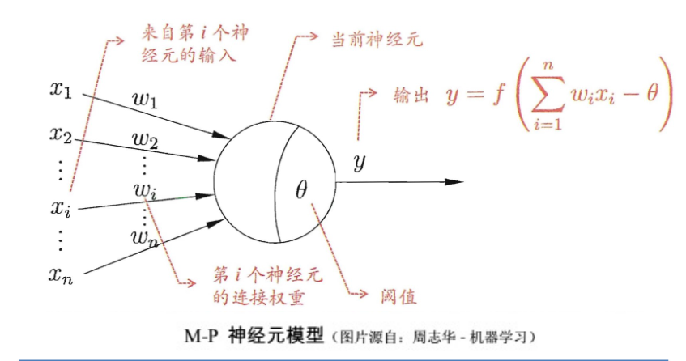
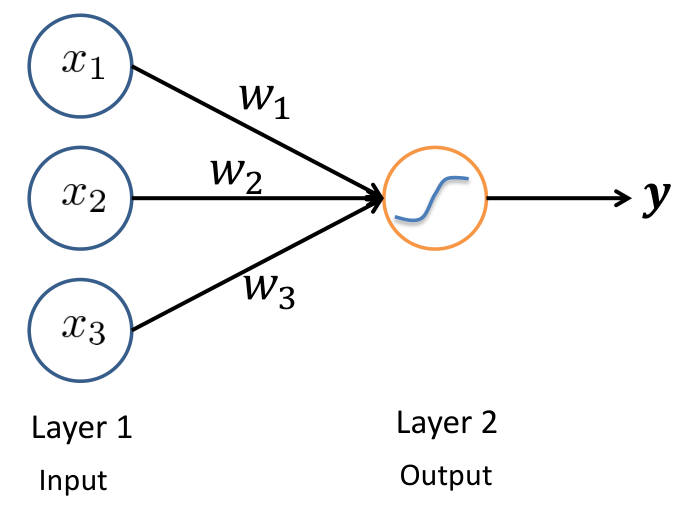
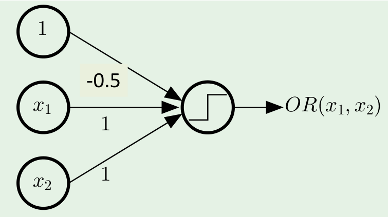
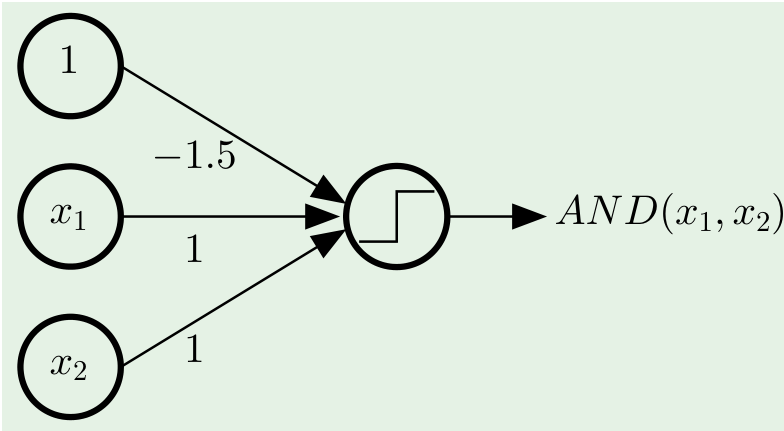
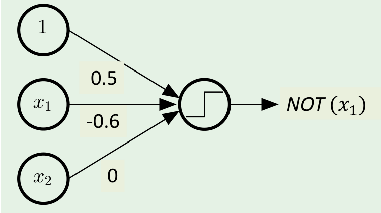
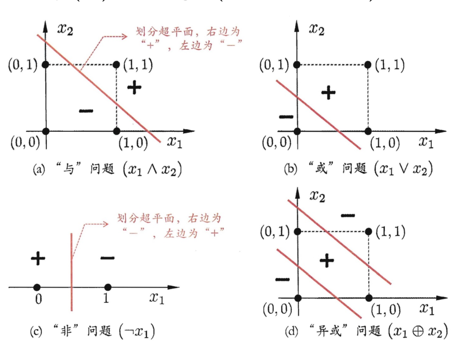
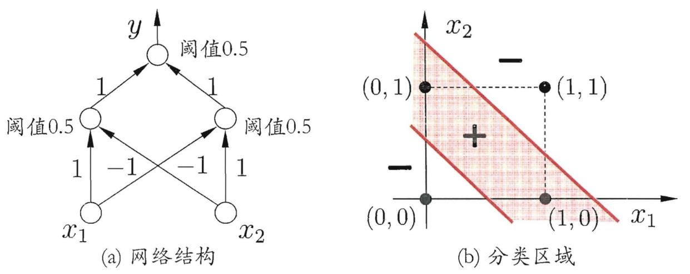
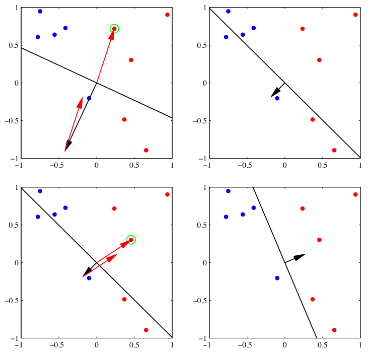
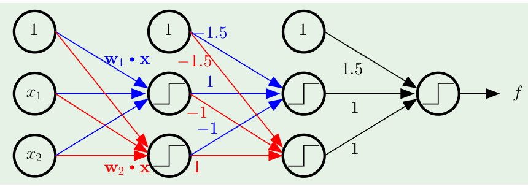
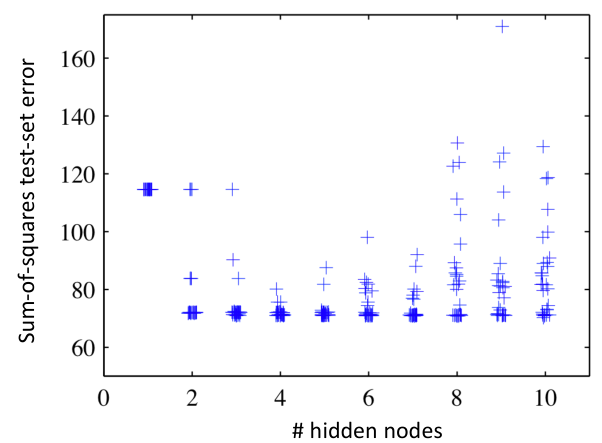

## Linear regression
$$
y_{i}=\beta_{1}x_{i1}+\cdots+\beta_{p}x_{ip}+\varepsilon_{i}=\mathbf{x}_{i}^{\mathrm{T}}\boldsymbol{\beta}+\varepsilon_{i},\quad i=1,\ldots,n,\\\mathbf{y}=\begin{pmatrix}y_1\\y_2\\\vdots\\y_n\end{pmatrix},\quad\mathbf{X}=\begin{pmatrix}\mathbf{x}_1^\mathrm{T}\\\mathbf{x}_2^\mathrm{T}\\\vdots\\\mathbf{x}_n^\mathrm{T}\end{pmatrix}=\begin{pmatrix}x_{11}&\cdots&x_{1p}\\x_{21}&\cdots&x_{2p}\\\vdots&\ddots&\vdots\\x_{n1}&\cdots&x_{np}\end{pmatrix},\quad\boldsymbol{\beta}=\begin{pmatrix}\beta_1\\\beta_2\\\vdots\\\beta_p\end{pmatrix},\quad\boldsymbol{\varepsilon}=\begin{pmatrix}\varepsilon_1\\\varepsilon_2\\\vdots\\\varepsilon_n\end{pmatrix}.
$$

写成矩阵性质，为：$\mathbf{y}=\mathbf{X}\beta+\varepsilon$

### Least Square Estimation
目标为：$\min_\beta\varepsilon^T\varepsilon=(Y-X\beta)^T(Y-X\beta)\quad\longleftrightarrow\quad\min_W\sum_t\lVert e_t(x_t,w)\rVert^2$

因此对向量 $\beta$ 求导：
$$
\begin{aligned}
\frac{\partial \varepsilon^{\mathrm{T}} \varepsilon}{\partial \beta} &= \frac{\partial}{\partial \beta} (Y-X\beta)^T(Y-X\beta)  \\
&= \frac{\partial }{\partial \beta} (Y^{\mathrm{T}}Y - Y^{\mathrm{T}}X\beta-\beta^{\mathrm{T}}X^{\mathrm{T}}Y + \beta^{\mathrm{T}}X^{\mathrm{T}}X\beta) \\
&= -2X^{\mathrm{T}}Y + 2X^{\mathrm{T}}X\beta = 0 \\
& \Rightarrow \beta = (X^{\mathrm{T}}X)^{-1}X^{\mathrm{T}}Y
\end{aligned}
$$

其中 $X^{+}\equiv (X^{\mathrm{T}}X)^{-1}X^{\mathrm{T}}$ 称为伪逆(psudo-inverse)，因为如果 $X$ 为满秩方阵，$X^{+}=X^{-1}$。

### Question
* Compare the definitions of error in PCA and linear regression
  * PCA 考虑垂直投影，即误差和所有变量有关。没有解析解。
  * Linear Regression 只考虑 $y$ 方向，各变量解耦。有解析解。

## Logistic regression
### Use Logistic Function
考虑离散的量。与 Linear regression 预测出结果不同，Logistic regression 预测 $Y=0,Y=1$ 的概率。此处用到 Sigmoid 函数 $\frac{1}{1+e^{-x}}$。

$$
p(x)=P(Y=1|x)=\frac{e^{\beta_0+\beta_1X}}{1+e^{\beta_0+\beta_1X}}=\frac1{1+e^{-(\beta_0+\beta_1X)}}
$$

$$
\Rightarrow \log\biggl(\frac{p(x)}{1-p(x)}\biggr)=\beta_0+\beta_1X
$$
### Logistic Regression with Multiple Variables and Class
$$
P(Y=k|X)=\frac{e^{\beta_{0k}+\beta_{1k}X_1+\cdots+\beta_{pk}X_p}}{1+\sum_{i=1}^ne^{\beta_{0i}+\beta_{1i}X_1+\cdots+\beta_{pi}X_p}}
$$

### Regression Regularization
Logistic regression 虽然用到了非线性的函数，但是在数据划分方面起到的是线性的效果。因此要做非线性划分还需要引入其他方法。而非线性方法可能会导致过拟合，此时需要 regularization。

$$
J(\theta)=\frac1{2m}\biggl[\sum_{i=1}^m(h_\theta(x^{(i)})-y^{(i)})^2+\lambda\sum_{j=1}^n\theta_j^2\biggr]
$$

此处的 $\theta_j^{2}$ 为 L2-norm。

Several types
* L1 (LASSO) (L1-norm)
  * 让模型变得稀疏。
* L2 (Ridge) (squared L2-norm)
  * 让所有的参数都变小。
  * 用的最多，因为 L1 在 $0$ 点不可导。
  * L2 可以和 L1 同时使用。

可见[该文章](https://zhuxz0299.github.io/posts/2a9c81bf.html)Regularized least squares 一节。

## Neural Networks
### Overview of neural networks
**The main aim of neural networks**：希望神经网络能够像大脑一样抽取特征。
#### History
* 1943:美国心理学家McCulloch和数学家Pitts提出神经元数学模型(M-P)
* 1949:心理学家Hebb提出了改变神经元间连接强度的Hebb规则
* 1957:计算机科学家Rosenblatt用硬件完成了最早的神经⽹网络模型，称之为感知器(Perceptron)，模拟生物的感知和学习能⼒。
* 1969:Minskey和Papert发表了《Perceptron》⼀一书指出了Perceptron无科学价值而言，连XOR逻辑分类都做不到，只能作线性划分。
* 1982:加州大学物理学家Hopfield提出模拟人类记忆的递归神经网络模型，并
⽤电路实现。
* 1985:Hinton和Terry Sejnowski 提出玻尔兹曼机(Boltzman机)模型， 表达随机过程形成结构的过程。
* 1986:Rumelhart, Hinton等提出了反向传播算法(BP)，掀起十年年高潮
* 1988:蔡少棠提出了了细胞神经网络模型
* 1990s:神经网络再次衰落

### Perceptron model
M-P neuron model:

Perceptron 就是 Input layer + M-P neuron (output)

Perceptron 可以做一些逻辑运算：
* OR
  
* AND
  
* NOT
  

#### XOR 
单个 perception 做的是线性的划分，因此无法解决 XOR 的问题。

但是使用 two-layer perception 即可。

#### Perceptron learning
$$
w_i\leftarrow w_i+\Delta w_i,\\\Delta w_i=\eta(y-\hat{y})x_i,
$$

如果线性可分，则能收敛；反之不能。
$$
\begin{aligned}
&P\leftarrow inputs\quad with\quad label\quad1; \\
&N\leftarrow inputs\quad with\quad label\quad0; \\
&\mathrm{Initialize~w~randomly;} \\
&\text{while !convergence do} \\
&\quad\begin{aligned}&\text{Pick random x}\in P\cup N;\\&\text{if x}\in P\quad and\quad\text{w.x}<0\text{ then}\\&\quad\mathbf{w}=\mathbf{w}+\mathbf{x};\\
&\text{end}\\
&\quad\text{if x}\in N\quad and\quad\mathbf{w}.\mathbf{x}\geq0\mathbf{then}\\
&\quad\mathbf{w}=\mathbf{w}-\mathbf{x};\\
&\text{end}\end{aligned}&  && \text{一}  \\
&\text{end} 
\end{aligned}
$$

该算法迭代的过程如下图所示：

### Neural network
#### The multilayer perceptron

#### Function by neural network
1. recursive nature:
   $$
   a_j=\sum_{i=1}^Dw_{ji}^{(1)}x_i+w_{j0}^{(1)},\quad j=1,\cdots,M \\
   z_j=h(a_j),\quad j=1,\cdots,M
   $$
2. sigmoid/tanh function
3. output layer
   1. 分类用 softmax

双层的神经网络可以写成如下形式：
$$
y_k(\mathbf{x},\mathbf{w})=\sigma\left(\sum_{k=1}^Mw_{kj}^{(2)}h\left(\sum_{i=1}^Dw_{ji}^{(1)}x_i+w_{j0}^{(1)}\right)+w_{k0}^{(2)}\right)
$$

#### A Reassuring Theorem
理论上两层的神经网络就可以拟合任意连续函数。（只要神经元足够多）

### Training the neural networks – Backpropagation (BP) algorithm
想要获得最优的参数，可以求解其导数为 $0$ 的方程，但是实际上求解非常困难，因此使用梯度下降。此时需要考虑如何计算梯度。

在网络有很多层的时候，假设需要求某个 $w_{ij}$ 的梯度，其中 $i,j$ 分别代表相邻两层的节点，目标函数为 $E_n$。

$$
\frac{\partial E_n}{\partial w_{ij}} = \frac{\partial E_n}{\partial a_j}\cdot  \frac{\partial a_j}{\partial w_{ij}}
$$

根据 $a_j$ 的表达式，可知 $\displaystyle \frac{\partial a_j}{\partial w_{ij}} = z_i$，同时定义 $\displaystyle \frac{\partial E_n}{\partial a_j} \equiv \delta_j$。接下来可以使用递归的形式求出 $\delta_j$，假设现在在第 $l$ 层，那么为 $\delta_j^{(l)}$。

$$
\delta_j^{(l)} = \frac{\partial E_n}{\partial a_j^{l}} = \sum_{k} \frac{\partial E_n}{\partial a_{k}^{l+1}} \cdot \frac{\partial a_k^{(l+1)}}{\partial a_j^{(l)}} = \sum_{k} \delta_k^{(l+1)} w_{kj} h'(a_j^{(l)}) = h'(a_{j}^{(l)}) \sum_{k} \delta_k^{(l+1)} w_{kj}
$$

由此得到了递推式。而在最后一层，假设损失函数为 MSE，则有
$$
\delta_{k} = \frac{\partial E_n}{\partial a_k} = y_k-t_k
$$

#### What is wrong with back-propagation？
反向传播存在
1. 计算量大，计算较慢
2. 层数多会导致梯度消失
3. 容易陷入局部最优解

等问题

现在的一种解决思路是，先使用 unsupervised learning 进行学习，这里的 unsupervised learning 的方式为构建重建网络，然后逐层学习参数。最终使用带 label 的数据进行微调。

### Regularization in Neural Nets
神经网络的过拟合与隐藏节点的数量相关。下图展示测试集上的误差与隐藏节点数量的关系：

因此常用一些正则化手段缓解过拟合，比如
$$
\widetilde{E}(\mathbf{w})=E(\mathbf{w})+\frac12\mathbf{w}^T\mathbf{w}
$$

相当于加了一个高斯先验。
## Support Vector Machine (SVM)