## Association vs. Causation (Intervention)
### What Is Association?
* An **associational** concept is any relationship that can be defined in terms of a joint distribution of observed variables
  * The term "association" refers broadly to any such relationship, whereas the narrower term "correlation" refers to a linear relationship between two quantities.
* **causal** concepts must be traced to some premises that invoke such concepts; it cannot be inferred or derived from statistical associations alone.”

### Yule-Simpson’s Paradox
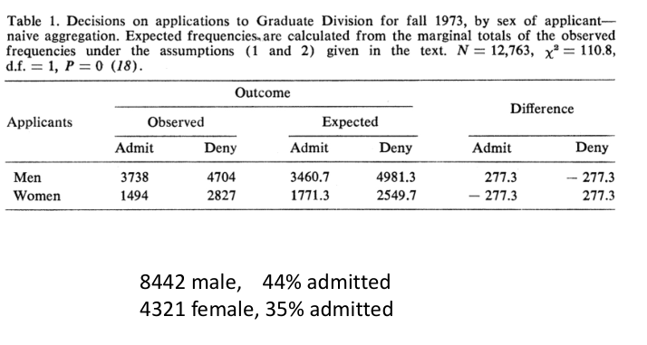

## Structural Causal Model
### POTENTIAL-OUTCOME FRAMEWORK
**The Counterfactual (Potential Outcomes/Neyman-Rubin) Framework**

- Causal questions are “what if” questions.
- Extend the logic of randomized experiments to observational data.

#### Example
假如选择为 $T \in \{ 0 , 1 \}$，对应最终结果为 $Y_0, Y_1$，那么可以定义 Individual causal effect (ICE) $=Y_1-Y_0$。
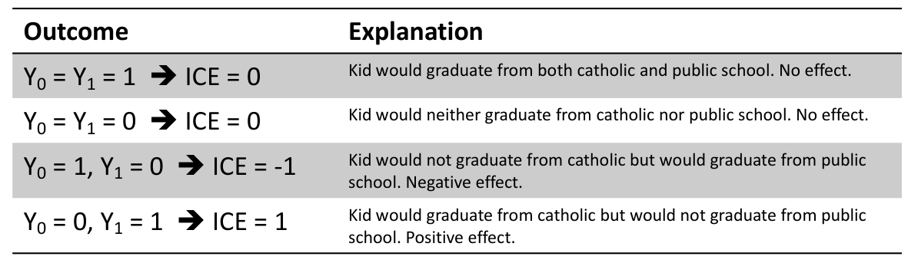

#### Fundamental Problem of Causal Inference
对于同一个个体而言，我们无法真正同时观察到其做出两种选择之后得到的结果。

* Average causal effect (ACE) $= \mathbb{E}[Y_1] - \mathbb{E}[Y_0]$
  * 对所有人做平均。同时需要注意，这里的“所有人”是包含了 $T=0,1$ 的情况
  * 在实际情况下我们能算的平均应该只是 $\mathbb{E}[Y_1|T=1], \mathbb{E}[Y_0|T=0]$
* Standard estimator $S^{*} = \mathbb{E}[Y_1|T=1]-\mathbb{E}[Y_0|T=0]$
  * 用于估计 ACE
  * 但是需要知道　ACE measures causation $\neq$ $S^{*}$ measures association

#### Solve the Problem by Randomized Experiments
如果 
$$
\mathrm{E[Y_{1}\mid T=1]=E[Y_{1}\mid T=0]=E[Y_{1}]}\\\mathrm{E[Y_{0}\mid T=1]=E[Y_{0}\mid T=0]=E[Y_{0}]}
$$

那么 ACE $=S^{*}$。也就是说 $T=0, 1$ 的个体需要 random assignment。

如果 random assignment 无法实现，该怎么办？Ignorability $(Y_0, Y_1) \perp T$ 很难，但是可以考虑 Conditional Ignorability $(\mathrm{Y}_0,\mathrm{Y}_1)\perp\mathrm{T}\mid\mathrm{X}$

##### Propensity score
倾向性得分
$$
e(X)=P(T=1|X)
$$

这里的 $X$ 称为混杂因子，可以理解为环境变量。Rubin认为，如果在给定 $X$ 时，$Z$ 对 $𝑌$ 的因果效应消除了混杂因子的影响，那么，在给定一维的倾向性得分 $e(X)$ 时，$𝑍$ 对 $𝑌$ 的因果效应也是没有混杂因子的影响的，即：
$$
Z_i\perp\{Y_i(1),Y_i(0)\}\mid e(X_i)
$$

比如在高考完之后，两名同学通过计算倾向性得分，得到上交大的概率都是 $0.8$，那么可以认为对这两名同学进行比较是没有 bias 的。

从而 ACE 可以计算为：
$$
ACE=E\big[E\big(Y_i|T_i=1,e(X_i)\big)\big]-E\big[E\big(Y_i|T_i=0,e(X_i)\big)\big]
$$

##### Inverse probability weighting
逆概率加权

由于倾向性得分是一维的，那么可以分层，得到平均因果作用的估计。逆概率加权就是连续版本的分层：
$$
ACE=\frac1n\sum_i\frac{T_iY_i}{e(X_i)}-\frac{(1-T_i)Y_i}{1-e(X_i)}
$$

比如对于下图，点的分布本身就与横轴相关。为了消除这个影响，那么就需要除以倾向性得分，使其分布更加趋于均匀。
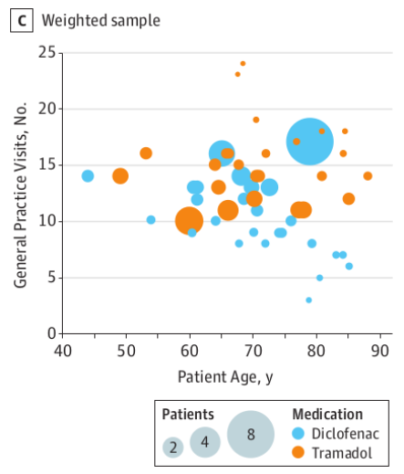

### STRUCTURAL EQUATION MODELS
**Weight’s Structural Equation Models**
* How can one express mathematically the common understanding that symptoms do not cause diseases?

使用 $y=\beta x+u_Y$ 表示因果不合适，因为方程还可以写成 $x=(y-u_Y)/\beta$ 的对称形式。所以引入 Path Diagram，有
$$
\begin{aligned}&x=u_{X}\\&y=\beta x+u_{Y}\end{aligned}
$$

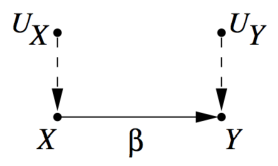

### DIRECTED ACYCLIC GRAPH
#### DAGs Encode Causal Knowledge
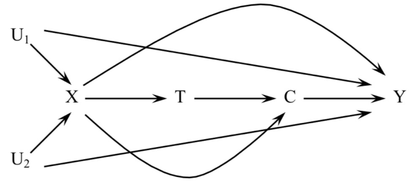
 

Causual assumptions $\xrightarrow{Encoded\ by}$ DAG $\xrightarrow{Deduce}$ All associations in the system.

* 在 DAG 中，如果两个点之间存在连线，那么说明这两点之间可能存在因果关系
* 如果两个点之间不存在连线，那么说明两点之间一定没有因果关系。

#### DAGs as SEM
对于 DAG 中的每一个变量 $V$，如果写成 SEM 的形式，那么有 $V = f_{V}(pa(V), e_{V})$。在上图中即为：
$$
\begin{aligned}
&U_{1}= f_{U 1}(e_{U1})  \\
&U_{2}= f_{U2}(e_{U2})  \\
&X=f_{X}(U_{1},U_{2},e_{X})  \\
&T=f_{T}(X,e_{T}) \\
&C=f_{C}(X,T,e_{C}) \\
& Y=f_Y(U_1,U_2,X,C,e_Y)n
\end{aligned}
$$

#### d-separation
如果一个集合 $S$ 能够阻断所有 $X$ 到 $Y$ 的 path，那么称 $S$ $d$-separate $X$ 和 $Y$，即 $X\perp Y |S$。

## Discover causal structure by conditional independence
基本思想：
如果能找到 $S$ d-separate $X$ 和 $Y$，然后固定 $S$ 中的取值，如果 $X \perp Y |S$，那么说明 $X,Y$ 之间没有直接因果关系。
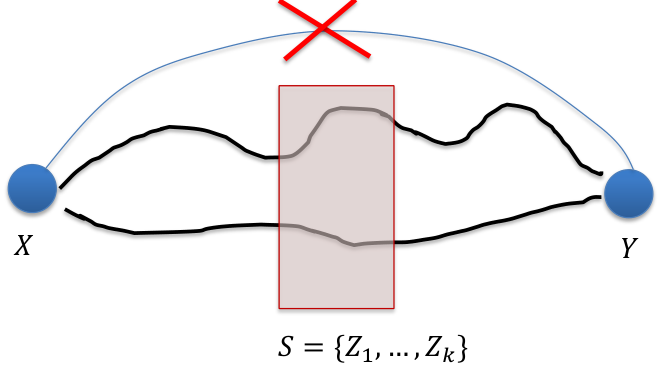

### PC algorithm
通过条件独立行区分出因果关系来。

* A.) Form the complete undirected graph;
* B.) Remove edges according to n-order conditional independence relations;
* C.) Orient edges by v-structures
  * 对于 $X-Y-Z$ 的结构，当且仅当 $Y$ 不在 $Sepset(X,Z)$ 中，有 $X \rightarrow Y \leftarrow Z$
* D.) Orient edges

#### Step B Example
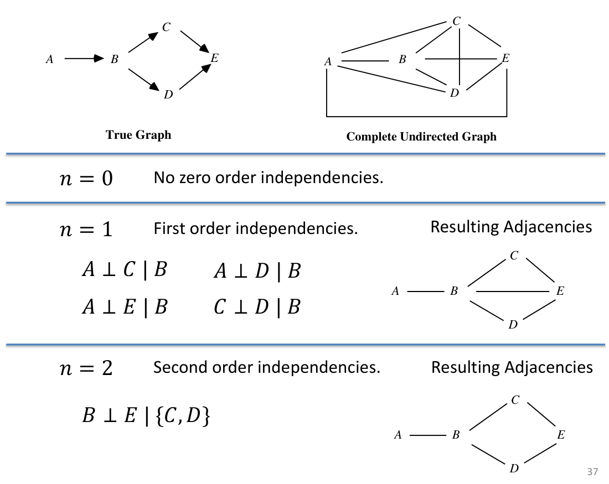

### Markov equivalent class
PC 算法无法还原所有的边的方向
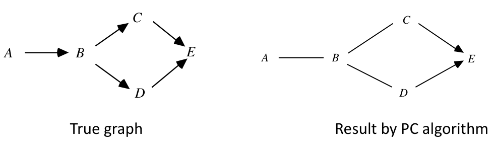

这一因为有些因果关系是无法用条件独立性得出的。比如左图的三个结构和右图的两个结构，它们的条件独立性都是相同的。
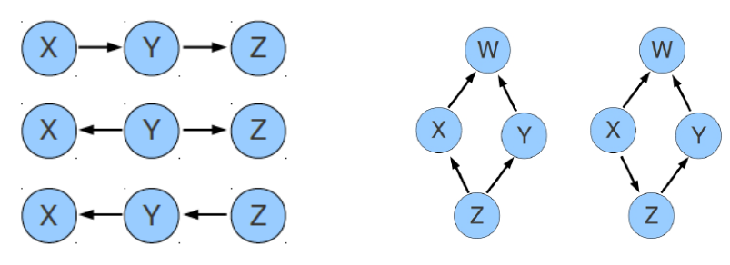

* **Theorem (Verma and Pearl, 1990)**: two DAGs are Markov equivalent iff they have the same skeleton and the same v-structures. 
* **skeleton**: corresponding undirected graph
* **v-structure**: substructure $X \rightarrow Y \leftarrow Z$ with no edge between $X$ and $Z$

<!-- TODO Functional Causal Model -->

## Pearl's do-calculus
do 操作可以理解为强制的将变量设置为某个值。

$$
p(.|do\ x)=p(.|x)
$$

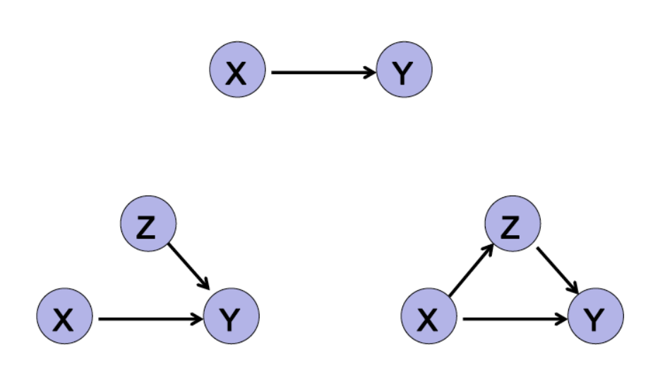

$$
p(Y|do\ x)=P(Y)\neq P(Y|x)
$$

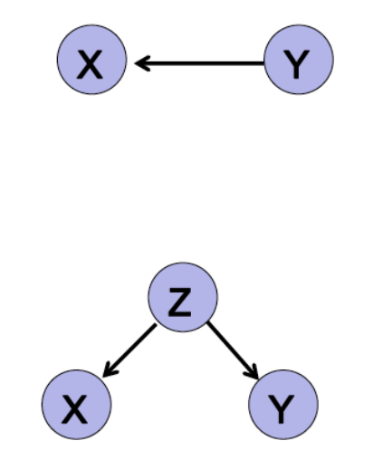

## A linear non-Gaussian model for causal discovery (LiNGAM)
PC 算法无法处理只有两个变量之间因果关系的问题，因此需要 LiNGAM 方法。

首先考虑 structural equation model，对于两个变量 $X,Y$ 而言，因果生成关系为
$$
Y=aX+E,\mathrm{~where~}E\perp X
$$

那么此时需要思考当只有 $X$ 和 $Y$ 的数据时，如何区分 $X,Y$ 之间的因果关系。因为 $Y=aX+E$ 同样也可能对应 $X=bY+E_{Y}$。现在对 $E$ 是否为高斯分布进行考虑：
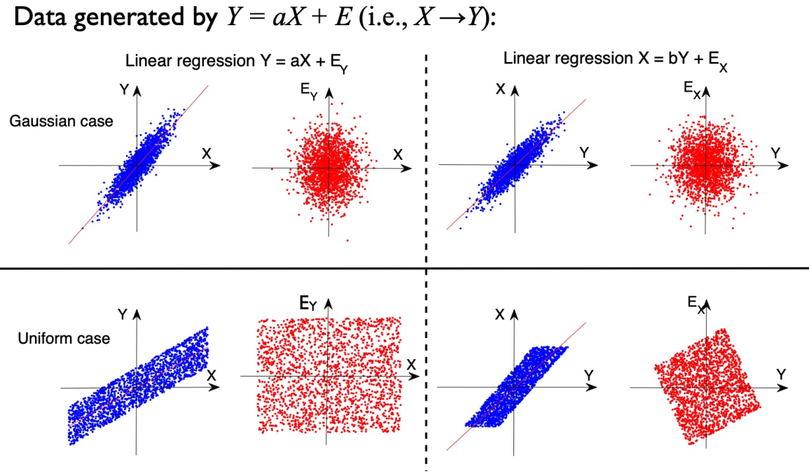

可以发现当 $E$ 为高斯分布时，因果关系无法区分；但是当 $E$ 为非高斯分布时(比如图中为均匀分布)，那么可以区分，即可以发现此时 $Y$ 与 $E_{Y}$ 不独立。

### Darmois-Skeitovitch theorem
$Y_1, Y_2$ 是由一系列随机变量 $S_1, S_2, \ldots S_n$ 线性组合而成
$$
Y_{1}=\alpha_1S_1+\alpha_2S_2+...+\alpha_nS_n\\Y_{2}=\beta_1S_1+\beta_2S_2+...+\beta_nS_n
$$

如果 $Y_1, Y_2$ 是独立的，那么只要 $\alpha_j \beta_j\neq 0$，$S_j$ 就为高斯分布。此时考虑 $X,Y$ 的因果关系。
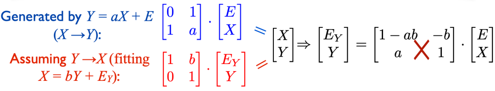

假如我们无法分辨因果关系，那么就说明 $E_{Y}, Y$ 是独立的，从而再倒退得到 $E,X$ 都是高斯分布。

### Linear Non-Gaussian Acyclic Model: LiNGAM
LiNGAM 算法就是利用上述结论建立的算法，用于找到因果关系。那么首先写出 Linear acyclic SEM：
$$
x_i=\sum_{j:\text{ parents of }i}b_{ij}x_j+e_i\quad\mathrm{~or~}\quad\mathbf{x=Bx+e}
$$

同时需要满足几点基本假设：
* 各个变量的因果关系生成的应当是一张有向无环图
* 外部影响因子(噪音) $e_i$ 应当有 $\operatorname{Var}(e_i)\neq 0$，同时是相互独立的非高斯随机变量。
* 分析的变量之间没有共同的因(latent confounders)。

接下来对 $B$ 进行估计：
1. 使用 ICA 来估计矩阵
  $$
  \begin{aligned}\mathbf{x}=\mathbf{B}\mathbf{x}+\mathbf{e}\Leftrightarrow\mathbf{x}&=(\mathbf{I}-\mathbf{B})^{-1}\mathbf{e}\\&=\mathbf{A}\mathbf{e}=\mathbf{W}^{-1}\mathbf{e}\end{aligned}
  $$
1. 生成 DAG
2. 除掉那些关联非常弱的边(可能由噪音导致)

  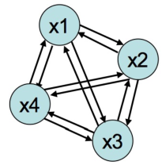
  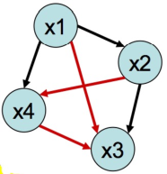
  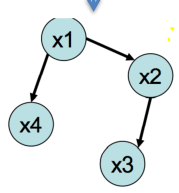

### Performance of the algorithm
* Fast (ICA is fast)
* Possible local optimum problem (ICA is an iterative method)
* A good estimation needs >1000 sample size for >10 variables
* Not scale invariant

