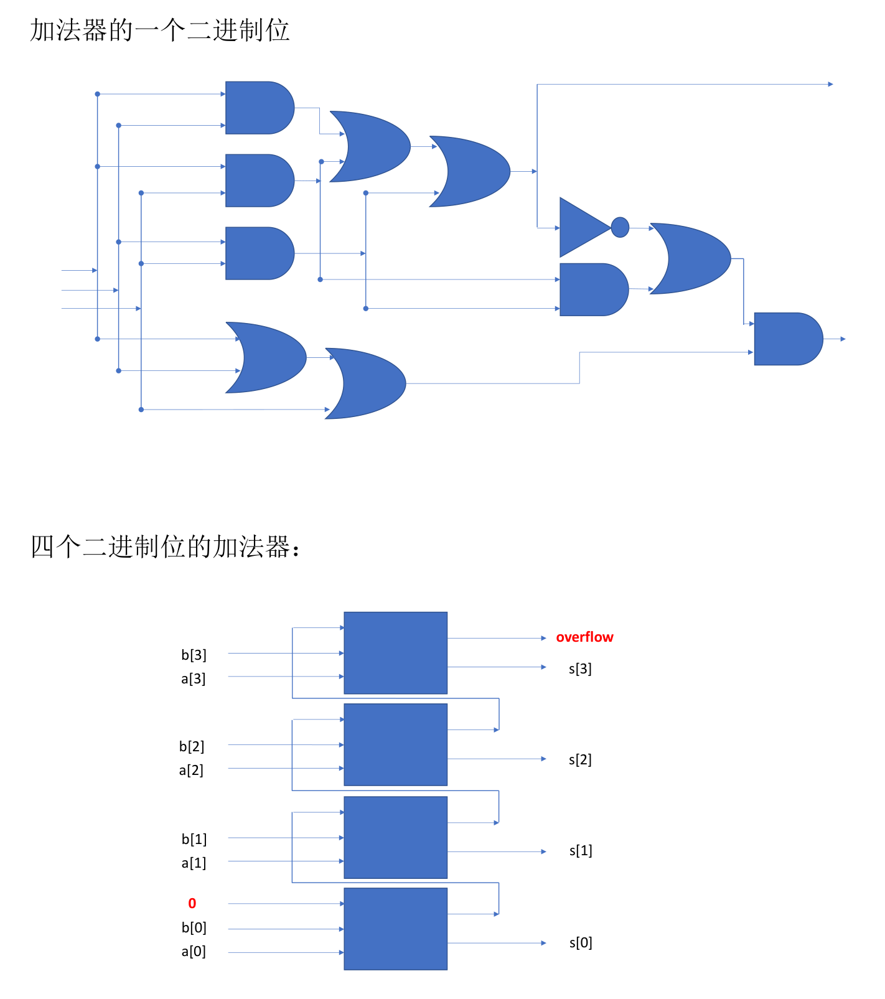

### Application of propositional logic
#### Logic Circuits

#### A Sudoku Puzzle
Modelling A Sudoku Puzzle
- propositional variables $p_{i,j,n}$: "the number at the cell $(i,j)$ is $n$"
- known entries: $\psi := \bigwedge_k p_{i_k,j_k,n_k}$ if the number at $(i_k,j_k)$ is $n_k$
- every cell contains at most one number:
$$
\psi' := \bigwedge_{i,j} \bigwedge_{n<n'} \neg(p_{i,j,n} \land p_{i,j,n'})
$$
- for each number $n$, each row contains at least one
$$
\phi_1 := \bigwedge_n \left( \bigwedge_i \left( \bigvee_j p_{i,j,n} \right) \right)
$$
* $\phi_2$: for each number $n$, each column contains at least one $n$. (Similar with $\phi_1$)
* for each number $n$, every 3 ˆ 3 block contains at least one $n$
$$
\phi_3 := \bigwedge_{n=1}^{9} \bigwedge_{I=0}^{2} \bigwedge_{J=0}^{2} \bigvee_{i=1}^{3} \bigvee_{j=1}^{3} p_{3I+i, 3J+j, n}
$$

数独有解，当且仅当存在一个真值指派，使得  $\psi\wedge\psi^\prime\wedge\phi_1\wedge\phi_2\wedge\phi_3$ 为真。

### Sub-classes of Propositions
**Definition 1**. A tautology (重言式, 永真式) is a compound proposition that is always true, no matter what the truth values of the propositional variables are. In other words, $phi$ is a tautology if $\llbracket \phi \rrbracket_{\mathcal{J}} = T$ for any truth assignment $\mathcal{J}$.

**Definition 2**. A contradiction (矛盾式) is a compound proposition that is always false, no matter what the truth values of the propositional variables are. In other words, $phi$ is a contradiction if $\llbracket \phi \rrbracket_{\mathcal{J}}=F$ for any truth assignment $\mathcal{J}$.

**Definition 3**. A compound proposition is satisfiable (可满足的) if it is true under some truth assignment. In other words, $phi$ is satisfiable if there exists a truth assignment $\mathcal{J}$ such that $\llbracket \phi \rrbracket_{\mathcal{J}}=T$

**Example 4**. $p \vee \neg p$ is a tautology, and is satisfiable.

**Example 5**. $p \wedge \neg p$ is a contradiction, and is not satisfiable.

**Example 6**. $p \wedge q$ is not a tautology, is not a contradiction, and is satisfiable.

**Theorem 7.**
* $\phi \lor \neg\phi$  is a tautology.
* $\phi \land \neg\phi$ is a contradiction.

**Theorem 8.**
- $\phi$ is a tautology if and only if $\neg\phi$ is a contradiction.
- $\phi$ is a contradiction if and only if $\neg\phi$ is a tautology.
- $\phi$ is satisfiable if and only if $\phi$ is not a contradiction.
- $\phi$ is a tautology if and only if $\neg\phi$ is not satisfiable.

**Theorem 9.**
- $\phi_1, \phi_2, \ldots, \phi_n \vDash \psi$ if and only if $\phi_1 \land \phi_2 \land \cdots \land \phi_n \land \neg\psi$ is not satisfiable.
- $\{\} \vDash \phi$ if and only if $\phi$ is a tautology.
- $\phi \equiv \psi$ if and only if $\phi \vDash \psi$ and $\psi \vDash \phi$.

**Theorem 10**. 
If $\phi \equiv \psi$, then
- $\phi$ is a tautology iff $\psi$ is a tautology.
- $\phi$ is a contradiction iff $\psi$ is a contradiction.

**Theorem 11**.
- If $\phi \models \psi$ and $\psi \models \chi$, then $\phi \models \chi$.
- If $\phi \models \psi$ and $\psi \equiv \chi$, then $\phi \models \chi$.
- If $\phi \equiv \psi$ and $\psi \models \chi$, then $\phi \models \chi$.

想要判断一个命题是否可满足，最直接的方法就是尝试所有真值指派。比如数独的例子，需要尝试 $2^{9\times 9\times 9}$ 种可能性。但计算量太大，完全穷举不合理的。

### Normal Forms (范式)
**Definition 12**. Normal Form
- A *literal* is a propositional variable or its negation. (比如说 $p, q, r, \lnot p, \lnot q$ 这种)
- A *conjunctive clause* (合取子句) is a conjunction of literals. (例如 $\lnot p \land q$，同时 $r$ 这种只有一个 literal 的也算)
- A *disjunctive clause* (析取子句) is a disjunction of literals.
- A compound proposition is in *disjunctive normal form* (DNF, 析取范式) if it is a disjunction of conjunctive clauses. (典型的有 $(p \land q)\lor (\lnot p \land r)$ 这种；$\lnot p \land q$ 也算，可以看作一个合取子句)
- A compound proposition is in *conjunctive normal form* (CNF, 合取范式) if it is a conjunction of disjunctive clauses.

**Remark**. 
A conjunctive clause may have only one literal, which can be treated as a conjunction of only one literal (退化情况). A DNF proposition may have only one conjunctive clause, which can be treated as a disjunction of only one conjunctive clause (退化情况).

**Theorem 13**. Every compound proposition is logically equivalent to some compound proposition in disjunctive normal form.

**Theorem 14**. Every compound proposition is logically equivalent to some compound proposition in conjunctive normal form.
任何复合命题都有逻辑等价的合取范式或是析取范式。

假如命题被写成 DNF 的形式，那么只要找到一个真值指派，使得其任意一个子句为真，就是可满足的。

Basic observations:
* It is easy to determine whether a DNF proposition is SAT.
* It is hard to determine whether a generic proposition is SAT.
* It is impossible to turn every proposition into a concise DNF expressions (if preserving logic equivalence).
就是说把一个复合命题转换成 DNF，这个 DNF 的长度可能是指数级的。这说明走 DNF 这条路是走不通的。
* It is still hard to determine whether a CNF proposition is SAT, but this problem is easier to analysis.
这个时候就需要找到一个真值指派，使得 CNF 中的每个真值指派都为真。
但是把一个复合命题转换成 CNF，这个 CNF 的长度可能是指数级的。问题依然没有得到解决。

### SAT solver
现有的解决办法是，我们把一个复合命题转化为 CNF，但是不需要逻辑等价，只需要保持可满足性相同。

#### Generating CNF expressions
例如
$$
\begin{array}{ll}
&(p\wedge q)\vee\neg(q\wedge r)\\
\Rightarrow&(p\wedge q\leftrightarrow p_1)\wedge(q\wedge r\leftrightarrow p_2)\wedge(\neg p_2\leftrightarrow p_3)\wedge(p_1\vee p_3\leftrightarrow p_4)\wedge p_4\\
\Rightarrow&\cdots\wedge\cdots\wedge\cdots\wedge\cdots\wedge p_4
\end{array}
$$

* $p_1, p_2, p_3, p_4$ 都是新引入的原子命题。第一行和第二行的式子的可满足性是一样的。
* 不过第二行目前还不是 CNF，但是也不难将其变为长度合理的合取范式，例如
$$
\begin{aligned}
&p \land q \leftrightarrow p_1 \\
\equiv &(p \land q \to p_1) \land (p_1\to p \land q) \\
\equiv &(\lnot (p \land q) \lor p_1) \land (\lnot p_1 \lor (p \land q)) \\
\equiv &(\lnot p \lor \lnot q \lor p_1) \land (\lnot p_1 \lor p) \land (\lnot p_1 \lor q)
\end{aligned}
$$
注意到最多有四个子句，每个子句至多有三个命题变元。