## Why study transformation
* modeling(模型变换)
  * translation(如游戏中视野的移动)
  * rotation
  * scaling
* viewing(视图变换，将三维投影到二维)

## 2D transformation
### Scale

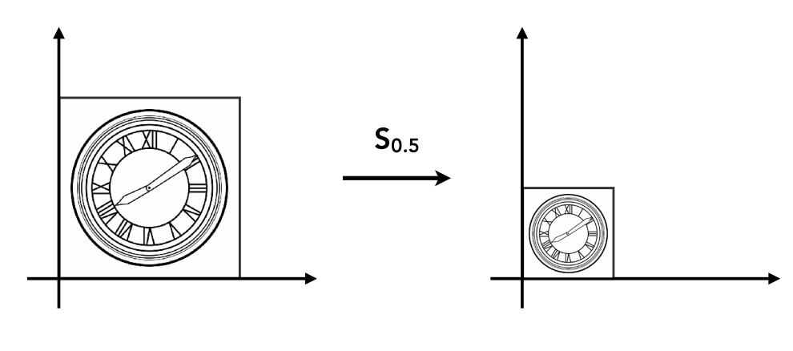

Scale Transform: $x'=sx, y'=sy$

Scale Matrix: 
$$
\begin{pmatrix} 
    x'\\ y' 
\end{pmatrix} =\begin{pmatrix} 
    s & 0 \\ 0 & s 
\end{pmatrix} \begin{pmatrix} 
    x \\ y 
\end{pmatrix} 
$$

Scale(Non-Uniform)
$$
\begin{pmatrix} 
    x'\\ y' 
\end{pmatrix} =\begin{pmatrix} 
    s_{x} & 0 \\ 0 & s_y 
\end{pmatrix} \begin{pmatrix} 
    x \\ y 
\end{pmatrix} 
$$

### Reflection

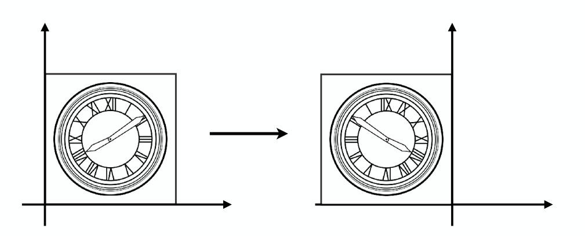

$$
\begin{pmatrix} 
    x'\\ y' 
\end{pmatrix} =\begin{pmatrix} 
    -1 & 0 \\ 0 & 1 
\end{pmatrix} \begin{pmatrix} 
    x \\ y 
\end{pmatrix} 
$$

### Shear

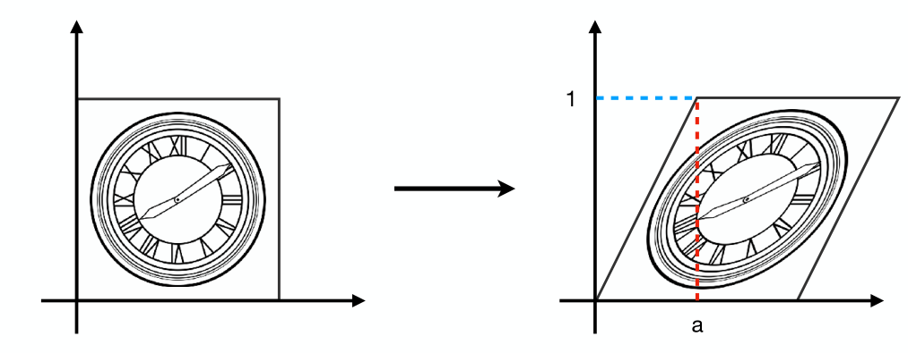

$$
\begin{pmatrix} 
    x'\\ y' 
\end{pmatrix} =\begin{pmatrix} 
    1 & a \\ 0 & 1 
\end{pmatrix} \begin{pmatrix} 
    x \\ y 
\end{pmatrix} 
$$

### Rotate

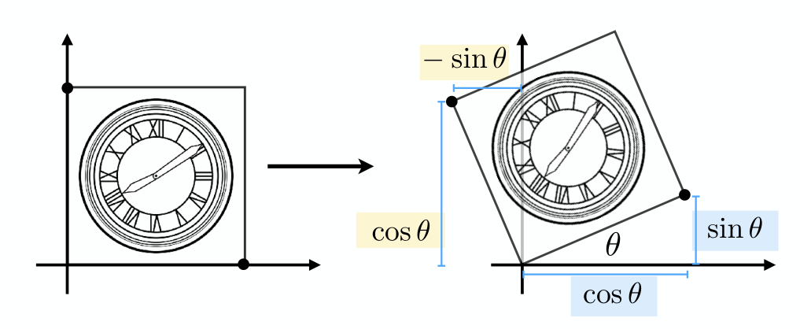

$$
\begin{pmatrix} 
    x' \\ y' 
\end{pmatrix}=\begin{pmatrix} 
    \cos \theta \\ \sin  \theta 
\end{pmatrix}  x + \begin{pmatrix} 
    -\sin  \theta \\ \cos \theta 
\end{pmatrix} y
$$

$$
\Rightarrow \begin{pmatrix} 
    x'\\ y' 
\end{pmatrix} =\begin{pmatrix} 
    \cos \theta & -\sin \theta \\ \sin \theta & \cos \theta 
\end{pmatrix} \begin{pmatrix} 
    x \\ y 
\end{pmatrix} 
$$

### Linear Transforms = Martices
$$
\begin{pmatrix} 
    x'\\ y' 
\end{pmatrix} =\begin{pmatrix} 
    a & b \\ c & d 
\end{pmatrix} \begin{pmatrix} 
    x \\ y 
\end{pmatrix} \Rightarrow 
\bm{x'}=\bm{M}\bm{x}
$$

## Homogeneous coordinates
### Translation

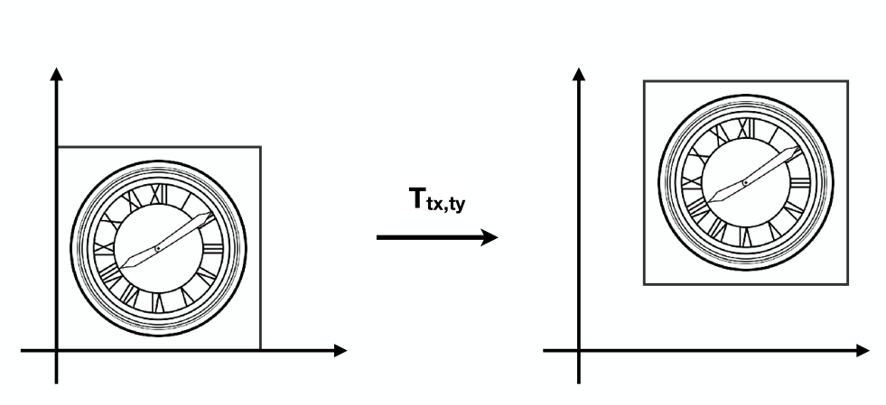

### Why Homogeneous Coordinates
Translation cannot be represented in matrix form, translation is not linear transform.

$$
\begin{pmatrix} 
    x'\\ y' 
\end{pmatrix} =\begin{pmatrix} 
    a & b \\ c & d 
\end{pmatrix} \begin{pmatrix} 
    x \\ y 
\end{pmatrix}+\begin{pmatrix} 
    t_{x} \\ t_y
\end{pmatrix} 
$$

But we don’t want translation to be a special case.

### Solution: Homogenous Coordinates
Add a third coordinate ($w$-coordinate)
• 2D **point** = $(x, y, 1)^{\mathrm{T}}$
• 2D **vector** = $(x, y, 0)^{\mathrm{T}}$

根据 *No free lunch theorem* ，我们为了去除平移变换最后的一项，需要在其他地方增加一些复杂度。这里就是增加了一个维度。

Matrix representation of translations
$$
\begin{pmatrix} 
    x' \\ y' \\ w' 
\end{pmatrix} = \begin{pmatrix} 
    1 & 0 & t_{x} \\ 0 & 1 & t_y \\ 0 & 0 & 1
\end{pmatrix} \cdot \begin{pmatrix} 
    x \\ y \\ 1 
\end{pmatrix} = \begin{pmatrix} 
    x+t_{x} \\ y+t_y \\ 1
\end{pmatrix} 
$$

对于一个点来说，经过平移矩阵变换会变成另一个点；但是对于一个向量来说，经过平移矩阵变换之后还是同一个向量。（保证向量平移不变性）

Valid operation if w-coordinate of result is 1 or 0
• vector + vector = vector
• point – point = vector
• point + vector = point
• point + point = ??

对于最后一个，扩充定义：
In homogeneous coordinates, $\begin{pmatrix} x \\ y \\ w \end{pmatrix}$ is the 2D point $\begin{pmatrix} x / w \\ y / w \\ 1 \end{pmatrix} (w\neq 0)$
那么最后的 point + point 就可以理解为求两点的中点。

### Affine Transformations(仿射变换)
Affine map = linear map + translation
$$
\begin{pmatrix} 
    x'\\ y' 
\end{pmatrix} =\begin{pmatrix} 
    a & b \\ c & d 
\end{pmatrix} \begin{pmatrix} 
    x \\ y 
\end{pmatrix}+\begin{pmatrix} 
    t_{x} \\ t_y
\end{pmatrix} 
$$

Using homogenous coordinates:
$$
\begin{pmatrix} 
    x' \\ y' \\ w' 
\end{pmatrix} = \begin{pmatrix} 
    a & b & t_{x} \\ c & d & t_y \\ 0 & 0 & 1
\end{pmatrix} \cdot \begin{pmatrix} 
    x \\ y \\ 1 
\end{pmatrix}
$$

### 2D Transformations
Scale
$$
S(s_{x},s_y)=\begin{pmatrix} 
    s_{x} & 0 & 0 \\ 
    0 & s_y & 0 \\ 
    0 & 0 & 1 
\end{pmatrix} 
$$

Rotation
$$
R(\alpha)=\begin{pmatrix} 
    \cos \alpha & -\sin \alpha & 0 \\ 
    \sin \alpha & \cos \alpha & 0 \\ 
    0 & 0 & 1 
\end{pmatrix} 
$$

Translation:
$$
S(s_{x},s_y)=\begin{pmatrix} 
    1 & 0 & t_{x} \\ 
    0 & 1 & t_y \\ 
    0 & 0 & 1 
\end{pmatrix} 
$$

可以看出对于二维的仿射变换，矩阵的最后一行都是 $0\ 0\ 1$。如果不是的话，那么将对应其他的变换。

## Composing Transforms
经过多次变换 $\Leftrightarrow$ 左乘多个矩阵

根据矩阵的结合律，可以知道任意一个复杂的变换都可以用一个矩阵表示。（就是利用结合律将矩阵先乘起来）

同时由于矩阵之间没有交换律，可知如果将两个变换顺序互换，最终得到的结果一般不同。

## 3D Transformations
Use homogeneous coordinates again:
• 3D point = $(x, y, z, 1)^{\mathrm{T}}$
• 3D vector = $(x, y, z, 0)^{\mathrm{T}}$

$$
\begin{pmatrix} 
    x' \\ y' \\ z' \\ 1 
\end{pmatrix} = \begin{pmatrix} 
    a & b & c & t_{x} \\ d & e & f & t_{y} \\ g & h & i & t_z \\ 0 & 0 & 0 & 1
\end{pmatrix} \cdot \begin{pmatrix} 
    x \\ y \\ z \\ 1 
\end{pmatrix} 
$$

The order: Linear Transform first(和二维中情形一样)

绕着 $x,y,z$ 轴旋转

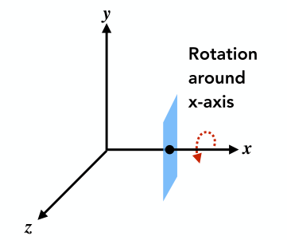

$$
R_{x}(\alpha)=
\begin{pmatrix} 
    1&0&0&0 \\ 
    0&\cos \alpha&-\sin \alpha&0 \\  
    0&\sin \alpha&\cos \alpha&0 \\
    0&0&0&1
\end{pmatrix} 
$$

$$
R_{y}(\alpha)=
\begin{pmatrix} 
    \cos \alpha&0&\sin \alpha&0 \\ 
    0&1&0&0 \\  
    -\sin \alpha&0&\cos \alpha&0 \\
    0&0&0&1
\end{pmatrix} 
$$

$$
R_{z}(\alpha)=
\begin{pmatrix} 
    \cos \alpha&-\sin \alpha&0&0 \\ 
    \sin \alpha&\cos \alpha&0&0 \\  
    0&0&1&0 \\
    0&0&0&1
\end{pmatrix} 
$$

可以看出绕 $y$ 轴的旋转的矩阵和绕 $x$ 轴、$z$ 轴的有所不同，这个和右手螺旋定则有关。

### 3D Rotations
对于任意的旋转，可以看作是绕 $x,y,z$ 轴旋转的叠加
$$
R_{xyz}(\alpha,\beta,\gamma)=R_{x}(\alpha)R_y(\beta)R_z(\gamma)
$$

这三个角度称为欧拉角。从直观上想象，如图

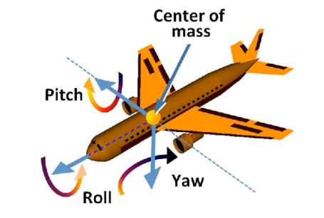

任意的旋转应该都是能被三个方向的旋转表示的

### Rodrigues’ Rotation Formula
旋转的公式为
$$
R(\bm{n},\alpha)=\cos \alpha\cdot \bm{I}+(1-\cos \alpha)\bm{n}\bm{n}^{\mathrm{T}}+\sin \alpha 
\begin{pmatrix} 
0&-n_z&n_y\\
n_z&0&-n_{x} \\
-n_y&n_{x}&0
\end{pmatrix} 
$$

表示以 $\bm{n}$ 方向为轴旋转 $\alpha$ 的角度。其中默认旋转轴经过原点。

## Viewing(观测) transformation
### View(视图) / Camera Transformation
把三维空间中的物体变成二维的图，就像拍照片。
* 首先找一个好的地方，把模型都放好(**model** transformation)
* 然后找一个好的角度、位置去放置相机(**view** transformation)
* 拍照，完成投影(**projection** transformation)

这里主要讲视图变换 (view transformation)

首先确定相机状态
* 位置(position) $\vec{e}$
* 相机朝向(look-at / gaze direction) $\hat{g}$
* 相机顶部方向(up direction) $\hat{t}$，这是为了防止相机能绕着光轴旋转

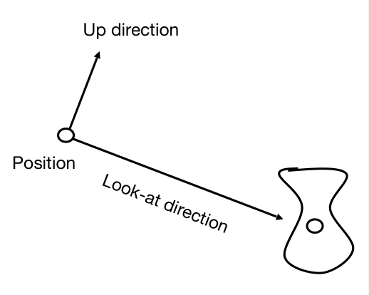

考虑到一点:
如果相机和前景背景的相对位置不变，最后得到的结果是一样的。因此我们可以让相机处于一个标准位置上：为了方便，我们默认相机
* 处于原点
* 朝向 $-z$ 方向
* 以 $y$ 方向作为顶部

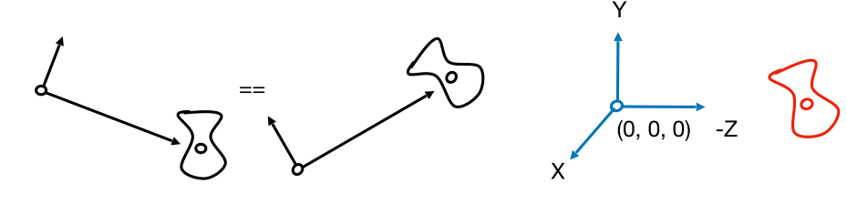

那么想要拍出合适的图，只要让其他物体跟着移动就行了。

如何将相机从一个任意位置移动到任意位置：
* 将 $\vec{e}$ 平移到原点
* 将 $\hat{g}$ 转到 $-z$ 方向
* 将 $\hat{t}$ 转到 $y$ 方向
* 将 $\hat{g}\times \hat{t}$ 转到 $x$ 方向

$M_{view}=R_{view}T_{view}$。容易得到 $T_{view}=\begin{pmatrix} 
    1&0&0&-x_e\\
    0&1&0&-y_e\\
    0&0&1&-z_e\\
    0&0&0&1
\end{pmatrix}$

而对于矩阵 $R_{view}$，可以先考虑其逆矩阵，也就是将 $x,y,z$ 分别转到 $\hat{g}\times \hat{t},\hat{t},-\hat{g}$ 的矩阵。
$$
R_{view}^{-1}=\begin{pmatrix} 
    x_{\hat{g}\times \hat{t}} & x_{\hat{t}} & x_{-\hat{g}} & 0\\
    y_{\hat{g}\times \hat{t}} & y_{\hat{t}} & y_{-\hat{g}} & 0\\
    z_{\hat{g}\times \hat{t}} & z_{\hat{t}} & z_{-\hat{g}} & 0\\
    0 & 0 & 0 & 1
\end{pmatrix} 
$$

考虑到旋转矩阵为正交矩阵，因此矩阵的逆等于矩阵转置
$$
R_{view}=(R_{view}^{-1})^{-1}=(R_{view}^{-1})^{\mathrm{T}}= 
\begin{pmatrix} 
    x_{\hat{g}\times \hat{t}} & y_{\hat{g}\times \hat{t}} & z_{\hat{g}\times \hat{t}} & 0 \\
    x_{\hat{t}} & y_{\hat{t}} & z_{\hat{t}} & 0 \\
    x_{-\hat{g}} & y_{-\hat{g}} & z_{-\hat{g}} & 0 \\
    0 & 0 & 0 & 1
\end{pmatrix}
$$

### Projection Transformation
* 正交投影(orthographic projection)(常用于工程制图)
* 透视投影(perspective projection)(常用于绘画，能展现近大远小的效果)

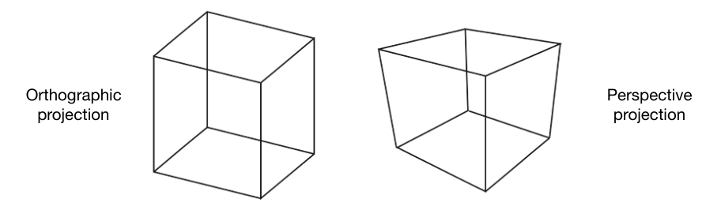

正交投影可以理解为将透视投影的camera的位置移到无穷远

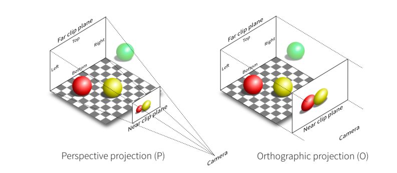

#### Orthographic Projection
正交投影的一种简单理解是直接扔掉 $z$ 轴坐标

而在图形学中，正交投影是将空间中的一个立方体 $\left[ l,r \right]\times [b,t] \times [f,n]$ 变换为一个“标准”(canonical)立方体 $[-1,1]^{3}$。变换矩阵为
$$
M_{\text {ortho }}=\begin{pmatrix}
\frac{2}{r-l} & 0 & 0 & 0 \\
0 & \frac{2}{t-b} & 0 & 0 \\
0 & 0 & \frac{2}{n-f} & 0 \\
0 & 0 & 0 & 1
\end{pmatrix}\begin{pmatrix}
1 & 0 & 0 & -\frac{r+l}{2} \\
0 & 1 & 0 & -\frac{t+b}{2} \\
0 & 0 & 1 & -\frac{n+f}{2} \\
0 & 0 & 0 & 1
\end{pmatrix}
$$

#### Perspective Projection
透视投影是用的最广泛的一种投影，满足近大远小，同时带来的视觉效果为平行线不再平行。

如何做透视投影？从直观上来说就是将如图所示的台体(Frustum)挤压(squish)成长方体(Cuboid)，然后再照着正交投影的步骤来即可

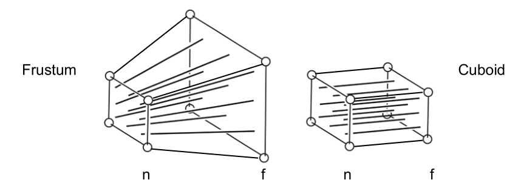

为规范化操作过程，在挤压的过程中，我们规定近平面(n)的4个点不变，而远平面(f)的 $z$ 坐标和中心不会变化。

对于某一点 $(x,y,z)$，我们假设挤压之后的点位置为 $(x',y',z')$，应当有 
$$
y'=\frac{n}{z}y \quad x'=\frac{n}{z}x
$$

而 $z'$ 还暂时不知道。

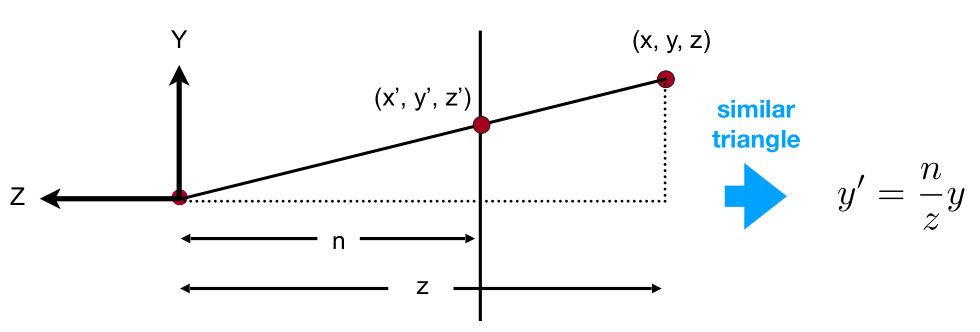

而坐标映射情况为
$$
\begin{pmatrix} 
    x \\ y \\ z \\1 
\end{pmatrix} \Rightarrow
\begin{pmatrix} 
    nx /z \\ ny /z \\ \text{unknown} \\ 1
\end{pmatrix} =
\begin{pmatrix} 
    nx \\ ny \\ \text{still unknown} \\ z
\end{pmatrix} 
$$

此时可以得到
$$
M_{persp\to ortho}=
\begin{pmatrix} 
    n&0&0&0 \\ 0&n&0&0 \\ ?&?& ?&? \\ 0&0&1&0
\end{pmatrix} 
$$

为了解出矩阵中的 $?$，考虑规定的两个性质：
* 在近平面上的点不会动
* 远平面的中点不会动

由第一个性质
$$
\begin{pmatrix} 
    x \\ y \\ n \\1 
\end{pmatrix} \Rightarrow
\begin{pmatrix} 
    x \\ y \\ n \\ 1
\end{pmatrix} =
\begin{pmatrix} 
    nx \\ ny \\ n^{2} \\ n
\end{pmatrix} 
$$

则 $M_{persp\to ortho}$ 的第三行必为 $\begin{pmatrix} 0&0&A&B \end{pmatrix}$ 的形式

$$
\begin{pmatrix} 
    0&0&A&B 
\end{pmatrix} 
\begin{pmatrix} 
    x \\ y \\ n \\ 1 
\end{pmatrix} = n^{2} 
$$

$$
\Rightarrow An+B=n^{2}
$$

再由第二个性质
$$
\begin{pmatrix} 
    0 \\ 0 \\ f \\ 1
\end{pmatrix} \Rightarrow
\begin{pmatrix} 
    0 \\ 0 \\ f \\ 1
\end{pmatrix} =
\begin{pmatrix} 
    0 \\ 0 \\ f^{2} \\ f
\end{pmatrix} 
$$

同理得到
$$
\Rightarrow Af+B=f^{2}
$$

从而解得 $A=n+f, B=-nf$

$$
M_{persp\to ortho}=
\begin{pmatrix} 
    n&0&0&0 \\ 0&n&0&0 \\ 0&0&n+f&-nf \\ 0&0&1&0
\end{pmatrix} 
$$

$M_{persp}=M_{ortho}M_{persp \to ortho}$

如何定义透视投影所需的的视锥？

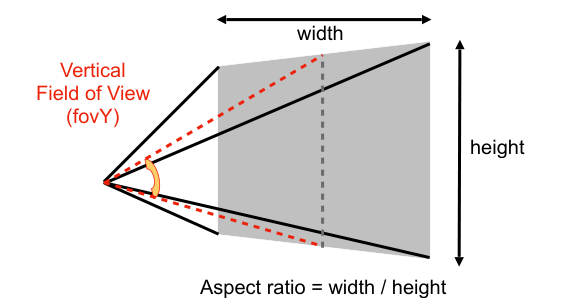

对于图中所示视锥。宽高比($Aspect ratio = width/height$)，而垂直可视角度(Vertical Field of View)如图所示。有了宽高比和视锥，就能得到宽和高。