## Canonical Cube to Screen
什么是屏幕？
* 像素组成的数组
* 数组的大小：分辨率
* 典型的光栅成像设备

光栅(Raster)=屏幕(德语)
* 光栅化(Rasterize)=把东西画在屏幕上

像素(Pixel, short for "picture elment")
* 这里暂时认为像素是只有一种颜色的方块
* 颜色是RGB的组合

屏幕的空间如图所示，
<div align=center>
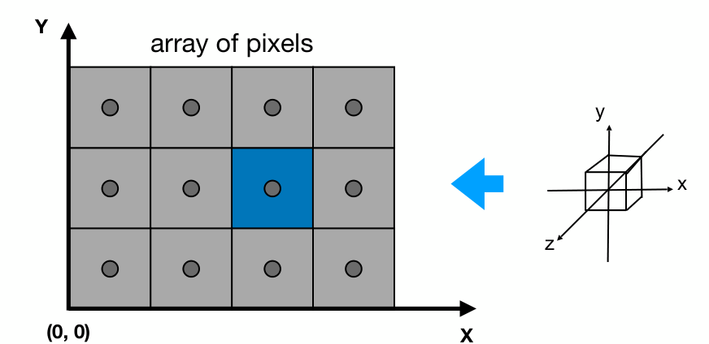
</div>

* 我们认为左下角为原点，像素的坐标用整数 $(x,y)$ 表示
* 像素的范围从 $(0,0)$ 到 $(width-1,height-1)$
* 像素的中心位于 $(x+0.5,y+0.5)$
* 屏幕覆盖的范围从 $(0,0)$ 到 $(width,height)$

现在希望把三维的立方体映射到屏幕上。现在暂时先不管 $z$；对于 $xy$ 平面，需要让立方体映射到整个屏幕，即 $[-1,1]^{2}\to [0,width]\times  [0,height]$，则矩阵为
$$
M_{viewpoint}=\begin{pmatrix} 
    \frac{width}{2} & 0 &0 & \frac{width}{2} \\
    0 & \frac{height}{2} & 0 & \frac{height}{2} \\
    0 & 0& 1 &0 \\
    0 & 0 & 0 & 1
\end{pmatrix} 
$$

做完变换之后，现在已经能得到一个二维场景了，那么下一步则是将这个结果打散成像素(光栅化)。


## Different Raster Displays
* 示波器(Oscilloscope)
* 阴极射线管(Cathode Ray Tube)，早期电视的原理
* Frame Buffer: Memory for a Raster Display
* Flat Panel Displays
* 液晶显示器(LCD: Liquid Crystal Display)
* 发光二极管(LED: Light emitting diode array)
* 墨水屏

### LCD (Liquid Crystal Display) Pixel
液晶显示器

原理：两个偏振方向相互垂直的偏振片，而液晶改变光的偏振方向。如图
<div align=center>
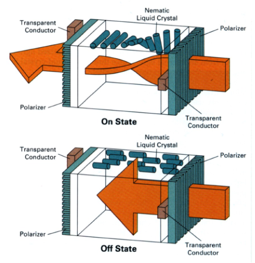
</div>


## Drawing to Raster Displays
### Triangles - Fundamental Shape Primitives
一般的图形都看成是三角形的组合

三角形的特殊性质：
* 三个点一定在同一平面
* 有“内部”
* 能较好的用于描述渐变

### What Pixel Values Approximate a Triangle?
如何把三角形变成像素? 可以通过采样的方法

### A Simple Approach: Sampling
采样相当于把函数离散化。例如
```c
for (int x = 0; x < x_max ; ++x )
    output [x] = f(x)
```

在图形学中，我们用像素中心采样。

<div align=center>
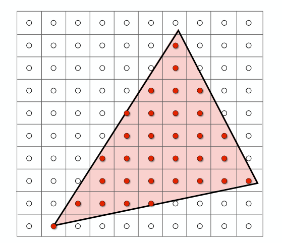
</div>

```c
for (int x = 0; x < xmax; ++x)
    for (int y = 0; y < ymax; ++y)
        image[x][y] = inside(tri , x + 0.5 , y + 0.5);
```

而 `inside()` 函数(判断点是否在三角形内)可以用叉积实现。如果点正好落在三角形边上，自己处理就行。

同时光栅化不用扫描整个屏幕，可以使用如图所示包围盒(Bounding Box)考虑
<div align=center>
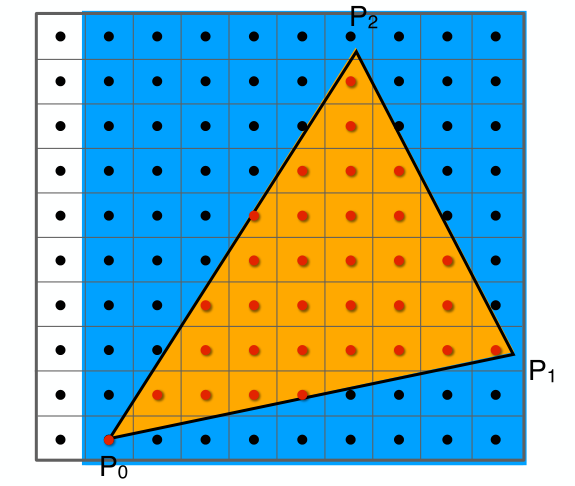
</div>

因为白色区域肯定不会在三角形中，因此不考虑。

或者也可以通过检测旁边像素的方法来加速光栅化。

## Antialiasing
通过采样获得的图形会有锯齿(Aliasing)，需要想办法解决这个问题。

###  Sampling theory
#### Sampling is Ubiquitous in Computer Graphics
采样在图形学中无处不在。
* 光栅化是在二维图像上采样
* 照相是在感光元件上采样
* 视频是对时间的采样

#### Sampling Artifacts(Errors / Mistakes / Inaccuracies) in Computer Graphics
* 会产生锯齿(Jaggies)——在空间中采样
* 可能产生摩尔纹(Moire)——图片采样率不足
* 轮子倒转的幻觉(Wagon wheel effect)——时间上的采样

Sampling Artifacts的原因：信号变化太快但是采样跟不上。

### Antialiasing in practice
#### Antialiasing Idea: Blurring (Pre-Filtering) Before Sampling
模糊化(采样前滤波)

直接采样：
<div align=center>
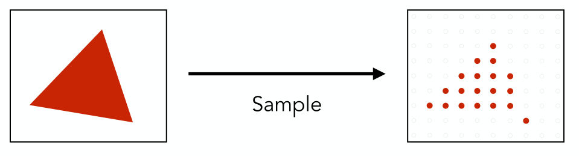
</div>

先模糊处理后再采样
<div align=center>
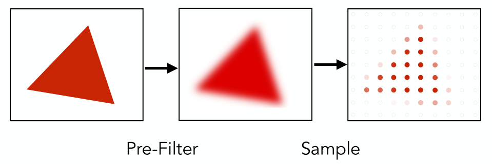
</div>

但是先采样再做模糊处理是达不到预想效果的。

## Frequency Domain
傅里叶级数展开：将函数展开为正弦函数之和。

由傅里叶展开可以引出傅里叶变换
<div align=center>
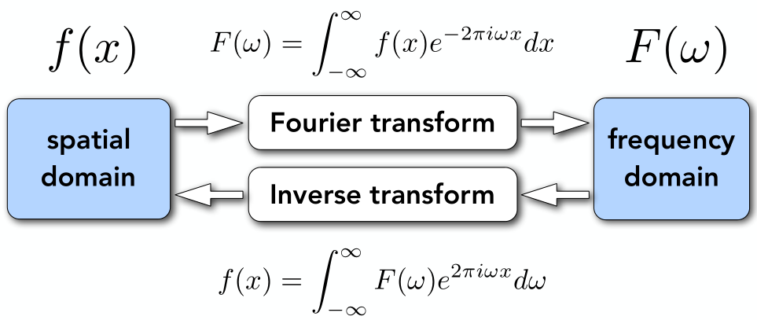
</div>

将空间表象中对函数的描述转化为频率表象中对函数的描述。

用同一频率采样不同频率的函数：
<div align=center>
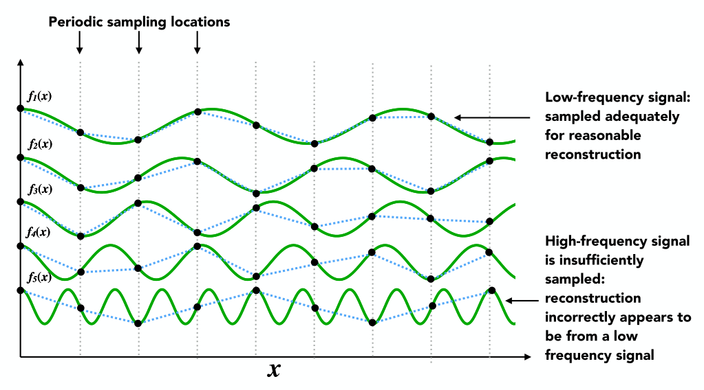
</div>

可以看出采样频率相同时，如果函数的频率过大，那么采样将会丢失很多信息。同时过低的采样频率可能会导致两个频率截然不同的函数被采样之后得到完全相同的结果：
<div align=center>
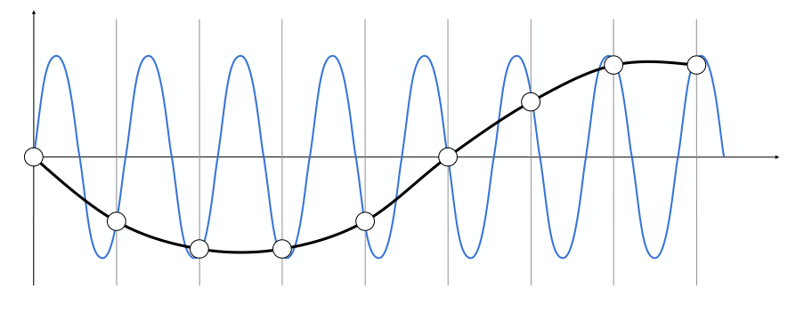
</div>

这种情况称其为 aliases

### Filtering = Getting rid of certain frequency contents
滤波，就是去掉某些特定的频率

对图像做傅里叶变换，将其从时域转化为频域。对于表示频域的图像，我们认为中心为最低频的区域，外侧为高频区域，亮度表示不同位置处的信息。如下图所示，左边的图片经过傅里叶变换之后变成右边
<div align=center>
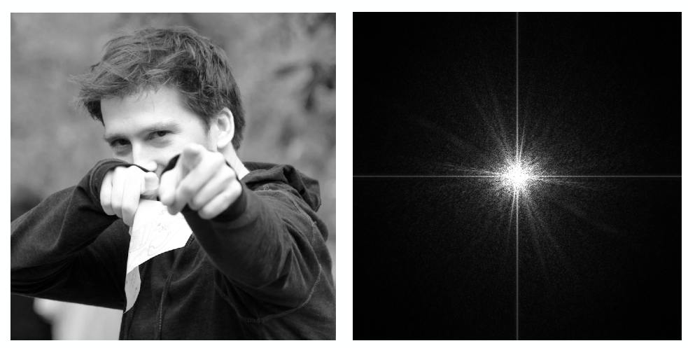
</div>

可以发现低频信息较多，高频信息较少(大多数图都这样)。至于图中的横线和竖线，这是原图的边界导致。

如果对频域图像做高通滤波，过滤低频信号，再做傅里叶逆变换变回原图，则得到如图情形
<div align=center>
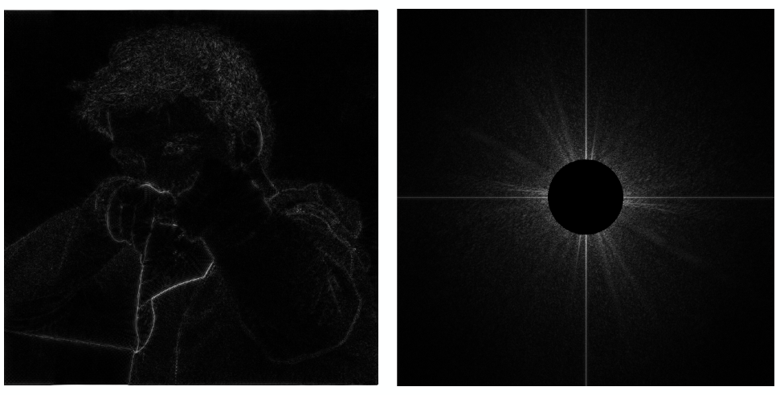
</div>

可以看出保留的为原图的内部的边界。这是因为边界处图像变化特别剧烈，因此为高频信息。

如果做低通滤波，过滤高频信号，这就是做模糊化(Blur)
<div align=center>
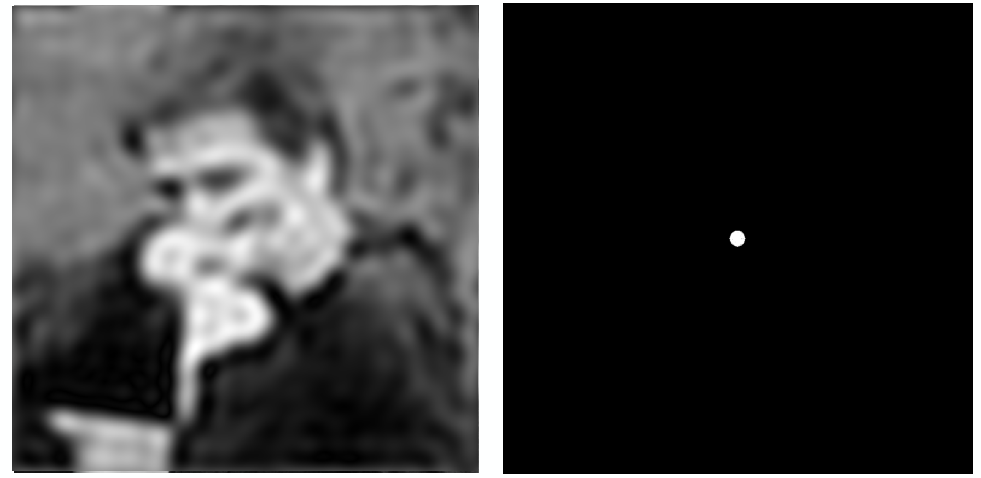
</div>

如果同时过滤最高频和最低频的信号，会得到结果如下
<div align=center>
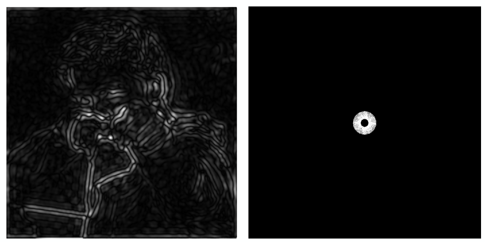
</div>

那么可以看出得到的是一些没那么明显的边界特征

### Filtering = Convolution(= Averaging)
对时域上对两个信号做卷积，相当于在频域上对两个信号做乘积。反之亦然。
<div align=center>
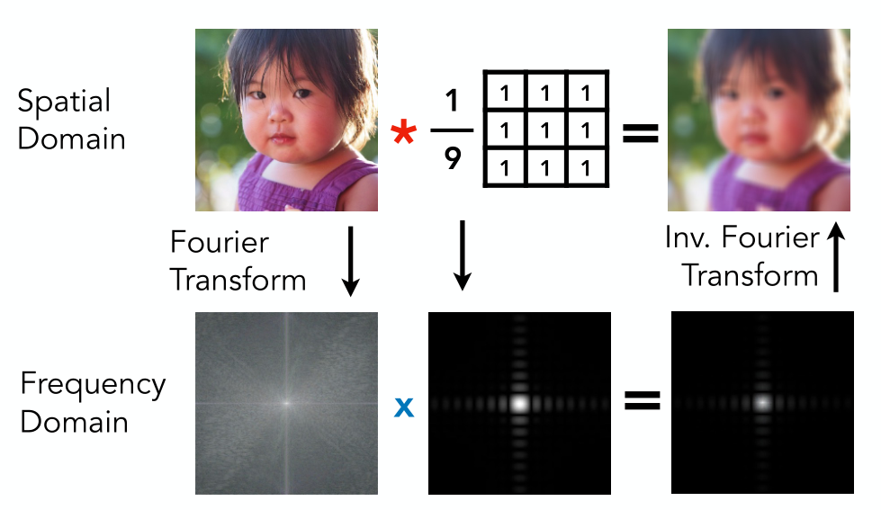
</div>

同时对于卷积操作来说，卷积核在时域上越大，那么在频域中就越小。(可以理解为卷积核如果很大，那么相当于会把整张图片弄得很模糊，也就是去掉了所有高频信息，这说明在频域中应该很小)
<div align=center>
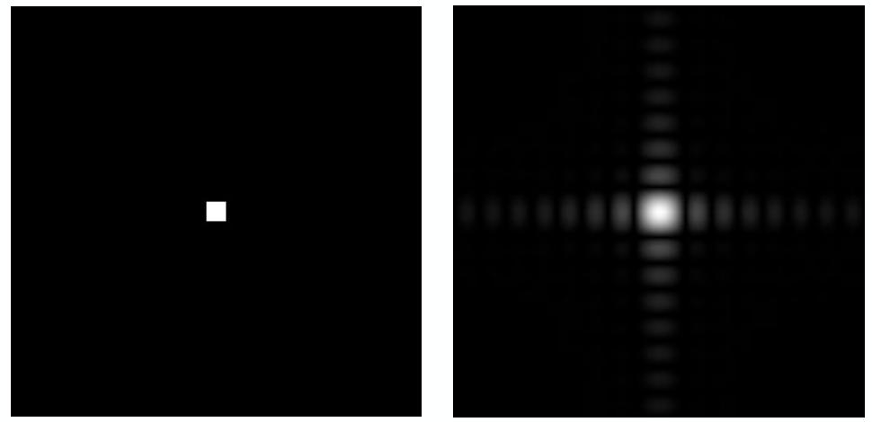
</div>

<div align=center>
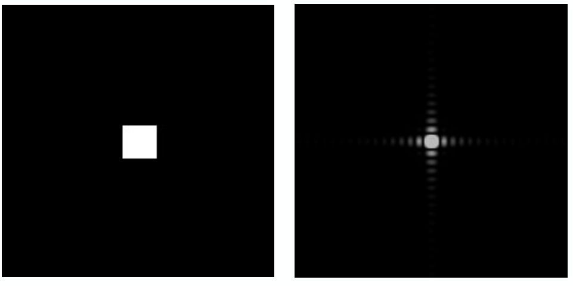
</div>

### Sampling = Repeating Frequency Contents
对信号做采样，就相当于让信号乘以一系列的冲激函数。而在频域中，就相当于让函数与一系列冲激函数做卷积，最终得到的结果就是频域中的函数被重复。
<div align=center>
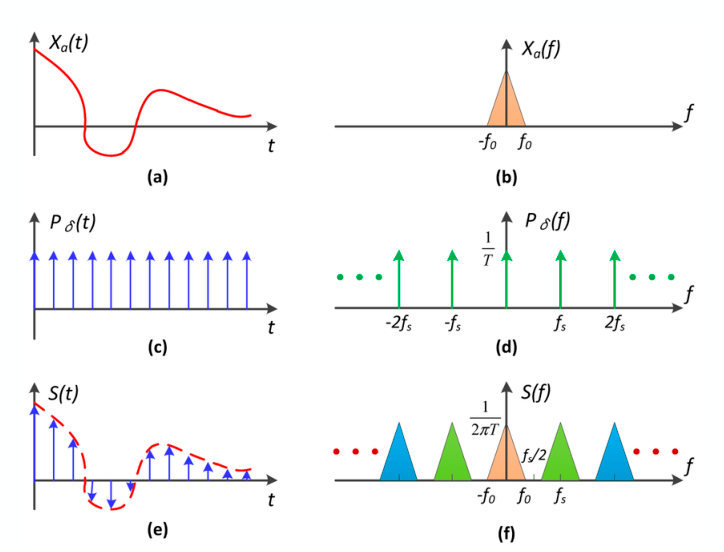
</div>

如果在时域中采样频率过低，那么在频域中冲激函数的间隔就会比较小，最终就会导致频域中的函数重叠。而如果对图像进行模糊处理，相当于截掉了高频部分，那么就能避免重叠。

<div align=center>
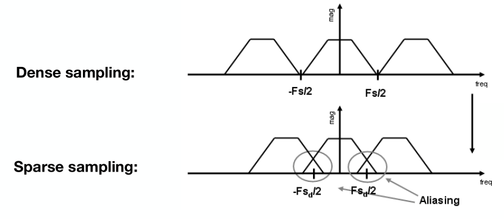
</div>


## Antialiasing (with frequency fundamental)
如何反走样？
* 提高分辨率
* 先模糊(消除高频信号)，后采样

如何选择滤波器？最简单的方式就是将一个像素作为滤波的块(1 pixel-width box filter)。如果使用该滤波器，那么各个像素经过滤波之后得到的结果如图：
<div align=center>
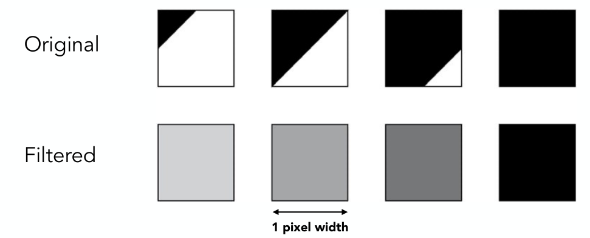
</div>


### Antialiasing By Supersampling (MSAA)
事实上准确的算出三角形在每个像素中覆盖的面积并不容易，因此需要引入某些近似操作。
#### Supersampling
将一个像素划分为很多更小的像素，比如在下图中将每个像素划分为4个块。而每个像素的近似覆盖率可以用在三角形中的更小的像素数来表示。
<div align=center>
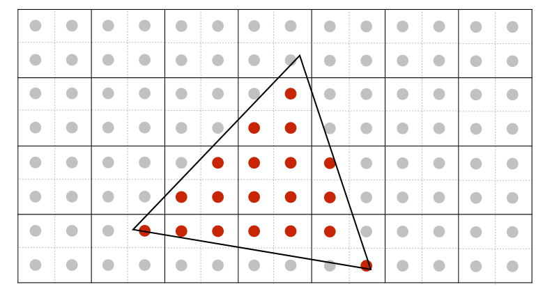
</div>

最后得到结果如图：
<div align=center>
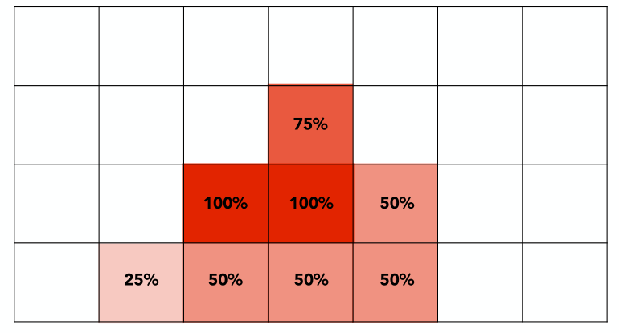
</div>

### Antialiasing Today
除了MSAA，还有很多其他的抗锯齿方法。其中比较典型的为：
* FXAA(Fast Approximate AA) 快速近似抗锯齿。先得到一个有锯齿的图，再找到锯齿位置，通过对图像的后期处理，消除锯齿。
* TAA(Temporal AA) 与时间相关。同样是将每个像素分成很多小像素，但对于每一帧来说都只计算一个小像素是否在三角形中。通过复用前面几帧的结果，达到和MSAA同样的效果(但比较适用于静态情形)

恢复图片分辨率(和抗锯齿过程相似)
DLSS(Deep Learning Super Sampling)，通过深度学习的方法，补全缺失的信息

## Visibility / occlusion
### Painter’s Algorithm
从绘画中获得灵感，也就是先画远处的东西，再画近处的东西，近处的东西会覆盖远处的东西。该算法需要 $O(n\log n)$ 的时间，其中 $n$ 为三角形的个数，主要的工作量在排序上。画家算法在一定情况下是适用的，但是如下图情况不适用：
<div align=center>
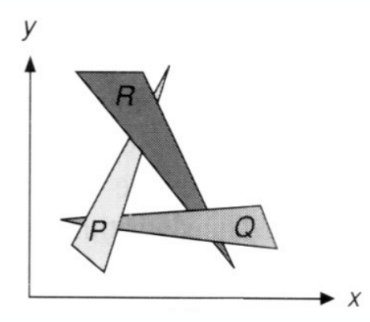
</div>

因为我们无法简单地得到各个三角形间的深度关系。为了解决这个问题，我们引入深度缓冲(Z-buffer)

### Z-buffer
既然对于每个三角形无法简单的得到远近关系，那么就直接考虑每个像素，记录在这个像素中最近的图形是哪个。

同时在这里为了简单起见，我们假设此时的 $z$ 是正的(与我们之前提到的viewing的方向不同)

在由模型生成图像时，我们要记录两组值：一组是颜色，另一组是深度。

#### Z-Buffer Example
<div align=center>
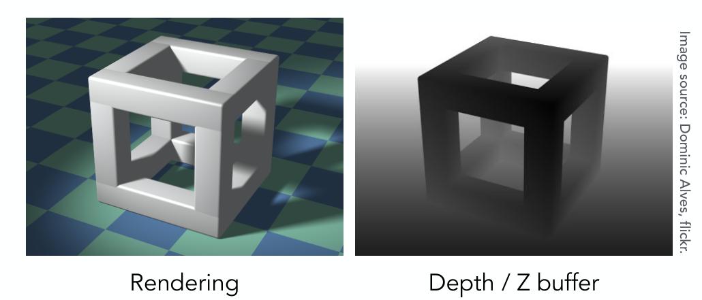
</div>

在上面这副图中，左边记录的就是颜色，而右边记录的是深度，颜色越深表示离得越近。

#### Z-Buffer Algorithm
把每个像素深度初始化为 $\infty$，在光栅化的过程中：
```c
for (each triangle T)
    for (each sample (x,y,z) in T)
        if (z < zbuffer[x,y])       // closest sample so far
        framebuffer[x,y] = rgb;     // update color
        zbuffer[x,y] = z;           // update depth
        else
        ;               // do nothing, this sample is occluded
```

算法复杂度：$O(n)$，这里假设每个三角形遮挡的像素数为 $O(1)$。因为这里没有比较排序，因此更快。

