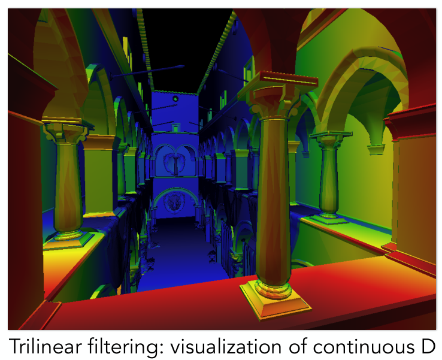

definition:The darkening or coloring of an illustration or diagram with parallel lines or a block of color.
在绘画上引入颜色和明暗的不同。

在这门课中，着色(shading)指的是对不同的物体应用不同的材质。

## Shading is Local
考虑反射模型时，我们考虑被光照射到的某一个点(shading point)。
<div align=center>

</div>

想要计算这个点在观测的相机眼中的着色情况，需要知道：
* 观测方向 $\vec{v}$
* 表面法向 $\vec{n}$
* 光照方向 $\vec{l}$(这里只考虑了某个光源)
* 表面情况，如颜色、材质……

同时需要注意着色没有考虑阴影，这是因为着色具有局部性，只会考虑光源方向，不会考虑到其他物体的遮挡情况。(shading $\neq$ shadow)

## A Simple Shading Model (Blinn-Phong Reflectance Model)
反射模型

### Perceptual Observation
<div align=center>

</div>

图中有高光、漫反射、间接光照

### Diffuse Reflection (Lambertian Shading)
漫反射就是认为当一束光线打到物体上某一个点上时，光线会被均匀地反射到各个方向。
同时需要注意，一个漫反射表面的亮度需要考虑物体表面和光线的夹角。假如 $\vec{n}$ 和 $\vec{l}$ 的夹角为 $\theta$，则光照强度与 $\theta$ 成正比。还要再考虑到点光源发出的光强度会随着距离的平方项衰减。

$$
\therefore L_{d}=k_{d}\cdot (I/r^{2})\max_{}(0,\vec{n}\cdot \vec{l})
$$

式子中 $L_{d}$ 为接收到的光强，$k_{d}$ 为漫反射的反射率。

(这只是一个经验模型，与真实的物理情形还是有所不同的)

### Specular Term
高光项，说明表面要光滑，同时观察方向和镜面反射方向要相同或相近。
<div align=center>

</div>

但是为了方便计算，我们通常并不直接计算反射光线和观察方向之间的夹角，而是计算平面的法向 $\vec{n}$ 和半程向量(half vector) $\vec{h}$ 的夹角 $\alpha$。当 $\alpha$ 较小时，就能反映出反射方向和观测方向的足够接近。

半程向量计算较为方便：
$$
\vec{h}=bisector(\vec{v},\vec{l})=\frac{\vec{v}+\vec{l}}{||\vec{v}+\vec{l}||}
$$

由此可以得到高光项的光强：
$$
L_{s}=k_s(I/r^{2})\max (0,\cos \alpha)^{p}=k_s(I /r^{2})\max (0,\vec{n}\cdot \vec{h})^{p}
$$

$k_s$ 与颜色有关，而高光一般是白色，因此这里的镜面反射系数我们就认为其是白色。这里没有像漫反射中那样考虑入射角 $\theta$ 大小的情况，这一点严谨来说是要考虑的，但是这个模型将其简化掉了，我们的关注点在于能否看见高光。公式中最后一项有一个指数 $p$，是因为如果直接使用 $\cos \alpha$ 计算的话，对于高光范围的容忍度太高了，这是不合适的，因此需要加一个 $p$ 来减小范围

<div align=center>

</div>

在布林·冯模型(Blinn-Phong Model)中，我们一般将 $p$ 取为 $100\sim 200$ 的值。
<div align=center>

</div>

这里展示了漫反射项和高光项同时作用的情形。可以看出当 $p$ 越大，高光的范围就越小。

### Ambient Term
由于环境光照项过于复杂，这里直接假设任何一个点接收到的来自环境的光是相同的，设为 $I_{a}$。

因此环境光项的光强为：
$$
L_a=k_a I_a
$$

是一个常数，也就是说环境光对颜色的影响是均匀的，同时从任何角度看都是如此。

### Blinn-Phong Reflection Model
<div align=center>

</div>

$$
L=L_a+L_{d}+L_s=k_a I_a+k_{d}(I /r^{2})\max (0,\vec{n}\cdot \vec{l})+k_s(I /r^{2})\max (0,\vec{n}\cdot \vec{h})^{p}
$$

## Shading Frequencies
着色的效果与着色频率有关。比如下图第一行，当多边形数量不是很密集的时候，较高的着色频率能带来较好的视觉效果。
<div align=center>

</div>

### Shade each triangle (flat shading)
对每个三角形着色。这种着色方式对与较为平滑的面效果不太好。

### Shade each vertex (Gouraud shading)
对于三角形的每个顶点着色，而三角形的内部则通过插值的方式补全。

#### Defining Per-Vertex Normal Vectors
那么如何求三角形顶点的法线？

最好的情形是知道这些三角形需要表示什么样的图形，然后直接求出这个图形的法线即可。但实际上这是不现实的。

因此常用的方法是对周围三角形的法线求平均。
<div align=center>

</div>

$$
N_v=\frac{\sum_{i}N_i}{||\sum_{i}N_i||}
$$

同时还可以对各个三角形的面积进行加权，得到的结果会更加准确。

### Shade each pixel (Phong shading)
对于每个像素着色。

(这里的Phong shading 和 Blinn-Phong Reflectance Model 不同，前者是着色频率，而后者是一个着色模型)

#### Defining Per-Pixel Normal Vectors
如何得到逐像素的法线？这里需要用到重心坐标。

## Graphics (Real-time Rendering) Pipeline
表示从一个场景到最后展现出来的图片中间所经历的过程。
<div align=center>

</div>

这整个操作过程在GPU中已经确定。

我们之前学习的
* MVP(Model, View, Projection transforms)就发生在Vertex Processing这个过程中；
* MSAA发生在Rasterization过程中；
* Z-Buffer发生在Fragment Processing中
* Shading(具体如何着色可以自己定义)
  * 假如是对顶点着色，则发生在Vertex Processing
  * 假如是对像素着色，则发生在Fragment Processing

Shader是可以自己实现的，是一个可编程的部分，很多语言比如OpenGL就可以实现shader的编写。shader是对每个vertex或者pixel的操作，代码中不用做for循环。
```c
uniform sampler2D myTexture; // program parameter
uniform vec3 lightDir;       // program parameter
varying vec2 uv;             // per fragment value (interp. by rasterizer)
varying vec3 norm;           // per fragment value (interp. by rasterizer)
void diffuseShader()
{
    vec3 kd;
    kd = texture2d(myTexture, uv);               // material color from texture
    kd *= clamp(dot(–lightDir, norm), 0.0, 1.0); // Lambertian shading model
    gl_FragColor = vec4(kd, 1.0);                // output fragment color
}
```

## Texture Mapping
纹理映射：希望定义任意一个点的不同属性。
<div align=center>

</div>

比如图中的地板纹路，或者是球的不同颜色，这些都会对着色时考虑的系数产生影响。

纹理映射就是将三维物体的表面映射到一个二维的平面上，这个二维的平面就称为“纹理”(texture)。
<div align=center>

</div>

比如说在这张图中，就是将三维的地球的表面投影到二维的地图上。

纹理如果设计的比较好，那么在经过重复的映射之后不会有明显的边界。

## Interpolation Across Triangles: Barycentric Coordinates
我们的很多值的计算操作是在三角形的顶点上进行的，而如果我们希望在三角形内部得到平滑的值，就需要插值。而插值需要引入重心坐标。

### Barycentric Coordinates
<div align=center>

</div>

对于三角形所在平面上任意一点，都可以用三角形的三个顶点坐标
$$
(x,y)=\alpha A+\beta B+\gamma C \quad (\alpha+\beta+\gamma=1)
$$

表示。且如果 $\alpha,\beta,\gamma>0$，可以得出所表示的点在三角形内。

三角形重心坐标可以用面积来求：
<div align=center>

</div>

也可以用公式直接算：
<div align=center>

</div>

有了重心坐标，就可以方便地对属性进行插值
<div align=center>

</div>

三角形中间某个点的参数值为
$$
V=\alpha V_{A}+\beta V_{B}+\gamma V_{C}
$$

其中 $V_{A},V_{B},V_{C}$ 可以是任意属性。比如说颜色、纹理坐标、深度……但是有一点需要注意，在投影变换下重心坐标可能会改变，因此如果我们想要插值三维空间中的属性，那么我们应该取三维空间中的重心坐标，而不能用投影之后的重心坐标。(比如说对于深度进行插值就应该这么做)

## Applying Textures
如何使用纹理？首先对于空间上一点 $(x,y)$，先将其映射到纹理 $(u,v)$ 上，从纹理上取值(比如说要取漫反射系数 $k_{d}$)，就能得到空间上那一点的漫反射系数。

### Texture Magnification(Easy Case)
解决纹理太小了怎么办的问题。比如说画面中有一堵墙，分辨率应当为4K，但是纹理只有256×256，这就会导致从画面映射到纹理时会出现分数的值。假如采用四舍五入取到某个纹理元素(texel)的方法，则会是最左边那幅图的效果
<div align=center>

</div>

这种效果不太好，所以我们希望做出一些处理。这里使用**双线性插值(Bilinear Interpolation)**。

假如使用四舍五入到整数的方法，那么下面这幅图的红点的纹理将会用离它最近的黑点的纹理表示。这就会导致原图中有好几个相邻像素的纹理值都是一样的。
<div align=center>

</div>

如果使用双线性插值
<div align=center>

</div>

首先考虑一维的情况：$lerp(x,v_0,v_1)=v_0+x(v_1-v_0)$。那么在本图中，应有：
$$
u_0=lerp(s,u_{00},u_{10})\\
u_1=lerp(s,u_{01},u_{11})\\
f(x,y)=lerp(t,u_0,u_1)
$$

最后的 $f(x,y)$ 就是双插值的结果，我们得到了红点处的纹理值。使用双线性插值得到的结果要好不少。而Bicubic使用三次插值，结果会更好。

### Texture Magnification(Hard Case)
解决纹理太大了怎么办的问题。假如纹理的分辨率要比画面高不少，同样会出现问题。比如下面这幅图，近处出现了锯齿，远处出现了摩尔纹。
<div align=center>

</div>

原因可以从这幅图中看出。在比较近的地方，一个像素覆盖的纹理区域比较小；但是在比较远的地方，一个像素覆盖了很多纹理元素，如果对那个像素仅仅取像素中间点的纹理值，显然是不合理的
<div align=center>

</div>

回忆之前抗锯齿的方法，可以采用超采样。但是这种方法会耗费更多的计算资源。因此我们希望使用另一种方式——求一个像素点覆盖的纹理区域的平均值(比如上面这幅图右边一个像素点覆盖的纹理区域的平均值)。想要又快又准的查到这些值，就需要使用Mipmap。

### Mipmap:Allowing (fast, approx., square) range queries
Mipmap就是从一张图生成一系列图。图片从第 $0$ 层开始，第 $i$ 层都是第 $i-1$ 层缩小一倍。如下图所示。
<div align=center>

</div>

也就是说，在拿到纹理之后，我们先生成这么一系列的图片，这里总共需要多占用原图的 $1/3$ 的空间。

#### Computing Mipmap Level D
既然任何一个像素都可以映射到纹理上的一个区域，那么如何知道需要查询的纹理的区域是多大？
<div align=center>

</div>

这里可以先选择一个像素，然后再考虑这个像素的邻居像素，将它们都映射到纹理上。令
$$
L=\max \left( \sqrt{\left( \frac{\mathrm{d}u}{\mathrm{d}x} \right)^{2}+\left( \frac{\mathrm{d}v}{\mathrm{d}x} \right)^{2}} ,\sqrt{\left( \frac{\mathrm{d}u}{\mathrm{d}y} \right)^{2}+\left( \frac{\mathrm{d}v}{\mathrm{d}y} \right)^{2}}\right) \quad D=\log_2 L
$$

这里的 $L$ 就可以近似纹理上区域的大小(图中粉色的区域)。也就是说我们现在已经把图片上的一个像素近似成了纹理上的一个正方形。然后为了得到图片上像素的纹理，我们需要再第 $D$ 层查询，此时查询到的纹理也恰好是平均之后得到的一个纹理元素。

使用上述方法得到的结果如下图，红色代表层数低，蓝色代表层数高
<div align=center>

</div>

但是会发现一个问题，就是层数会发生跃变。也就是第 $0$ 层旁边就直接是第 $1$ 层，没有层数的渐变。为了解决这个问题，可以进行插值。

#### Trilinear Interpolation
<div align=center>

</div>

这里指的就是，当算出 $D$ 之后，假如 $D$ 不是一个整数值，那么就需要再 $[D]$ 和 $[D]+1$ 层之间进行插值，从而得到 $D$ 层的纹理。这样得到的结果就是渐变的
<div align=center>

</div>

### Mipmap Limitations
Mipmap会导致过度模糊化
<div align=center>

</div>

#### Irregular Pixel Footprint in Texture
这是因为有些纹理映射在纹理上的形状并不规则，如果只是用正方形进行近似的话会对比较大的空间进行模糊，从而造成不太好的效果。
<div align=center>

</div>

#### Anisotropic Filtering
使用各向异性过滤可以缓解这种问题。
<div align=center>

</div>

比如说对于一个卫星的图片，我们不仅对它做等比例压缩，同时还仅在水平和竖直方向做压缩，这样就能在一定程度上解决一个像素映射到纹理上变成一个长方形的问题。但是如果映射过去是一个斜着的形状，同样还是会出问题。

<div align=center>

</div>

如果用EWA来解决，那就会把一个不规则形状拆成很多圆形来处理，然后每次查询一个圆形，这样就能解决这个问题。但是会带来更大的计算量。

## Applications of Textures
纹理可以理解为GPU上的一块内存，我们可以对这块内存进行点查询、范围查询、滤波等操作。
### Environment Map
在一个房间里，向四面八方看，在任何一个方向都会有光，如果将这些光都记录下来，就是环境贴图(Environment Map)。
<div align=center>

</div>

比如说左边这幅图中，就是来自各个方向的环境光，而右边的茶壶就会被这些环境光照亮，也就是会反射这些光。 而这些环境光就是用纹理来表示的。同时我们认为环境光来自无穷远处，所以考虑环境光时我们只记录环境光的方向信息就行。
#### Spherical Environment Map
如何将环境光用纹理表示？一种方法是将环境光记录在球体表面。
<div align=center>

</div>

但是这回导致一些问题。将球体展开为平面之后会产生扭曲(就像世界地图一样)。
#### Cube Map
为了解决这个问题，我们可以将环境光投影在立方体表面上，最后展开之后得到6个没有扭曲的面
<div align=center>

</div>

### Bump Mapping
纹理还可以来定义一个物体表面的高度起伏(或是法线方向)，这样就能影响表面的着色结果，让人看起来表面有起伏。做凹凸贴图是因为这样可以用不太复杂的三角形来描述出图形基本轮廓，而复杂的表面则用纹理解决。
<div align=center>

</div>

假如是有了高度情况求法线，假设表示高度的函数为 $h(u,v)$
$$
\begin{aligned}
\frac{\mathrm{d}p}{\mathrm{d}u}=c_1\cdot [h(u+1)-h(u)] \\
\frac{\mathrm{d}p}{\mathrm{d}v}=c_2\cdot [h(v+1)-h(v)]
\end{aligned}
$$

法线为
$$
\vec{n}=\left\| (-\frac{\mathrm{d}p}{\mathrm{d}u},-\frac{\mathrm{d}p}{\mathrm{d}v},1) \right\|_{}
$$

但由于凹凸贴图没有真正的改变表面的位置，因此效果会比位移贴图(真正将表面位置移动)差一些
<div align=center>

</div>

### 3D Textures and Volume Rendering
纹理不仅仅是贴在表面的二维图形，同时还可以是三维的，用来描述空间中一点的信息
<div align=center>

</div>