## Many Ways to Represent Geometry
表示几何有隐式和显式的方法
### “Implicit” Representations of Geometry
隐式指的是不会告诉空间中的点具体在哪，而是会说这些点满足的关系。比如说对于一个球，隐式的表示可以是 $x^{2}+y^{2}+z^{2}=1$。普遍而言，就是 $f(x,y,z)=0$。

隐式表示的缺点：不直观。比如对于 $f(x,y,z)=(2-\sqrt{x^{2}+y^{2}})^{2}+z^{2}-1$，我们并不能直观的看出哪些点在 $f(x,y,z)=0$ 上。但如果将其画出来，形状还是比较简单的

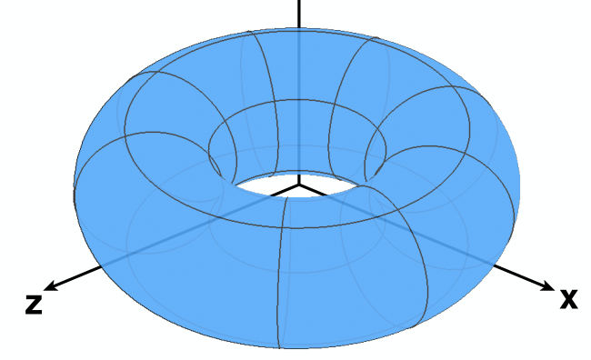

优点：判断某个点和几何形体的关系比较简答。比如想判断点 $(\frac{3}{4},\frac{1}{2},\frac{1}{4})$ 是否在 $f(x,y,z)=x^{2}+y^{2}+z^{2}-1=0$ 内，可以直接将该点代入，有 $f(x,y,z)=-\frac{1}{8}<0$，因此在里面。

### “Explicit” Representations of Geometry
最直观的显示表达方法就是之前提到的用三角形的表示方法。同时还有一种不那么直观，但同样是显示的方法，就是通过参数映射来定义表面。普遍而言，就是 $f:\mathbb{R}^{2}\rightarrow \mathbb{R}^{3};(u,v)\rightarrow (x,y,z)$。

比如说，给定 $f(u,v)=((2+\cos u)\cos v,(2+\cos u)\sin v,\sin u)$，就是一种显示的表示，表示的同样是上面那张圆环图片。只要遍历 $u$ 和 $v$，就能遍历几何形体上的所有点。

但是显式的就不容易判断一个点是否在几何图形内。

## More Implicit Representations in Computer Graphics
### Algebraic Surfaces (Implicit)
直接用数学公式表示(就是之前举的隐式的例子)。对于稍微复杂一些的图形会很难表示。
### Constructive Solid Geometry (Implicit)
用基本几何的布尔运算来表示更复杂一点的几何形体

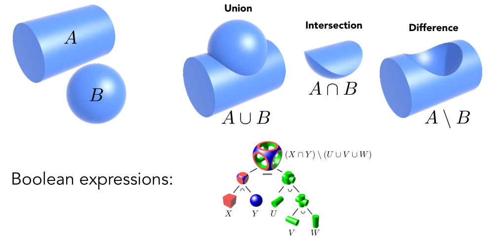

### Distance Functions (Implicit)
可以使用距离函数对两个表面进行blend操作。

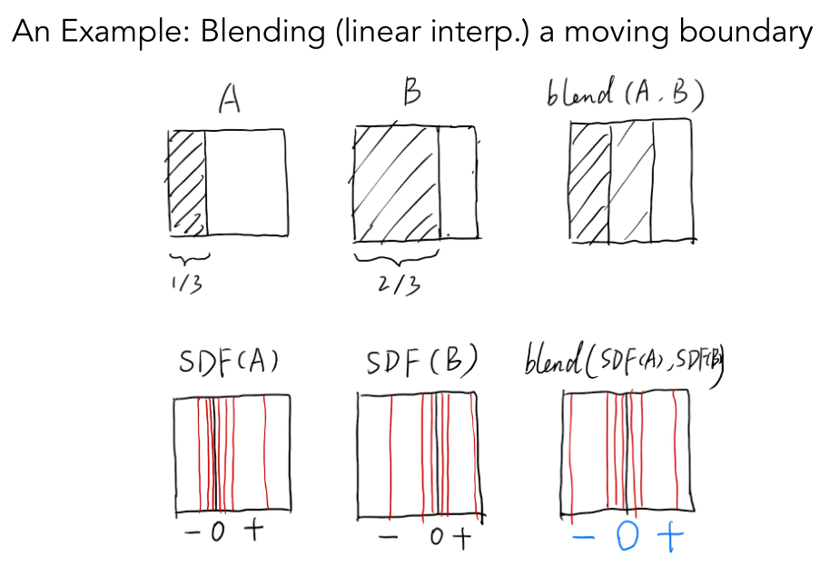

像第一行那样，假如直接对两幅图做blend，那么会得到左边黑，中间灰，右边白的结果，而不是一个运动的中间结果。因此我们先求出一个有向的距离函数(这里是一个点到边界的最短距离，外侧为正，内测为负)，然后对这两个距离函数做blend，然后就会得到一个中间状态的距离函数，将该距离函数恢复成形状，就是我们想要的中间状态。
#### Level Set Methods (Also implicit)
那么如何从距离函数中重新恢复形状，得到物体表面？假如是有一个解析的函数，令 $f(x)=0$ 即可。但如果解析的形式不太好得到，可以使用水平集(类似于等高线)。就是将距离函数在各个格子中的值写出来，最后就能画出距离为 $0$ 的一条曲线，就是表面

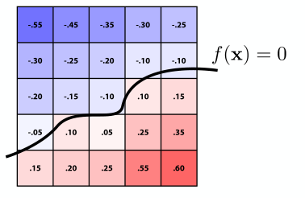

### Fractals (Implicit)
分形(自相似)。类似于算法中的递归。

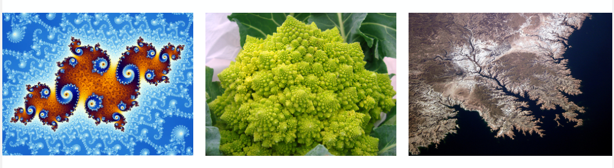

### Implicit Representations - Pros & Cons
优点
* 表示简短，方便存储
* 方便判断一个点是否在图形内
* 方便计算和光线相交关系
* 对于简单的模型，能够很简单的描述
* 比较容易变换拓扑结构

缺点：
* 不方便表示特别复杂的图形

## Explicit Representations in Computer Graphics
### Point Cloud (Explicit)
最简单的表示方法：表示出一堆点来，只要点和点之间足够密，就能得到想要的几何图形。因此理论上点云可以表示任意的几何形体。

在三维空间做扫面，输出一般就是点云。而将点云转化为三角形则需要一定的算法。

### Polygon Mesh (Explicit)
在图形学中运用的最为广泛。

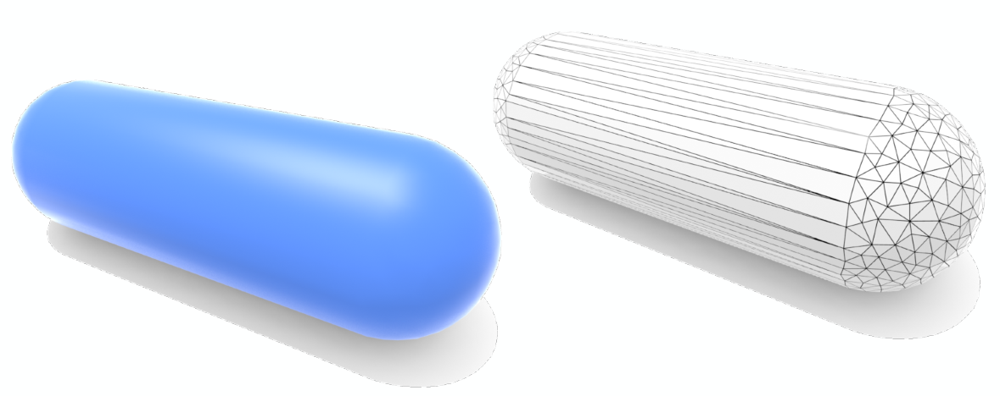

#### The Wavefront Object File (.obj) Format
如何用多边形来表示图形。通常将数据放在文本文件.obj中，一个文件存储一个物体。

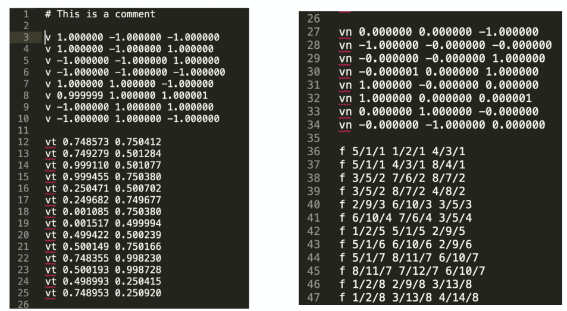

这个文件存储的是一个立方体。图中的v存储点，vn定义的是法线，vt定义的是纹理坐标，最后的f(face)则表示由哪三个点构成一个三角形。其中第一个数字选取一个点，第二个数字表示选择第几个纹理坐标，第三个数字表示选取第几个法线。

比如说 `f 5/1/1 1/2/1 4/3/1` 就表示需要连接5，1，4这三个点，使用第1，2，3个纹理，以及三个点都是用第1个法线。

## Curves
### Bézier Curves
贝塞尔曲线是需要用一系列控制点来定义一条曲线。曲线需要满足性质：起点和终点分别在 $p_0$ 和 $p_3$ 上，同时切线也需要分别为 $p_0p_1$ 和 $p_2p_3$。

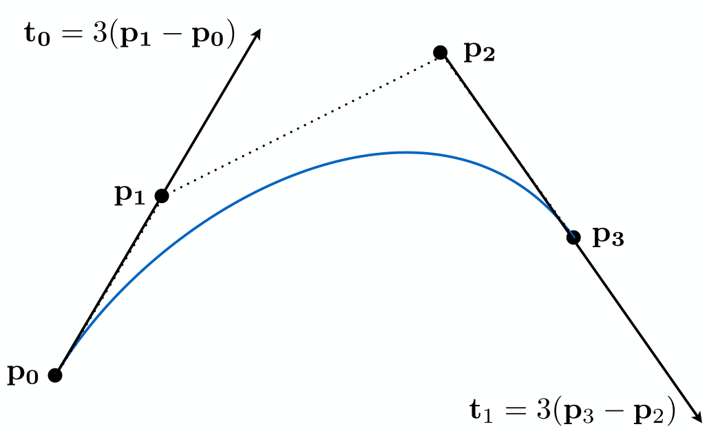

#### Evaluating Bézier Curves (de Casteljau Algorithm)
现在考虑给定一系列任意多个(大于等于三个)控制点，如何画出贝塞尔曲线。

首先考虑三个控制点的情况(此时做出的曲线叫二次贝塞尔曲线 quadratic Bezier)。给定参数 $t\in [0,1]$，对于任意的 $t$，在图像上我们令 $b_0b_0^{1}=t\cdot b_0b_1$，$b_1b_1^{1}=t\cdot b_1b_2$，$b_0^{1}b_0^{2}=t\cdot b_0^{1}b_1^{1}$，最终如图所示得到的 $b_0^{2}$ 点就是贝塞尔曲线的轨迹。

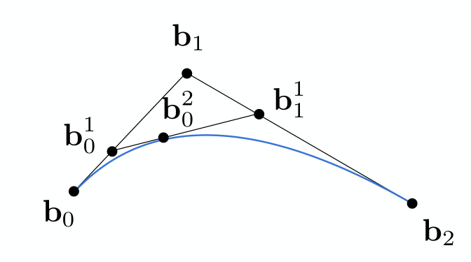

对于四个控制点的情形也是类似的

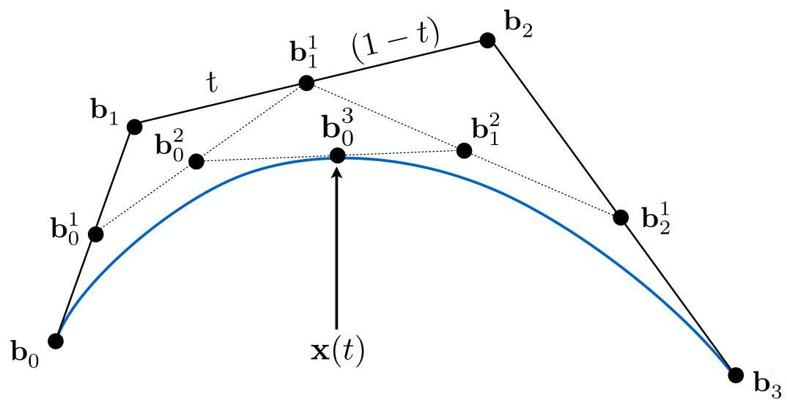

对于更多个控制点，递归操纵即可。

#### Evaluating Bézier Curves Algebraic Formula
首先还是考虑三个控制点的情形
$$
\begin{aligned}
b_0^{1}(t)&=(1-t)b_0+tb_1 \\
b_1^{1}(t)&=(1-t)b_1+tb_2 \\
b_0^{2}(t)&=(1-t)b_0^{1}+tb_1^{1} \\
\Rightarrow b_0^{2}(t)&=(1-t)^{2}b_0+2t(1-t)b_1+t^{2}b_2
\end{aligned}
$$

通过观察以及数学归纳法不难得出
$$
b^{n}(t)=b_0^{n}(t)=\sum_{j=0}^{n}b_j B_j^{n}(t)
$$

其中 $B_j^{n}(t)$ 为伯恩斯坦分布(Bernstein polynomial)
$$
B_i^{n}(t)= {n \choose i}t ^{i}(1-t)^{n-i}
$$

控制点不仅可以是二维的，也可以是三维的。

#### Properties of Bézier Curves
* 对于插值的端点，有
$$
b(0)=b_0\quad b(1)=b_n
$$
* 对于两端的切线，有
  $$
  b'(0)=n(b_1-b_0) \quad b'(1)=n(b_{n}-b_{n-1})
  $$
* 仿射变换(Affine transformation)性质：
  直接对贝塞尔曲线做仿射变换 $=$ 对曲线的控制点做仿射变换再插值得到贝塞尔曲线
* 凸包(Convex hull)性质
  * 凸包指的是能够包围一系列给定的几何形体的最小凸多边形
    

    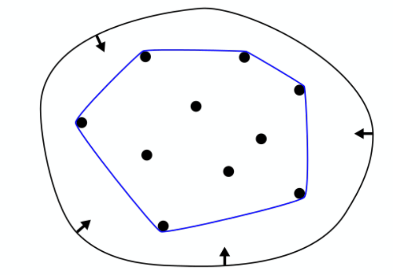
    

  * 贝塞尔曲线在控制点形成的凸包内

### Piecewise Bézier Curves
如果控制点太多，贝塞尔曲线会趋于平滑，就难以用控制点直观地控制曲线

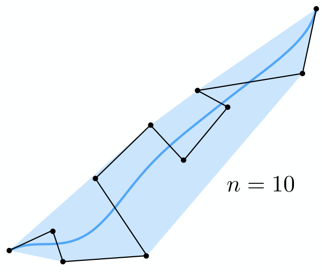

因此可以引入逐段控制的贝塞尔曲线。通常让每4个控制点定义一段贝塞尔曲线。

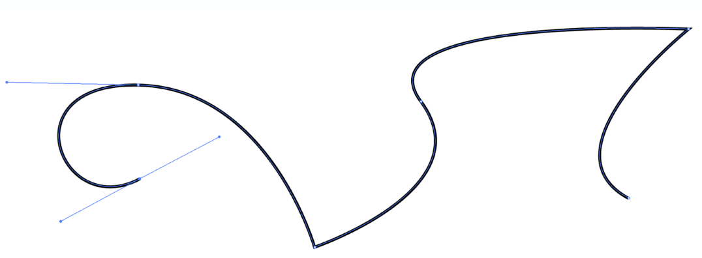

#### Continuity
* $C^{0}$ 连续(线段连续)：$a_n=b_0$
* $C^{1}$ 连续(切线连续)：$a_n=b_0=1 /2(a_{n-1}+b_1)$

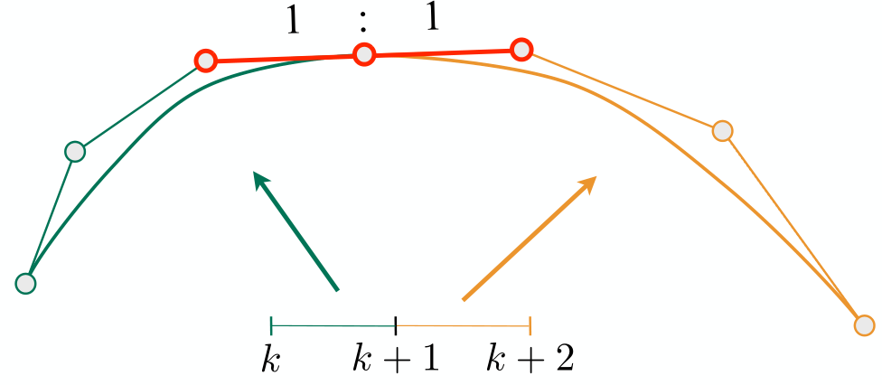

### Other types of splines
样条(splines)指的是一段能够经过若干指定点并且具有一定阶数连续导数的曲线。

B样条(B-splines)是一种比较常用的样条
* 是基样条的缩写(basis splines)
* 和贝塞尔曲线相比需要更多信息，相当于贝塞尔曲线的扩展
* 满足贝塞尔曲线的所有重要性质

## Surfaces
### Bézier Surfaces
以有4×4个控制点的贝塞尔曲面为例

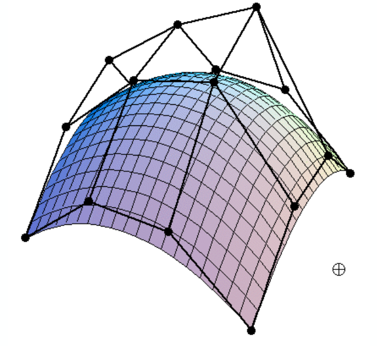

16个控制点会分成4组，每组4个控制点先成贝塞尔曲线；然后再考虑这4条贝塞尔曲线上的点，用来形成另一个方向的曲线，遍历所有点就能形成曲面(就是控制坐标 $u$ 从 $0$ 到 $1$，得到 $v$ 方向的无数条贝塞尔曲线)

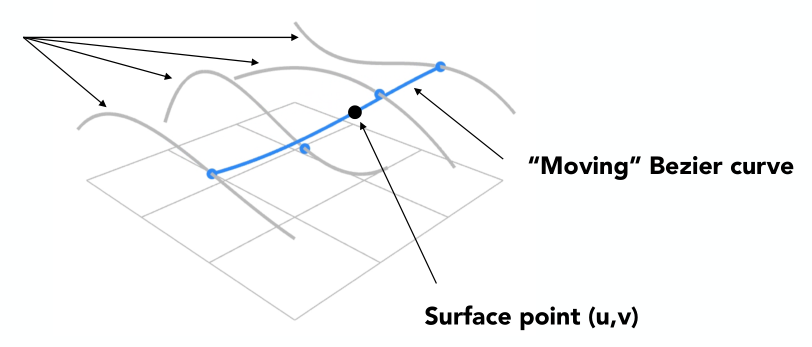

### Mesh Operations
• Mesh subdivision(upsampling)
• Mesh simplification(downsampling)
• Mesh regularization(same #triangles)

### Subdivision
#### Loop Subdivision
将原来的一个三角形划分成4个

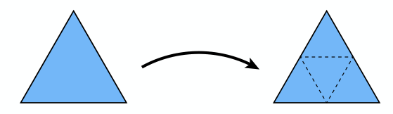

* 对于新产生的点：

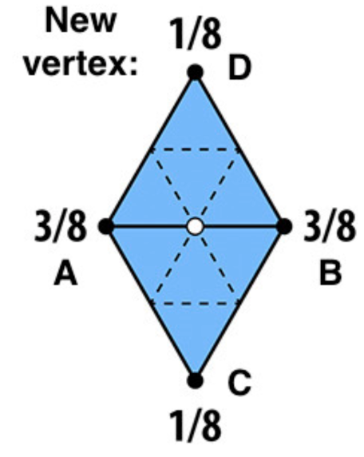

将该点的坐标设置为 $3/8\cdot (A+B)+1 /8\cdot (C+D)$

* 而对于原来就有的点，同样要修正一下位置：

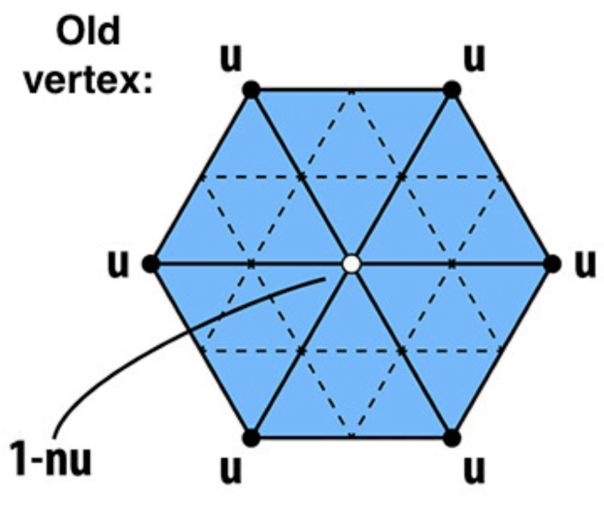

新的点的位置变为
$$
(1-n\cdot u)\cdot original\_position+u\cdot neighbor\_position\_sum
$$

其中 $n$ 为顶点的度，而
$$
u=\begin{cases}
  \frac{3}{16} \quad n=3\\ 
  \frac{3}{8n} \quad o.w.
\end{cases}
$$

#### Catmull-Clark Subdivision (General Mesh)
之前的loop细分只能处理所有网格(mesh)都是三角形的情况，如果网格可以是任意形状，那么就需要用到Catmull-Clark细分。

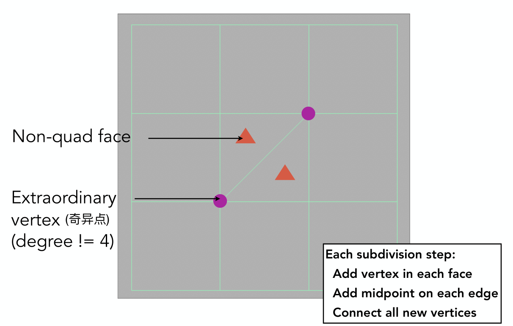

在Catmull-Clark细分中，我们将网格分为四边形(quad face)和非四边形(non-quad face)；同时将顶点(vertex)分为奇异点(extraordinary vertex)和非奇异点，其中奇异点指的是度不为4的顶点。

然后我们找到原来网格的中心和边的中点来做细分

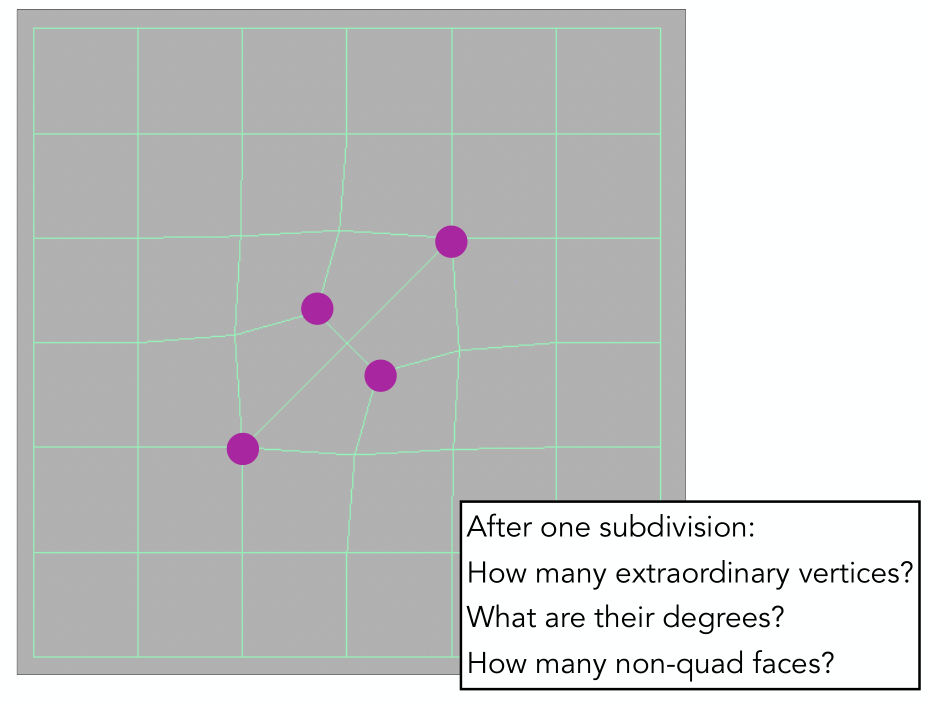

经过一次细分后我们发现所有非四边形现在都变成了四边形；同时原来非四边形的数量就是奇异点增加的数量。

各个顶点的调整方式如下：
* 一个面中心的点(face point)
  

  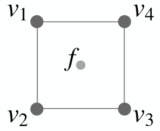
  

  $$
  f=\frac{v_1+v_2+v_3+v_4}{4}
  $$
* 一条边中心的点(edge point)
  

  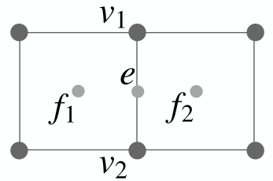
  

  $$
  e=\frac{v_1+v_2+f_1+f_2}{4}
  $$

* 原来的点(vertex point)
  

  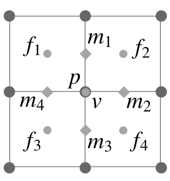
  

$$
v=\frac{f_1+f_2+f_3+f_4+2(m_1+m_2+m_3+m_4)+4p}{16}
$$

### Mesh Simplification
目标是减小三角形的数量，同时保持基本的形状。这里我们通过坍缩边(edge collapsing)的方式进行简化。

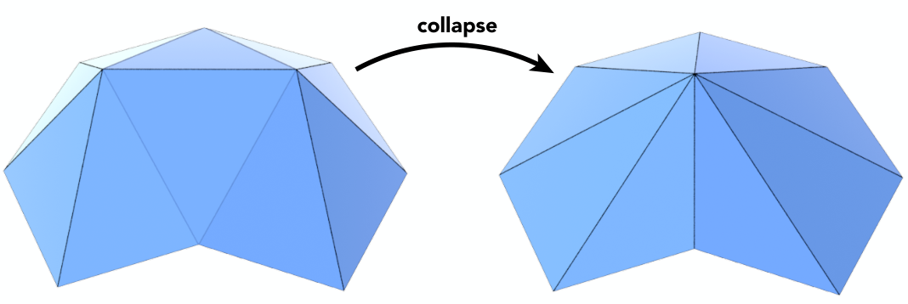

#### Quadric Error Metrics
这里需要引入二次误差度量。比如在下图中，我们就需要控制新产生的点的位置让和原来图形的二次误差最小

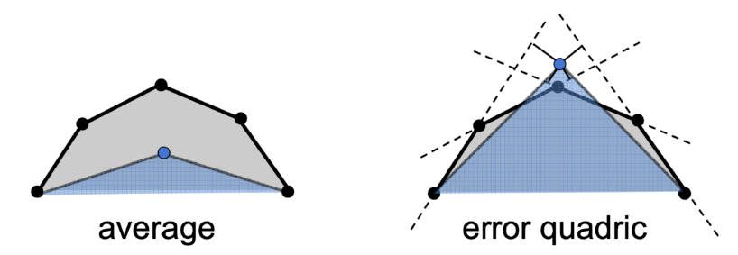

#### Quadric Error of Edge Collapse
在简化网格的过程中，我们通过坍缩边得到新的点，那么就需要让新的点的位置使得面的二次误差最小。对于整个模型而言，我们可以先计算坍缩了某条边之后得到的最小误差，然后取所有边中最小误差最小的，然后进行坍缩。

这里需要注意，坍缩了一条边之后，有些边会跟着变化，即坍缩了一条边之后会影响其他边的最小二次误差。这时就需要一个最小堆作为数据结构存储，不仅能方便地取到最小值，同时也能动态更新变化的边。

这种算法是一个贪心算法，虽然不能保证全局最优解，但是能保证大多数情况下都比较实用。