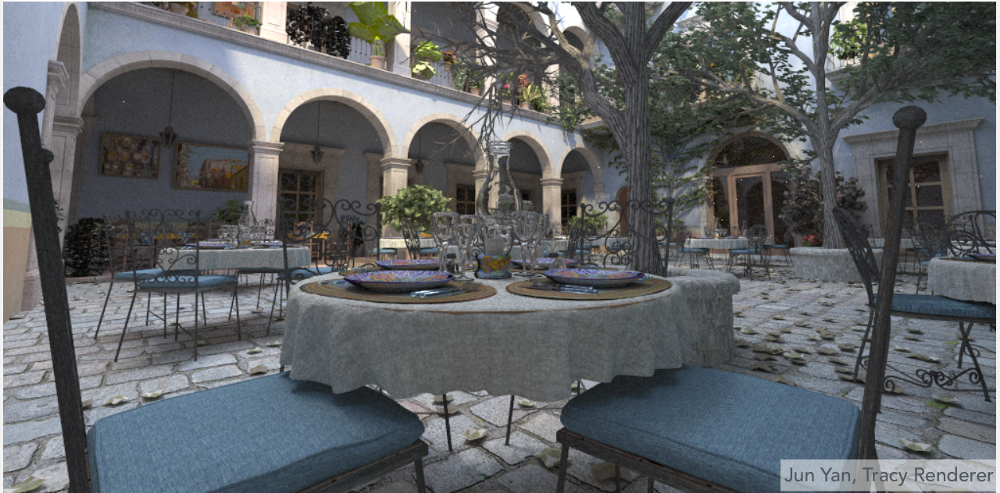

## Why Ray Tracing?
光栅化不能很好的展现某些会受到全局影响的性质。比如说图像的阴影，物体的模糊反射，间接光照。尤其是对于光线多次弹射的情形，光栅化效果并不好。
<div align=center>

</div>

通常而言，我们认为光栅化是一种比较快，但是效果并不是很好(比较近似)的算法。而光线追踪则比较精确，渲染质量高，但是生成过程会比较慢。所以光栅化通常是实时的，而光线追踪很多时候是离线的。

## Basic Ray-Tracing Algorithm(Whitted-Style Ray Tracing)
### Light Rays
图形学中对光线的假设：
* 光线沿直线传播
* 光线之间不会相互影响
* 光线从光源传播到眼睛，光线可逆(所以可以等价的认为眼睛可以发出光，一直对应到光源)

### Ray Casting
光线投射就是对每个像素，从相机引出一条光线射到物体上，然后判断物体上的点是否被光源照到。
<div align=center>

</div>

提到光线追踪时，我们默认眼睛是一个针孔摄像机(不考虑镜头的大小)，光源则认为是点光源，光源照射到物体上是认为发生完美的反射或折射。
<div align=center>

</div>

### Recursive (Whitted-Style) Ray Tracing
我们在上面讨论的还是光线只反射一次的情形，而要考虑光线多次反射折射，则需使用Whitted-Style光线追踪。

这是最早通过光线追踪得到的一个例子。从图中看出光线追踪对阴影的表示还是较好的。
<div align=center>

</div>

我们依然假设光从眼睛中发出，通过一个像素。当光与第一个物体相交时，我们考虑反射光线与折射光线，而这些反射和折射光线会和其他物体再相交。同时在考虑着色时，我们对每一个与场景中物体的交点(就是下图中的那几个黑点)都要考虑其着色情况，这些着色值最终都将对像素产生影响。当然在实际的计算中需要考虑光线传播时光强的衰减情况。

我们在这里对不同类型的光线做一个简单的归类：从眼睛射出的光线称为primary ray，而经过弹射的光线都成为secondary ray，从光源连出以确定可见性的称为shadow ray。
<div align=center>

</div>

## Ray-Surface Intersection
### Ray Equation
在图形学中，我们用光线的发出点 $\bm{o}$ 和方向 $\bm{d}$ 来定义光线，而光线的方程则写成
$$
\bm{r}(t)=\bm{o}+t \bm{d} \quad 0\le t<\infty
$$

### Ray Intersection With Implicit Surface
在求光线与一个曲面的交点时，如果曲面用隐式表示法表示，那么直接代入即可。比如对于一个球体的方程：
$$
\bm{p}:(\bm{p}-\bm{c})^{2}-R^{2}=0
$$

其中 $\bm{c}$ 为球心。则联立光线与球体的方程，得到
$$
(\bm{o}+t\bm{d}-\bm{c})^{2}-R^{2}=0
$$

即可求出 $t$，从而得到交点。

对于一种一般的情况：
$$
\bm{p}:f(\bm{p})=0
$$

同样代入得到
$$
f(\bm{o}+t \bm{d})=0
$$

进行数值求解即可。

### Ray Intersection With Triangle Mesh
图形学中的许多物体实际上使用三角形表示的，因此计算光线和三角形网格求交非常重要。

一种最简单的判断光线和物体交点的方法就是遍历组成物体的所有三角形，考虑它们是有交点，然后取最近的交点即可。这种方法虽然思路简单，但是计算量非常大。

#### Ray Intersection With Triangle
但是我们还是先来考虑如何求光线与三角形的交点。

我们将光线和三角形求交分解为两个问题：
* 光线和平面求交
* 交点是否在三角形内(我们在之前已经考虑过了如何判断一个点是否在三角形内的方法)

#### Ray Intersection With Plane
而定义一个平面需要一个平面上的点和一条法向量。
<div align=center>

</div>

平面的方程为
$$
\bm{p}:(\bm{p}-\bm{p'})\cdot \bm{N}=0 \quad \Rightarrow ax+by+cz+d=0
$$

代入光线的方程，有
$$
(\bm{o}+t \bm{d}-\bm{p'})\cdot \bm{N}=0 \Rightarrow t=\frac{(\bm{p'}-\bm{o})\cdot \bm{N}}{\bm{d}\cdot \bm{N}}
$$

然后检查是否有 $0\le t<\infty$ 即可。最后就能得到光线和平面的交点。

#### Möller Trumbore Algorithm
除了先计算交点再判断交点是否在三角形内，还有算法能一次直接解出光线和三角形的交点。这就是Möller Trumbore算法。

该算法利用了三角形的重心坐标
$$
\bm{O}+t \bm{D}=(1-b_1-b_2)\bm{P_0}+b_1 \bm{P_1}+b_2 \bm{P_2}
$$

如果解得 $0<b_1,b_2,(1-b_1-b_2)<1$，那么光线就和三角形有交点。而为了解出 $t,b_1,b_2$，我们看出上述式子恰好给出了三个方程，因此可以解得：
$$
\begin{pmatrix} 
    t \\ b_1 \\b_2 
\end{pmatrix} =
\frac{1}{\bm{S_1}\cdot \bm{E_1}}
\begin{pmatrix} 
    \bm{S_2}\cdot \bm{E_2} \\ \bm{S_1}\cdot \bm{S} \\ \bm{S_2}\cdot \bm{D} 
\end{pmatrix} 
$$

其中
$$
\bm{E_1}=\bm{P_1}-\bm{P_0} \quad \bm{E_2}=\bm{P_2}-\bm{P_0} \\
\bm{S}=\bm{O}-\bm{P_0} \quad \bm{S_1}=\bm{D}\times \bm{E_2}\quad \bm{S_2}=\bm{S}\times \bm{E_1}
$$

### Accelerating Ray-Surface Intersection
用上面提到的方法固然可以求出光线和物体相交情况，但是对于比较复杂的物体而言，这种操作计算量太大，是不现实的，因此需要能加速的方法。

#### Bounding Volumes
使用包围盒(Bounding Box)将物体包围起来，如果光线不和这个包围盒相交，那么必然不会和物体相交。使用这种方法能够减小不少计算量。
<div align=center>

</div>

Bounding Volumes可能是各种简单形状，而在三维空间中我们最常用的就是轴对齐(Axis-Aligned)的长方体，即各条棱都与坐标轴平行。这里的长方体，我们将其视作三对平面为成的空间。
<div align=center>

</div>

这里使用轴对齐的长方体是为了减小计算量。对于一个一般的平面，计算交点的公式为 $t=\frac{(\bm{p'}-\bm{o})\cdot \bm{N}}{\bm{d}\cdot \bm{N}}$，而如果这个平面的法线和 $x$ 轴平行，则公式为 $t=\frac{\bm{p_{x}'}-\bm{o_{x}}}{\bm{d_{x}}}$


#### Ray Intersection with Axis-Aligned Box
然后需要考虑光线如何与包围盒求交。首先我们做一个简化，考虑二维的情形。

我们首先考虑 $x_0$ 和 $x_1$ 形成的对面，这两个面和光线的交点对应的 $t$ 为 $t_{\min}$ 和 $t_{\max}$，而对 $y_0$ 与 $y_1$ 形成的对面同样以这种方式考虑。然后取 $\max \left\{ t_{\min} \right\}$ 和 $\min\left\{ t_{\max} \right\}$，就能得到光线进入和离开包围盒的时间。
<div align=center>

</div>

那么类推到三维情形，对于三对平面，我们能算出三对 $t_{\min}$ 和 $t_{\max}$，取
$$
t_{enter}=\max\left\{ t_{\min} \right\}, t_{exit}=\min\left\{ t_{\max} \right\}
$$

* 若 $t_{enter}<t_{exit}$ 且 $t_{exit}>0$，则光线和包围盒有交点。
* 若 $t_{enter}<0$ 且 $t_{exit}\ge 0$，则光源在盒子内。


### Accelerating:Uniform Spatial Partitions (Grids)
#### Preprocess – Build Acceleration Grid
我们认为光线和包围盒求交计算的速度非常快，而与物体求交计算速度则比较慢。

首先我们找到一个包围盒之后，想要求出光线和包围盒中的物体的相交情况，因为直接求光线和物体相交是比较慢的，所以我们先对场景做预处理。我们将包围盒分成很多均匀的格子(grid)，并找出哪些格子会包含物体，然后考虑光线射入，先看光线会通过哪些格子，假如通过的某个格子恰好包含了物体，那么就计算光线是否会和这个物体相交。
<div align=center>

</div>

#### Grid Resolution?
如果不做划分，那么相当于没有加速；但是如果做了太多的划分，会导致需要计算非常多次光线与盒子求交，同样会影响速度。因此需要找到一个比较合适的划分大小。

根据经验公式，应该有
$$
\#cells = C * \# objs
$$

其中在三维情况下， $C\thickapprox 27$。#cell是格子的数量，而#objs是包围盒中物体的数量。
#### When Uniform Grids Work and When Fail
如果物体在场景中分布比较均匀，效果就比较好。
<div align=center>

</div>
但是如果场景中空的部分比较多，物体分布不均匀，就会出现"teapot in stadium" problem，那光线就必须经过非常多的格子才能和物体相交。
<div align=center>

</div>

### Accelerating:Spatial Partitions
由teapot in stadium problem，我们知道直接将空间划分成等大小的格子是不合适的，因此需要引入空间划分，在比较空旷的地方用较大的格子，物体密集的地方则用较小的。

#### Spatial Pratitioning Example
<div align=center>

</div>

Oct-Tree指的是八叉树，即将每个立方体都均匀划分成8个立方体(这里是二维图形，所以切成4块)，划分终止的依据为划分到的格子为空或者其中物体数量足够少。但是这种方法并不常用，因为当维度较高时划分的数量会指数级增加。

KD-Tree与八叉树相似，但是每次只将一个格子分成两部分，划分的顺序为水平-竖直-水平-竖直，保证划分较为均匀。

BSP-Tree是将空间二分，划分的方法是每次选一个方向，但可以是斜着的。BSP-Tree的问题主要在于划分的平面不与坐标轴垂直，因此不好计算。

#### KD-Tree Pre-Processing
<div align=center>

</div>

将空间划分成kd-tree的加速结构，信息用树来存储

叶子节点存储：几何形体的信息
中间节点存储：
* 划分的方向 x-,y-,或者z-
* 划分的位置(不一定是在正中间)
* 两个子节点指向划分开的两半

#### Travering a KD-Tree
<div align=center>

</div>

想要利用KD-Tree的结构加速图形求交，首先考虑中间节点，比如先判断光线与包围盒A是否有交点：如果有的话，那么光线和A的子节点1和B都有可能有交点；如果没有则无需继续考虑。对于树上的叶子节点且该包围盒与光线相交，比如1，我们就直接考虑光线与1中所有物体求交。

但是KD-Tree存在一些问题，比如不方便判定一个AABB的盒子与物体是否有交集；以及一个物体可能在很多包围盒内，需要被存储和计算多次。

### Accelerating:Object Partitions & Bounding Volume Hierarchy (BVH)
通过划分物体得到的加速结构，这种结构如今在图形学中得到了非常广泛的应用。

<div align=center>

</div>

该方法可以省去三角形和包围盒求交的过程，同时一个物体也不会在多个包围盒中。而产生的新的问题就是划分的空间会有重叠。

#### Building BVHs
划分的步骤为：
* 找到一个包围盒
* 将包围盒中的物体分为两个部分
  * 找最长的轴做划分
  * 划分时取中间的三角形(用重心表示三角形位置)
* 重新计算这两个部分的包围盒
* 当包围盒中的物体足够少时停止划分

最后物体的信息同样存在叶子节点中。
#### BVH Traversal
和KD-Tree相似
```c
Intersect(Ray ray, BVH node) {
    if (ray misses node.bbox) return;

    if (node is a leaf node)
        test intersection with all objs;
        return closest intersection;

    hit1 = Intersect(ray, node.child1);
    hit2 = Intersect(ray, node.child2);

    return the closer of hit1, hit2;
}
```
<div align=center>

</div>
