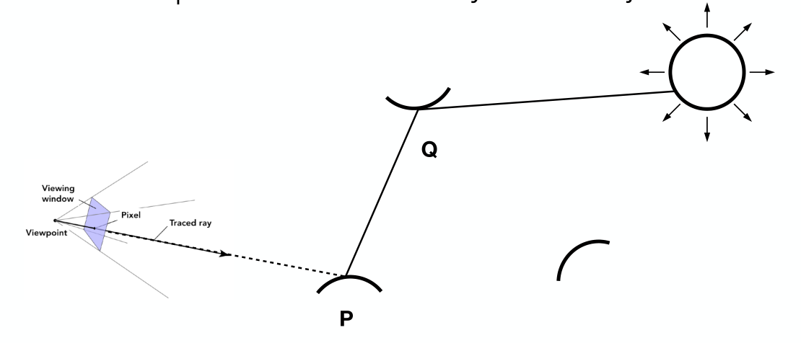

## Basic Radiometry
### Motivation
Blinn-Phong模型中，有一个量为光照强度 $I$，我们需要探究这个光照强度的物理意义。同时Whitted-Style渲染出来的场景因为做了非常多的简化，比如实际物体反射的光强有分布，折射时还要考虑折射光线和反射光线能量比。这些问题导致这种方法渲染出来的场景不够真实。

而辐射度量学有助于精确的描述光与物体表面的作用，能够得到更加正确的结果。

### Radiometry
关于如何在物理上准确描述光照，同时仍然基于几何光学，不考虑光的波动性。

给了光一系列空间中的属性(Radiant flux, intensity, irradiance, radiance)

### Radiant Energy and Flux (Power)
Radiant energy：电磁辐射的能量，单位为 $J$，记为 $Q$。
Radient flux(power)：单位时间发射、反射或接收的能量，单位为 $W$，记为 $\Phi$。在光学中，我们通常用 $lm$ (流明)描述光源亮度，流明数与功率相关。

### Radiant Intensity
radiant (luminous) intensity：指的是点光源发出的单位时间通过单位立体角(solid angle)的功率。
(这里相当于在描述辐射能量在各个方向上的分布。)
$$
I(\omega)\equiv \frac{\mathrm{d}\Phi}{\mathrm{d}\omega}
$$

单位为 
$$
\left[ \frac{W}{sr} \right] \quad \left[ \frac{lm}{sr}=cd \right]
$$

$\omega$ 在这里表示三维空间中的方向
<div align=center>

</div>

### Irradiance
Irradiance：物体表面上单位面积接收的功率
$$
E(x)\equiv \frac{\mathrm{d}\Phi(x)}{\mathrm{d}A}
$$

单位为
$$
\left[ \frac{W}{m^{2}} \right] \quad \left[ \frac{lm}{m^{2}}=lux \right]
$$

#### Lambert’s Cosine Law
考虑irradiance的时候需要注意接收光线的面和光线的夹角之间的关系。
<div align=center>

</div>

### Radiance
是为了描述光线的属性，这个概念与图形学中光线追踪紧密相关。
Radiance：指的是一个表面单位立体角单位投影面积发射、反射或接收的功率。
<div align=center>

</div>

$$
L(p,\omega)\equiv \frac{\mathrm{d}^{2}\Phi(p,\omega)}{\mathrm{d}\omega \mathrm{d}A \cos \theta}
$$

单位为
$$
\left[ \frac{W}{sr\cdot m^{2}} \right] \quad \left[\frac{cd}{m^{2}}= \frac{lm}{sr\cdot m^{2}} = nit \right]
$$

比较radiance和irradiance和intensity的定义，可以认为radiance是单位立体角的irradiance或者单位投影面积的intensity。

#### Incident Radiance
Incident radiance可以认为是到达物体表面的单位立体角的irradiance。
$$
L(p,\omega)=\frac{\mathrm{d}E(p)}{\mathrm{d}\omega \cos \theta}
$$

#### Exiting Radiance
Exiting radiance 可以认为是从表面发射的单位投影面积的intensity
$$
L(p,\omega)=\frac{\mathrm{d}I(p,\omega)}{\mathrm{d}A \cos \theta}
$$

#### Irradiance vs. Radiance
irradiance和radiance都是图形学中非常重要的概念。irradiance可以认为是一个小的范围 $\mathrm{d}A$ 接收到的总功率，而radiance是这个小范围从方向 $\mathrm{d}\omega$ 接收到的功率。
<div align=center>

</div>

$$
\begin{aligned}
\mathrm{d}E(p,\omega) &= L_i(p,\omega)\cos \theta \mathrm{d}\omega \\
E(p) &= \int_{H^{2}}L_i(p,\omega)\cos \theta \mathrm{d}\omega
\end{aligned}
$$

## Bidirectional Reflectance Distribution Function (BRDF)
### Reflection at a Point
对于反射模型，我们可以认为是某个小的面积 $\mathrm{d}A$ 接收了能量，然后再发出能量。因此在考虑反射时，我们考虑光从某个方向 $\omega_{i}$ 入射，然后从某个方向 $\omega_{j}$ 出射

<div align=center>

</div>

对于入射，我们考虑某个小的面积在某个方向接收到的irradiance
$$
\mathrm{d}E(\omega_i)=L(\omega_i)\cos \theta_i \mathrm{d}\omega_i
$$

然后我们想知道出射的radiance $\mathrm{d}L_r(\omega_r)$ 和上面的irradiance有什么关系。这时就需要一个函数来描述，这个函数就是BRDF。

<div align=center>

</div>


该函数记作
$$
f_r(\omega_i\rightarrow \omega_r)=\frac{\mathrm{d}L_r(\omega_r)}{\mathrm{d}E_i(\omega_i)}=\frac{\mathrm{d}L_r(\omega_r)}{L_i(\omega_i)\cos \theta_i \mathrm{d}\omega_i}
$$

因此想要知道某个出射方向的irradiance，只需要将入射光线方向对立体角积分
$$
L_r(p,\omega_r)=\int_{H^{2}}f_r(p,\omega_i\rightarrow \omega_r)L_i(p,\omega_i)\cos \theta_i \mathrm{d}\omega_i
$$

BRDF既然描述了出射光线和入射光线的关系，那么物体的材质其实也就是由它来描述。

### The Rendering Equation
在之前使用BRDF得到的反射方程的基础上加上那个点的发光情况，就能得到渲染方程
$$
L_o(p,\omega_o)=L_e(p,\omega_o)+\int_{\Omega^{+}}L_i(p,\omega_i)f_r(p,\omega_i,\omega_o)(n\cdot \omega_i)\mathrm{d}\omega_i
$$

这里用 $o$ 表示出射方向，同时所有向量默认方向朝外(所以可以用 $n\cdot \omega_i$ 代替 $\cos \theta_i$)

### Challenge: Recursive Equation
考虑到光是会多次反射的，因此在某个点的出射radiance也会成为其他点的irradiance，这就导致了一个递归计算的问题
<div align=center>

</div>

这里我们考虑各个反射光线相互作用的关系
$$
L_r(x,\omega_r)=L_e(x,\omega_r)+\int_{\Omega}L_r(x',-\omega_i)f(x,\omega_i,\omega_r)\cos \theta_i \mathrm{d}\omega_i
$$

然后在数学上简化上式，将式子的最后面视为kernel $K(u,v)$
$$
l(u)=e(u)+\int l(v) K(u,v)\mathrm{d}V
$$

然后再将后面的积分写成算子 $\mathcal{K}$
$$
L=E+\mathcal{K}L
$$

其中 $L$ 是我们想算的反射能量。我们如果将 $L$ 想象成，则 $\mathcal{K}$ 的作用方式就类似于一个矩阵
$$
\begin{aligned}
\mathcal{I}L-\mathcal{K}L&=E \\
(\mathcal{I}-\mathcal{K})L&=E \\
\Rightarrow L&=(\mathcal{I}-\mathcal{K})^{-1}E
\end{aligned}
$$

再利用泰勒展开
$$
\begin{aligned}
L&=(\mathcal{I}+\mathcal{K}+\mathcal{K^{2}}+ \cdots )E \\
&=E+\mathcal{K}E+\mathcal{K^{2}}E+ \cdots 
\end{aligned}
$$

就得到了 $L$ 的表达式。对于该表达式的理解，$E$ 可以看作是如果只考虑光源，不考虑反射，我们看到的；而 $\mathcal{K}E$ 是直接反射的效果；$\mathcal{K^{2}}E$ 是间接反射的效果；$\mathcal{K^{3}}E$ 则是考虑三次反射再到达眼睛的结果……

如果考虑光源直接光照加上所有反射，就是我们所说的全局光照。回忆之前的光栅化，着色所做的就是直接反射项 $\mathcal{K}E$，后面的那些多次反射的项对于光栅化来说并不好处理。

## Monte Carlo Integration
引入蒙特卡洛积分的原因：函数 $f(x)$ 比较复杂，算出定积分 $\displaystyle \int_{a}^{b}f(x)\mathrm{d}x$ 的解析解很困难。
<div align=center>

</div>

不同于黎曼积分，蒙特卡洛积分使用的是一种随机采样的方法。在 $a$ 和 $b$ 之间随机采样，设采样的概率密度函数(PDF)为 $p(x)$，即随机变量 $X\sim p(x)$，那么随机变量 $Y=f(X)\sim p(x)$，

$$
\int_{a}^{b}f(x)\mathrm{d}x=\int f(x) \frac{\mathrm{d}p}{p(x)} \thickapprox \sum_{i}f(x_i) \frac{p_{i}}{p(x_i)} = \frac{1}{N} \sum_{i=1}^{N} \frac{f(x_i)}{p(x_i)}
$$

那么如果我们将 $p(x)$ 取均匀分布，则有
$$
\int_{a}^{b}f(x)\mathrm{d}x\thickapprox \frac{b-a}{N}\sum_{i=1}^{N}f(x_i)
$$

可以预见，采样次数越多，对定积分的估计越准确。

## Path Tracing
### Motivation: Whitted-Style Ray Tracing $\rightarrow$ Rendering Equation
之前提到的Whitted-Style Ray Tracing执行的总是镜面反射和折射，同时在漫反射的面光线会停止传播。

但这些简化显然是不太合理的，因此需要引入Path Tracing。Path Tracing使用的就是渲染方程(Rendering Equation)
$$
L_o(p,\omega_o)=L_e(p,\omega_o)+\int_{\Omega^{+}}L_i(p,\omega_i)f_r(p,\omega_i,\omega_o)(n\cdot \omega_i)\mathrm{d}\omega_i
$$

那么此时我们需要解决两个问题
* 求出上述对半球面的积分
* 考虑光线多次反射导致的递归计算

#### A Simple Monte Carlo Solution
首先只考虑光源直接光照的情形，那么现在要解决的问题就是对半球面积分，这里我们使用蒙特卡洛积分。

类似于介绍蒙特卡洛积分时我们在 $ab$ 区间采样，这里我们在半球面上采样。最简单的就是均匀采样，则此时 $\operatorname{Pr}(\omega_i)=1/2\pi$

$$
\therefore L_o(p,\omega_o) \thickapprox \frac{1}{N} \sum_{i=1}^{N} \frac{L_i(p,\omega_i)f_r(p,\omega_i,\omega_o)(n\cdot \omega_i)}{\operatorname{Pr}(\omega_i)}
$$

然后就可以给出算法：
```
shade(p, wo)
    Randomly choose N directions wi~pdf
    Lo = 0.0
    For each wi
        Trace a ray r(p, wi)
        If ray r hit the light
            Lo += (1 / N) * L_i * f_r * cosine / pdf(wi)
Return Lo
```

伪代码中 `If ray r hit the light` 说明在这里我们只考虑直接光照。
#### Introducing Global Illumination
接下来考虑全局光照。这里我们将别的物体反射出的光线加上光源光线即可。
<div align=center>

</div>

于是我们在代码中加入其他物体反射光的项
```
shade(p, wo)
    Randomly choose N directions wi~pdf
    Lo = 0.0
    For each wi
        Trace a ray r(p, wi)
        If ray r hit the light
            Lo += (1 / N) * L_i * f_r * cosine / pdf(wi)
        Else If ray r hit an object at q
            Lo += (1 / N) * shade(q, -wi) * f_r * cosine / pdf(wi)
Return Lo
```

### Path Tracing
#### Problem 1：Explosion of #rays - Path Tracing 
但是如果直接使用上面的方法会遇到一个问题，就是如果考虑多次反射，光线的数量会爆炸性地增长
<div align=center>

</div>

为了防止指数爆炸性地增长，我们将考虑的反射光线数量设置为 $N=1$，即在做蒙特卡洛积分的时候只采样一次。这固然会导致比较大的噪声，但如果我们在计算一个像素着色的时候设置的光线路径(path)足够多，最后的结果依然使可以接受的。
<div align=center>

</div>

```
shade(p, wo)
    Randomly choose ONE direction wi~pdf(w)
    Trace a ray r(p, wi)
    If ray r hit the light
        Return L_i * f_r * cosine / pdf(wi)
    Else If ray r hit an object at q
        Return shade(q, -wi) * f_r * cosine / pdf(wi)
```

这时得到的算法就可以被称为路径追踪(Path Tracing)，这就是因为我们对一个像素要计算很多路径。
#### Ray Generation
然后我们需要考虑如何生成这些光线路径。我们对一个像素进行均匀的采样，使之引出 $N$ 条光线，假如说光线能够打到物体，那么就计算一次着色。
```
ray_generation(camPos, pixel)
    Uniformly choose N sample positions within the pixel
    pixel_radiance = 0.0
    For each sample in the pixel
        Shoot a ray r(camPos, cam_to_sample)
        If ray r hit the scene at p
            pixel_radiance += 1 / N * shade(p, sample_to_cam)
    Return pixel_radiance
```

#### Problem 2: The recursive algorithm - Russian Roulette (RR)
在解决了光线数量爆炸的问题之后，我们还需要面对递归无法停止的问题。这个时候就可以引入一种概率算法——俄罗斯轮盘赌(Russian Roulette)。

首先我们手动设置一个概率 $P(0<P<1)$，然后对于任意一条出射光线，我们都设它有 $P$ 的概率返回光线强度 $L_o / P$；同时有 $1-P$ 的概率直接返回 $0$。然后我们考虑相机接收到能量的期望值
$$
E=P\cdot (L_o /P)+(1-P)\cdot 0=L_{o}
$$

与预期结果相符。这时算法改为：
```
shade(p, wo)
    Manually specify a probability P_RR
    Randomly select ksi in a uniform dist. in [0, 1]
    If (ksi > P_RR) return 0.0;

    Randomly choose ONE direction wi~pdf(w)
    Trace a ray r(p, wi)
    If ray r hit the light
        Return L_i * f_r * cosine / pdf(wi) / P_RR
    Else If ray r hit an object at q
        Return shade(q, -wi) * f_r * cosine / pdf(wi) / P_RR
```

到此为止，这就已经是个正确的Path Tracing算法了。
#### Sampling the Light
上述的算法虽然是正确的，但是并不高效。如果我们单位像素取的光线数量(即采样次数)不够多，那么效果会如左图所示，有很大的噪声。
<div align=center>

</div>

这是因为如果我们在计算半球面定积分时均匀采样，那么可能需要很多的光线才能打到光源，大多数光线都是被浪费的
<div align=center>

</div>

因此可以考虑根据场景具体情况控制蒙特卡洛积分采样时的概率密度函数。如果希望不浪费光线，我们可以从对半球面采样转为对光源采样
<div align=center>

</div>

如果在光源上采样，假设光源面积为 $A$，我们让采样的概率密度函数为 $1 /A$，然后将对立体角的积分改写为对光源面积的积分。从图上不难看出
$$
\mathrm{d}\omega= \frac{\mathrm{d}A\cos \theta'}{\left\| x'-x \right\|_{}^{2}}
$$

则此时渲染方程变为
$$
L_o(p,\omega_o)=L_e(p,\omega_o)+\int_{A}L_i(p,\omega_i)f_r(p,\omega_i,\omega_o) \frac{\cos \theta \cos \theta'}{\left\| x'-x \right\|_{}^{2}}\mathrm{d} A
$$

同样使用蒙特卡洛积分就能解决大量光线浪费的问题。

最后考虑改进的算法：
* 对于直接反射，我们采用上述对光源积分的方法，同时不需要使用RR
* 对于间接反射，我们还是采用原来的方法
```
# Contribution from the light source.
L_dir = 0.0
Uniformly sample the light at x' (pdf_light = 1 / A)
Shoot a ray from p to x'
If the ray is not blocked in the middle
    L_dir = L_i * f_r * cos θ * cos θ’ / |x’ - p|^2 / pdf_light

# Contribution from other reflectors.
L_indir = 0.0
Test Russian Roulette with probability P_RR
Uniformly sample the hemisphere toward wi (pdf_hemi = 1 / 2pi)
Trace a ray r(p, wi)
If ray r hit a non-emitting object at q
    L_indir = shade(q, -wi) * f_r * cos θ / pdf_hemi / P_RR

Return L_dir + L_indir
```

伪代码中的 `If the ray is not blocked in the middle` 是为了检测物体是否被光源直接照射到。
