## Material == BRDF
我们研究材质，实际上是在研究光线如何与材质作用，因此在图形学中研究材质，就是在研究BRDF。

### Diffuse / Lambertian Material
漫反射材料效果如图

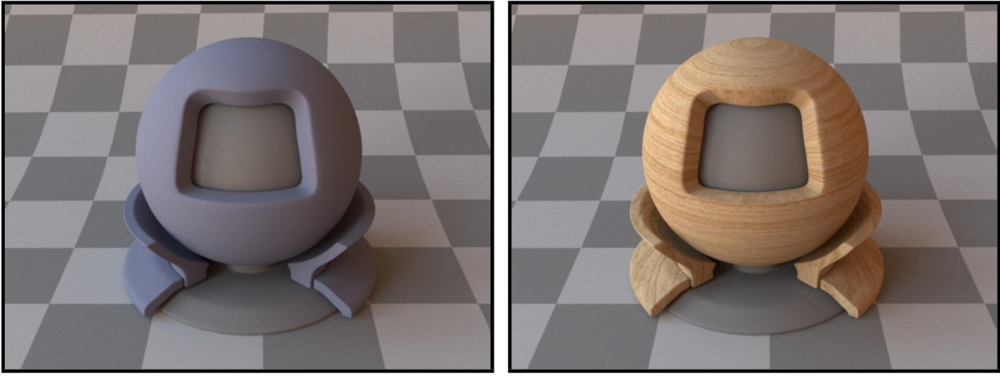

现在计算漫反射材质的BRDF。

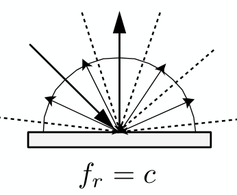

现在我们假设射入的光线是均匀的，而由于表面是漫反射，反射光线也是均匀的。这里首先假设材料反射率为 $\rho$，那么由对称性，入射光和出射光radiance的关系应当为 $L_o=\rho L_i$，而如果使用BRDF计算：
$$
\begin{aligned}
L_o(\omega_o)&=\int_{H^{2}}f_r L_i(\omega_i)\cos \theta_i \mathrm{d}\omega_i \\
&=f_r L_i \int_{H^{2}}\cos \theta_i \mathrm{d}\omega_i \\
&= \pi f_r L_i
\end{aligned}
$$

因此可以得到 
$$
f_r=\frac{\rho}{\pi}
$$

同时应当注意，这里的反射率 $\rho$ 可以只是一个数，也可以是对应三个光通道的一个向量。

### Glossy material
磨砂的材质效果如图

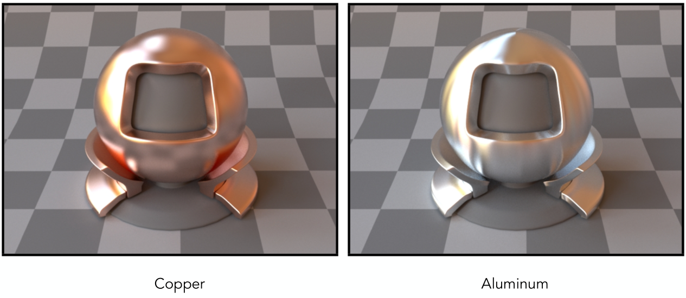

其光线反射的情况则如图所示。因此该种材料虽然有一定的镜面效果(比如古人使用铜镜)，但比较模糊

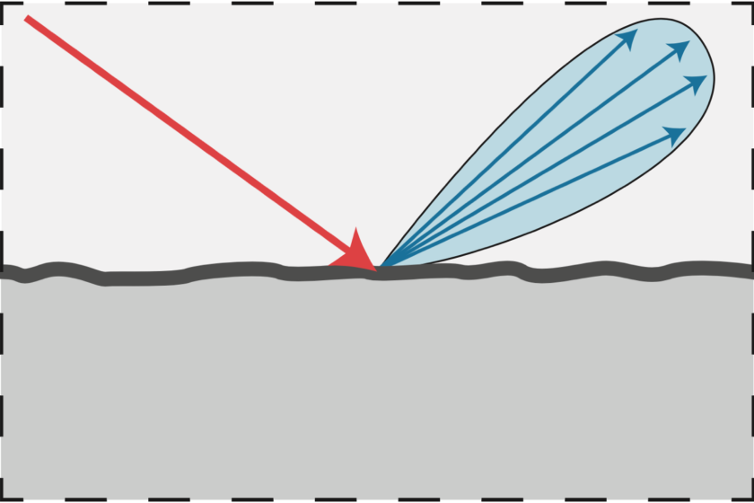

### Ideal reflective / refractive material
这种材质一般是玻璃或者水。对于第二幅图，我们可以发现光线在玻璃中会有部分吸收，因此才会显现出玻璃的颜色。

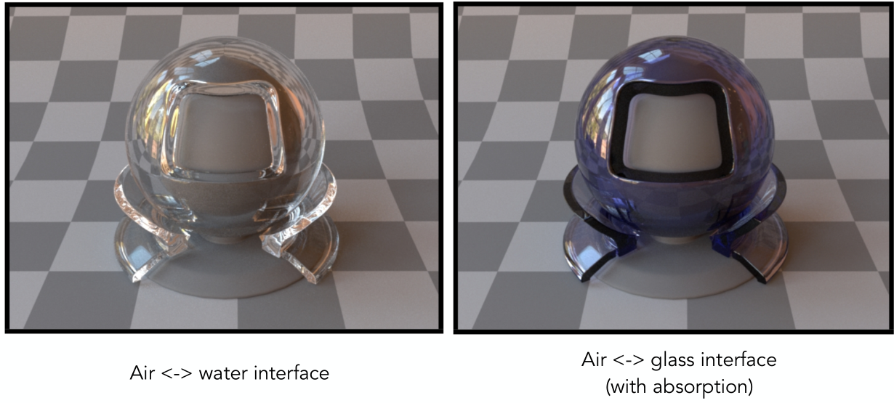

光线在界面会发生理想的反射与折射

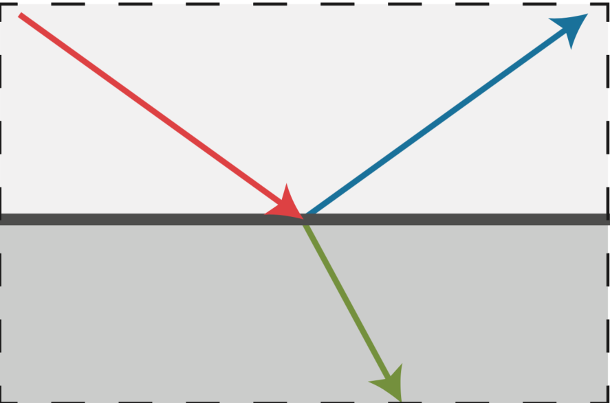

## Perfect Specular
### Perfect Specular Refraction

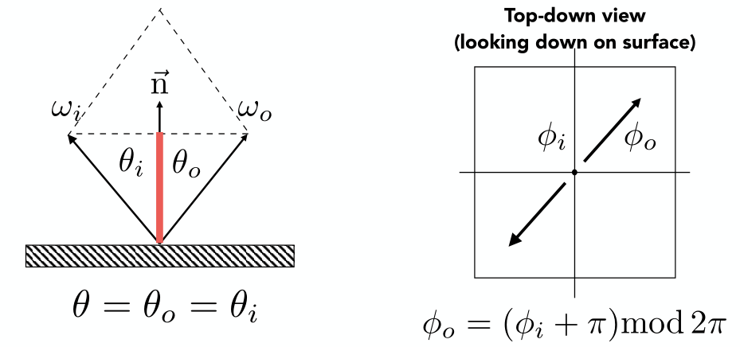

求出反射光方向的一种方式为：
$$
\omega_o+\omega_i=2\cos \theta \vec{n}=2(\omega_i\cdot \vec{n})\vec{n} \\
\Rightarrow \omega_o=-\omega_i+2(\omega_i\cdot \vec{n})\vec{n}
$$

我们可以看出想要计算发射光线方向需要计算一个点乘，因此在Blinn-Phong反射模型中我们没有计算反射光线以减小计算量。

还有一种方法就是将空间中的角度拆分成 $\theta$ 和 $\phi$，然后入射和反射光线的角度关系就由上图中的公式描述。

镜面反射的BRDF比较复杂，需要使用 $\delta$ 函数，这里不提及。

### Specular Refraction
折射用斯涅尔定理描述即可，同时从公式中我们还可以注意到全反射的存在。

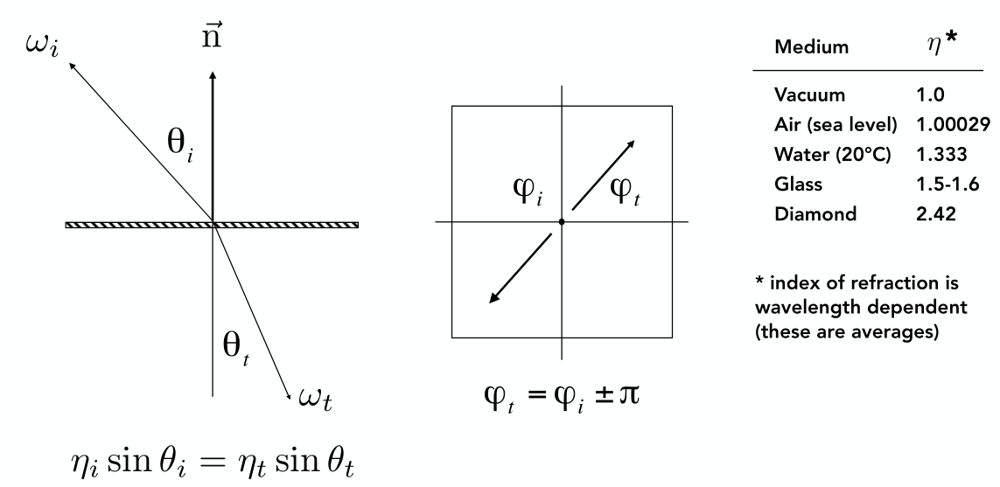

### Fresnel Reflection / Term
从图中可以看出，光的反射情况与角度有关，入射角度越大，反射的能量占比就越大。

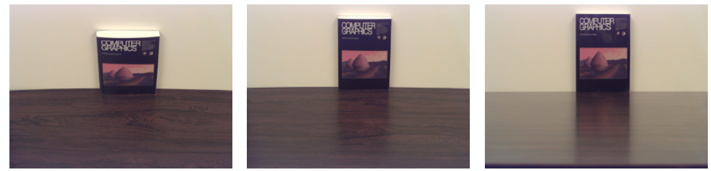

从图中可以看出，导体和绝缘体的菲涅尔系数不相同，导体在入射角度较小时反射系数远大于绝缘体，因此镜子多用铜、银等金属。

  

    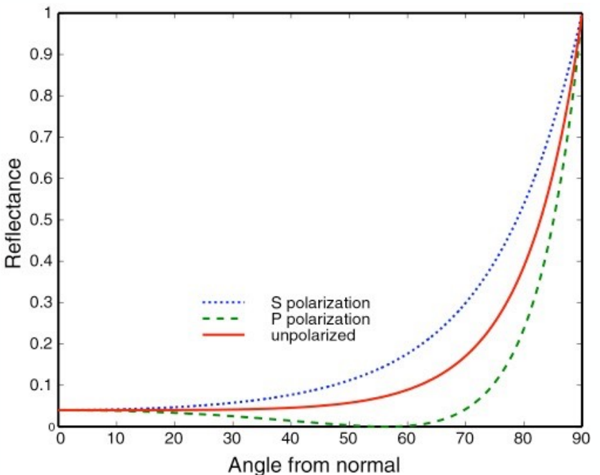
  

  

    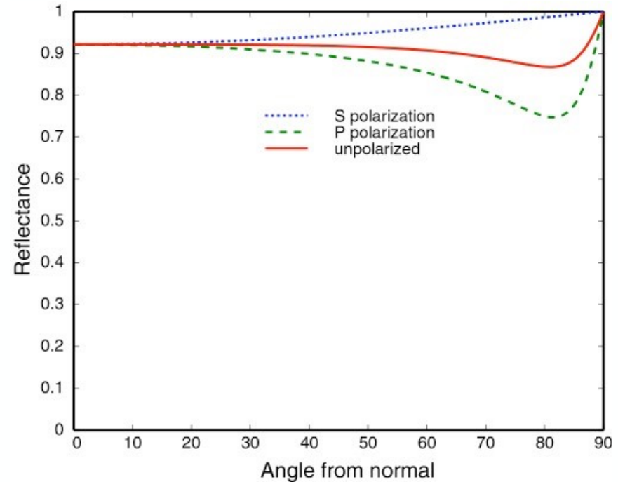
  

#### Fresnel Term — Formulae
$$
\begin{array}{l}
R_{\mathrm{s}}=\left|\frac{n_{1} \cos \theta_{\mathrm{i}}-n_{2} \cos \theta_{\mathrm{t}}}{n_{1} \cos \theta_{\mathrm{i}}+n_{2} \cos \theta_{\mathrm{t}}}\right|^{2}=\left|\frac{n_{1} \cos \theta_{\mathrm{i}}-n_{2} \sqrt{1-\left(\frac{n_{1}}{n_{2}} \sin \theta_{\mathrm{i}}\right)^{2}}}{n_{1} \cos \theta_{\mathrm{i}}+n_{2} \sqrt{1-\left(\frac{n_{1}}{n_{2}} \sin \theta_{\mathrm{i}}\right)^{2}}}\right|^{2} \\
R_{\mathrm{p}}=\left|\frac{n_{1} \cos \theta_{\mathrm{t}}-n_{2} \cos \theta_{\mathrm{i}}}{n_{1} \cos \theta_{\mathrm{t}}+n_{2} \cos \theta_{\mathrm{i}}}\right|^{2}=\left|\frac{n_{1} \sqrt{1-\left(\frac{n_{1}}{n_{2}} \sin \theta_{\mathrm{i}}\right)^{2}}-n_{2} \cos \theta_{\mathrm{i}}}{n_{1} \sqrt{1-\left(\frac{n_{1}}{n_{2}} \sin \theta_{\mathrm{i}}\right)^{2}}+n_{2} \cos \theta_{\mathrm{i}}}\right|^{2}\\
R_{eff}=\displaystyle \frac{1}{2}(R_s+R_p)
\end{array}
$$

但是这个计算公式过于复杂，因此一般采用Schlick’s approximation来估算菲涅尔项
$$
\begin{aligned}
R(\theta)&=R_0+(1-R_0)(1-\cos \theta)^{5}\\
R_0&= \left( \frac{n_1-n_2}{n_1+n_2} \right)^{2}
\end{aligned}
$$

## Microfacet Material
上面讨论菲涅尔项是为了这里引入一个真正基于实际情况的表面模型：微表面模型。

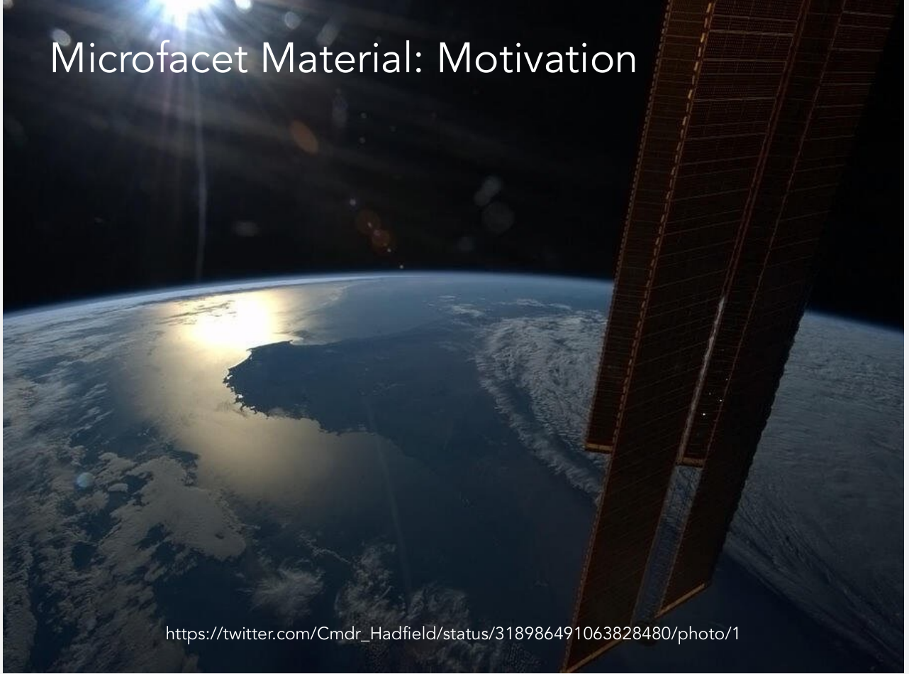

 
提出微表面模型就是因为从远处看物体，其间的起伏细节都看不间，即表面基本是平的，而起伏反映到眼睛中就是表面的粗糙程度。就如同上图从宇宙中拍地球，地面上的各种建筑、植物都看不清，看到的只有一个反射的效果。

### Microfacet Theory
在微表面模型中，对于一个粗糙的表面
* 从远处看(Macroscale):平坦且粗糙。看到的是材质或外观
* 从近处看(Microscale):起伏且光滑。看到的是几何

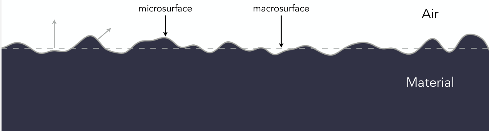

### Microfacet BRDF
从微表面模型可以来看不同材质的BRDF：如果微表面的法线分布较为集中，那么体现出的效果就是glossy；如果微表面的法线分布较为分散，那么体现出的效果就是diffuse。

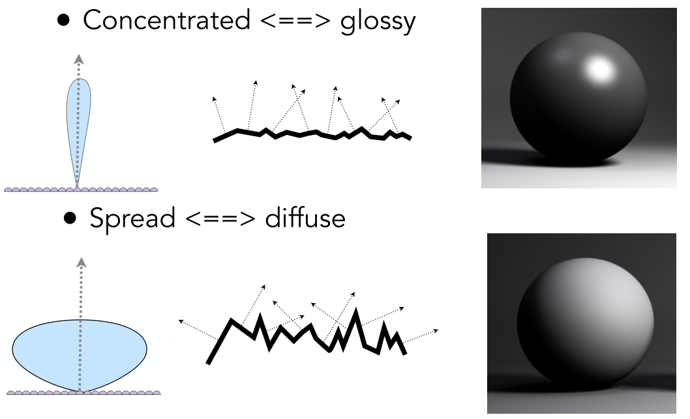

想要写出微表面的BRDF，则需如下考虑
$$
f(i,o)=\frac{F(i,h)G(i,o,h)D(h)}{4(n,i)(n,o)}
$$

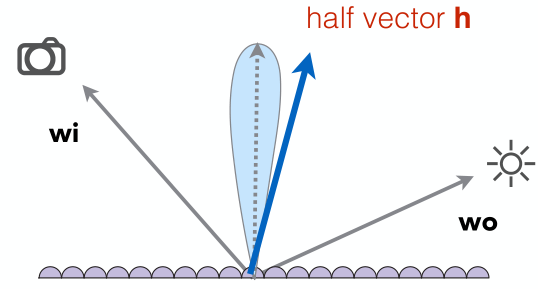

其中 $F(i,h)$ 为菲涅尔项(Fresnel term)，$D(h)$ 表示微表面中有多少表面的法线方向和half vector一致(distribution of normals)，$G(i,o,h)$ 考虑了微表面之间对光线相互遮挡的情况，称为几何项(shawing-masking term)。

当光线和发现夹角接近 $90 \degree$ 时，$F(i,h)$ 会较大，而 $G(i,o,h)$ 会较小，从而让边界不会那么亮。

微表面相当强大，能够很好的描述各种材质，现代的图形学基本在使用的就是这种模型。

### Isotropic / Anisotropic Materials
材质的各向同性和各向异性和微表面的方向性有关，其反映在BRDF上即：
$$
f_r(\theta_i,\phi_i;\theta_r,\phi_r)\neq f_r(\theta_i,\theta_r,\phi_r-\phi_i)
$$

图中左侧的球是各向同性的，而右边的球则是各向异性的。

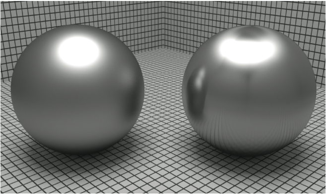

### Properties of BRDFs
* 非负性(能量不能是负的)
  $$
  f_r(\omega_i \rightarrow \omega_r)\ge 0
  $$
* 线性性(各个光线的效果能相互叠加，Blinn-Phong模型就利用了此性质) 
  $$
  L_r(p,\omega_r)=\int_{H^{2}}f_r(p,\omega_i \rightarrow \omega_r)L_i(p,\omega_i)\cos \theta_i \mathrm{d} \omega_i
  $$
* 可逆性(交换出射和入射放行，BRDF相同)
  $$
  f_r(\omega_r \rightarrow \omega_i)=f_r(\omega_i \rightarrow \omega_r)
  $$
* 能量守恒
  $$
  \forall \omega_r \int_{H^{2}}f_r(\omega_i \rightarrow \omega_r) \cos \theta_i \mathrm{d}\omega_i \le 1
  $$
* 各向同性和各向异性
  * 如果是各项同性，可以四维降三维
    $$
    f_r(\theta_i,\phi_i;\theta_r,\phi_r)= f_r(\theta_i,\theta_r,\phi_r-\phi_i)
    $$

    再考虑可逆性的话
    $$
    f_r(\theta_i,\theta_r,\phi_r-\phi_i)=f_r(\theta_r,\theta_i,\phi_i-\phi_r)=f_r(\theta,\theta_r,\left\vert \phi_r-\phi_i \right\vert )
    $$

