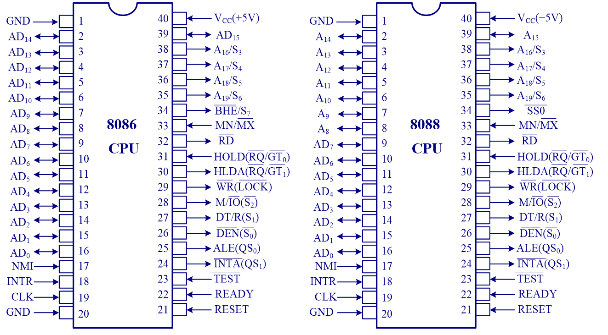
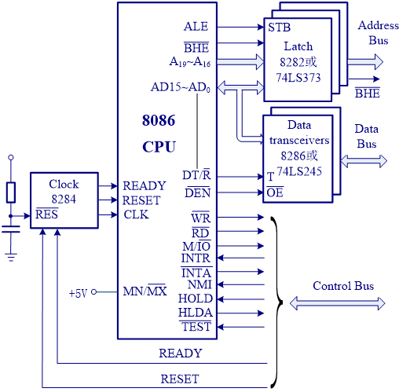
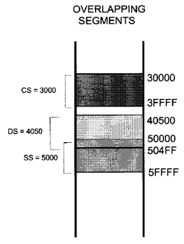
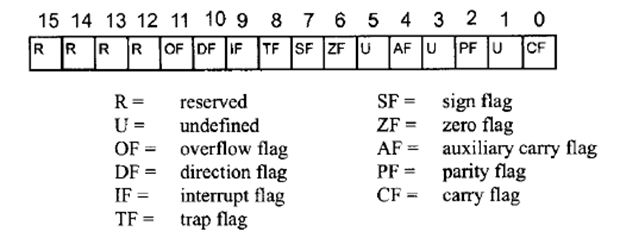

## 8086接脚介绍
首先比较一下8086和8088芯片的接脚。8086是16位的芯片，而8088为了符合当时市场主流，虽然内部是16位的设计，但是对外的接口是8位的。

从图中可以看出，8086的数据线有16根，从 $AD_0$ 到 $AD_{15}$，而8088只有8根。

下面具体介绍一些接脚的功能；

* $AD$ 表示这些接脚既可以做地址线，也可以做数据线，接脚复用。
* 最左侧的 $CLK$ 表示CPU接入的时钟信号。
* $\overline{WR}$ 和 $\overline{RD}$ 分别表示写和读
* $M/\overline{IO}$ 表示访问memory还是I/O，这个信号说明8086采用的是isolated I/O的结构。
* $INTR$ 表示中断请求，外设通过这个接脚将请求发送给CPU
* $\overline{INTA}$ 是CPU对外设中断请求的回应
* $NMI$ 表示不可屏蔽中断
* $HOLD$ 由DMA controller送给CPU，请求总线
* $HLDA$ 是CPU对DMA总线请求的回复
* $READY$ 通常和CPU访问memory或者I/O相关。CPU比较快，所以当memory或者I/O处理好数据之后，会把 $READY$ 信号放到总线上，通知CPU。
* $RESET$ 和计算机重启相关。在重启之后，$IP,DS,SS,ES$ 寄存器和指令队列(instruction queue)中的数据都被清零。而 $CS=FFFFH$。可以看出计算机重启之后CPU会从位于 $FFFF0H$ 的位置开始执行。

图中的Latch叫做锁存器(型号74LS373)，用来暂时存储地址
* $ALE$ 用于控制锁存器的开关。信号有效时，锁存器能从输入端读取数据，并且发送到输出端；若信号无效，则输出端数据不变。
* $\overline{BHE}$ 用于决定8086芯片的高地址对应的数据(even bank)是否有效。

Data transceiver叫做数据收发器(型号74LS245)，用来控制数据的传输
* $DT/\overline{R}$ 用来决定CPU是写数据还是读数据。
* $\overline{DEN}$ 用来决定数据收发器是否工作。如果为高点平，则不工作，两边数据断开。

## 8086地址计算
### Physical Address Wrap-around
8086中地址的表示采用段加偏移的形式，同时使用该方式表示地址时会有warp-around，即如果段加偏移算出来的物理地址超过了 $FFFFFH$，那么抛掉进位，从 $00000H$ 重新开始算。比如当 $CS=FF59H$，那么代码段的范围可以到 $0F58FH$。
### 段重叠(Segment overlapping)
一个8086程序通常有code segment，data segment，stack segment三个段，这三个段可能会有重叠。有时候会故意通过设置段值的方式让某些段重叠，从而方便数据的共享。

同时从图中可以看出，$CS$ 和 $DS$ 通常在内存中处于比较低的位置，而 $SS$ 则存在于比较高的位置。

### 段地址表示
* 代码段：$CS:IP$。假如指令地址超出了当前代码段的范围，那么计算机会自行修改 $CS$ 的值。
* 数据段：$DS:offset$，其中偏移量可以是
  * 立即数，如 $23FFH$
  * 寄存器，可以是 $BX,SI,DI$
* 堆栈段：$SS:SP$。(特殊情况下会用 $BP$)
  * 需要注意，在push入数据之后，栈地址会逐渐变低，即 $SP$ 逐渐减小。这是为了防止和其他应用的数据冲突。
* 额外段(Extra segment)：和数据段相同。

### 大端序和小端序
Little endian：一个字的低字节放在内存低地址(大多数处理器都采取此方式，如8086)
Big endian：一个字的低字节放在内存高地址

## CPU状态字(Flag register)
是一个16位的寄存器，8086只是用了其中9位。

* CF(Carry Flag)：记录进位
* PF(Parity Flag)：检查低8位中1的个数，假如是偶数，PF=1。(用于奇校验)
* AF(Auxiliay Carry Flag)：记录BCD的进位
* ZF(Zero Flag)：计算结果为0，ZF=1
* SF(Sign Flag)：和计算结果的最高位相同，用于表示正负(当成二进制补码)
* OF(Overflow Flag)：有符号数计算溢出
* OF(Overflow Flag)：无符号数计算溢出
* IF(Interrupt Flag)：IF=1时，CPU处理INTR；反之则忽略
* DF(Direction Flag)：字符串处理方向相关
* TF(Trap Flag)：TF=1，CPU进入调试(debug)模式

## 8086系列寻址模式
CPU如何访问操作数？以MOV指令为例
### Register
数据就在寄存器中，无需访存
如：MOV BX,DX

除了CS和IP之外，其他寄存器的值都可以这样操作。
### Immediate
直接把立即数送给寄存器，无需访存
如：MOV AX，2550H

但是立即数不能直接送给段寄存器。
### Direct
数据在Memory中，而数据的地址偏移量在指令中
如：MOV DL,[2400] $\quad$ MOV [3518],AL

如果不指明段寄存器，则默认是数据段寄存器DS

### Register indirect
数据在Memory中，而数据的地址偏移量在寄存器中。默认段值为DS，存储偏移地址的寄存器只能是SI，DI和BX。
如：MOV AL,[BX]

### Based relative
如 MOV CX,[BX]+10
### Indexed relative
和上面类似，只是这里用index寄存器
如 MOV DX,[SI]+5
### Based indexed relative
如 MOV CL,[BX][DI]+8

