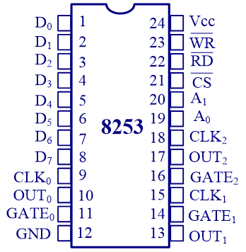
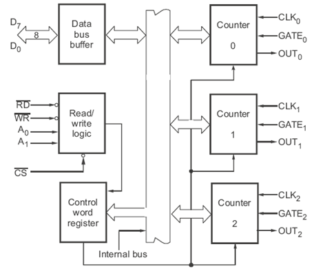
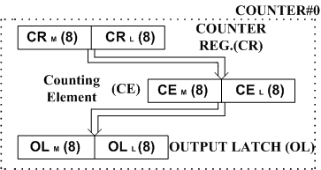
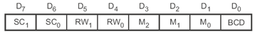
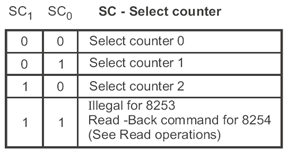
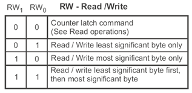
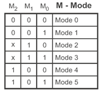
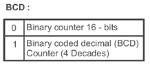

## 8253 芯片结构


使用 8253 作为计数器是因为使用 CPU 进行计数的话，可能会因为中断等问题而不可控。比如
```8086
    MOV CX, N
AGAIN:LOOP AGAIN
```

可以进行计时，但是软件方法并不稳定。因此引入了 8253 这一硬件。


* 左侧的 $A_1A_0$ 选择 Counter 或者控制寄存器。当 $A_1A_0=00,01,10,11$ 时，分别选择 Counter0, Counter1, Counter2, Control Register。
* 右侧是三个 Counter。工作流程为：门控信号有效时，给 Counter 一个计数初值 N，然后在外部时钟的驱动下 Counter 开始倒数，倒数到 0 的时候 OUT 进行输出。同时输出的形式不仅仅可以是方波，也可以有不同的 duty cycle。
  * CLK 是驱动用的时钟
  * GATE 是门控，有效时 Counter 才工作
  * OUT 是输出信号。
* 这里的 Counter 最大可以将频率降低 $65536$(Binary) 或者 $10000$(BCD) 倍。

### Counter 内部结构


* $CR$ 寄存器中储存的是计数初值。计数初值最大是 $0$，之后会减到 $65535$ 或者 $9999$。
* $CE$ 中储存的是计数值。最开始初始化为计数初值，然后会在时钟的驱动下自减
* $OL$ 可以锁存当前的计数值

### 控制字格式


$SC$ 用于选择当前 Counter


$RW$ 与读写有关


其中 00 指的是把计数值写到上述 $OL$ 中。
其他几种情况在考虑写高字节还是低字节。这是因为寄存器有 $16$ 位，而数据线只有 $8$ 位。

$M$ 用于选择模式


$BCD$ 表示是否采用 BCD 编码


