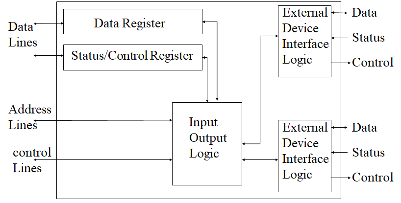
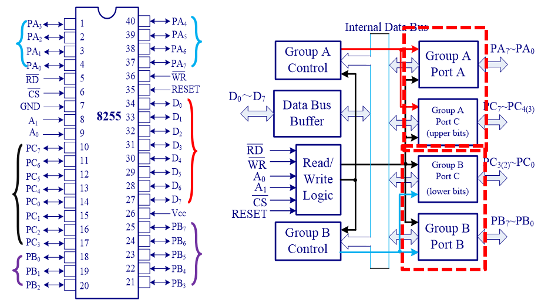
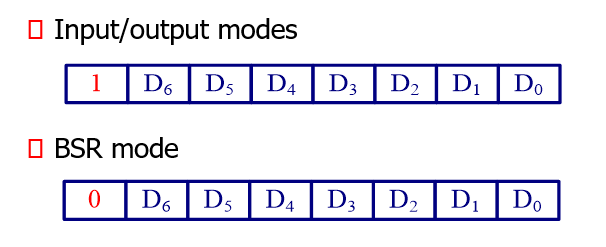
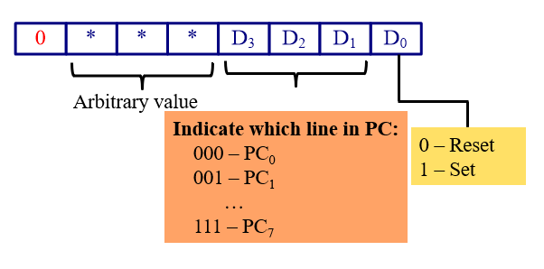

## 芯片结构
### I/O 模块的基本结构

如上图所示，I/O 模块的左侧是和系统的接口，系统可以和 I/O 模块交互数据，地址和控制信息。同时 Status/Control Register 通常会存储一些 I/O 模块的状态信息和控制字，可以与 CPU 进行读写操作。

I/O 模块右侧是与外设的交互接口，和外设交换数据和状态。

### 8255 芯片结构

可以看出8255芯片基本满足 I/O 模块的基本结构。
* 对于右侧，有 Port A，Port B，Port C 对外进行输入输出，同时还能组合成 Group A，Group B。
* 对于左侧，就是和 CPU 进行交互的数据线以及控制线。
  * $\overline{RD},\overline{WR}$ 表示读写信号
  * $A_0,A_1$ 用于选择 Port A，Port B，Port C 以及 Control Register(CR)。
    * $A_0A_1=00,01,10,11$ 时，分别选择 Port A，Port B，Port C，CR。此时 CPU 可以和这些 buffer 或者 register 进行读写操作。
  * $\overline{CS}$ 是片选信号

### 操作模式(Operation Modes)
* 输入输出模式(Input/output modes)
  * Mode 0, 简单输入输出模式(simple I/0 mode)
    * PA，PB，PC与外设可以直接读或者写
    * 传输速度一样，不需要握手信号
  * Mode 1
    * PA，PB与外设进行读或者写，需要握手信号
    * PCU(PC3-PC7)，PCL(PC0-PC2) 用作PA，PB的握手信号(只需要3个位)
  * Mode 2
    * PA能够进行读以及写操作。
    * PCU(PC3-PC7)做握手信号
* 位的设置与清除模式(BSR, bit set/reset mode)
  * 只有PC能做输出端口
  * PC的每个位都可以单独设置

### 控制寄存器与操作模式

#### 输入输出模式
* Group A
  * $D_6D_5$ 用于选择模式
    * 00-Mode 0, 01-Mode 1, 1*-Mode 2
  * $D_4$ 选择 Port A 的输入输出模式
    * 1-Input, 0-Output
  * $D_3$ 选择 PCU 的输入输出模式
    * 1-Input, 0-Output
* Group B
  * $D_2$ 用于选择模式
    * 0-Mode 0, 1-Mode 1
  * $D_1$ 选择 Port B 的输入输出模式
    * 1-Input, 0-Output
  * $D_0$ 选择 PCL 的输入输出模式
    * 1-Input, 0-Output

#### BSR 模式

$D_3D_2D_1$ 选择位，$D_0$ 控制输出。

<!-- TODO Mode1，Mode2的详细操作待补充 -->