## MAC(Media Access Control)子层在哪里？
数据链路层分为两个子层：
• MAC子层：介质访问
• LLC子层：承上启下（弱层），主要起到的是让上层无需关心下层的实现方式，即根据物理层的情况调用不同的协议。
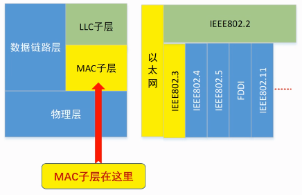

* 以太网包含了物理层和数据链路层，是个2层协议。
* IEEE802.3则包含了物理层和MAC子层，是1.5层协议。
* 而WiFi(IEEE802.11)也是1.5层协议。

对于1.5层的协议，LLC子层可以使用IEEE802.2进行协议的选择，更加有弹性。而以太网虽然设计的没那么好，但是提出更早，因此如今被更加广泛的使用。

<!-- 之前讲到数据链路层最流行的是PPP协议， -->

## 信道分配问题
### 常见的接入情形
之前讲到数据链路层属于点对点的连接协议。对于家庭用户，比较常见的是使用信道直接连接两个端点
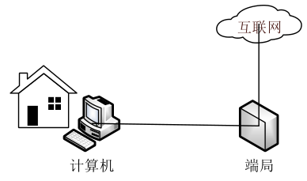

但是假如是公司用户，常见的是多用户共享一根信道。所以MAC子层需要解决的就是这里的信道复用的问题。
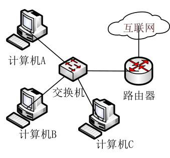

介质访问控制可以分为**静态分配**和**动态分配**。

### 静态分配的性能分析
常见的静态分配方法有：时分(TDM)，频分(FDM)。

在这里我们使用排队时间的长短来衡量性能。
#### M/M/1排队系统模型
* M（顾客到达时间间隔分布）
  * 帧到达时间间隔服从指数分布
  * 平均到达率（输入率）：l 帧/秒
* M（服务时间分布）
  * 帧长度服从指数分布，平均长度1/µ 位/帧
  * 信道容量为C 位/秒，则信道服务率为µC 帧/秒
* 1（并列服务台个数）

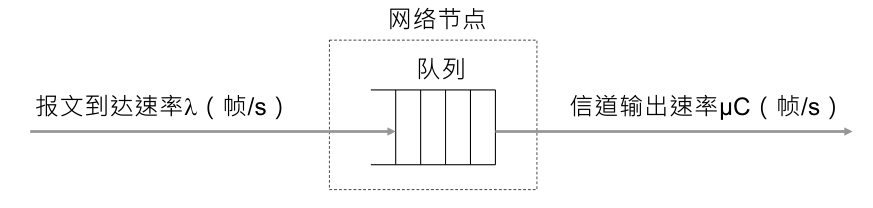

下面分析一个稳定的生灭过程：
$$
\begin{aligned}
\lambda p_0 &= \mu C p_1 \\
\lambda p_1+\mu C p_1 &= \lambda p_0 +\mu C p_2 \\
\lambda p_2+\mu C p_2 &= \lambda p_1 +\mu C p_3 \\
&\cdots 
\end{aligned}
$$

可以解得 $p_{i}=p_0 \rho^{i}$，其中 $\rho=\frac{\lambda}{\mu C}$，$p_0=1-\rho$。最终可得队伍中平均顾客数量为：
$$
N = \sum_{i=0}^{\infty}i p_{i} = \frac{\rho}{1-\rho}
$$
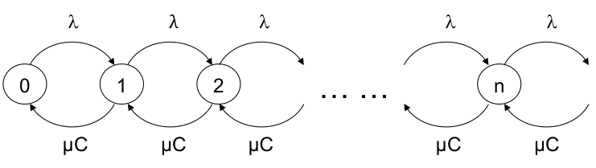

#### Little定理
在稳定状态下，存储在网络中的**报文平均数**，等于报文的**平均到达率**乘以这些报文在网络中经历的**平均时间**

结合排队模型的分析，有
$$
N=\frac{\rho}{1-\rho}=\lambda T \Rightarrow T = \frac{1}{\mu C-\lambda}
$$

$T$ 即为每个客户等待的平均时间。

#### 子信道的平均延迟
假如将信道 $N$ 等分，得到 $N$ 个子信道，那么平均输入率为 $\lambda /N$，平均服务率为 $C /N$，平均延迟为：
$$
T_{FDM}= \frac{1}{\mu(C /N)- \lambda /N} = \frac{N}{\mu C-\lambda}=NT
$$

### 静态分配特点
* 问题
  * 资源分配不合理，不满足用户对资源占用的不同需求
  * 有资源浪费，效率低
  * 延迟时间增大N倍
* 适用情况
  * 适于用户数量少且用户数目固定的情况
  * 适于通信量大且流量稳定的情况
  * 不适用于突发性业务的情况

## 多路访问协议
### 三大多路访问协议
随机访问协议通常都会引起冲突。而受控访问协议相当于有一个中心来决定谁来发送数据，不会产生冲突。随机访问协议和受控访问协议分别在低负载和高负载的情况下性能较优，有限竞争协议则是对这两者的权衡。

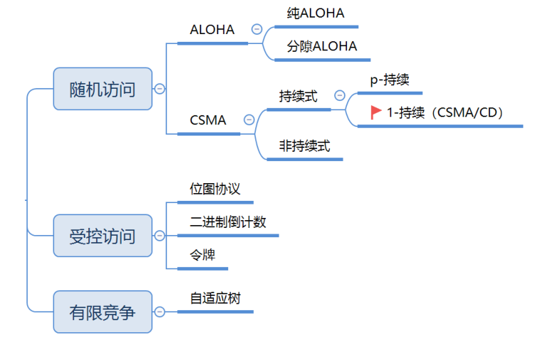

### ALOHA协议
#### 纯ALOHA协议工作原理
想发就发，因此随时可能导致冲突。冲突了的帧需要重传。
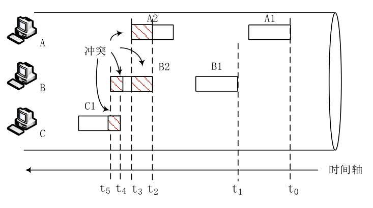

为了衡量ALOHA协议的性能，我们定义**帧时** $T$ 为发送一个标准长的帧所需要的时间

假设生成帧的数量服从泊松分布
* 一个帧时内用户平均产生 $N$ 个新帧
* 一个帧时内信道平均产生 $G$ 个新帧(包括重传)

分析一下可以发现，$0<N<1$，轻载时 $N\rightarrow 0$，重载时 $N \rightarrow 1$。同时 $G\ge N$，轻载时 $G=N$(无冲突)，重载 $G>N$(冲突导致重传)。

根据泊松分布，一个帧时内产生 $k$ 个帧的概率为
$$
\operatorname{Pr}(k)=G^{k}e^{-G}/k!
$$

当 $k=0$，有 $\operatorname{Pr}(k=0)=e^{-G}$。

#### 纯ALOHA协议性能分析
再定义
* **吞吐量** $S$ 为在一个帧时 $T$ 内发送成功的平均帧数(相当于信道利用率)，显然 $0<S<1$。
* **网络负载** $G$ 为一个帧时 $T$ 内所有通信站总共发送的帧平均值(包括重发)
* $P_0$ 为一帧发送成功(未发生冲突)的概率

以上有 $S=G\times P_0$。

然后分析纯ALOHA冲突概率。假如一帧想要成功发送不冲突，那么在 $2T$ 的一段时间中应当都没有其他帧发送，如下图所示
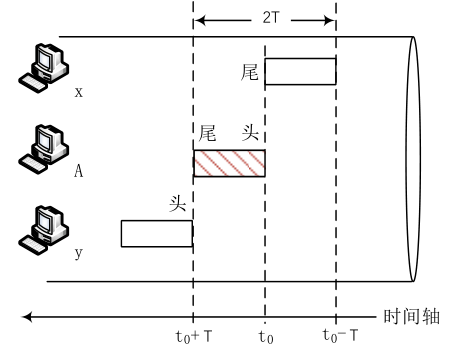

这段时间内生成帧的平均值为 $2G$，因此不产生冲突的概率为 $P_0=e^{-2G}$。然后带入
$$
S=GP_0=Ge^{-2G}
$$

分析可知当 $G=0.5$ 时，$S$ 取到最大值 $0.184$。可以看出纯ALOHA的信道利用率很低。
#### 分隙ALOHA(Slotted ALOHA)
相比之前改进的地方是把时间分成时隙，时隙长度对应一帧的传输时间，帧的发送只能在时隙的起点。那么此时可以看出冲突也只能发生在时隙的起点
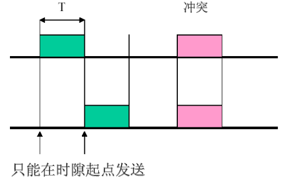

此时 $P_0=e^{-G}$，$S=G e^{-G}$，在 $G=1$ 时，取到 $S_{\max}=1/e\thickapprox 0.368$

### 载波侦听多路访问协议(CSMA：Carrier Sense Multiple Access)
先听后发。假如没有其他用户发送，那么就发送；但是假如监听到信道被占用，则有多种不同处理方式

#### 非持续式CSMA
1. 经侦听，如果介质空闲，开始发送
2. 如果介质忙，则等待一个随机分布的时间，然后重复步骤 $1.$

* 优点：等待一个随机时间可以减少再次碰撞冲突的可能性
* 缺点：等待时间内介质上如果没有数据传送，这段时间是浪费的

#### 1-持续式CSMA
1. 经侦听，如介质空闲，则发送
2. 如介质忙，持续侦听，一旦空闲立即发送
3. 如果发生冲突，等待一个随机分布的时间再重复步骤①
   
* 优点：持续式的延迟时间要少于非持续式
* 主要问题：如果两个以上的站等待发送，一旦介质空闲就一定会发生冲突

#### p-持续式CSMA
1. 经侦听，如介质空闲，那么以 $p$ 的概率 发送，以 $1-p$ 的概率延迟一个时间单元发送
2. 如介质忙，持续侦听，一旦空闲重复 $1.$
3. 如果发送已推迟一个时间单元，再重复步骤 $1.$

#### CSMA能否避免冲突
不能。一种情况是信道空闲后两个用户可能同时发送导致冲突，另一种情况和传播延迟有关。

比如在下图中，$t_0$ 时刻甲发送信号，$t_1$ 时刻乙侦听后以为信道没有占用，也发送信号。然后 $t_2$ 时刻发生冲突，$t_3$ 时刻乙检测到冲突，$t_4$ 时刻甲检测到冲突。
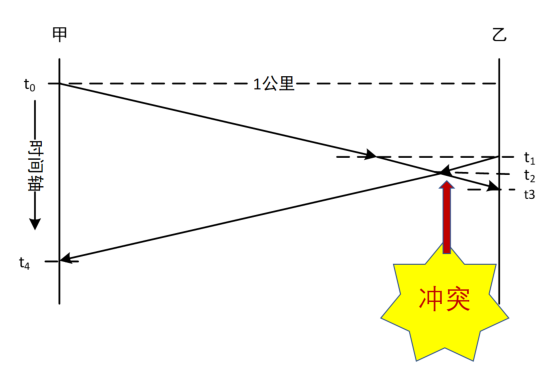

#### 侦听冲突的原理
Tx为发送端，Rx为接收端。检测冲突的原理为：在Tx发送数据时，会通过Loopback将信号传输给自己的Rx，而Rx同时也接收Receive的信号，两个信号线性叠加。假如此时信道没有其他信号占用，那么Rx收到的就是Tx的数据帧。Tx和Rx都会向Collision Detection传输数据，所以假如Rx和Tx的数据一样，那么认为没有冲突，反之认为有冲突。
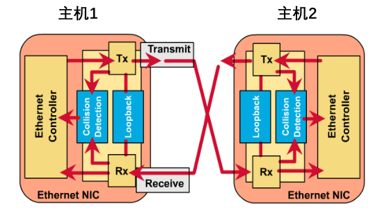

回到刚才传播延迟产生冲突的例子，假如甲在 $t_4$ 时刻之前就停止了发送数据，那么根据侦听冲突的原理，甲无法侦测到冲突。同理如果乙在 $t_3$ 前停止发送数据，则导致乙侦测不到冲突。

因此这里定义**冲突窗口**的概念。冲突窗口是一个时间区间，表示发送方发出帧之后能检测到冲突的最长时间。冲突窗口在数值上等于最远两方传播时间的两倍 $2D$，即一个来回传播时延RTT(Round Trip Time)。

想要避免无法侦听到冲突的问题，我们要求发送方发送帧的时间应当大于冲突窗口，所以需要规定帧的最小长度 $L=2D\cdot v$，其中 $v$ 为信号传播速度。

#### CSMA/CD （1-持续）
考虑到直接使用CSMA无法避免冲突，所以还需要解决冲突，这里使用CSMA with Collision Detection。

原理：“先听后发、边发边听”
1. 经侦听，如介质空闲，则发送。
2. 如介质忙，持续侦听，一旦空闲立即发送。
3. 如果发生冲突，等待一个随机分布的时间再重复步骤 $1.$

当一方侦测到冲突之后，就会立刻停止传输，同时发送强化(Jam)信号，告诉另一方有冲突发生。
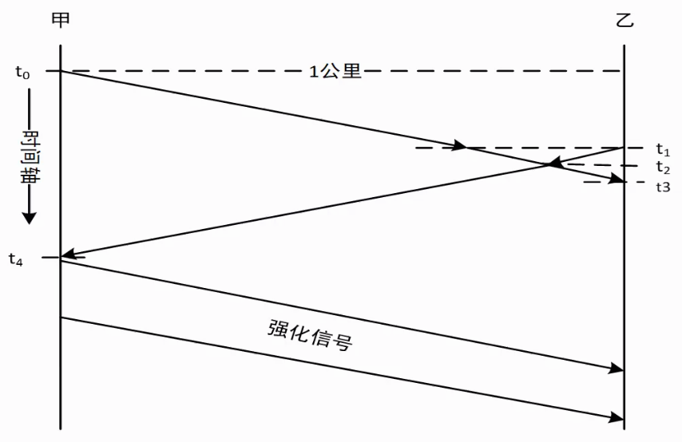

CSMA/CD 的概念模型包含：
* 传输周期：一个站点使用信道，其他站点禁止使用
* 竞争周期：所有站点都有权尝试使用信道，争用时间槽
* 空闲周期：所有站点都不使用信道

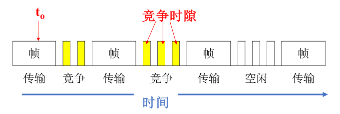

#### 各种CSMA的性能比较
这里考虑信道利用率。
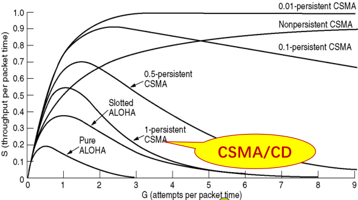

如今的以太网采用的是CSMA/CD(1-持续式)。虽然 $p$ 更小时信道利用率更高，但是由于延迟过高，所以并不实用。

### 位图协议
* 在竞争期，每个使用者都有一定的时隙，在时隙中可以“举手”示意自己有数据要发送。
* 在传输期，刚刚举手的使用者按序发送，避免冲突

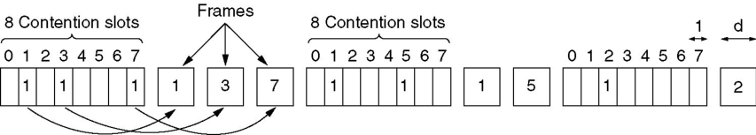

#### 位图协议信道利用率分析
假设有 $N$ 个用户，同时每个帧有 $d$ 个 bits。

信道利用率
* 在低负载下：$d /(d+N) \xrightarrow{N\rightarrow\infty} 0$
* 在高负载下：$Nd /(Nd + N) = d /(d + 1) \xrightarrow{d \rightarrow \infty} 1$

位图协议还有个缺点，就是无法考虑优先级。

### 二进制倒计数协议
想要解决优先级的问题，可以使用二进制倒计数协议。该协议对每个站点进行**编号**，序号的长度相同。

* 在竞争期，需要发送数据的站点从高序号到低序号进行比较，需要更大的优先。
  比较方式为：先比第一位，假如某个站点第一位为 $0$，但是发现存在站点第一位为 $1$，则该站点放弃竞争。

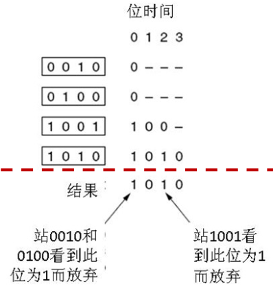

#### 二进制倒计数协议的信道利用率分析
$N$ 个站点二进制编码需要 $\log_2 N$ 位，因此信道利用率为 $d / (d+\log_2 N)$。

### 自适应搜索树协议
类似于核酸检测，先混检，发现问题之后再单检。

自适应搜索树协议在一次成功传输后的第一个竞争时隙，所有站点同时竞争。
* 如果只有一个站点申请，则获得信道。
* 否则在下一竞争时隙，有一半站点参与竞争（递归），下一时隙由另一半站点参与竞争

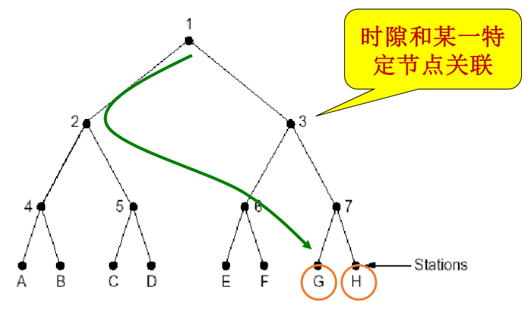

## 以太网
### 以太网的前世今生
1973年提出经典以太网，后来又出现了快速以太网(fast ethernet)，千兆以太网(gigabit ethernet)，万兆以太网(10-G ethernet)，每次版本迭代速度大约差十倍。

### 经典以太网
#### 物理层
最高速率 $10Mbps$，使用曼彻斯特编码，使用**同轴电缆**和**中继线**连接。
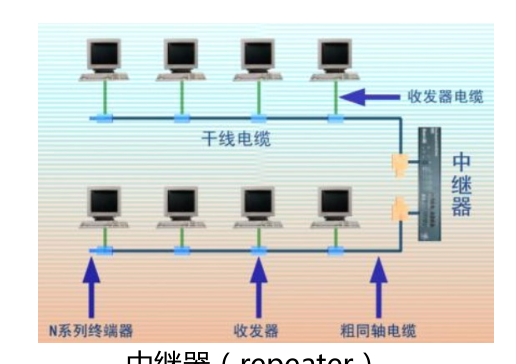

任意两个收发器之间距离不得超过2.5km，且任意两个收发器之间经过的中继器不能超过4个，以保证MAC协议正常工作

#### MAC子层
主机运行CSMA/CD协议

常用的MAC帧格式有两种标准
* DIX Ethernet V2 标准(最常用的)
* IEEE 的 802.3 标准

一个帧的完整格式如下，而对于其中的 header，两种标准略有不同
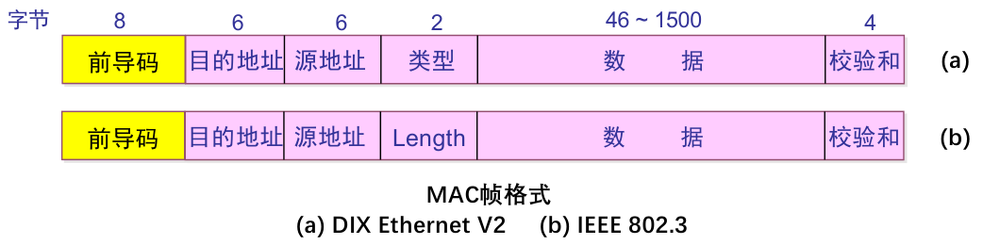

在DIX Ethernet V2 标准中，类型有以下几种：
* IPv4: 0x0800
* ARP: 0x0806
* PPPoE: 0x8864 (PPPoE协议是结合了以太网能够解决信道复用以及PPP协议有连接的特点形成的协议)

因此再考虑数据的长度不超过1500，比对应类型的数字都小。网卡可以通过这一项的值大小来判断接收到的MAC帧格式使用的是哪个标准。

数据帧数据的长度最小是46个字节，这与冲突窗口有关。数据帧长度不能太短，否则会导致无法检测到冲突。分析经典的以太网，速率为 $10Mbps$，最大长度为 $2500\times 4=10000m$，在最差情况下往返一次的时间为 $50ms$，在这段时间内能够发送 $500bit$，加上安全余量至 $512bit$，因此总长度设置为 $64Bytes$。
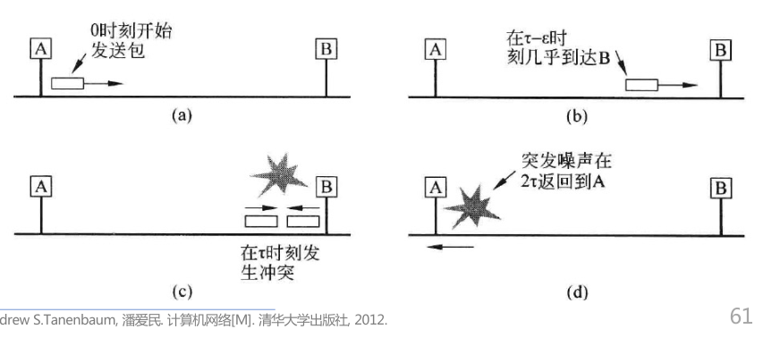

经过以上分析，我们注意到这个长度的设定是和以太网的传输速率有关的。
* 假如传输速率增大，当使用 fast ethernet 时，为了不增加帧长，那就必须将最大长度缩小十倍。
* 再到gigabit ethernet，为了保证CSMA/CD继续正常工作，可以采用载波扩充(增加帧长度)或者帧突发(将多个小的帧合到一起)。但事实上，此时的以太网在使用了交换机之后已经避免了冲突问题，如果不需要向前兼容，可以不使用CSMA/CD。

之前考虑 CSMA/CD 协议时，以太网检测到冲突后，会立即中止传输，并发出一个短冲突加强信号，在等待一段随机时间后重发。这里来讨论一下随机时间如何决定。
最常用的随机时间决定方法称为**二进制指数后退**。
1. 首先确定基本退避时间槽，其长度为以太介质上往返传播时间($2𝜏$) ，以太网中设为 $512$ 比特时间
2. 定义 $k=\min_{}(\text{重传次数},10)$
3. 从整数集合 $\left\{ 0,1 , \ldots ,2^{k}-1 \right\}$ 中随机抽出一个数，记为 $r$
4. 重传所需的时延就是 $r$ 倍的时间槽 $2𝜏$；
5. 当重传达 $16$ 次仍不能成功时即丢弃该帧，并向高层报告

## 数据链路层交换
### 数据链路层交换原理
#### 交换机(网桥)的引入
* **冲突域**指的是一个网段，其中可能会有冲突产生。产生冲突的前提就是当有多个使用者共享一个信道，并且同时冲突。
* **Hub**是物理层的一个网络连接设备，直接把网线接起来
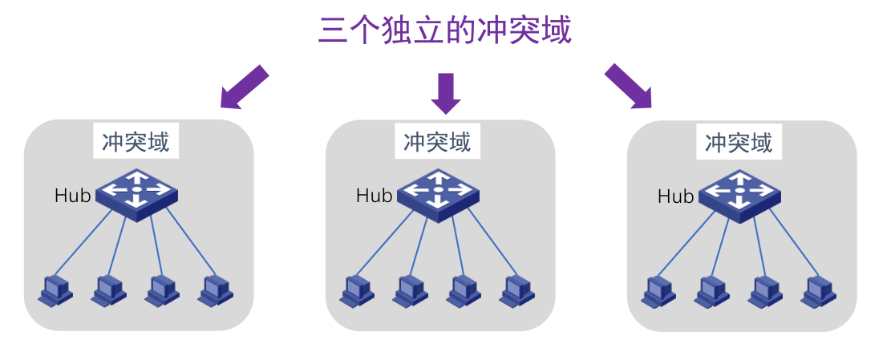

如果希望上图中的所有电脑都可以相互通信，可以再使用一个Hub将它们全部连接起来，形成一个含有 $12$ 台电脑的冲突域。但是这会让更多的电脑共享信道，会导致：信道利用率下降，出现更大的安全隐患。
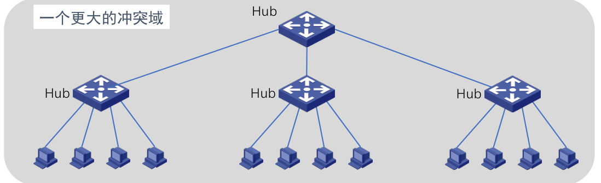

为了解决这个问题，我们使用数据链路层的交换设备。这个设备称为网桥或者交换机。交换机能够分隔冲突域，同时保证两个冲突域的电脑之间任然能够相互通信。
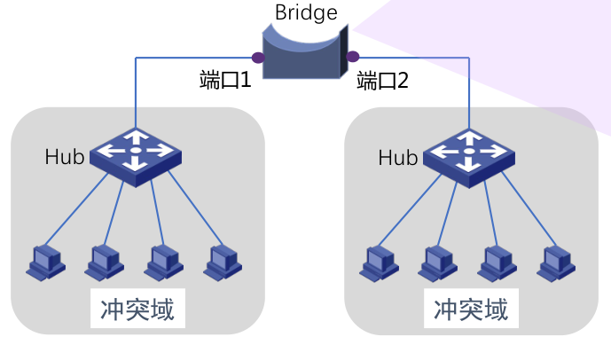

交换机实现功能，核心在于转发表。转发表用于记录某个设备的MAC地址对应于哪个端口。
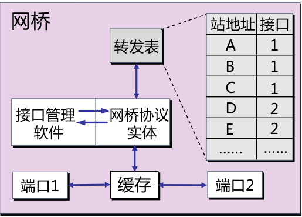

#### 交换机转发表的生成
理想的网桥是透明的，即插即用，无需用户配置，这就要求交换机需要能够自己生成转发表。

转发表(MAC地址表)的构建是通过**逆向学习源地址**实现的。比如初始情况下网桥MAC地址表为空，计算机 A 向 B 发送数据，此时交换机就知道计算机 A 的MAC地址对应的端口号。
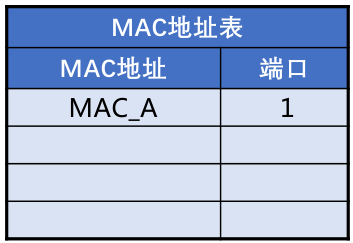

同时交换机还需要记录帧的到达时间，并且设定老化时间(默认为 $300s$)，当老化时间到期时，该表项就要被清除。这是因为设备可能需要经常插拔，所以转发表也需要经常更新。但如果在清除表项之前，A 电脑又发送了一次数据，则老化时间重置。

根据上述MAC地址表的生成原理，不难发现可能会溢出。比如某些攻击者使用许多设备向交换机发送信息，交换机就会认为有很多设备接入，从而不断增加MAC地址项，最终导致溢出。

#### 交换机转发数据帧
交换机对于入境帧共有转发(forwarding)，过滤(filter)和泛洪(flooding)几种操作。

假如计算机 B 向 D 发送数据帧，并且此时MAC地址表完整，那么交换机通过查询MAC地址表，发现 B 和 D 对应不同的端口，则即使将接收到的数据帧从 D 对应的端口上**转发**出去。
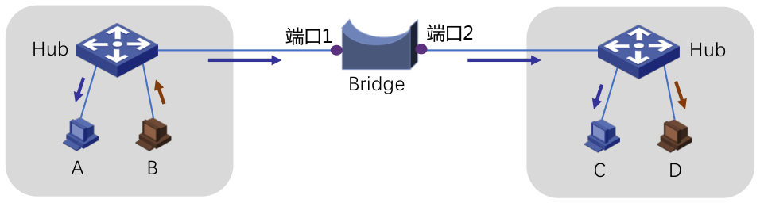

假如计算机 B 向 A 发送数据帧，并且此时MAC地址表完整，那么交换机通过查询MAC地址表，发现 B 和 A 对应相同的端口，则交换机将该数据帧丢弃。这种操作称为**过滤**。
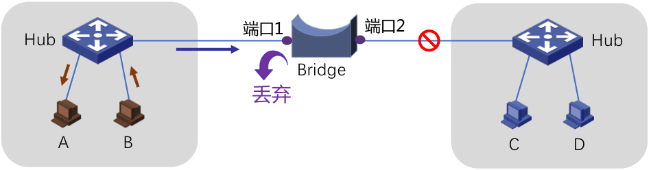

假如计算机 A 向 B 发送数据帧，但是此时MAC地址表不完整，那么交换机通过查询MAC地址表，发现查找不到 B 的MAC地址对应哪个端口，则交换机会将该数据帧从所有端口(除了入境口)发送出去，保证 B 能够接收到数据。这种操作称为**泛洪**。
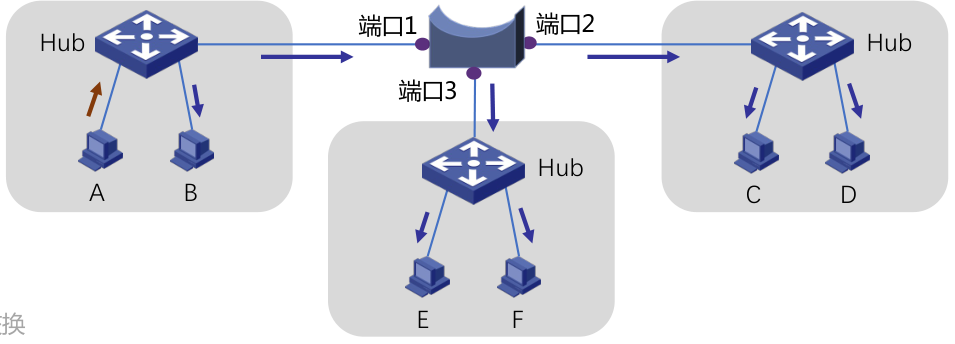

同时除了上述查找不到端口的目标MAC地址需要泛洪，**广播帧**也需要泛洪。(广播帧指的是目的地址为FF-FF-FF-FF-FF-FF的数据帧。)

### 链路层交换机
* 传统LAN分段
  * 交换机端口通常与集线器连接；
  * 使用交换机把LAN分段为更小的冲突域。
* 现代LAN分段
  * 直连PC，微分段，创建无冲突域

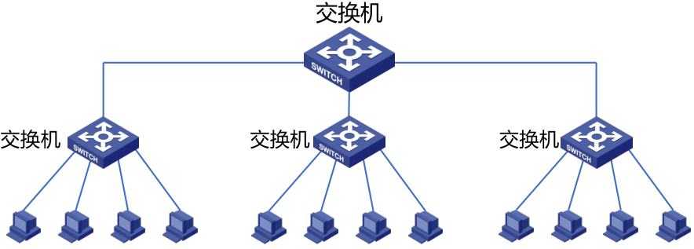

#### 市面上的交换机
* 执行数据链路层交换算法(通常买到的)
  * 多端口透明网桥，网桥的现代名称
  * 一种即插即用设备
* POE（Power Over Ethernet）交换机
  * 常接：网络摄像机、AP、IP电话等
  * 主要优点：无需电源（受电端）、无需专门布线

#### 交换机分类
* 交换方式：从带宽的角度
  * 对称交换：出和入的带宽相同。例如：交换机上全为1000Mb/s速率端口
  * 非对称交换：出和入的带宽不同。例如：交换机上有100Mb/s、1000Mb/s等多种速率端口
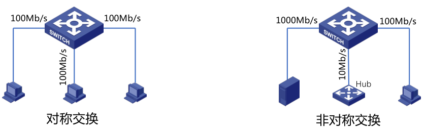

* 交换模式：从转发时机的角度
  * 存储转发模式(Store and Forward)：转发前必须接收整个帧、执行CRC校验
    * 缺点：延迟大
    * 优点：不转发出错帧、支持非对称交换
  * 直通模式(Cut-through)：一旦接收到帧的目的地址，就开始转发
    * 缺点：可能转发错误帧、不支持非对称交换
    * 优点：延迟非常小，可以边入边出
  * 无碎片模式(Fragment-free)：接收到帧的前64字节(冲突窗口大小)，即开始转发。(假如收到的帧小于64个字节，那么说明帧不完整，只是一个碎片)
    * 缺点：仍可能转发错误帧，不支持非对称交换
    * 优点：过滤了冲突碎片，延迟和转发错帧介于存储转发和直通交换之间
### 生成树协议
#### 拓扑冗余导致的问题
可靠传输通常需要**冗余拓扑**，但是冗余拓扑可能会导致**物理环路**
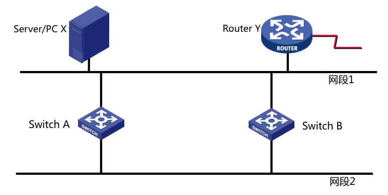

物理环路可能会导致广播风暴、重复帧以及MAC地址表不稳定等问题。

**广播风暴**指交换机在物理环路上不断广播流量，无限循环。
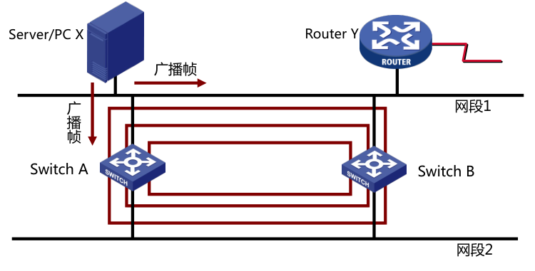

**重复帧**发生在X发数据给Y，但是此时转发表中还没有Y的MAC地址，此时使用flooding，就会导致Y连续两次接收到同一个帧。
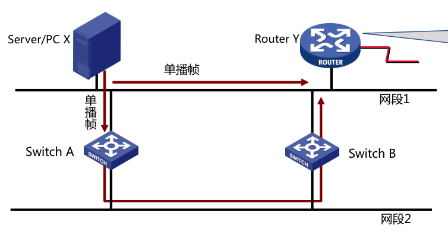

同时当一个帧的多个副本到达不同端口时，交换机会不断修改同一个MAC地址的对应端口，导致**MAC地址表不稳定**。
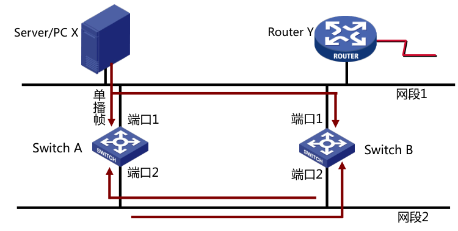

为了不形成物理环路，我们想到可以生成一棵树。因此引入了生成树算法。

#### 生成树算法步骤
1. 选举根桥(Root Bridge)，相当于树的根
2. 为每个非根桥选出一个根端口(Root Port)
3. 为每个网段确定一个指定端口(Designated Port)

选择根桥时，依照交换机的优先级，将优先级小的作为根桥。如果优先级相同，则选其中MAC地址小的。
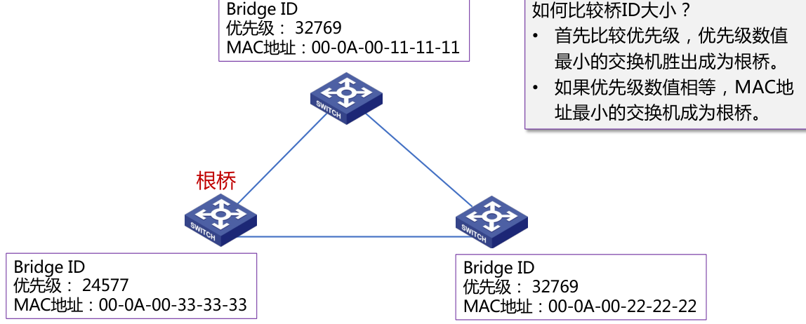

有了根桥之后，对于其他交换机，我们考虑这些交换机的哪个端口离交换机更近，近的作为根端口。假如一样近，那么同样选取ID更小的。
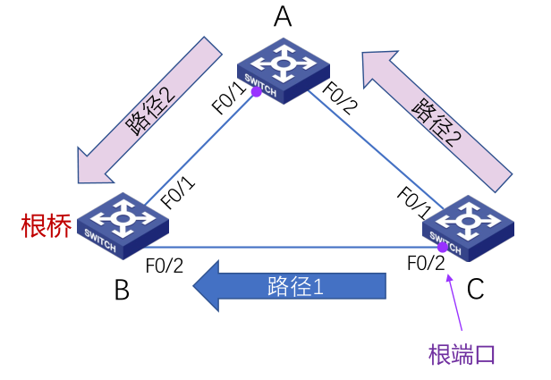

最后要给每一个网段指定端口。指定端口从所有连接到这个网段的交换机端口中选择，我们选择具有最小根路径开销的端口作为指定端口。假如开销相同，则选择ID更小的。
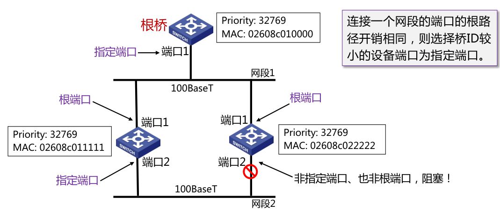

最后对于剩下的端口，则进行阻塞。

### 虚拟局域网
#### 广播域
**广播域**指的是广播帧能够到达的范围。在一般情况下，所有交换机都会对广播帧进行flooding，因此交换机能够隔绝冲突域，但是不能隔绝广播域。
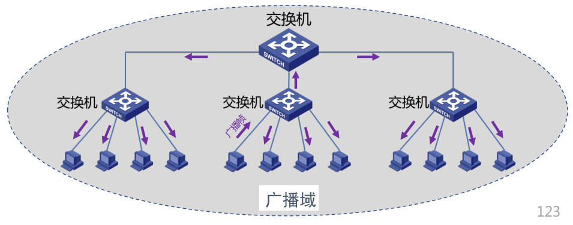

#### 支持VLAN的交换机
VLAN即虚拟局域网，一个VLAN就是一个广播域。使用支持VLAN的交换机可以通过划分VLAN来分隔广播域。
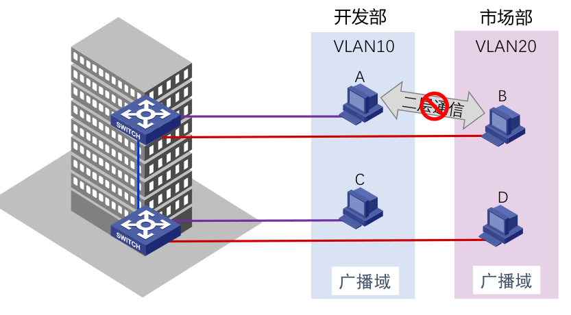

两个虚拟局域网(VLAN)之间的计算机无法通过数据链路层进行通信，想要通信需要使用路由器或者三层交换机。

#### 如何实现VLAN
* 基于端口的VLAN(最常用)
  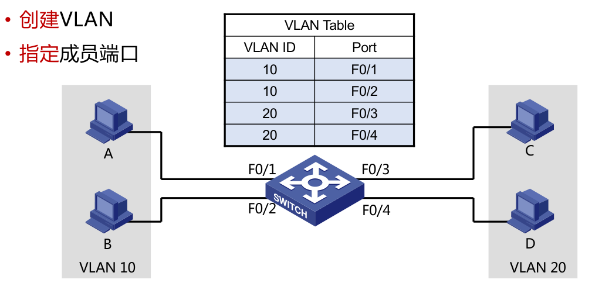
* 基于MAC地址的VLAN
* 基于协议的VLAN，通常需要服务器的参与
* 基于子网的VLAN，一个子网就是一个VLAN

但是可以看出后面两种方式已经违反了计算机网络的分层架构，这里可以看出计算机网络在理论和实践方面有些不同。

#### 如何区分不同VLAN的数据帧
假如在下面这幅图中，灰色的计算机为一个VLAN，白色的计算机属于另一个VLAN。B1和B2分别为两个交换机。
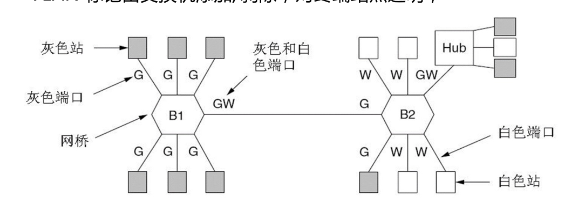

假如左侧一台灰色区域的电脑发送数据帧，该数据帧经由B1传递到了B2，根据传统的情况，B2无法通过端口来判断发送的数据帧具体属于哪个VLAN。因此需要引入新的帧标记标准：IEEE802.1Q。

为了同时支持带VLAN标记的帧(**标记帧**)和不带VLAN标记的帧(**无标记帧**)，IEEE802.1Q对帧格式做了如下调整：
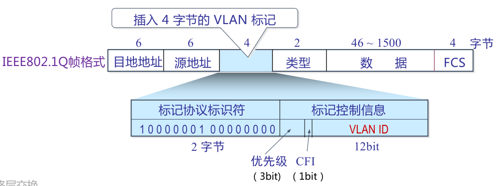

这里相当于增加了一种新的帧格式，对于支持VLAN的交换机，可以识别出该标记；对于不支持的交换机，则相当于接收到了一个不知道类型的数据帧，同样不影响传输。

支持VLAN的交换机有两种端口：
* Access端口：直接与计算机相连
  * 一旦Access端口加入了特定的VLAN，连接在该端口的设备被视为属于该VLAN
  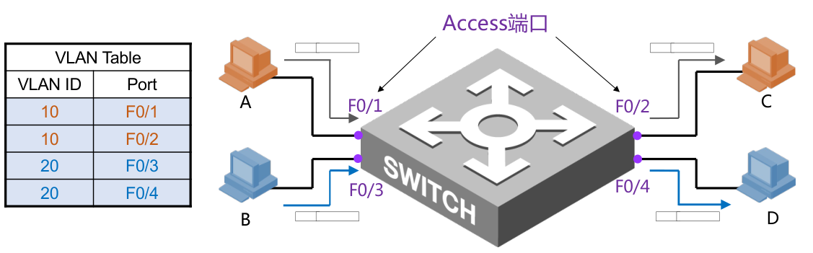
* Trunk端口：用于交换机之间连接
  * VLAN交换机在Trunk端口输出时，负责对Access端口输入的帧打上VLAN标签。因为VLAN对于计算机用户而言是透明的，计算机属于哪个VLAN由交换机决定，所以计算机发送出的帧没有VLAN标签，交换机最后将数据帧送给计算机时也会将VLAN标签去掉。
  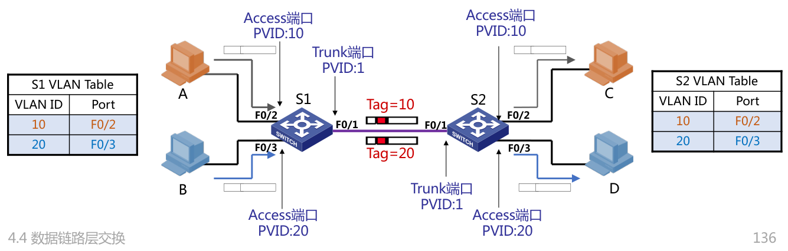
  

## 无线局域网
* 对于以太网，数据链路层采用的是乌托邦式的协议，只发送，不确认。
* 对于无线局域网，数据链路层采用停等式，接收端收到数据之后返回确认帧，发送端如果没有收到确认帧，则重发。同时并不采用pipeline的形式。
### 无线局域网组网模式
#### 基础架构模式

  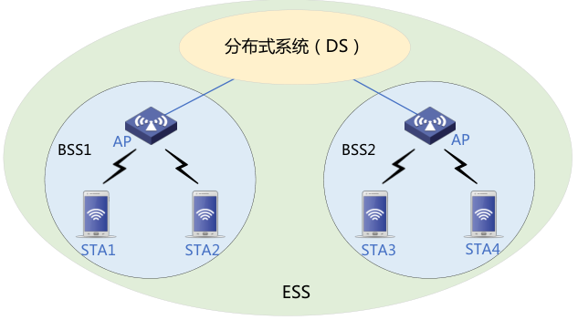
  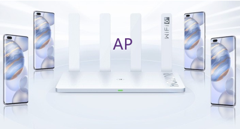

* DS：分布式系统
* AP：访问点
* STA：站点

#### 自组织模式(Ad hoc)
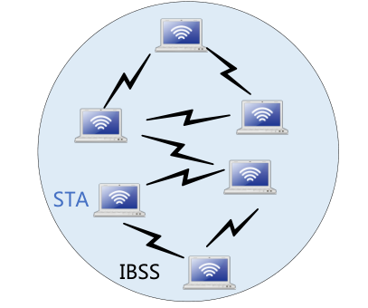

很少使用。

### IEEE802.11介质访问控制
#### 直接将CSMA/CD用于介质访问控制
CSMA/CD是以太网的介质访问控制算法，如果直接用于Wifi的话，会产生以下问题：
* 隐藏终端问题(Hidden Terminal)
* 暴露终端问题(Exposure Terminal)

隐藏终端问题是因为距离太远，导致站点无法检测到某些竞争者的存在。比如下图中A正在向B传输数据，但是C也要向B传输数据，就会产生冲突，同时又无法检测到。
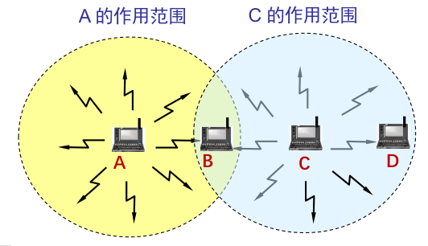

暴露终端问题是某些站点侦听到其他站点的发送而误以为信道忙导致不能发送。比如下图中B正在向A传输数据，C要向D发送数据
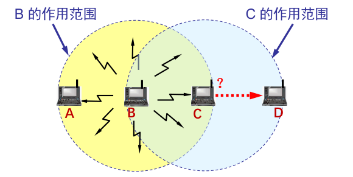

#### CSMA/CA(Carrier Sense Multiple Access with Collision Avoid)
* 当信道空闲时间大于IFS（帧间隙），立即传输
* 当信道忙时，延迟直到当前传输结束+IFS时间
* 开始随机退后过程
  * 从（0，CWindow）中选择一个随机数作为退后计数器（backoff counter）
  * 通过侦听确定每个时间槽是否活动
  * 如果没有活动，则减少退后时间
* 退后过程中如果信道忙，则挂起退后过程（解决站点之间的公平问题）
* 在当前帧传输结束后恢复退后过程

下图为一个CSMA/CA的示例。箭头表示有数据要开始传输。蓝色矩形表示站点正在进行倒计数，淡蓝色网格的矩形则表示倒计数剩下的时间。
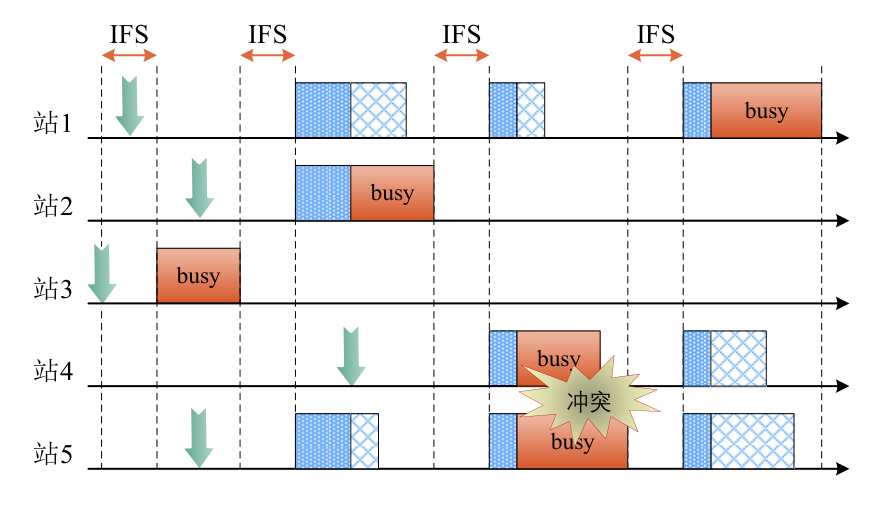

同时需要注意，上图中检查到冲突的方式和以太网不同。CSMA/CA难以直接监测冲突，但是Wifi是有确认的，如果发送端没有收到确认，那么则认为冲突，需要重传数据。

#### 帧间隙与优先级
我们注意到，帧间隙的长短可以控制发送端的优先级。
* SIFS（Short IFS）：最高优先级，用于Ack, CTS, 轮询响应等
* PIFS（PCF IFS）：中等优先级（SIFS+1槽口时间），轮询服务
* DIFS（DCF IFS）：最低优先级（ SIFS+2槽口时间），异步数据服务
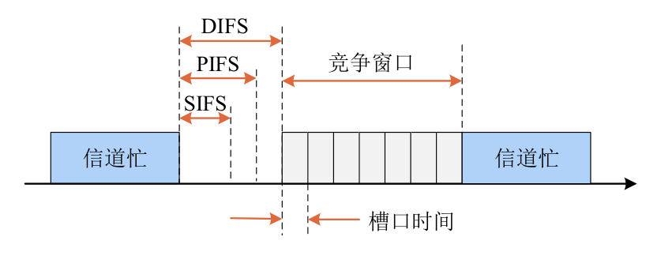

因此像ACK这种信令数据就可以有更高的优先级，这样就不会让发送端误判超时。
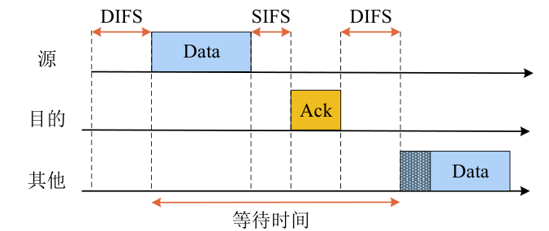

#### RTS-CTS机制(可选机制)
* 发送端在发送前先发送RTS(request to send)，告诉附近的站点自己需要发送数据。
* 接收端在接收到信息之后，会发送CTS(clear to send)，告诉附近的站点自己正在接收数据。
* RTS和CTS中会包含传输的持续时间(Duration)以及发送者、接收者。
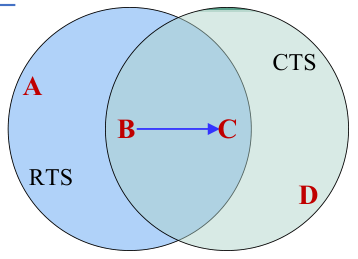

附近相关站点能够收到RTS或CTS，来维护NAV(Network Allocation Vector)，实现**虚拟载波监听**
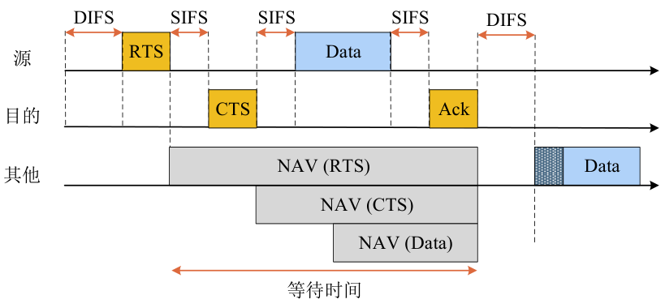

但实际上这种机制默认不使用，因为日常使用很少发生hidden terminal等问题，使用了该机制反而更慢。

