为什么需要传输层？
* 网络层虽然把数据从一台主机传输到另一台，但是还需要解决数据究竟传输到哪个应用程序的问题
* 对于发送数据端而言，有数据需要发送，那么就需要把这些数据收集下来交给网络层进行传输

## 概述和传输层服务
### 传输层的位置
* 传输层位于应用层和网络层之间。基于网络层提供的服务，向分布式应用程序提供通信服务
* 按照因特网的“端到端”设计原则，应用程序只运行在终端上，即不需要为网络设备编写程序
* 站在应用程序的角度，传输层应提供进程之间**本地通信的抽象**。(用户感受不到不同的应用运行在不同的终端上)

### 不同终端上的进程如何通信
* 设想在应用程序和网络之间存在一扇“门”：
  * 需要发送报文时：发送进程将报文推到门外
  * 门外的运输设施（因特网）将报文送到接收进程的门口
  * 需要接收报文时：接收进程打开门，即可收到报文
* 在TCP/IP网络中，这扇“门”称为套接字（socket）

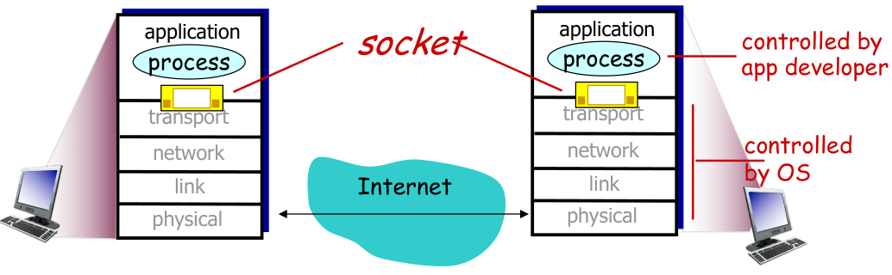

### 传输层提供什么服务？
* 无连接的服务(不可靠)，UDP
* 面向连接的服务(可靠)，TCP
  * 只能保证可靠，但是不能像虚电路一样保证传输质量。因为TCP建立在不可靠的IPv4之上。

### 传输层实现什么功能？
* UDP，最低限度服务
  * 进程到进程的传输
  * 错误校验
* TCP，最低限度服务加上增强服务
  * 进程到进程的传输
  * 错误校验
  * 可靠传输(类似数据链路层，依靠ACK，或者还有pipline使用滑动窗口)
  * 流量控制
  * 拥塞控制

## 套接字编程
### 创建一个网络应用
首先编写一个分布式程序，使其运行在不同的端系统上，并通过网络通信。

然后选择应用程序体系结构，主流的是客户-服务器体系结构（C/S）
* 有一台总是在线的主机，运行一个**服务器程序(server)**，服务器主机具有永久的、众所周知的地址
* 用户终端上运行一个**客户程序（client）**，需要时主动与服务器程序通信，请求服务
* 客户只与服务器通信，客户之间不通信

进程需要一个标识，以便其它进程能够找到它。进程标识包括：
* 主机地址
* 主机上与该进程关联的**端口号**
### 应用编程接口：socket API
应用需**显式地**创建、使用和释放套接字
* 采用客户-服务器模式：
  * 客户总是主动发起通信的一方，服务器始终在等待客户的服务请求到来
* 应用可以通过socket API调用两种传输服务:
  * 不可靠的数据报服务：由UDP协议实现
  * 可靠的字节流服务：由TCP协议实现

#### 基于UDP的套接字通信流程
服务器端可以服务许多客户端，同时对客户端先来先服务的原则。
服务器可以被网络攻击者攻击，即控制大量机器访问该服务器，让正常用户无法访问。

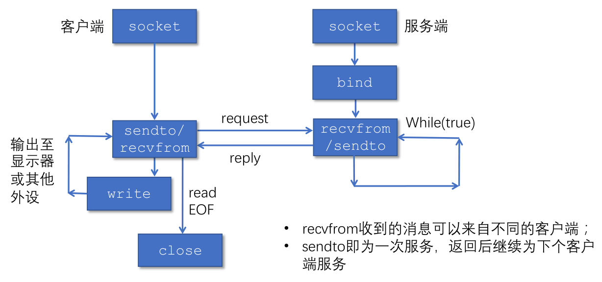

#### 使用TCP套接字实现回音服务
使用TCP套接字编程时，可将TCP连接想像成一对套接字之间的一条封闭管道：
* 发送端TCP将要发送的字节序列从管道的一端（套接字）送入
* 接收端TCP从管道的另一端（套接字）取出字节序列
* 在管道中传输的字节不丢失，并**保持顺序**

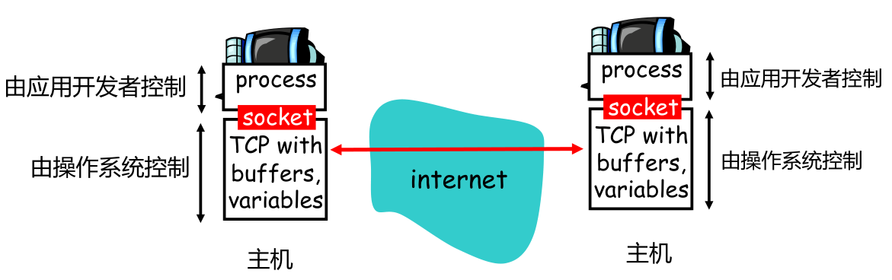

#### 服务器使用多个套接字服务客户
* 服务器进程在监听套接字上等待客户的连接请求
* 客户进程创建一个本地套接字，与服务器的监听套接字通信。
  * 在此过程中，客户TCP向服务器TCP发送连接请求
* 收到连接请求后，服务器进程创建一个临时套接字（称**连接套接字**）和一个**新的服务器进程**，与客户进程通信
* 服务器进程回到监听套接字上继续等待。
  * 此举允许服务器同时服务多个客户
* 客户服务结束后，服务器销毁进程，关闭连接套接字

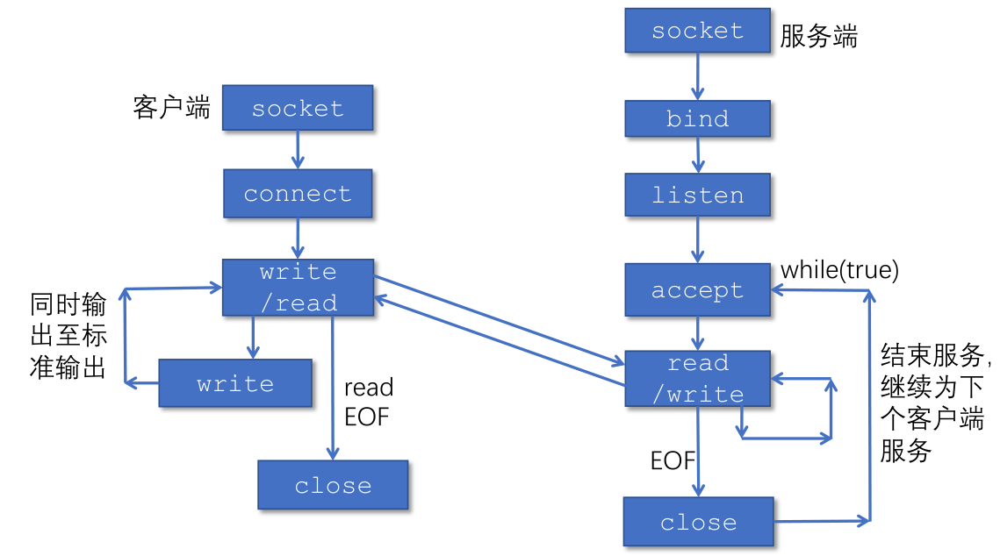

## 传输层复用和分用
* （发送端）复用：传输层从多个套接字收集数据，交给网络层发送
* （接收端）分用：传输层将从网络层收到的数据，交付给正确的套接字

就像寄信，要把信送给同一个地方的每个人，地址就相当于IP地址，名字就相当于端口号。
### 套接字标识与端口号
* 端口号是套接字标识的一部分：
  * 每个套接字在本地关联一个端口号
  * 端口号是一个16比特的数
* 端口号的分类：
  * 熟知端口：0～1023，由公共域协议使用
  * 注册端口：1024～49151，需要向IANA注册才能使用
  * 动态和/或私有端口：49152～65535，一般程序使用

## 无连接传输：UDP
### UDP提供的服务
* UDP提供的服务：
    * 进程到进程之间的报文交付
    * 报文完整性检查（可选）：检测并丢弃出错的报文
* UDP需要实现的功能：
    * 复用和分用
    * 报文检错

### UDP报文段结构
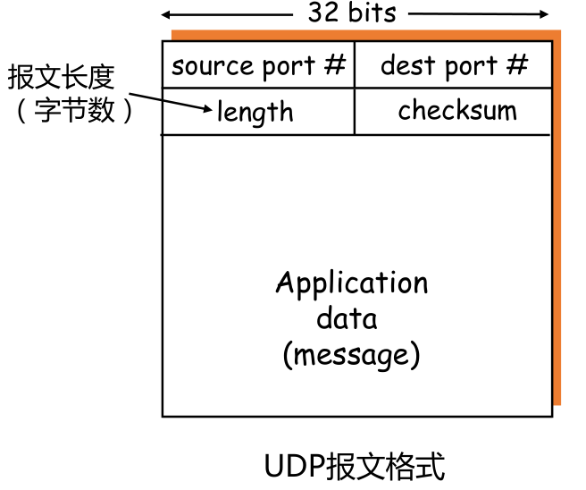

* 用于复用和分用的字段：源端口号，目的端口号
* 用于检测报文错误的字段：报文总长度，校验和（checksum）

### UDP校验和计算
计算UDP校验和时，要包括伪头、UDP头和数据三个部分
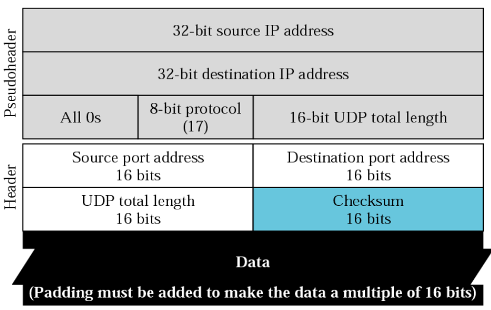

### 为什么需要UDP
* 应用可以尽可能快地发送报文：
  * 无建立连接的延迟
  * 不限制发送速率（不进行拥塞控制和流量控制）
* 报头开销小
* 协议处理简单

UDP适合哪些应用？
* 容忍丢，但对延迟敏感的应用，如流媒体
* 以单次请求/响应为主的应用，如DNS
* 若应用要求基于UDP进行可靠传输。由应用层实现可靠性

UDP包通常不能穿过防火墙。

## 面向连接的传输：TCP
### TCP 概述
* TCP服务模型在一对通信的进程之间提供一条理想的字节流管道
* 点到点通信:仅涉及一对通信进程
  * 因为会创建临时的套接字和进程来处理
* 全双工：可以同时双向传输数据
* 可靠、有序的字节流：不保留报文边界

需要的机制
* 建立连接:
    * 通信双方为本次通信建立数据传输所需的状态（套接字、缓存、变量等）
* 可靠数据传输：
    * 流水线式发送，报文段检错，丢失重传
* 流量控制:
    * 发送方不会令接收方缓存溢出

### TCP报文段结构
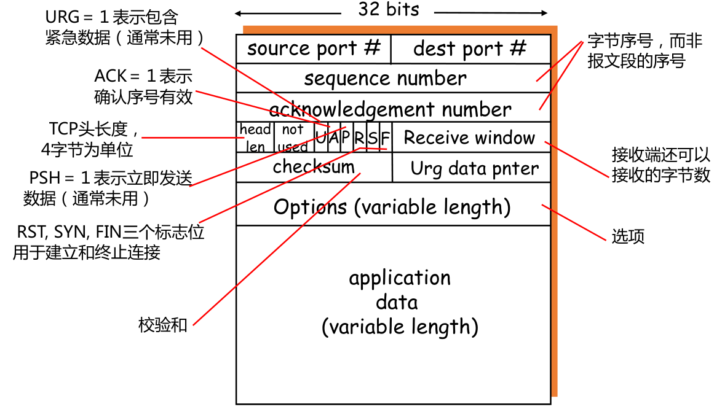

#### 重要的TCP选项
* 最大段长度（MSS）：
    * TCP段中可以携带的最大数据字节数
    * 建立连接时，每个主机可声明自己能够接受的MSS，缺省为536字节
* 窗口比例因子（window scale）：
    * 建立连接时，双方可以协商一个窗口比例因子
    * 实际接收窗口大小 = window size * 2^window scale
* 选择确认（SACK）：
    * 最初的TCP协议只使用累积确认
    * 改进的TCP协议引入选择确认，允许接收端指出缺失的数据字节

### TCP可靠数据传输
TCP 在不可靠的IP服务上建立可靠的数据传输
* 基本机制
    * 发送端：流水线式发送数据、等待确认、超时重传
    * 接收端：进行差错检测，采用累积确认机制
* 乱序段处理：协议没有明确规定
    * 接收端不缓存：可以正常工作，处理简单，但效率低
    * 接收端缓存：效率高，但处理复杂

#### 一个高度简化的TCP协议
* 接收方：
    * 确认方式：采用**累积确认**，仅在正确、按序收到报文段后，更新确认序号；其余情况，重复前一次的确认序号（与GBN类似）
    * 失序报文段处理：**缓存**失序的报文段（与SR类似）
* 发送方：
    * 发送策略：流水线式发送报文段
    * 定时器的使用：仅对最早未确认的报文段使用**一个重传定时器**（与GBN类似）
    * 重发策略：仅在超时后**重发最早未确认的报文段**（与SR类似，因为接收端缓存了失序的报文段）

#### TCP 发送方
在此协议下，TCP发送方要处理的事件有：
* 收到应用数据：
    * 创建并发送TCP报文段
    * 若当前没有定时器在运行（没有已发送、未确认的报文段），启动定时器
* 超时:
    * 重传包含最小序号的、未确认的报文段
    * 重启定时器
* 收到ACK：
    * 如果确认序号大于基序号（已发送未确认的最小序号）：
    * 推进发送窗口（更新基序号）
    * 如果发送窗口中还有未确认的报文段，启动定时器，否则终止定时器

##### 如何设置超时值
* 若超时值太小，容易产生不必要的重传
* 若超时值太大，则丢包恢复的时间太长

超时值应大于RTT，但RTT是变化的，所以先估计RTT。
* **SampleRTT**：RTT是变化的，需要实时测量从发出某个报文段到收到其确认报文段之间经过的时间，该时间即为 SampleRTT。
* **EstimatedRTT**：由于 SampleRTT 波动很大，更有意义的是计算其平均值，该平均值即为 EstimatedRTT。

使用指数加权移动平均估算 EstimatedRTT：
$$
EstimatedRTT = (1- a)* EstimatedRTT + a* SampleRTT
$$

通常 $a=0.125$
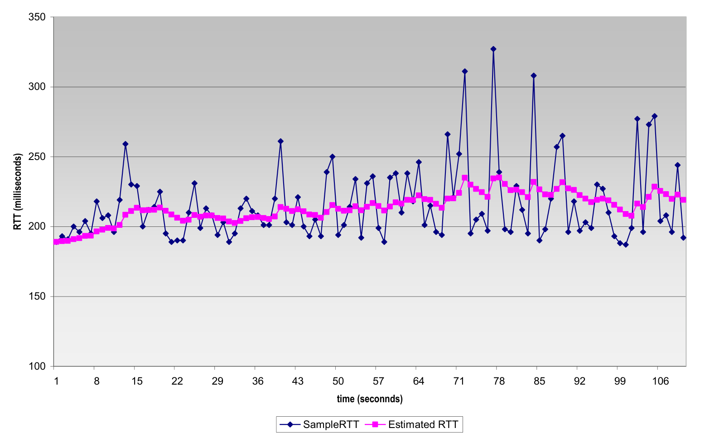

估算出RTT之后，我们希望超时值 TimeoutInterval 能够比 EstimatedRTT 大一些，满足使得大多数正常传输不超时。TimeoutInterval 和 TimeoutInterval 之间的差值应当与 RTT 的波动幅度相关，这里考虑 DevRTT。其中
$$
DevRTT = (1-b)*DevRTT + b*|SampleRTT-EstimatedRTT|
$$

通常 $b=0.25$
##### TCP确认的二义性
* TCP确认的二义性问题：
    * 重传的TCP报文段使用与原报文段相同的序号
    * 发送端收到确认后 ，无法得知是对哪个报文段进行的确认
* 二义性确认带来的问题：
    * 对重传报文段测量的SampleRTT，可能不准确
* 解决方法：
    * 忽略有二义性的确认，只对一次发送成功的报文段测量SampleRTT ，并更新EstimtedRTT
    * 当TCP重传一个段时，停止测量SampleRTT

  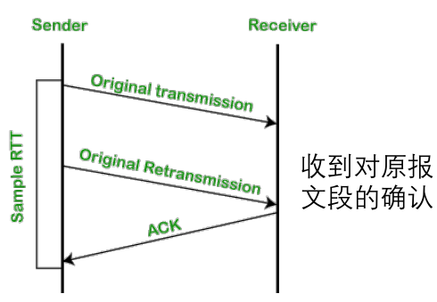
  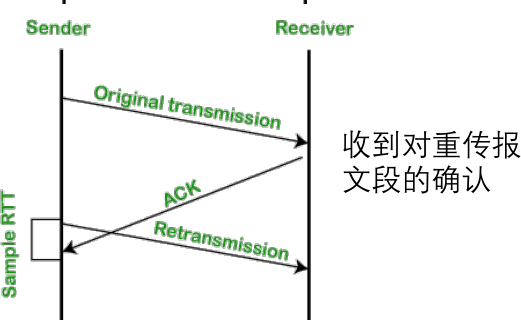

##### 定时器补偿
如果为了解决TCP确认的二义性，而停止测量SampleRTT，可能会面临下面的问题：
* 简单忽略重传报文段的问题：
    * 重传意味着超时值可能偏小了，需要增大
    * 若简单忽略重传报文段（不更新EstimtedRTT），则超时值也不会更新，超时设置过小的问题没有解决
* 解决方法：
    * 采用定时器补偿策略，发送方每重传一个报文段，就直接将超时值增大一倍（不依赖于RTT的更新）
    * 若连续发生超时事件，超时值呈指数增长（至一个设定的上限值）

Karn算法结合使用RTT估计值和定时器补偿策略确定超时值：
* 使用EstimatedRTT估计初始的超时值
* 若发生超时，每次重传时对定时器进行补偿，*直到成功传输一个报文段为止*
* 若收到上层应用数据、或某个报文段没有重传就被确认了，用最近的EstimatedRTT估计超时值

#### TCP的接收端
理论上，接收端只需区分两种情况：
* 收到期待的报文段：发送更新的确认序号
* 其它情况：重复当前的确认序号

##### 推迟确认
* 为减小通信量，TCP允许接收端推迟确认：
  * 接收端可以在收到若干个报文段后，发送一个累积确认的报文段
* 推迟确认带来的问题：
  * 若延迟太大，会导致不必要的重传
  * 推迟确认造成RTT估计不准确
* TCP协议规定：
  * 推迟确认的时间最多为500ms
  * 接收方至少每隔一个报文段使用正常方式进行确认

##### 快速重传
仅靠超时重发丢失的报文段，恢复太慢，因此发送方可利用重复ACK检测报文段丢失：
* 发送方通常连续发送许多报文段
* 若仅有个别报文段丢失，发送方将收到多个重复序号的ACK
* 多数情况下IP按序交付分组，重复ACK极有可能因丢包产生

TCP协议规定：当发送方收到对同一序号的3次重复确认时，立即重发包含该序号的报文段。
所谓快速重传，就是在定时器到期前重发丢失的报文段

### TCP流量控制
#### 接收缓存
TCP接收端有一个接收缓存，接收端TCP将收到的数据放入接收缓存，应用进程从接收缓存中读数据。如果接收缓存中的数据未及时取走，后续到达的数据可能会因缓存溢出而丢失。
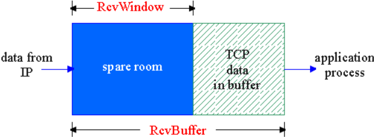

因此流量控制希望发送端TCP通过调节发送速率，不使接收端缓存溢出。

#### TCP如何进行流量控制
接收缓存中的可用空间称为接收窗口：
$$
RcvWindow = RcvBuffer-[LastByteRcvd -LastByteRead]
$$

接收方将 RcvWindow 放在报头中，向发送方通告接收缓存的可用空间，从而发送方限制未确认的字节数不超过接收窗口的大小，即：
$$
LastByteSent-LastByteAcked ≦ RcvWindow
$$

#### 非零窗口通告与零窗口探测
在理论上，当接收窗口为0时，发送方必须停止发送；当接收窗口变为非0时，接收方应通告增大的接收窗口。而在TCP协议中，触发一次TCP传输需要满足以下三个条件之一：
* 应用程序调用
* 超时
* 收到数据/确认

对于单向传输中的接收方，只有第三个条件能触发传输，但是当发送方停止发送后，接收方不再收到数据，无法返回确认。因此就产生了一个死锁。要解决这个问题，发送端在接收到**零窗口通告之后**，可以采用**零窗口探测**。

即发送端收到零窗口通告时，启动一个**坚持定时器**，定时器超时后，发送端发送一个零窗口探测报文段（序号为上一个段中最后一个字节的序号）。接收端在响应的报文段中通告当前接收窗口的大小，若发送端仍收到零窗口通告，重新启动坚持定时器

### TCP连接管理

## TCP拥塞控制
TCP拥塞控制需要回答三个问题：
* 发送方如何感知网络拥塞？
* 发送方采用什么机制来限制发送速率？
* 发送方感知到网络拥塞后，采取什么策略调节发送速率？

### 拥塞检测和速率限制
**发送方如何感知网络拥塞**：
由于拥塞发生在网络层，因此发送方只能利用丢包事件感知拥塞。拥塞会造成丢包和分组延迟增大，那么对于传输层来说，无论是丢包还是分组延迟过大，对于发送端来说都是丢包了。

**发送方采用什么机制限制发送速率**：
和流量控制中的接收窗口类似，发送方使用拥塞窗口 cwnd 限制已发送未确认的数据量。
$$
LastByteSent-LastByteAcked \le  cwnd
$$
$$
rate =\frac{cwnd}{RTT}Bytes/sec
$$

### 拥塞窗口的调节策略：AIMD
* 乘性减（**M**ultiplicative **D**ecrease）:发送方检测到丢包后，将cwnd的大小减半（但不能小于一个MSS）。目的：迅速减小发送速率，缓解拥塞
* 加性增（**A**dditive **I**ncrease）：若无丢包，每经过一个RTT，将cwnd增大一个MSS，直到检测到丢包。目的：缓慢增大发送速率，避免振荡

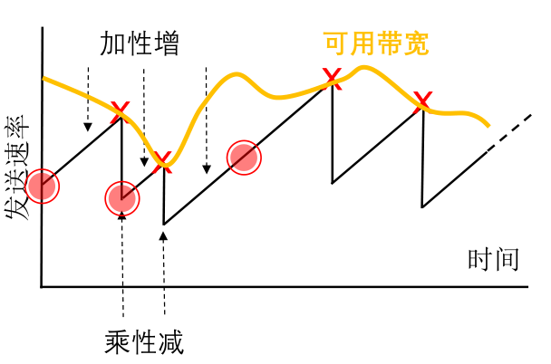

### TCP慢启动 (Slow Start)
优秀的拥塞窗口的调节策略希望发送速率能够尽可能地贴近可用的带宽，而AIMD策略使用加性增的变化速度太慢。因此这里引入慢启动。

慢启动的基本思想：
* 在新建连接上**指数增大**cwnd，直至检测到丢包（此时终止慢启动）
* 希望迅速增大cwnd至可用的发送速度

### 区分不同的丢包事件
超时和收到3个重复的ACK，它们反映出来的网络拥塞程度是步一样的。
* 超时：说明网络交付能力很差
* 收到3个重复的ACK：说明网络仍有一定的交付能力

因此目前的TCP实现区分上述两种不同的丢包事件

* 收到3个重复的ACK：
    * 将cwnd降至一半
    * 使用AIMD调节cwnd
* 超时：
    * 设置门限 =cwnd/2
    * cwnd=1MSS
    * 使用慢启动增大cwnd至门限
    * 使用AIMD调节cwnd

### TCP拥塞控制的实现
发送方维护变量ssthresh，发生丢包时，ssthresh=cwnd/2，
ssthresh是从慢启动转为拥塞避免(Congestion Avoidance) 的分水岭：
* cwnd低于门限时，执行慢启动
* cwnd高于门限：执行拥塞避免
拥塞避免阶段，拥塞窗口线性增长：每当收到ACK， cwnd=cwnd + MSS*(MSS/cwnd)

检测到3个重复的ACK后：
* TCP Reno实现： cwnd= ssthresh+3MSS，线性增长
* TCP Tahoe实现：cwnd=1 MSS，慢启动

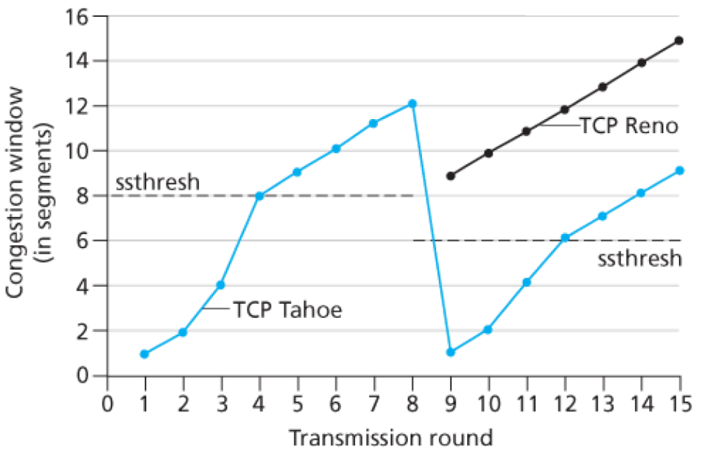

