## 网络实例
### 互联网的构成
* 网络边缘
  * 端系统：位于互联网边缘与互联网相连的计算机和其他设备
  * 端系统由各类主机(host)构成：桌面计算机、移动计算机、服务器、其他智能终端设备
* 网络核心
  *  由互联端系统的分组交换设备和通信链路构成的网状网络
     * 分组交换设备(路由器、链路层交换机)
     * 连接分组交换设备的通信链路(光纤、铜缆、无线电、激光链路)

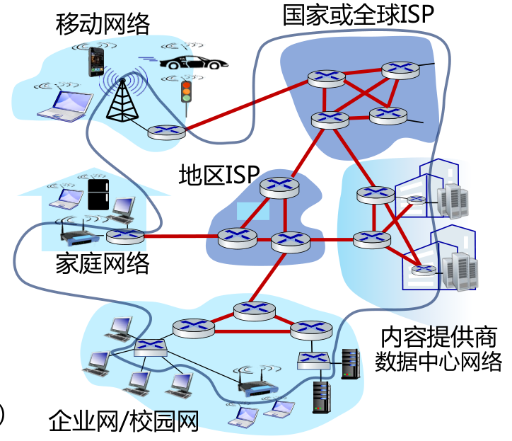

按照网络范围来分
* 个域网PAN (Personal Area Network)
  * 能在便携式消费电器与通信设备之间进行短距离通信的网络
  * 覆盖范围一般在10米半径以内，如蓝牙耳机等
* 局域网LAN(Local Area Network)
  * 局部地区形成的区域网络，如企业网络
  * 分布地区范围有限，可大可小，大到一栋建筑、小到办公室内的组网
  * 电脑WLAN接入，打印机共享等等
* 城域网MAN(Metropolitan Area Network )
  * 范围覆盖一个城市的网络
* 广域网WAN(Wide Area Network)
  * 覆盖很大地理区域，乃至覆盖地区和国家

按照ISP类型来分
* Tier-1 ISP
  * 全球最高级别ISP，互不结算
  * 比如中国电信、美国AT&T
* Tier-2 ISP
  * 如教育网
  * 需要向更高级别的ISP交流量费

Internet：特指遵循 TCP/IP 标准、利用路由器将各种计算机网络互连起来而形成的、覆盖全球的、特定的互连网，是一个专有名词。

### 网络边缘
主机包括
* 客户端：便携机、智能手机、平板电脑，智能手环等各类智能终端(都需要连入网络)
* 服务器：(服务器通常位于数据中心)

主机的功能主要是运行应用程序、产生和接受信息。

#### 接入网概述
接入网的目标是将主机连接到边缘路由器上(**边缘路由器**是端系统Host去往任何其他远程端系统的路径上的第一台路由器)

接入网有有线接入和无线接入的方式。

* 光纤到户FTTH：带宽大，线路稳定，在我国广泛使用
  * 分为有源光纤网络AON和无源光纤网络PON
  * PON中包括OLT(局部的光线路终端)和ONU光网络单元(如光猫ONT)，光猫ONT通过一个或多个无源分光器，连接到局端的光线路终端OLT
  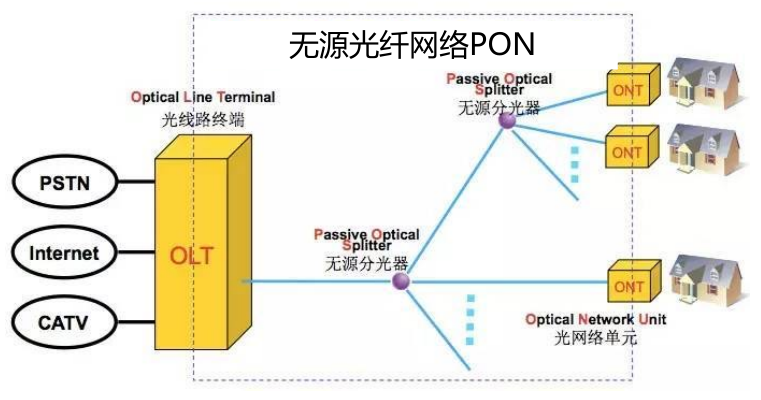
* 数字用户线DSL(Digital Subscriber Line)
  * 复用之前的电话线，使用的是双绞线，成本低(国外使用广泛)
  * 上下行速率不对称
  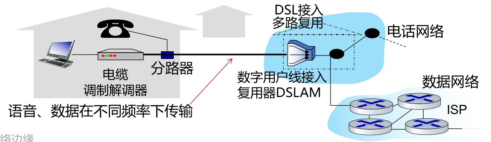
* 同轴电缆
  * 复用有线电视线，多个家庭共享有线电视的头端
  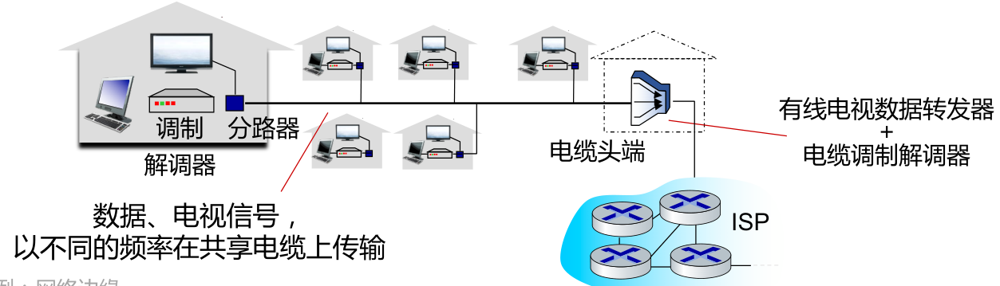
* 无线局域网(WLAN)
  * 通常在建筑物内或者周围
* 广域蜂窝接入网
  * 由移动蜂窝运营商提供

#### 物理介质
* 引导型介质：信号在固体介质中传播，例如铜、光纤、同轴电缆
* 非引导型介质：信号自由传播，例如无线电(陆地无线电、卫星无线电信道)

主要的物理介质介绍：
* 光纤：玻璃纤维携带光脉冲，每个脉冲一位；高速运行；低错误率
* 双绞线：两根绝缘铜线互相缠绕为一对
  * 电话线为1对双绞线；网线为4对双绞线，广泛用于计算机网络(以太网)双向传输
  * 第5类：100 Mbps~1 Gbps；第6类：10Gbps
* 同轴电缆：两根同心铜导线，双向传输
* 无线电：电磁频谱中各种“波段”携带的信号，半双工(发送方到接收方)
  * 无线局域网(WiFi)10-100 Mbps；10米
  * 广域(如3/4/5G蜂窝)，在~10公里范围内
  * 蓝牙：短距离，有限速率
  * 地面微波：点对点；45 Mbps
  * 卫星
    * 同步卫星：36000km高空， 280毫秒的往返时延
    * 低轨卫星：近地，但围绕地球高速运动，需要大量卫星才能覆盖地球(采用低轨卫星降低通信时延)

### 网络核心
* 目标：将海量的端系统互联起来
* 由各类交换机(路由器)和链路，构成的网状网络

网络核心的两大功能：
* 路由(全局操作)：确定数据分组从源到目标所使用的路径，需要路由协议和路由算法**产生路由表**
* 转发(本地操作)：路由器或交换机将接收到的数据分组转发出去(即移动到该设备的某个输出接口)。根据从“入接口”收到分组头中的目的地址，**查找本地路由表**，确定“出接口”。

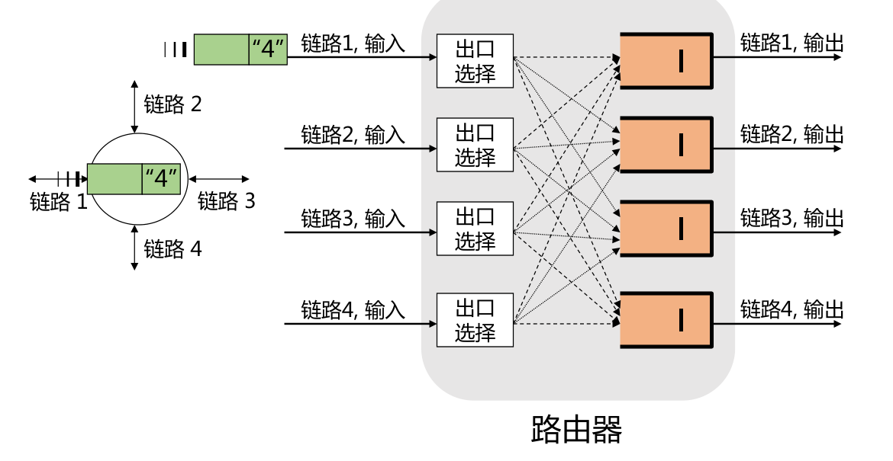

#### 分组交换
* 分组交换(packet switching)：通信双方以分组为单位、使用存储-转发机制，实现数据交互的通信方式
  * 每个分组的首部都含有地址(目的地址和源地址)等控制信息
  * 每个分组在互联网中独立地选择传输路径，因此一个报文可以被拆成分组之后通过不同路径到达目的地。
  * 支持灵活的统计多路复用

**存储转发技术**：路由器需要接收到完整的整个数据分组以后，才能开始下一跳发送
**统计多路复用**(statistical multiplexing)：主机A和B的报文分组按需共享带宽，
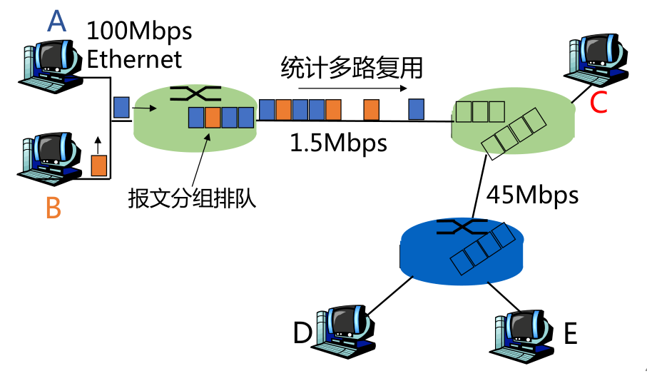

#### 电路交换
面向连接的方式

先呼叫建立连接，实现端到端的资源(链路带宽资源、交换机的交换能力)预留，物理通路被通信双方独占，资源专用，即使空闲也不与其他连接共享。

* 优点：由于建立连接并预留资源，因此传输性能好；
* 缺点：但如果传输中发生设备故障，则传输被中断。同时资源独占比较浪费。

电路交换的多路复用：
* **频分多路复用**FDM(按照频段高低不同)
* **时分多路复用**TDM(按照时间切片)

#### 报文交换
与分组交换类似，采用存储转发方式，但不将应用的大报文拆分成多个分组

几种交换方式的比较
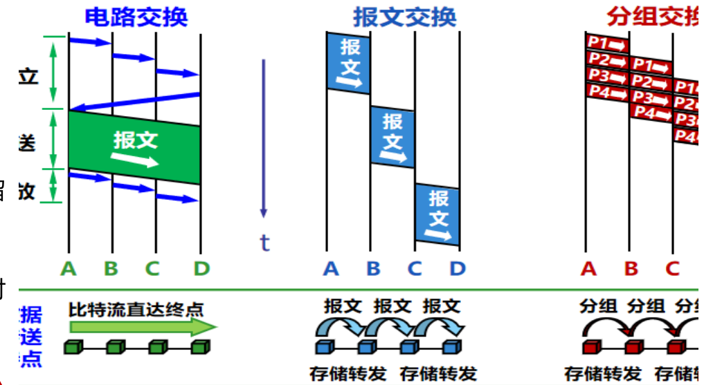

## 网络协议
网络协议是为进行网络中的数据交换而建立的规则、标准或约定。通信双方需要共同遵守，互相理解。

### 网络协议三要素
* 语法：规定传输数据的格式(如何讲)
* 语义：规定所要完成的功能(讲什么)
* 时序：规定各种操作的顺序(双方讲话的顺序)

### 协议层次结构
* 层次栈
  * 为了降低网络设计的复杂性，大部分网络都组成一个层次栈，每一层都建立在其下一层的基础上
* 对等实体
  * 不同机器上构成相应层次的实体成为对等实体
* 接口
  * 在每一对相邻层次之间的是接口；接口定义了下层向上层提供哪些**原语操作与服务**
* 网络体系结构
  * 层和协议的集合为网络体系结构，一个特定的系统所使用的一组协议，即每层的协议，称为**协议栈**
  
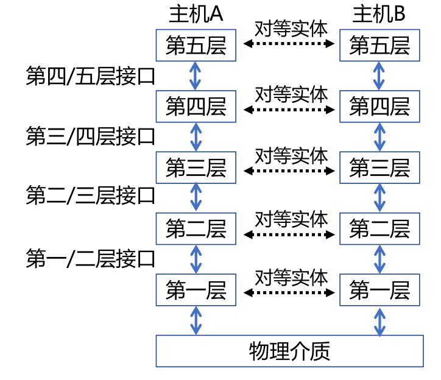

#### 服务原语
服务分类
* 面向连接：按照电话系统模型建立的
* 无连接：按照邮政系统模型建立的

服务由一组可用于用户进程以访问服务的原语(操作)形式指定，原语告诉服务执行某些操作或报告对等实体所采取的操作

面向连接服务的核心服务原语：
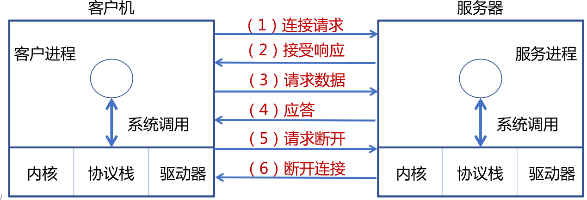

### 服务与协议的关系
* 协议是“水平”的，服务是“垂直”的
* 实体使用协议来实现其定义的服务
* 上层实体通过接口使用下层实体的服务

## 参考模型
### 参考模型的必要性
分层结构、统一标准、模块独立，能够满足计算机网络的复杂和异构，以及技术快速更新迭代的问题。

### OSI参考模型
#### 物理层(Physical Layer)
* 定义如何在信道上传输0、1：Bits on the wire
* 机械接口(Mechanical)：网线接口大小形状、线缆排列等
* 电子信号(Electronic)：电压、电流等
* 时序接口(Timing)：采样频率、波特率、比特率等
* 介质(Medium)：各种线缆、无线频谱等
#### 数据链路层 (Data Link Layer)
* 实现**相邻(Neighboring)网络实体**间的数据传输
* 成帧(Framing)：从物理层的比特流中提取出完整的帧。形成帧有利于帮助数据的校验和纠错，为提供**可靠数据通信**提供可能
* 为设备提供**物理地址(MAC address)**：48位，设备的唯一网络标识，烧录在网卡，能够提供厂商信息。
* 提供流量控制，避免“淹没”(overwhelming):当快速的发送端遇上慢速的接收端，接收端缓存溢出
* 局域网**共享信道**上的访问控制(MAC)：同一个信道，同时传输信号，因此需要控制让信道满足多个设备的需求。
#### 网络层 (Network Layer)
* 将数据包跨越网络从**源设备**发送到**目的设备**(host to host)
* 使用IP地址，包含区域信息，便于查找
* 路由(Routing)：在网络中选取从源端到目的端转发路径，常常会根据网络可达性动态选取最佳路径，也可以使用静态路由
* 路由协议：路由器之间交互路由信息所遵循的协议规范，使得单个路由器能够获取网络的可达性等信息
* 服务质量(QoS)控制：处理网络拥塞、负载均衡、准入控制、保障延迟
* 异构网络互联：在异构编址和异构网络中路由寻址和转发
#### 传输层 (Transport Layer)
* 将数据从源**端口**发送到目的**端口**(**进程**到**进程**)
* 网络层的控制主要面向*运营商*，传输层为*终端用户*提供端到端的数据传输控制
* 两类模式：可靠的传输模式(如TCP)，或不可靠传输模式(如UDP)
    * 可靠传输：可靠的端到端数据传输，适合于对通信质量有要求的应用场景，如文件传输等
    * 不可靠传输：更快捷、更轻量的端到端数据传输，适合于对通信质量要求不高，对通信响应速度要求高的应用场景，如语音对话、视频会议等
#### 会话层 (Session Layer)
* 利用传输层提供的服务，在应用程序之间建立和维持会话，并能使会话获得同步
#### 表示层(Presentation Layer)
* 关注所传递信息的语法和语义，管理数据的表示方法，传输的数据结构
#### 应用层(Application Layer)
* 通过应用层协议，提供应用程序便捷的网络服务调用

### TCP/IP参考模型
* 链路层(Link Layer)
    * 描述了为满足无连接的互联网络层需求，链路必须具备的功能
* 互联网层(Internet Layer)
    * 允许主机将数据包注入网络，让这些数据包独立的传输至目的地，并定义了数据包格式和协议(IPv4协议和IPv6协议)
* 传输层(Transport Layer)
    * 允许源主机与目标主机上的对等实体，进行端到端的数据传输：TCP，UDP
* 应用层(Application Layer)
    * 传输层之上的所有高层协议：DNS、HTTP、FTP、SMTP...

先有TCP/IP协议栈，然后有TCP/IP参考模型，参考模型只是用来描述协议栈的

IP分组交换的特点
* 可在各种底层物理网络上运行(IP over everything)
* 可支持各类上层应用(Everything over IP)
* 每个IP分组携带各自的目的地址，网络核心功能简单(通过路由表转发分组)，适应爆炸性增长

TCP/IP沙漏模型：
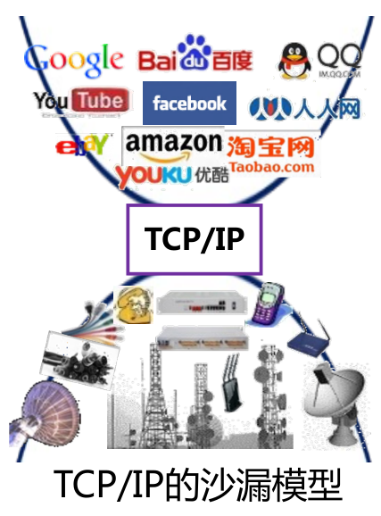

### 分层模型与网络实例
分层模型与网络实例：
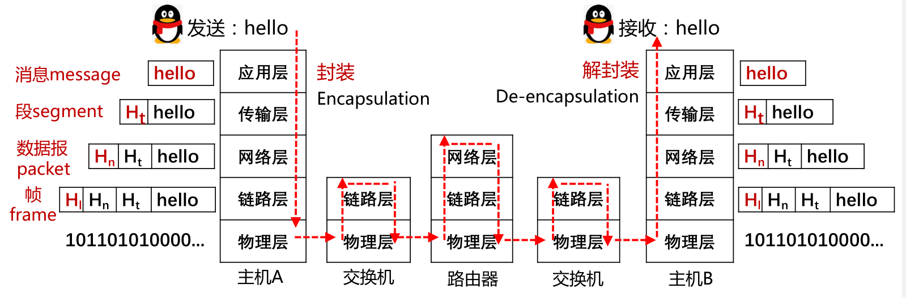

不同层对应不同的协议数据单元(PDU Protocol Data Unit)

## 计算机网络度量单位
* 比特率(bit rate)：**主机**在数字信道上传送数据的速率，也称数据率，单位是b/s(比特每秒)，也可以写为bps，(bit per second)，或 kbit/s、Mbit/s、 Gbit/s等
* 带宽：网络中**某通道**传送数据的能力，即单位时间内网络中的某信道所能通过的“最高数据率”，单位是 bit/s，即 “比特每秒”
* 包转发率(PPS)
  * 全称是Packet Per Second(包/秒)，表示交换机或路由器等网络设备以包为单位的转发速率
  * 线速转发：交换机端口在满负载的情况下，对帧进行转发时能够达到该端口线路的最高速度
*  时延(Delay)：时延 (delay 或 latency) 是指数据(一个报文或分组)从网络(或链路)的一端传送到另一端所需的时间，也称为延迟或迟延
   * 传输时延(transmission delay)：数据**从结点进入到传输媒体介质**所需要的时间，传输时延又称为发送时延
   * 传播时延(propagation delay)：电磁波**在信道中**需要传播一定距离而花费的时间
   * 处理时延(processing delay)：主机或路由器在收到分组时，为**处理分组**(例如分析首部、提取数据、差错检验或查找路由)所花费的时间
   * 排队时延(queueing delay)：分组在路由器输入输出队列中**排队等待**处理所经历的时延
   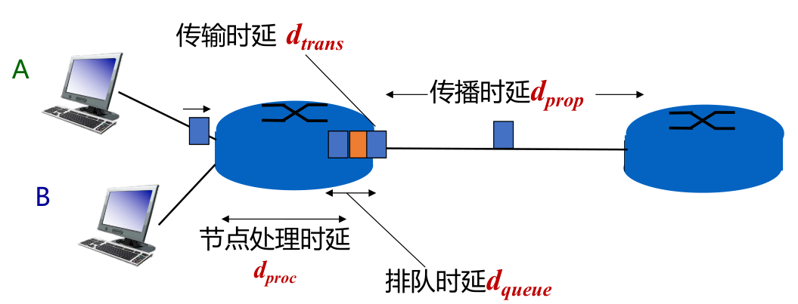
    总时延 $d_{total}=d_{proc}+d_{queue}+d_{trans}+d_{prop}$
* 往返时延RTT(Round-Trip Time)：从发送方发送数据开始，到发送方收到来自接收方的确认，经历的总时间
* 时延带宽积 = 传播时延 $\times$ 带宽，即按比特计数的链路长度。可以理解为需要多少个bit才能把传播的链路塞满(可以把链路想象成水管，时延带宽积就是水管的体积)
* 吞吐量 (throughput)
    * 单位时间内通过某个网络(或信道、接口)的数据量，单位是 b/s
* 有效吞吐量(goodput)
    * 单位时间内，目的地正确接收到的有用信息的数目（以 bit 为单位）
* 利用率
    * **信道利用率**指出某信道有百分之几的时间是被利用的
    * **网络利用率**则是全网络的信道利用率的加权平均值
* 丢包率
    * 所丢失数据包的数量占所发送数据包的比率
* 时延抖动：变化的时延称为抖动（Jitter）
  * 时延抖动起源于网络中的队列或缓冲，抖动难以精确预测
  * 在语音、视频多媒体业务中，抖动往往会严重影响用户的体验

