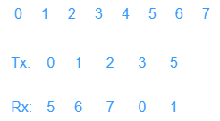

## 数据链路层的设计
### 数据链路层在协议栈中的位置
* 向下：利用物理层提供的位流服务
* 向上：向网络层提供明确的 (well-defined) 服务接口

在局域网中，数据链路层(DLL)还会分成逻辑链路控制(LLC)和介质访问控制(MAC)。局域网属于通信质量比较高的共享信道，而本章考虑的主要是经典的数据链路层，考虑点对点的通信。

### 数据链路层提供的服务
用确认的有无以及连接的有无做区分
* 确认指的是接收方接收到信息之后是否会发送确认信息给发送方
* 连接的有无指的是状态的有无,状态用于记录通信过程中发生的事，比如发送方是谁，数据的传输量等历史信息，可以用来做认证或者提供更可靠的服务

服务的种类：
* 无确认 无连接 服务(Unacknowledged connectionless)
    • 接收方不对收到的帧进行确认
    • 适用场景：误码率低的可靠信道；实时通信；
    • 网络实例：以太网(有线传输)
* 有确认 无连接 服务(Acknowledged connectionless)
    • 每一帧都得到单独的确认
    • 适用场景：不可靠的信道(无线信道)
    • 网络实例：802.11
* 有确认 有连接 服务(Acknowledged connection-oriented)
    • 适用场景：长延迟的不可靠信道

事实上也存在无确认有连接的服务，这里的连接主要记录信息，用于收费。

### 数据链路层的功能
* 成帧(最大的功能)
  * 将比特流划分成“帧”的主要目的是为了检测和纠正物理层在比特传输中可能出现的错误
* 差错控制
  * 比如说一些错误或者丢失
* 流量控制
  * 解决传输两侧传输速率不匹配的问题，防止高速率的发送方发送的数据不会淹没低速率的接收方，避免**缓冲区溢出**

### 成帧——如何表示一个帧的开始
分组(packet)和帧(frame)的关系

只有确定帧的开始，才能进行帧的**定界**和**同步**(指的是上一帧没接受成功，但是通过定界符可以知道下一帧，因此下一帧还是能够正常接收的)。

#### 字节计数法：
  * 在每个帧的帧头用数字表示帧的长度
  * 这种方法简单明确，但是不允许传输错误。一个字节的差错可能导致后面所有帧的失效
  * 

#### 带字节填充的定界符法
  * 定义一个特殊的字节为定界符FLAG，比如 $01111110$，即 $0x_7E$，用于区分前后两个不同的帧
  * 
  * 但是这种方法需要考虑假如有效载荷中假如恰好包含定界符FLAG，会导致定界符的错误判断。因此需要对有效载荷进行字节填充，发送方在FLAG之前加上转义字符ESC，接收方接收到后再自定将转义字符去掉，就能得到正确的有效填充。
  * 
  * 这种方法能够解决问题，但是代价太大。假如有效载荷中出现了很多FLAG和ESC的内容，那么就需要假如非常多的额外的字节。

#### 带比特填充的定界符法
  * 假如定界符还是 $01111110$，那么发送发可以检查有效载荷，假如出现连续的五个 $1$ 比特，那么就插入一个 $0$ 比特。对于接受方来说，只要扫描有效载荷，遇到五个 $1$ 比特之后删掉后面的一个 $0$ 即可。
  * 

#### 物理层编码违例
核心思想：选择的定界符在数据层不会出现
* 4B/5B编码方案
  - 4比特数据映射成5比特编码，剩余的一半码字(16个码字)未使用，可以用做帧定界符
  - 例如： 00110组合不包含在4B/5B编码中，可做帧定界符
* 前导码
  - 存在很长的 前导码(preamble)，可以用作定界符
  - 例如：传统以太网、802.11
* 曼切斯特编码 / 差分曼切斯特编码
  - 正常的信号在周期中间有跳变，持续的高电平(或低电平)为违例码，可以用作定界符
  - 例如：802.5令牌环网

### 差错控制
链路层存在的一个问题：信道的噪声导致数据传输问题
• 差错(incorrect)：数据发生错误
• 丢失(lost)：接收方未收到
• 乱序(out of order)：先发后到，后发先到
• 重复(repeatedly delivery)：一次发送，多次接收

解决方案：差错检测与纠正、确认重传
• 确认：接收方校验数据(差错校验)，并给发送方应答，防止**差错**
• 定时器：发送方启动定时器，防止**丢失**
• 顺序号：接收方检查序号，防止**乱序**递交、**重复**递交

### 流量控制
解决方案
* 基于反馈 (feedback-based) 的流量控制
  * 接受方收到数据之后再向发送方发送反馈，发送方收到了反馈之后才能继续发送。这里的反馈就是确认帧。
* 基于速率 (rate-based) 的流量控制
  * 发送方根据内建机制，自行限速

## 差错检测和纠正
### 差错检测与纠正概述
通常采用增加冗余信息(或称校验信息)的策略
比如说每个比特传三份，如果每比特的三份中有一位出错，可以纠正。这种方法虽然方便，但是冗余信息巨大。

我们希望保证一定差错检测和纠错能力的前提下，如何减少冗余信息量。
* 考虑的问题
  *  信道的特征和传输需求
  *  冗余信息的计算方法、携带的冗余信息量
  *  计算的复杂度等
* 两种主要策略
  * 检错码(error-detecting code)
  * 纠错码(error-correcting code)

一些基本概念
* 码字 (code word)：一个包含 $m$ 个数据位和 $r$ 个校验位的 $n$ 位单元
  * 描述为 $(n, m)$ 码，$n=m+r$
* 码率 (code rate)：码字中不含冗余部分所占的比例，可以用 $m/n$ 表示
* 海明距离 (Hamming distance)：两个码字之间不同对应比特的数目
  * 例：0000000000 与 0000011111 的海明距离为5
  * 如果两个码字的海明距离为d，则需要d个单比特错就可以把一个码字转换成另一个码字
  * 为了检查出d个错（比特错），可以使用海明距离为 $d+1$ 的编码
  * 为了纠正d个错，可以使用海明距离为 $2d+1$ 的编码

### 典型的纠错码
纠错码指的是发送方在每个数据块中加入足够的冗余信息，使得接收方能够判断接收到的数据是否有错，并能纠正错误(定位出错的位置)。主要用于错误发生比较频繁的信道上，如无线链路；也经常用于物理层，以及更高层(例如，实时流媒体应用和内容分发)

使用纠错码的技术通常称为前向纠错(FEC，Forward Error Correction)
### 典型的检错码
检错码指的是在被发送的数据块中，包含一些冗余信息，但这些信息只能使接收方推断是否发生错误，但不能推断哪位发生错误，接收方可以请求发送方**重传**数据。主要用在高可靠、误码率较低的信道上，例如光纤链路

#### 奇偶校验
增加1位校验位，可以检查奇数位错误
* 偶校验：保证1的个数为偶数个
* 奇校验：保证1的个数为奇数个

(如果考虑二维奇偶校验，那么可以用来纠错)

#### 校验和
TCP/IP体系中主要采用的校验方法

* 发送方：进行 16 位二进制补码求和运算，计算结果取反，随数据一同发送
* 接收方：进行 16 位二进制补码求和运算（包含校验和），结果非全1，则检测到错误

#### 循环冗余校验CRC
CRC校验码计算方法
  * 设原始数据 $D$ 为 $k$ 位二进制位模式
  * 如果要产生 $n$ 位CRC校验码，事先选定一个 $n+1$ 位二进制位模式 $G$ (称为生成多项式，收发双方提前商定)，$G$ 的最高位为 $1$
  * 将原始数据 $G$ 乘以 $2^{n}$ （相当于在 $D$ 后面添加 $n$ 个 $0$），产生 $k+n$ 位二进制位模式，用 $G$ 对该位模式做模 $2$ 除，得到余数 $R$（$n$ 位，不足 $n$ 位前面用 $0$ 补齐）即为CRC校验码

## 基本的数据链路层协议
### 有错信道上的单工停等式协议
* 发送方发送数据，假如接收方正确地接收了数据，则返回哑帧确认，发送方收到确认信息后发送下一帧。假如传输过程中出了问题，发送方在一定时间内没有收到确认帧，则重发。
* 或者发送方发送数据，假如接收方正确地接收了数据，返回肯定确认帧；假如接收数据有误，则返回否定确认帧。

对于以上两种方法，后者速度显然更快，因为前者必须等待到设定时间才能继续发送。设定时间不能太短，至少需要超过信息来回传输的时间；但设置时间也不能太长，否则信道利用率太低。但是实际上，由于前者实现起来更加方便，所以使用的更加广泛。

为了进行乱序和重复的问题，可以给信号进行标号。

为了流量控制，可以让发送方接收到上一个确认信号再继续发送信号。但是假如网络延时非常大(长肥网络)，比如说卫星通信，此时信道利用率会非常低。此时可以需要使用流水线(pipeline)的方法改进，这就是滑动窗口协议。

## 滑动窗口协议
一次传输多个帧，比如说一次传 $6$ 个，每收到一个确认帧，窗口就可以后移。比如说接收到 $6$ 的确认帧之后，窗口后移，后面的 $5$ 进入滑动窗口内。

解决了效率之后，还需要再考虑数据传输出错的情形。
* 可以将错误帧及其之后的帧全部重发
* 接收方可以将后面的正确帧进行缓存，等原来的错误帧重发之后，再填入接收方。

### 回退N协议
* 当接收端收到一个出错帧或乱序帧时，丢弃所有的后继帧，并且不为这些帧发送确认
* 发送端超时后，重传所有未被确认的帧

#### 工作流程

比如以上图为例，假设N为 $5$，并且接收方在接收第 $2$ 帧时出错，那么对于接收方来说，后面的所有帧都被丢弃；对于发送方来说，在接收到 $0$ 和 $1$ 的确认信号之后，滑动窗口向下滑动两个单位，继续发送 $5$ 和 $6$ 两帧，但这两帧最后会被丢弃。

回到发送方，$2$ 号帧的计时器等待超时，后面所有帧重传，即 $2, 3, 4, 5, 6$。

同时再考虑 $2$ 号帧之后成功接收的帧，以 $3$ 号为例。此时有两种选择
* 不会确认帧，因为反正之后发送方会重传
* 回复确认帧，但是回复的是ACK1，而不能回复ACK3。(这是由于计算机网络中常用的累计确认的方法，即假如收到了某一帧的确认帧，那么表明这一帧之前所有的帧都被正确收到。)

#### 协议基本思想
* 目的
  * 对可以连续发出的最多帧数（已发出但未确认的帧）作限制
* 序号使用
  * 循环重复使用有限的帧序号
* 流量控制：接收窗口驱动发送窗口的转动
* 发送窗口：其大小记作 $W_{T}$，表示在收到对方确认的信息之前，可以连续发出的最多数据帧数。其中 $W_{T}\le 2^{n}-1$。(假如 $W_{T}=2^{n}$，即滑动窗口大小等于序号数量，那么当发送方一次发送了所有数据，接收方成功接收，但是确认信号又全部丢失。这个时候发送方重发所有信号，接收方会误以为是下一组的帧，从而会产生错误)
* 接收窗口：其大小记作 $W_{R}$ ，$W_{R}=1$，因为必须按照顺序接收帧
* 累计确认：不必对收到的分组逐个发送确认，而是对按序到达的最后一个分组发送确认

### 选择性重传
若发送方发出连续的若干帧后，收到对其中某一帧的否认帧，或某一帧的定时器超时， 则只重传该出错帧或计时器超时的数据帧。(回退N协议的发送方只有一个计时器，但是这里每一帧都有)

#### 工作流程

以上图为例，同样设N为 $5$，假如第 $2$ 帧发生错误但是第 $3$ 帧正确，那么接收方在接收到第 $3$ 帧后将返回NAK2，表示第 $2$ 帧没有正确接收；而发送方在接收到NAK2或者第 $2$ 帧计时器超时之后，则会重传。而第 $3$ 帧之后的几帧假如正确接收，可以选择返回ACK1。

一段时间后，第 $2$ 帧的重传被正确接收，那么将检查接收方缓存区内的序号，此时可以看出将返回ACK6，表示第 $6$ 帧以及前几帧都被正确的接收了。

#### 协议实现分析
发送方：
1. 窗口尺寸：$1<W_{T}≤2^{n-1}$，最多连续发送窗口中的 $W_{T}$ 个PDU。
2. 窗口滑动：与回退N帧协议相同
3. 选择重发：收到NAK (k)，重发PDU (k)
4. 超时重发：超过T未收到期望的ACK，重发当前超时未应答的PDU
5. 超次数失败：超过最大重发次数 $N_{max}$ 仍无正确应答，报告上层失败

接收方：
1. 窗口尺寸：$1<W_{R}≤2^{n-1}$
2. 窗口滑动：窗口底部数据上交，窗口向前滑动一步
3. 窗口内接收：窗口内的PDU全部接收，存储出错的后续PDU，按序交付；窗口外的PDU一律丢弃
4. 确认策略：按序到达的PDU可立即确认，也可延迟确认(收到多帧后一起确认)ACK (k)；出错用否定性确认NAK(k)（期望重发k号PDU）

假如 $W_{T}=2^{n-1}+1$，同样发生上面的错误，即接收方的确认信息再次全部丢失。假设 $n=3$，可以看出重传的部分数据序号与接收方接收下一段数据的信号会恰好相同，从而发生误判。

## 数据链路协议实例
### 点到点链路层协议PPP
PPP协议是目前使用最多的数据链路层协议之一。有连接，无确认。
* 帧数据的纠错功能
    * 数据链路层的PPP协议只进行检错，出现问题直接丢弃。PPP协议是不可靠传输协议
* 流量控制功能
  * PPP协议未实现点到点的流量控制
* 可靠传输功能
  * PPP为不可靠协议，不使用帧的序号。不可靠网络中可能使用有序号的工作方式。
* 多点连接功能
  * PPP协议不支持多点线路，只支持点对点的链路通信。
* 单工和半双工链路
  * PPP协议支持全双工链路

#### PPP协议帧格式
