## 物理层基本概念
### 物理层功能
* 位置：物理层是网络体系结构中的最低层
    * 不是连接计算机的具体物理设备，也不是负责信号传输的具体物理媒体
* 功能：如何在连接各计算机的传输媒体上传输数据比特流
    1. 数据链路层将数据比特流传送给物理层
    2. 物理层将比特流按照传输媒体的需要进行**编码**
    3. 然后将信号通过传输媒体传输到下一个节点的物理层
* 作用：尽可能地**屏蔽掉不同传输媒体和通信手段的差异**，为数据链路层提供一个统一的数据传输服务

### 物理层接口特性
**物理层协议**是DTE和DCE间的约定，规定了两者之间的接口特性
* 数据终端设备(DTE)
    * 一种具有一定的数据处理和转发能力的设备，可以是数据的源点或终点
* 数据电路端设备(DCE)
    * 在DTE和传输线路之间提供**信号变换**和**编码**的功能，负责建立、保持和释放数据链路

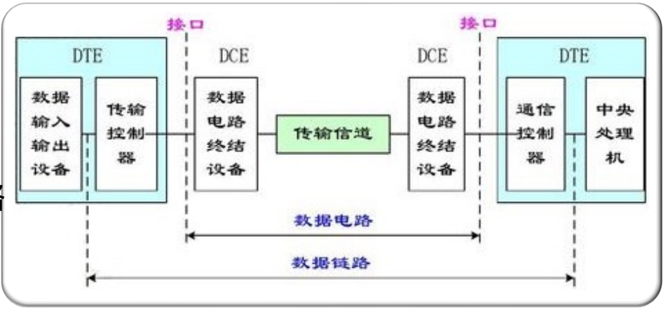

* 标准化的DTE/DCE接口具有
    * 机械特性、电气特性、功能特性、过程特性

#### 物理层机械特性
涉及接口的物理结构，通常采用接线器来实现机械上的连接，定义接线器的形状和尺寸、引线数目和排列、固定和锁定装置等。
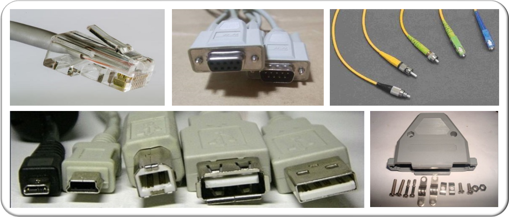

#### 物理层电气特性
规定了发送器和接收器的**电路特性**、**负载要求**、**传输速率**和**连接距离**等，如发送信号电平、发送器和接收器的输出阻抗、平衡特性等

举例： ITU-T V/X系列有关建议的某些电气特性
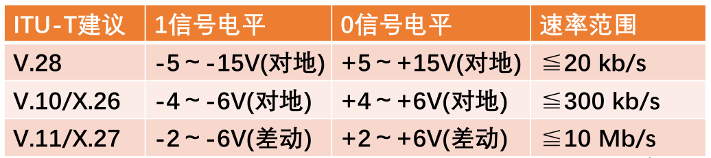

#### 物理层功能特性
描述接口执行的功能，定义接线器的每一引脚(针，Pin)的作用

举例：10BASE-T RJ-45 接口功能特性
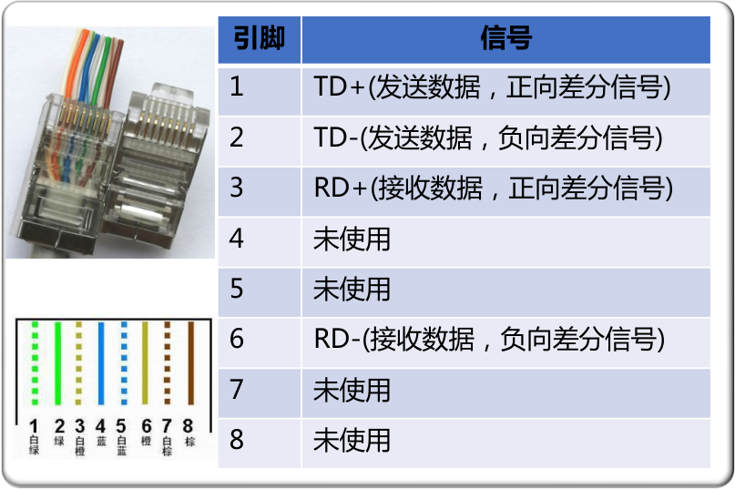

#### 物理层过程特性
指明对于不同功能的各种可能事件的出现顺序
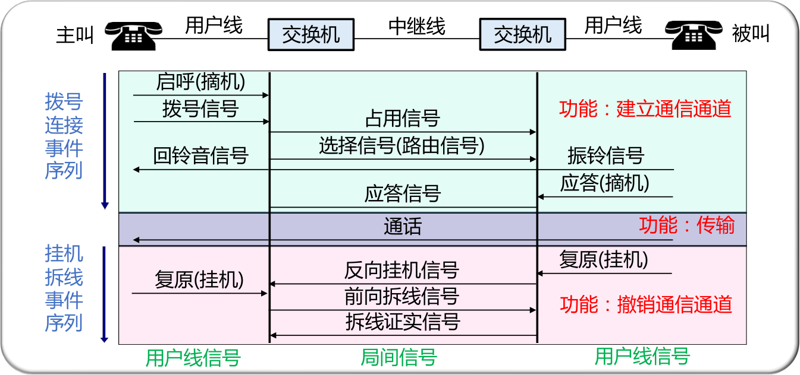

## 数据通信基础
### 基本概念与术语
#### 通信、消息、信息、信号与数据
* 通信(communication)：在两台计算机之间传递消息
* 消息(message)：可以是图像、文字、语音等可以被通信双方理解并且可以被相互传递的东西。
* 数据(data)：消息的载体
* 信息(information)：消息中的有效部分
* 信号(signal)：通信过程中的数据的载体

#### 数据的信号表示
数据
* 数字(digital)：如文字
* 模拟(analog)：如语音

信号同样有数字信号和模拟信号。

数据可以编码(encode)成信号：
* 数字数据 $\rightarrow$ 数字信号：直接使用高低电位，得到基带信号
* 数字数据 $\rightarrow$ 模拟信号：可以调幅(ASK)、调频(FSK)、调相(PSK)。
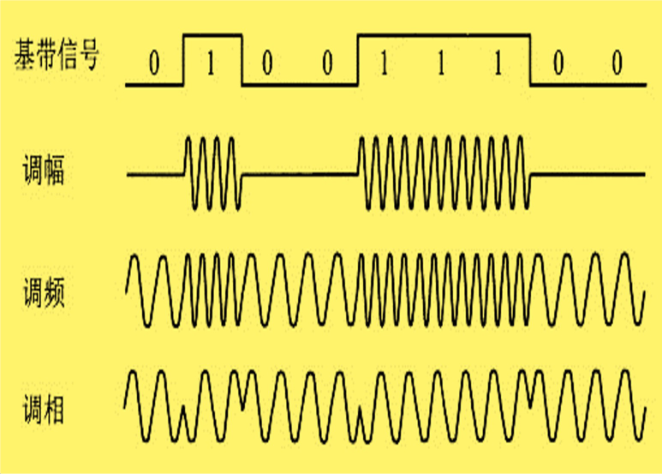

* 模拟数据 $\rightarrow$ 模拟信号：同样可以调幅(AM)、调频(FM)、调相(PM)
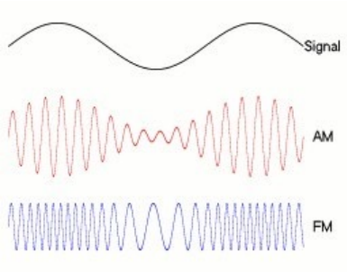

* 模拟数据 $\rightarrow$ 数字信号：采样，如语音信号的PCM调制
  * 在时间上采样(采样率)，比如声音有 $44.1Hz, 48Hz, 96Hz, 192Hz$
  * 在值域上近似(采样深度)，比如 $16bits, 32bits$，表示用多少个比特来记录一个数值

### 传输方式
#### 数字通信和模拟通信
* 以模拟信号来传送消息的通信方式称为模拟通信，而传输模拟信号的通信系统称为模拟通信系统
* 以数字信号来传送消息的通信方式称为数字通信，而传输数字信号的通信方式称为数字通信系统

#### 基带传输和频带传输
* 基带传输：指不搬移信号频谱的传输体制
* 频带传输：指利用**调制解调器**搬移信号频谱的传输体制
  * 就是让基带信号和载波进行调制
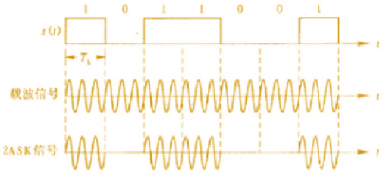

频带传输是为了让不同协议的信号之间尽量不相互干扰，同时也可以调整带宽来控制某种协议的传输速度。

#### 传输模式(单工、半双工、双工)
* 单工：指两个站之间只能沿一个指定的方向传送数据信号
* 半双工：指两个站之间可以在两个方向上传送数据信号，但不能同时进行，又称“双向交替”模式，发/收之间的转向时间为 $20～50ms$
* 全双工：指两个站之间可以在两个方向上同时传送数据信号
#### 同步方式(同步/异步)
* 异步传输的协议设计比较复杂，接收方需要识别信号什么时候开始，什么时候结束
* 同步传输协议更加简单，但是精确地实现同步比较困难
  

    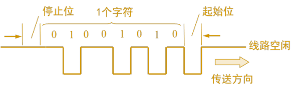
    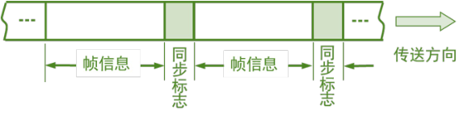
  

#### 数据传输类型(串行、并行)
  

    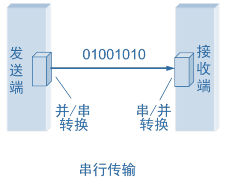
    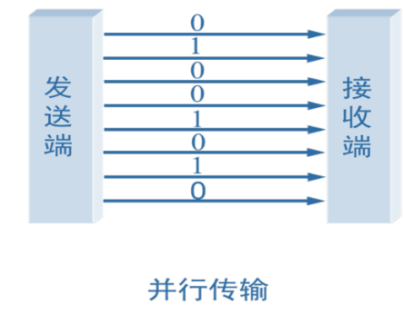
  

### 传输损伤
* 误码(Error)。指信号在传输过程中码元发生的差错，即接收与发送数字信号的单个数字之间的差异
* 抖动(Jitter)。指码元出现的时刻随时间频繁地变化，也就是各有效瞬间相对于理想时间位置的短时间偏移
* 漂移(Wander)。指码元各有效瞬间相对于理想时间位置的长期缓慢偏移
* 滑动(Slip)。指一个信号序列在传输过程中，不可恢复地丢失或增加若干码元
* 时延(Delay)。指信号的各有效瞬间相对于理想时间位置的滞后或推迟

干扰：
* 环境干扰指大气干扰(如雷电、电离层闪烁等)、城区人为干扰(如工业干扰、汽车干扰等，wifi信号收到微波炉影响)和非恶意的邻道干扰等(比如在考场周围的电磁干扰)；
* 人为恶意干扰：指带有恶意或敌意的人为干扰。

### 性能度量
#### 传输速率
这里是对于数字信号而言

* 调制速率(波特率、码元速率)：指单位时间内调制信号波形的变换次数，其单位是波特。$R_{B}=1 /T$
* 数据信号速率(比特率)：指单位时间内通过信道的信息量，其单位是比特/秒。$R_{b}=\frac{1}{T} \log_2 M$

波特和比特的不同之处在于，有时候一个码元可能有不止两种的状态，而是 $M$ 种(比如说有 $M$ 个电位)，那么一个码元所含有的信息就相当于 $\log_2M$ 个比特。

#### 常见不同进制调制方式举例
这里是对模拟信号而言(模拟信号传递数字数据)

通常由于频率是模拟信号的稀缺的资源(大的带宽能带来更大的传输速率)，因此调制的时候我们通常使用调幅和调相。而对于幅值和相位，我们可以用极坐标系中的一个点来代表。

假如1个码元对应1个比特，那么极坐标系下只需要2个点，这就是 BPSK。QPSK中1个码元对应2个比特，QAM中对应4个。
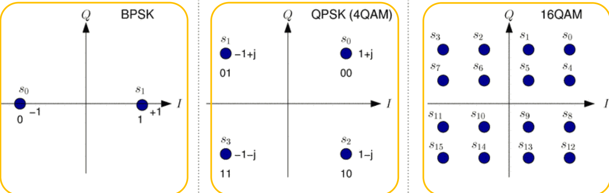

#### 带宽
* 在通信领域(模拟传输)，带宽指某个信号具有的频带宽度。单位是赫(或千赫、兆赫、吉赫、太赫等)。如话音信号的带宽是 $3.1kHz(300Hz～ 3400Hz)$。
* 在计算机领域(数字传输)，带宽指计算机网络的通信线路所能传送数据的能力，即在单位时间内从网络中某一点到另一点所能达到的“最高数据速率”。单位是 $b/s (bit/s)$ 

#### 信道容量
* 模拟信道容量
**香农定律**指出：
$$
C=B \log_2(1+\frac{S}{N})
$$

    其中 $C$ 是信道容量，$B$ 是信道带宽，$S /N$ 是平均信号信噪比，$S$ 是接收信号功率，$N$ 为噪声功率。

* 数字信道容量
对于一条有限带宽，无噪声的理想信道上，**采样定理**指出：
$$
C=2B \log_2M
$$

$M$ 是一个码元对应的比特数。

#### 传输质量
* 信噪比SNR：指信号通路某一点上的信号功率Ps与混在信号中的噪声功率PN之比值（常用对数表示）。
  $$
  SNR=10 \lg P_{S}/P_{N}
  $$
* 平均误码率：指单位时间内接收到的出错码元数占总码元数的比例
  $$
  P_e=\frac{n_e}{n}
  $$

## 复用技术
复用 (multiplexing)技术的目的是：允许用户使用一个共享信道进行通信，避免相互干扰，降低成本，提高利用率。

### 时分复用(TDM)
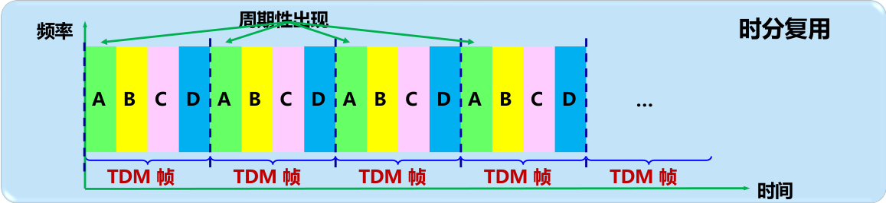

存在的不足：使用时分复用系统传送计算机数据时，由于计算机数据的突发性质，用户对分配到的子信道的利用率一般是不高的。因此可以引入统计时分复用

### 统计时分复用(STDM)
统计时分复用（statistical time division multiplexing，STDM）是指动态地按需分配共用信道的时隙，即在每一次周期开始之前，先查询有哪些用户需要传输数据。

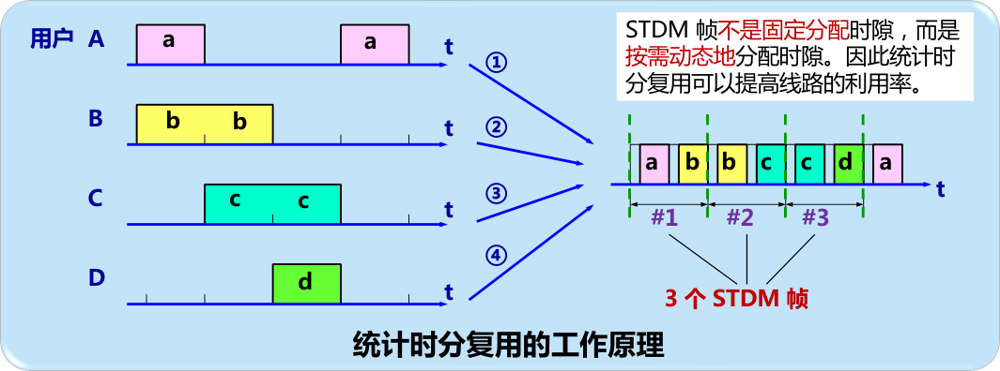

### 频分复用(FDM)
频分复用将整个带宽分为多份，用户在分配到一定的频带后，在通信过程中自始至终都占用这个频带
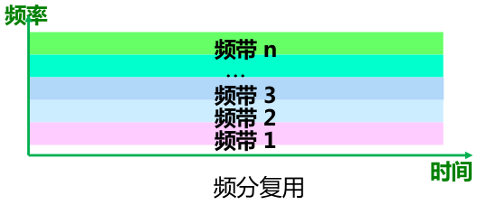

频分复用的信道利用率同样不高，不过相对时分复用而言，频分复用不需要做同步，更加方便

### 波分复用(WDM)
和频分复用基本一样，只是波分复用用于光纤

### 码分复用(CDMA)
是指利用码序列相关性实现的多址通信，基本思想是靠不同的地址码来区分的地址。3G技术使用的主要就是这个复用技术。

不同使用者使用不同的地址码，而一组地址码可以理解为一组正交的向量基。比如有一组正交基 $(1, 0, 0), (0, 1, 0), (0, 0, 1)$，然后有3个用户A，B，C输入 $a, b, c$，那么在信道上传输的数据就为 $(1, 0, 0)\times a+ (0, 1, 0)\times b+ (0, 0, 1)\times c=(a,b,c)$，然后接收到数据之后再乘一个用户A对应的向量基 $(1, 0, 0)$，就能得到信息 $a$。
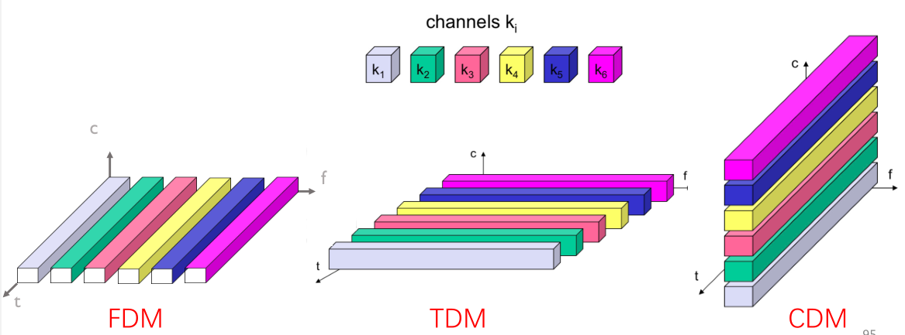

### 空分复用(SDM)
空分复用(Space Division Multiplexing,SDM)是指让同一个频段在不同的空间内得到重复利用。每个使用者占据一定的空间，从而避免相互干扰。手机网络之所以称为蜂窝网络，就是利用了这种技术。

最开始的空分复用指的是每个基站因为相隔比较远，因此不会相互干扰
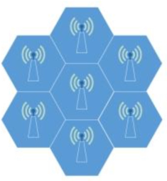

后来空分复用延伸到自适应天线阵列实现的空间分割，
