## 网络层服务
### 网络层服务概述
下图中的接口层包含数据链路层和物理层。
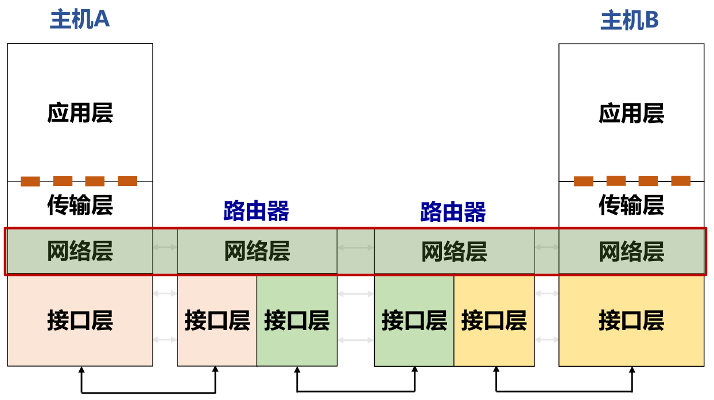

#### 网络服务的实现
网络层实现的是端系统之间多跳传输。网络有很多发送端和接收端，这些都是我们的设备。而网络的核心则是众多路由器，执行转发数据包的功能。

#### 网络层关键功能
路由器需要实现的是从发送端到接收端找到一条路径，然后不断转发数据。

* 路由(宏观层面)
  * 通过一系列路由算法和协议找到从发送端到接收端的路径
* 转发(微观层面)
  * 将数据报从路由器的数据接口传送到正确的数据接口

#### 提供给传输层的服务
需要考虑网络通信的可靠服务是靠网络还是端系统来负责。

网络层可以向传输层提供两种服务：
* 面向连接：虚电路
* 无连接：数据报

### 无连接服务的实现
就像寄信，把信寄出去之后就不管了。
因此网络层向上只提供简单灵活无连接的、尽最大努力交付的数据报服务，不提供服务质量的承诺。

* 可能会出现丢包、乱序、错误
* 优点：网络的造价大大降低，运行方式灵活，能够适应多种应用

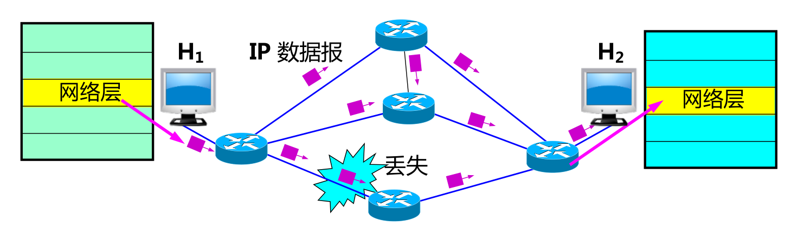

#### 数据报的转发策略
数据报的转发取决于分组的目的地址。

对于每一个数据报，都会独立路由，与虚电路一定走同一条路不同。不过在实际实现中，假如路由表没有发生变化，那么数据报实际上走的还是同一条路。

### 面向连接服务的实现
就像打电话，通信之前需要先建立连接(虚拟的或是真实的)。
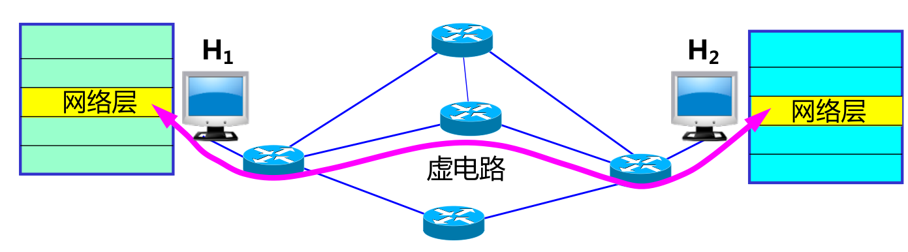

同时需要注意，面向连接的服务也无法保证数据一定可靠，链路中如果有路由器出现问题，那么可能会导致数据丢失等严重问题。

#### 虚电路的转发策略
在虚电路传输之前需要先建立好链路，然后就一直在这个链路上传输。建立好链路之后，发送的数据中就无需包含源地址和目的地址，而是只需要包含一个标签，所有路由器看到这个标签之后就知道把这个数据向哪里传输。

<!-- 比如下图中，当R4接收到数据，发现标签为L1，就知道应该从3号端口数据，标签改为L2 -->
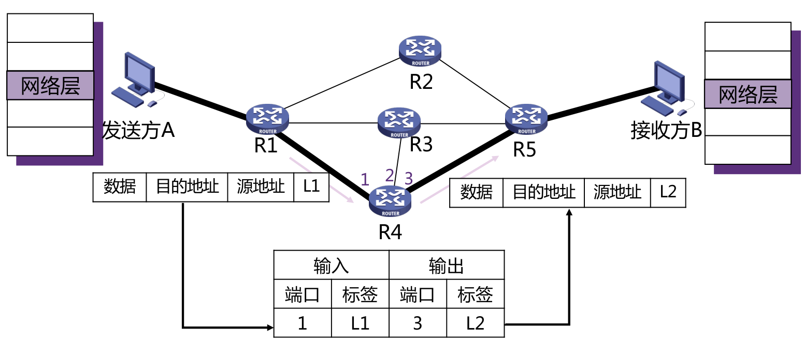

### 虚电路与数据报网络的比较
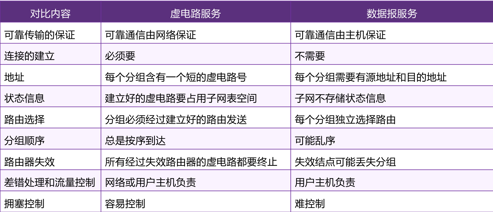

## Internet网际协议
### IPv4协议
IPv4协议，网际协议版本4，一种无连接的协议，是互联网的核心，也是使用最广泛的网际协议版本，其后继版本为IPv6

Internet协议执行两个基本功能
* 寻址(addressing)
* 分片(fragmentation)

#### IPv4数据报格式
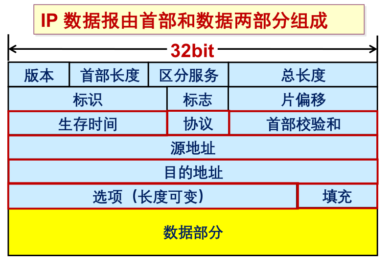
 

* 版本： 4bit ，表示采用的IP协议版本。
* 首部长度： 4bit，表示整个IP数据报首部的长度。(因为IP数据报首部长度可变，主要是选项部分，所以设置了这一位。同时此处“长度”的单位为32bit)
* 区分服务： 8bit ，该字段一般情况下不使用。(为了让当前应用的特性改变服务，虽然这个构想很好，但是事实上每个用户都希望自己获得最好的服务，所以该服务并不被使用)
* 总长度： 16bit ，表示整个IP报文的长度,能表示的最大字节为2^16-1=65535字节
* 标识： 16bit ， IP软件通过计数器自动产生，每产生1个数据报计数器加1；在ip分片以后，用来标识同一片分片
* 标志： 3bit，目前只有两位有意义； MF，置1表示后面还有分片，置0表示这是数据报片的最后1个；DF，不能分片标志，置0时表示允许分片
* 片偏移： 13bit，表示IP分片后，相应的IP片在总的IP片的相对位置
* 生存时间TTL(Time To Live) ：8bit,表示数据报在网络中的生命周期，用通过路由器的数量来计量，即跳数(每经过一个路由器会减1)。TTL的引入是为了防止某些数据报无法到达目的地，在网络中不断转发，浪费带宽。
* 协议：8bit，标识上层协议（TCP/UDP/ICMP…）
* 首部校验和：16bit ，对数据报首部进行校验，不包括数据部分
* 源地址：32bit，标识IP片的发送源IP地址
* 目的地址：32bit，标识IP片的目的地IP地址
* 选项：可扩充部分，具有可变长度，定义了安全性、严格源路由、松散源路由、记录路由、时间戳等选项
* 填充：用全0的填充字段补齐为4字节的整数倍

#### 数据报分片
MTU（Maximum Transmission Unit），最大传输单元，可以理解为两个站点之间最大带宽。
* MTU分类
  * MTU分为链路MTU和路径MTU，分别代表两个站点之间的最大传输带宽和两个端点之间的带宽。
* 数据报分片策略
  * 允许途中分片：根据下一跳链路的MTU实施分片
  * 不允许途中分片：发出的数据报长度小于路径MTU（路径MTU发现机制）

假如一条链路中MTU不同，并且允许途中分片，那么就需要进行分片操作。

以下图传输情况为例：
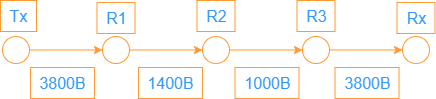

从R1到R2的MTU小于从Tx到R1的MTU，因此在路由器R1上执行分片。数据报格式中与分片相关的有：标识、标志和片偏移。
* 数据报在分段前后标识不变，以便于到达目的地之后重组。
* 数据报标志有DF和MF。
  * DF=0表示能分片，DF=1表示不能分片。分片前后DF不变
  * 在分片前，MF=0。在分片后，假如该数据报片后面还有其他数据报片，则MF=1；若没有，MF=0
* 片偏移的值则由数据部分第一个字节的地址除 $8$ 得到。

第一次分片情况如下图所示：
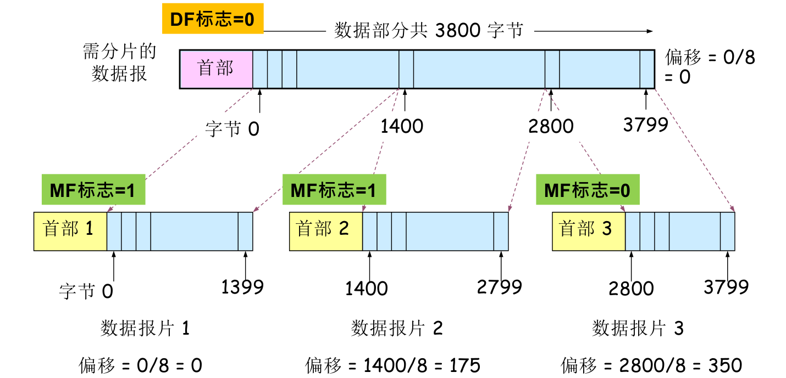

然后再考虑从R2传输到R3。由于MTU进一步减小，所以之前得到的数据报片还需要进一步分片。
比如对数据报片1继续分片，那么我们得到长度为 $1000$ 和 $400$ 的两个更小的的分片。
* 对于长度为 $1000$ 的分片，DF=0，MF=1，偏移=$0/8$
* 对于长度为 $400$ 的分片，DF=0，MF=1，偏移=$1000/8$

最后从R3传到目的地Rx。R3继续转发这些分片，而不会进行整合。直到Rx分片才会重新整合。这是因为数据报独立路由，所以有些数据报走的可能不是同一条路。

### IP地址
* IP地址，网络上的每一台主机（或路由器）的每一个接口都会分配一个全球唯一的32位的标识符
* 将IP地址划分为固定的类，每一类都由两个字段组成
* 网络号相同的这块连续IP地址空间称为地址的前缀，或网络前缀

#### 分类的IP地址
* IP地址共分为A、B、C、D、E五类，A类、B类、C类为单播地址。其中D类和E类做特殊用途，这里不介绍。
* IP地址依靠前几个bit进行分类。
* IP地址的书写采用点分十进制记法，其中每一段取值范围为0到255

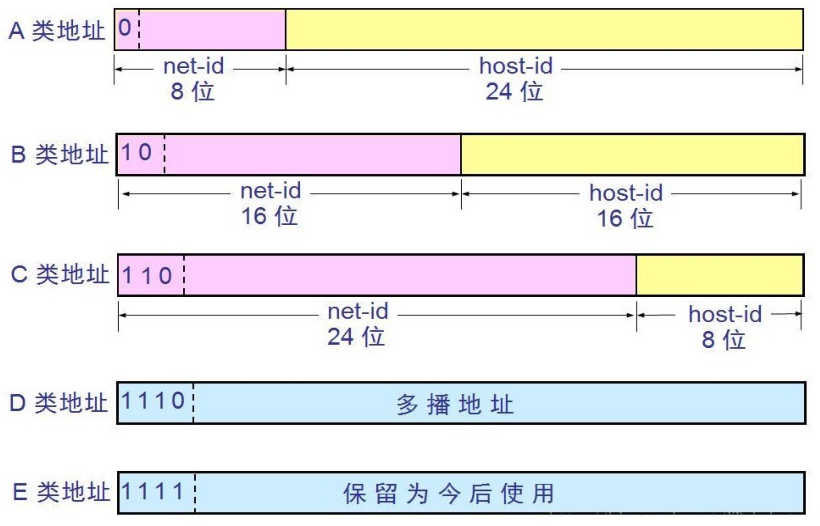

从图中可以看出，A类网络中可以有非常多的主机，所以这类地址通常分给国家。我们最常用的是C类地址，网络中的主机号的数量只有 $2^{8}-2$(有两个是特殊IP地址)。

#### 特殊IP地址
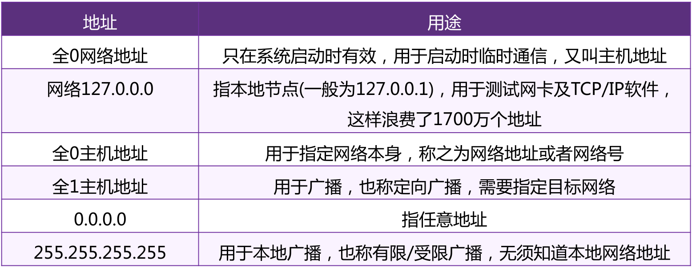

#### 子网划分
我们注意到如果只是按A、B、C类地址进行划分，弹性会很小。比如一个小公司只有几台电脑，但是分到了C类网络，这就会导致很多主机号的浪费。这是两级IP地址带来的缺陷，因此引入了子网划分。

* **子网划分**(subnetting)，在网络内部将一个网络块进行划分以供多个内部网络使用，对外仍是一个网络
* **子网**(subnet )，一个网络进行子网划分后得到的一系列结果网络称为子网
* **子网掩码**(subnet mask )，与 IP 地址一一对应，是32 bit 的二进制数，置1表示网络位，置0表示主机位。子网掩码用于判断子网号的长度。
* 子网网络地址也有更加简单的表示方式，比如下图中的的子网掩码，可以记为 IP/24，其中 $24$ 表示子网掩码的 $1$ 共有 $24$ 位。

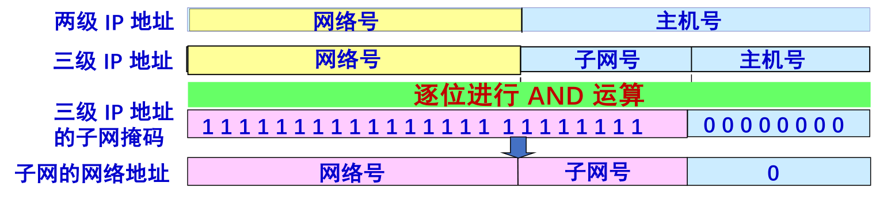

#### 无类域间路由(CIDR)
* 将32位的IP地址划分为前后两个部分，并采用斜线记法，即在IP地址后加上“/”，然后再写上网络前缀所占位数(就是上面讲的记法)，这个成为一个CIDR(Classless Inter-Domain Routing)。
* 一个 CIDR 地址块可以表示很多地址，这种地址的聚合常称为路由聚合（route aggregation），也称为构成超网 (supernet)

#### 最长前缀匹配（Longest prefix match）
(注意这里的IP地址为子网的IP地址，每个端口对应一个网络网)
* IP地址与IP前缀匹配时，总是选取子网掩码最长的匹配项
* 主要用于路由器转发表项的匹配，也应用于ACL规则匹配等

比如下面这张路由转发表：
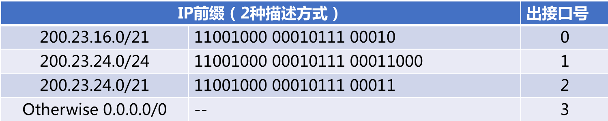

从这张表中我们可以得出，
* IP地址为：200.23.22.161 （ 11001000 00010111 00010110 10100001 ）时，接口为0
* IP地址为：200.23.24.170 （ 11001000 00010111 00011000 10101010 ）时，接口为 1

### DHCP
#### Ipv4地址如何获取
* 公有IP地址要求全球唯一
  * ICANN（Internet Corporation for Assigned Names and Numbers）即互联网名字与编号分配机构向ISP分配，ISP再向所属机构或组织逐级分配
* 静态设定(传统的申请方式，比较麻烦)
  * 申请固定IP地址，手工设定，如路由器、服务器
* 动态获取
  * 使用DHCP协议或其他动态配置协议，当主机加入IP网络，允许主机从DHCP服务器动态获取IP地址。这样可以有效利用IP地址，方便移动主机的地址获取。

#### DHCP动态主机配置协议
* 工作模式：客户/服务器模式（ C/S ）
  * 基于 UDP 工作，服务器运行在 67 号端口， 客户端运行在 68 号端口

#### DHCP工作流程
1. 首先用户端并不知道DHCP服务器在哪，只知道DHCP工作在 67 号端口，因此会先广播。此时源IP地址为全零(还未分配到IP地址)，端口号为 68；目标IP地址为全一(广播)，端口号为 67；想要的IP地址为全零(还不知道哪些IP可用)；然后会有一个ID用于标识。
2. DHCP收到之后会发送一个offer，告诉用户端能提供的IP地址。同时因为不知道用户端的IP，所以同样需要广播。除此之外DHCP服务器还会指定租借IP的期限，即图中的lifetime，但同时一个客户机可以在租借期间续借IP地址。
3. 由于网络中可能存在很多DHCP服务器，因此用户机可能会收到很多offer，此时它会从中选择一个，再发送request。request中会指明自己选择的那个IP地址，同时同样采用广播机制，这是为了告诉所有的服务器自己选择的是哪个offer。
4. 最后DHCP服务器发送确认信号，用户端成功获得IP地址。

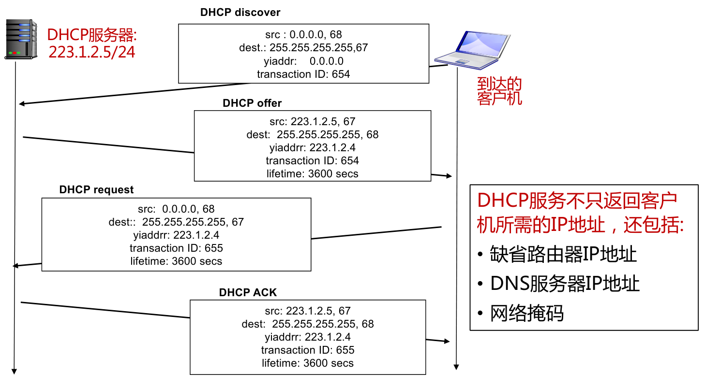

### IP与MAC地址
路由器的每个端口和主机一样，都有一个IP地址和MAC地址。
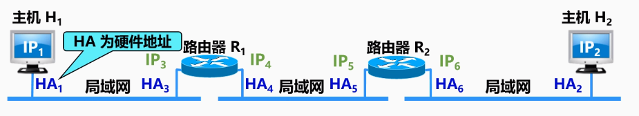

在这里，假如IP$_{1}$想和IP$_{3}$通信，首先可以通过网络号和子网号相同这一点得到这两台主机在同一个局域网中，所以就可以利用局域网通信。

假如IP$_{1}$想和IP$_{2}$通信，IP数据报需要经过路由器的转发。同时需要注意，在网络层，IP数据报无论怎么转发，IP源地址和目的地址都是一样的；但是在数据链路层，在不同的局域网中，MAC帧中的源地址和目的地址是会不断改变的。(数据链路层是点对点的通信)

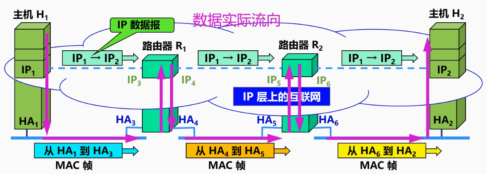

#### 为什么同时需要MAC地址和IP地址
* 假如只有MAC，没有IP
  * 难以进行路由寻址
* 只有IP，没有MAC
  * 理论可行，但是这样的话每次都需要解析网络层才能进行转发。

### ARP协议
#### ARP地址解析协议
我们注意到，数据在进行发送时，会先确定网络层的IP的源地址和目的地址。但是在局域网中信息是以MAC帧进行发送，于是带来了一个问题：我们如何得到MAC源地址和目的地址？

比如对于如下情形：
IP数据包转发：从主机A到主机B
• 检查目的IP地址的网络号部分
• 确定主机B与主机A属相同IP网络
• 将IP数据包封装到链路层帧中，直接发送给主机B
那么怎么获得B的MAC地址？
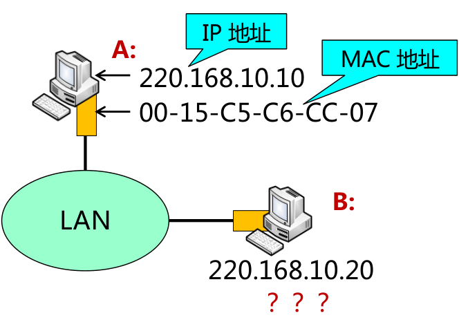

ARP地址解析采用的是查表的方式，每个主机中都存有IP到MAC的转换表。
#### ARP协议工作过程
以下图为例，A已知B的IP地址，需要获得B的MAC地址（物理地址）
* 如果A的ARP表中缓存有B的IP地址与MAC地址的映射关系，则直接从ARP表获取
* 如果A的ARP表中未缓存有B的IP地址与MAC地址的映射关系，则A广播包含B的IP地址的ARP query分组，在局域网上的所有节点都可以接收到ARP query
  * B接收到ARP query分组后，将自己的MAC地址发送给A(单播)
  * A在ARP表中缓存B的IP地址和MAC地址的映射关系
  * 超时时删除

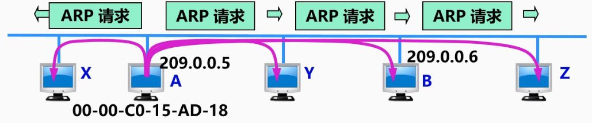
 
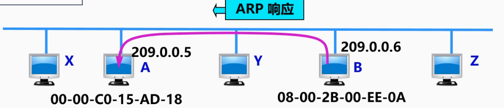

#### 路由到另一个局域网
刚刚讲的是发送方和接收方在同一个局域网中的情况，这里考虑不同局域网。

比如说下图中需要实现A到E的通信。
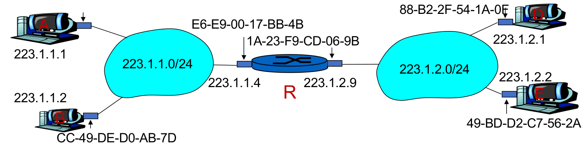

1. A创建IP数据包(源地址为A，目的地址为E)
2. 此时主机A应当首先得到的是R的MAC地址。同时每台主机都有路由表，这个路由表只有一个端口，指明了数据包往哪发(其实是DHCP时获得的路由器的IP地址)。因此A就可以使用ARP协议获得R的MAC地址。
3. A创建数据帧(源地址为A，目的地址为R)，其中数据帧中封装了A到E的IP数据包。
4. A发送数据帧，R接收。

### 网络地址转换NAT
NAT的引入是为了解决IPv4地址不够用的问题，是一种将私有地址转为共有IP地址的技术。

私有IP地址：
* A类地址：10.0.0.0--10.255.255.255
* B类地址：172.16.0.0--172.31.255.555
* C类地址：192.168.0.0--192.168.255.255
#### NAT工作机制
左侧为公有IP地址，右侧为私有IP地址。
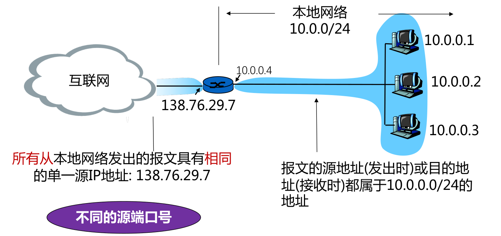

需要注意，如果直接这样使用，那么只有内网的数据能够发送到外网，而外网数据无法发送给内网(因为外网的计算机不知道内网计算机的IP地址)。
为了解决这个问题，边界路由器需要解决内网和外网IP变换的工作，此时需要借助端口号来实现。

比如电脑10.0.0.1的3345端口想要从服务器128.119.40.186的80端口请求数据
1. 内网的10.0.0.1,3345首先会通过NAT路由器的NAT转换表转成138.76.29.7,5001
2. 成功将请求发送到服务器并且得到回复，服务器发送的数据包的目的地址为138.76.29.7,5001
3. NAT路由器收到信息之后，解析目的地址，通过NAT转换表将目的地址转为10.0.0.1,3345
4. 计算机成功接收到数据

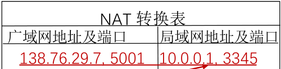

#### 网络地址转换
传输层TCP/UDP拥有16-bit 端口号字段，所以一个WAN侧地址可支持60,000个并行连接

* NAT的优势：
  * 节省IP地址
  * 保护局域网的私密性(防火墙就是使用NAT实现的)
* 问题或缺点
  * 违反了IP的结构模型，路由器处理传输层协议。违反了协议分层规则
  * 违反了端到端的原则(中间需要使用NAT路由器修改IP地址和端口号)
  * 新型网络应用的设计者必须要考虑 NAT场景，如 P2P应用程序(如果两个设备都在内网中，会不太好处理)

### ICMP:互联网控制报文协议
ICMP是网络层协议，但是是建立在IPv4或者IPv6之上的。假如在数据传输中出现问题，路由器会通过ICMP进行回报。
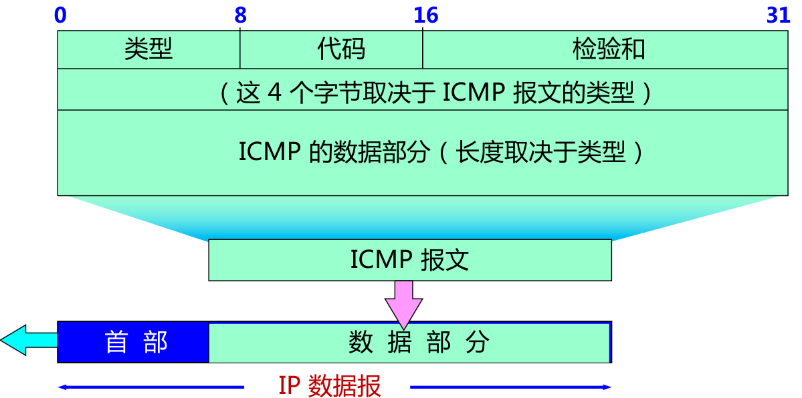

## 路由算法
### 优化原则
* **汇集树**(Sink Tree)：所有的源节点到一个指定目标节点的最优路径的集合构成一棵以目标节点为根的树。
  * 这是因为在最优路径A上的任意两点，这两点之间的最优路径B一定在A上
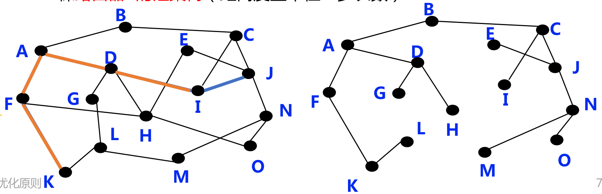

上图中右边的树就是左边的图的汇集树。

### 最短路径算法
可以用Dijstra算法实现。不过这种算法只能处理静态的情形。

Dijkstra算法的基本步骤：
* 初始化：将源节点的距离设置为0，将其他节点的距离设置为无穷大（或一个很大的数），将源节点标记为当前节点。
* 迭代过程：重复以下步骤，直到所有节点都被标记为已访问。
  * 从当前节点开始，计算当前节点到其邻居节点的距离和，更新邻居节点的距离（如果计算得到的距离比当前保存的距离更短）。
  * 选择未访问节点中距离最小的节点作为下一个当前节点。
  * 将该节点标记为已访问。
* 最短路径生成：通过回溯，根据计算得到的最短路径信息，生成从源节点到其他节点的最短路径。
### 距离向量路由(Distance Vector, DS)
#### 距离向量路由算法
* Bellman-Ford 方程
  * 假设 $D_{x}(y)$ 是 从 $x$ 到 $y$ 最小代价路径的代价值
  * 则：$D_{x}(y) = \min {c(x,m) + D_{m}(y) }$。其中 $m$ 为 $x$ 的邻居, $c(x,m)$ 为 $m$ 到 $x$ 的距离。

在经过多次迭代之后，就能得到所有点两两之间的最短距离。

* **距离向量**（Distance Vector）算法和BF算法基本相同:
  *  每个节点周期性地向邻居发送它自己到某些节点的距离向量；
  *  当节点x接收到来自邻居的新DV估计，它使用B-F方程更新其自己的DV :
  $$
  D_{x}(y) \leftarrow \min_{v}\left\{ c(x,y)+D_v(y) \right\} \quad for\ each\ node\ y\in N
  $$
  *  上述过程迭代执行，$D_{x}(y)$ 收敛为实际最小费用 $d_{x}(y)$

#### 路由器实现
1. 路由器启动时初始化自己的路由表。初始路由表包含所有直接相连的网络路径，距离均为0
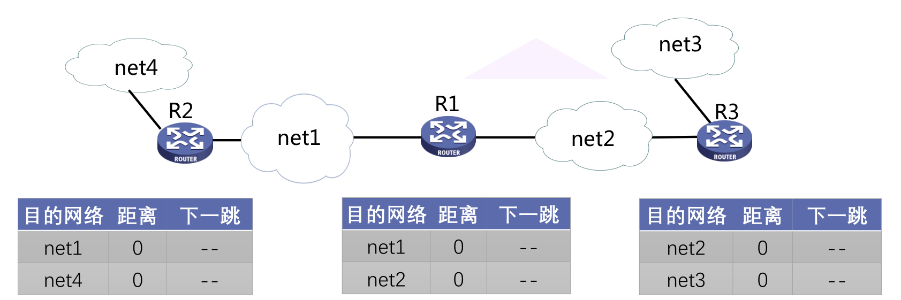

2. 路由器*周期性*地向其相邻路由器广播自己知道的路由信息，相邻路由器可以根据收到的路由信息修改和刷新自己的路由表(因为会周期性的更新信息，所以该算法是动态的)
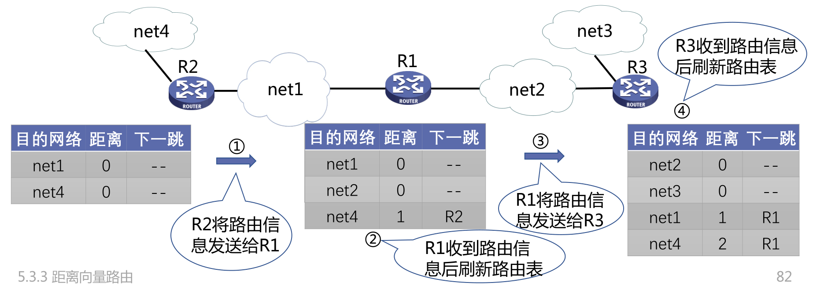

3. 经过若干次更新后，算法收敛，路由器最终都会知道到达所有网络的最短距离
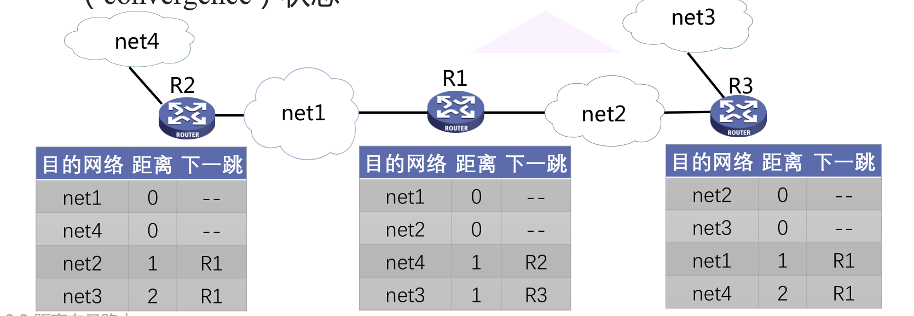

#### 计数到无穷问题
考虑如下情况：
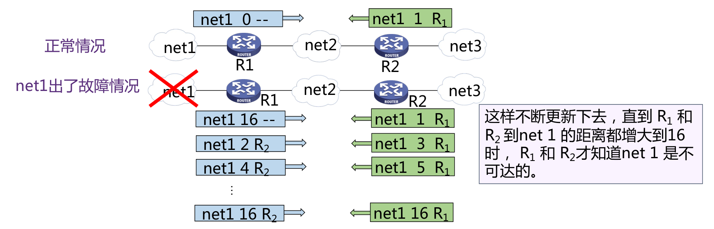

在出了故障之后，假如是 $R_2$ 先把自己的路由表给 $R_1$，那么会导致 $R_1$ 更新自己的路由表，让自己到网络 net1 的距离变成 $2$。然后路由表在 $R_1$ 和 $R_2$ 之间不断传播，到 net1 的距离有不断更新，最终依然会收敛到 $16$，但是这会耗费非常多的时间。

### 链路状态路由(Link State, LS)
链路状态(Link State)路由解决Dij无法处理动态情况的方式是：当网络拓扑发生改变之后，就把这个改变的拓扑信息更新给网络中所有的路由器，那么Dij就是可用的。

1. 发现邻居，了解他们的网络地址；
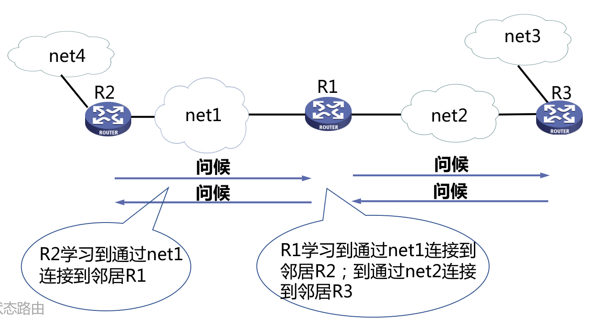

2. 设置到每个邻居的成本度量(比如说带宽、延迟之类的信息)
3. 构造一个分组(链路状态分组，link state packet, LSP)，分组中包含刚收到的所有信息：发送方标识、序列号、年龄、邻居列表。
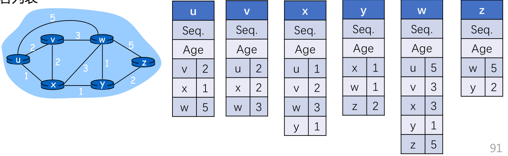
4. 将此分组发送给其他的路由器；
5. 计算到其他路由器的最短路径(采用的是Dij算法)

#### 距离向量和链路状态算法比较：
* 网络状态信息交换的范围
  * DV:邻居间交换
  * LS:全网扩散
* 网络状态信息的可靠性
  * DV:部分道听途说
  * LS:自己测量
* 健壮性:
  * DV:计算结果传递，健壮性差
  * LS: 各自计算，健壮性好
* 收敛速度：
  * DV: 慢,可能有计数到无穷问题
  * LS: 快

### 层次路由
#### 产生原因
世界上的电脑和路由器非常多，
* 如果仅仅是按照上述比如Link State的方式，由于更新了拓扑结果之后要进行全网扩散，工作量非常大
* 如果按照Distance Vector的方式，那么路由表会非常大
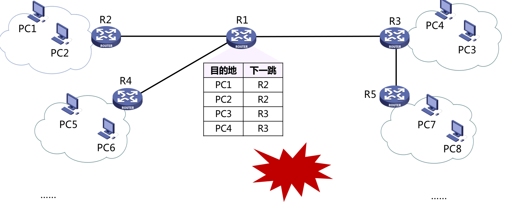

比如上图所示的网络，当接入的主机数量越来越多，那么 $R_1$ 的路由表也会越来越大。因此我们思考通过聚合的方式来减小路由表的规模。比如图中可以将 $PC_1-PC_2$ 聚合到一起，对应 $R_2$；将 $PC_5-PC_6$ 聚合到一起，对应 $R_4$；剩下的地址对应 $R_3$。

但现实情况是：
*  地址分配往往是随机的，难以进行高效的地址聚合
* 每个网络的网络管理员有自己的管理方法和思路，并不希望每个路由器都干涉本网络内部的地址分配等问题

因此需要使用层次路由

#### 基本思路
层次路由就是将网络分为多个阶层，最高层成为**自治系统**(AS, Autonomous System)。每个AS有一个全球唯一的ID号：AS ID。

譬如如图所示的网路，我们可以根据其所属的单位对其进行分隔。每个单位形成一个自治系统，在自治系统下的路由器由每一个单位自己做管理。
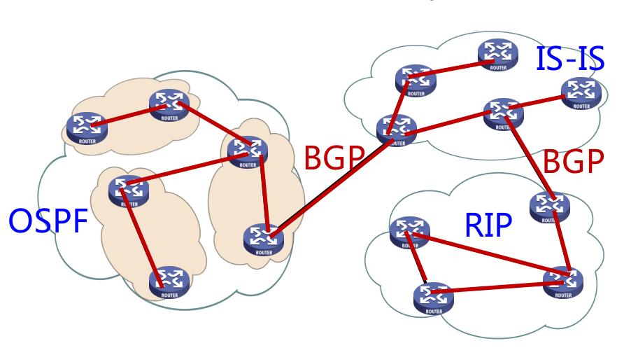

* 自治系统内部使用内部网关路由协议，Interior Gateway Protocols (IGP)
  * 典型IGP协议：OSPF，RIP，IS-IS，IGRP，EIGRP…(主要基于DV和LS)
* 自治系统之间之间使用外部网关路由协议，Exterior Gateway Protocols(EGP)
  * 典型EGP协议：BGP

#### 效果
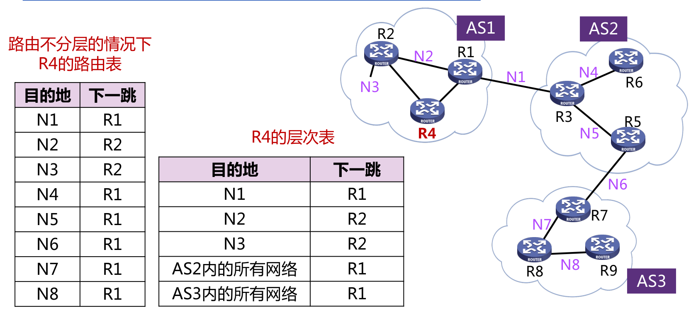

### 广播路由
之前考虑的路由方式主要是一对一的路由方式，这里考虑广播，即数据发送方想将数据发送给某一网络中的所有电脑。
* 方法1：给每个主机单独发送一个数据包
  *  效率低、浪费带宽
  * Server需要知道每个目的地址
* 方法2：多目标路由（multi-destination routing）
  * 在需要转发的路由器线路复制一次该数据报
  * 优点：网络利用率高
  * 缺点：Server依然需要知道所有的目的地址，难以实现

  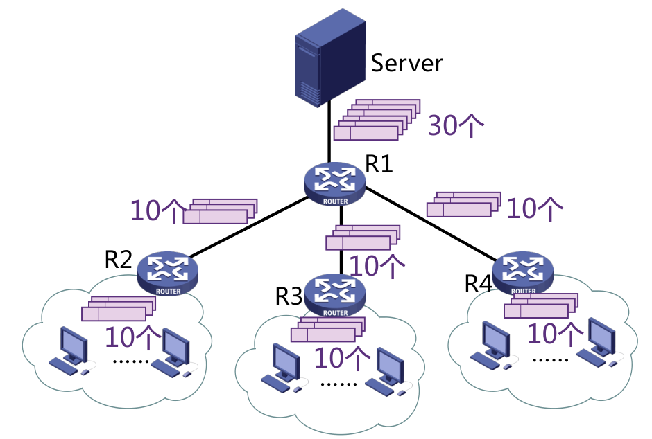
  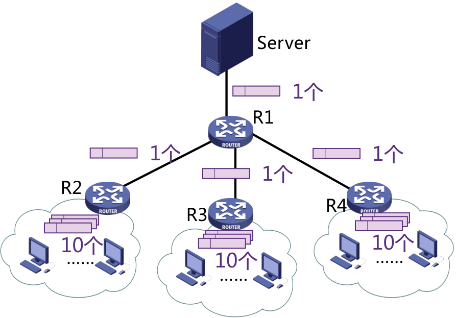

* 方法3：泛洪（flooding）
  * 将每个进入数据包发送到除了进入线路外的每条出去线路
  * 优点：
    *  保证性：一种有效广播手段，可确保数据包被传送到网络中每个节点
    * 鲁棒性：即使大量路由器被损坏，也能找到一条路径（如果存在）
    * 简单性：仅需知道自己的邻居
  * 缺点：网络中存在环路的话可能会对导致广播风暴。

解决方法：生成树。和交换机泛洪的处理方式一样。

### 组播路由
**组播**（multicasting）：源主机给网络中的一部分目标用户发送数据包。又称为多播。多用于网络会议，或者服务器希望将体育直播视频发送给某些网络中的个别用户。

#### 源点树
组播路由的方式和广播路由非常像，同样是建立**源点树**(生成树)，只是叶节点仅仅是特定的一些用户。
基于源点树（source-based trees）存在的问题：大型网络中，组播源很多时，路由器需生成多颗棵树，工作量巨大，路由器需要大量空间来存储多颗树(对于每个生成树，每个路由器都需要储存父节点和子节点)

#### 核心树
另一种方法是使用**核心树**。即所有的组播源先将信息传到一个核心节点上，再由这个节点进行组播，这样多个组播源就能共享同一棵生成树。但是这种方法会导致核心节点的压力非常大，同时也可能导致更长的路径。
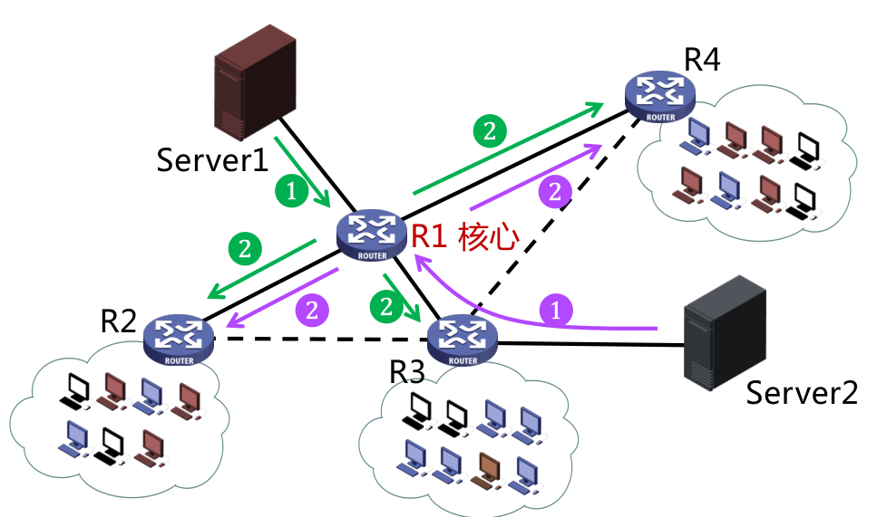

比如在上图中，从Server2到 $R_3$ 本应该可以直接到达，但是使用了核心树之后就需要先将数据送到 $R_1$ 核心。

#### 隧道
由于早期的路由器很多并不支持组播，那么可能会导致一个问题：假设主机和服务器都是支持组播的，但是在传输过程中有部分路由器不支持。为了让组播协议在网络中正常运行，可以使用**隧道**。

隧道实现的是对组播数据包的封装，变成一个普通的数据报。
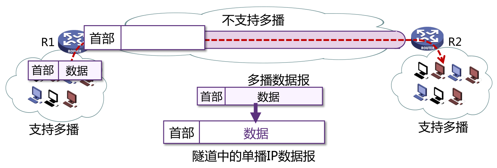

### 选播路由(Anycast)
有点类似于报警，会选择最近的一个警察局。

选播的应用场景为DNS，即将域名转为ip地址。在寻找DNS服务器的过程中，就会寻找最近的DNS服务器。比如平时使用8.8.8.8这个ip地址寻找DNS服务器，而有这个ip地址的服务器非常多，那么就需要让路由器找到最近的一个。

## Internet路由协议
常见的路由协议包括：
1. OPSF-内部网关路由协议。(和Link State基本相同)
2. RIP-内部网关路由协议。(和Distance Vector基本相同)
3. BGP-外部网关路由协议
4. 标签交换和MPLS。(就是希望在数据报网络中能够实现虚电路网络)
### BGP-外部网关路由协议
BGP是目前互联网中唯一实际运行的自治域间的路由协议。

* 自治系统内部的路由：效率
* 自治系统之间的路由：安全
  * 自治系统之间通信可能会通过其他自治系统，那么处于安全或者费用的考虑，选择方式会有所不同。
  * 因此BGP会把所有可行的数据告诉用户，用户决定使用哪个

#### eBGP&iBGP连接
* BGP功能
  * eBGP：从相邻的AS获得网络可达信息
  * iBGP： 将网络可达信息传播给AS内的路由器

下图中红色线表示eBGP，黑色线表示iBGP。我们更关注eBGP。
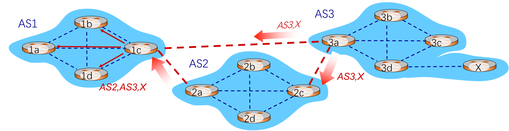

#### BGP路径通告
考虑一种情况，比如AS1要实现和AS3中X的通信。
1. 那么当AS3的路由器3a向AS2的路由器2c通告路径AS3, X时AS3向AS2承诺它会向X转发数据包。
2. AS2的路由器2c从AS3的路由器3a接收到路径AS3, X
3. 根据AS2的策略，AS2的路由器2c接受路径AS3, X，通过iBGP传播给AS2的所有路由器
4. 根据AS2策略，AS2的路由器2a通过eBGP向AS1的路由器1c通告从AS3的路由器3a接收到路径AS2, AS3, X

从这里可以看出BGP协议和前面的协议很不相同。IGP的算法中我们只关心下一个路由器是谁，而BGP则需要知道整条路径。同时路由器可能会学到多条到目的网络的路径:
1. AS1的路由器1c从2a学到路径AS2, AS3, X
2. AS1的路由器1c从3a学到路径AS3, X
3. 由策略，AS1路由器1c可能选择路径AS3, X, 并在AS1中通过iBGP通告路径

## 拥塞控制算法
流量控制和拥塞控制区别：
* 流量控制：解决接收方的接收能力不如发送方的发送能力的问题。(数据链路层和传输层)
* 拥塞控制：解决网络来不及处理发送方发送的数据的问题。(网络层)

理论上拥塞控制应该在网络层实现，因为拥塞就是在网络层发生的。但是由于早期计算机网络发展时，希望路由器能够实现的比较简单，因此拥塞控制的实现实际上交给了传输层。但是这样做会导致分层模型受到破坏。理论上传输层对于拥塞的感知有限，对于传输层而言，只知道**时延**、**丢包**两个问题。

### 拥塞控制概述
* **拥塞**：网络中存在太多的数据包导致数据包传输延迟或丢失，从而导致网络吞吐量下降
* **拥塞控制**（congestion control）：需要确保通信子网能够承载用户提交的通信量，是一个全局性问题，涉及主机、路由器等多种因素

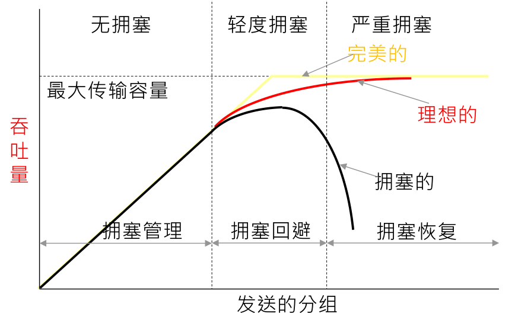

网络发生拥塞导致吞吐量急剧下降，是因为拥塞会导致数据包的丢弃，被丢弃有导致重传，继续增加了网络负担，导致更严重的拥塞。在这种正反馈的影响下，网络会崩溃。

#### 拥塞控制的途径
• 提高网络供给。(但是要考虑到Braess Paradox，就像道路数量增加，民众对车的需求量也会增加，甚至大于修路的速度，最终导致路更堵。考虑到网络系统中也有很多用户，那么也可能导致这种现象。)
• 流量感知路由。(通过路由方式解决拥塞。类似于导航告诉用户哪条路不赌)
• 准入控制
• 流量调节
• 负载丢弃

### 流量调节
考虑A发送数据给B，流程为 $A \rightarrow R_1 \rightarrow R_2\rightarrow R_3 \rightarrow R_4 \rightarrow B$，在R3处发生拥塞。

* **显式拥塞通告**（ECN，Explicit Congestion Notification），在IP包头中记录数据包是否经历了拥塞。R3会在IP包上标记，B接收到数据后会告诉A发生拥塞
  * 路由器工作量最小
  * 在网络层真正有实现的方法
* **抑制包**(Choke Packets)：R3直接发送信息给A，告诉这里发生拥塞
* **逐跳的抑制包**(Hop-by-Hop Choke Packets)：R3先告诉R2发生拥塞，请减慢发送速度。然后R2再向R1发送信息，最终逐跳传回A。

以上三种方式都是显式的控制。  

### 负载丢弃——随机早期检测RED (Random Early Detection)
负载丢弃属于隐式的反馈，当发生拥塞是会发生丢包，当发送方发现没有受到确认信号，就会认为发生了拥塞，从而降低发送速度。而随机早期检测就是决定如何进行丢弃的算法。

回忆路由器的转发流程，路由器在受到数据之后会决定将数据从某个端口转发出去，而在发送前数据会先存在那个端口的buffer中，随即早期检测算法就是对这个buffer进行操作。
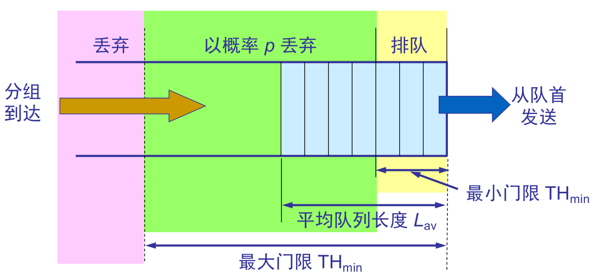

* 当数据非常少的时候，buffer基本是空的，一有数据进来就能转发出去
* 发生拥塞时，数据来不及被转发，会堆积在buffer中，随机早期检测算法就会对buffer中过多的数据进行丢弃。

随机早期检测丢弃的概率如下图所示：
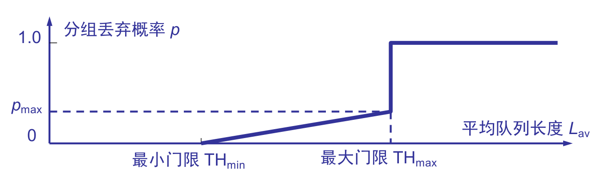

* 中间一段设置丢弃概率的原因：假如网络真的发生拥塞，那么会导致直接的崩溃。因此早期的小概率丢弃就是希望让发送端知道此时网络已经出现了一定的压力，应当降低返送端的发送速度。
* 进行随机丢弃的原因是：在发生拥塞时，我们更希望让发送数据最多的一方减慢发送数据的速率，而发送数据多就意味着被随机丢弃的概率就更大，那么就有更大的概率知道可能会发生的拥塞，从而放慢数据发送。

## 服务质量
因为互联网本身只能提供“尽力而为的服务”，所以需要考虑网络服务的质量。

### 什么是网络服务质量？（QoS, Quality of Service）
QoS是网络在传输数据流时要满足一系列服务请求，具体可以量化为带宽、时延、抖动、丢包率等性能指标。

QoS针对各种业务的不同需求，为其提供端到端的服务质量保证。在有限的带宽资源下，它允许不同的流量不平等地竞争网络资源，语音、视频和重要的数据应用在网络设备中可以优先得到服务
* 针对各种业务的不同需求：传输大文件可能需要大的带宽，玩游戏需要低延迟与低抖动。
* 不同的流量不平等地竞争网络资源：这里指的在其他用户不需要的情况下使用空闲的资源。比如对于传输大文件的用户可以分配更大的带宽，对于玩游戏的用于则分配能让延时降低的资源

### 如何确保服务质量
需要解决以下4个问题：
* 应用程序需要网络提供什么样的质量？(了解不同的业务需求)
* 如何规范进入网络的流量？
* 为了保障性能如何在路由器预留资源？
* 网络能否安全的接受更多流量？

### 流量整形
这个技术解决的是**规范进入网络的流量**的问题。其作用是限制流出某一网络的某一连接的流量与突发，使这类报文以比较均匀的速度向外发送

#### 漏桶算法
可以把应用想象成水龙头，用户使用流量相当于去开关水龙头。用户的行为是难以预期的，开关的时间以及打开之后的流量都不确定。为了对网络的使用做规范，即让流出去的水水流更加稳定，可以在水龙头下面放一个漏桶，控制流速。同时注意到桶是有深度的，所以这个控制出入的buffer也是有容量大小的。

* 漏桶算法由此就能实现**网络流量的限制**。
* 同时还需要**对网络的使用进行表达**。这个可以通过控制漏桶洞的大小控制流速，桶的大小控制储存量。

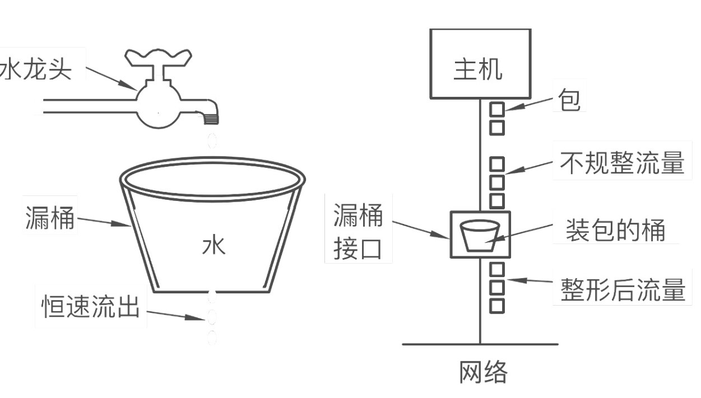

但是漏桶算法也有一些缺点：
* 增加了延迟
* 无法应对突发性的应用(如网页浏览)

#### 令牌桶算法
为了解决以上两个问题，出现了令牌桶算法。
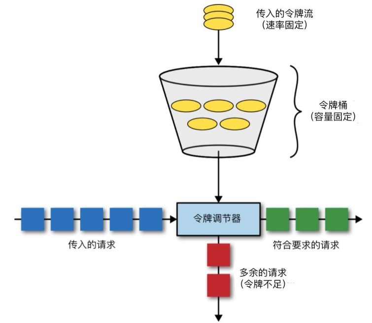

如上图所示，一个数据包如果想要传输，那么就必须从桶中拿到一个令牌，否则要被丢弃。
* 令牌产生的速率是固定的，可以通过这一点控制传输速率
* 同时这里解决了延迟的问题，只要桶里有令牌，就可以立即开始传输
* 令牌桶还能解决突发的问题，突发的上限取决于桶的大小。

### 数据包调度
解决的是**为了保障性能如何在路由器预留资源**的问题。即给定应用的需求(流量、突发)之后，由路由器预留资源，保障性能。

就是在buffer上实现调度算法。
• 先来先服务FCFS（First-Come First-Serve）
• 公平队列算法（Fair Queueing）
• 加权公平队列算法（Weighted Fair Queueing）
• 优先级调度（Priority Scheduling）

### 服务需求
解决的是**应用程序需要网络提供什么样的质量**的问题。

描述应用的质量常用的方法有两种。
#### 综合服务
典型的虚电路服务，
* 应用必须非常清楚地描述需要的带宽是多少，时延是多少。
* 传输之前需要资源预留协议RSVP

综合服务因为实现上非常困难，所以是失败的。

#### 区分服务
IPv4的header中有一个栏位就是关于区分服务的，可以告诉优先级。

严格的满足某种带宽或者时延是困难的，但是可以把条件放宽松一些。即说明自己是倾向于大带宽或是倾向于低时延，对于这种不同的分类，就能实现不同地路由方式。

## VPN(Virtual Private Network)
目的：希望数据在通过公网传输时是安全的。
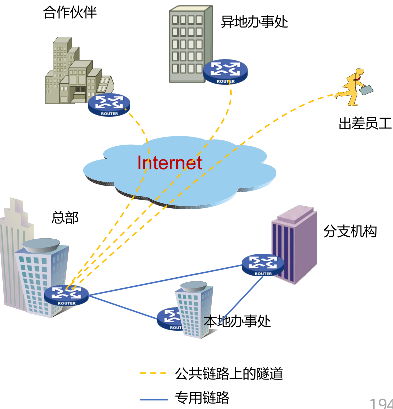

VPN实现的方法之一就是通过隧道技术。
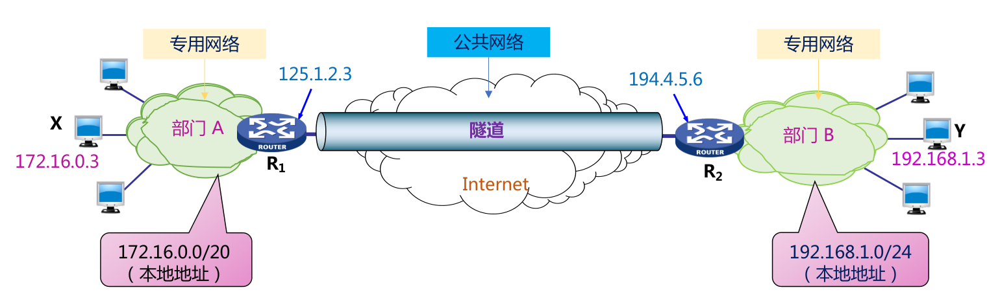

比如数据报想要从R1传输到R2，中间需要经过公共网络，不安全。此时可以在R1对数据报进行封装，封装之后形成新的数据报，起点是R1，终点是R2。这是原本数据报的源地址X和目的地址Y就被隐藏，内容也会被加密。R2对数据报拆封，并且对内容进行解密，就可以继续正常传输。

## IPv6技术
IPv6（Internet Protocol version 6）是互联网工程任务组（IETF）设计的用于替代IPv4的下一代协议。

IPv6地址表示法，冒分十六进制，$x:x:x:x:x:x:x:x$
• 简化方法：每个x前面的0可省略，可把连续的值为0的x表示为“::”, 且“::”只能出现1次
• 简化前地址，2001:0DA8:0000:0000:200C:0000:0000:00A5
• 简化后地址，2001:DA8:0000:0000:200C::A5

### IPv6头部
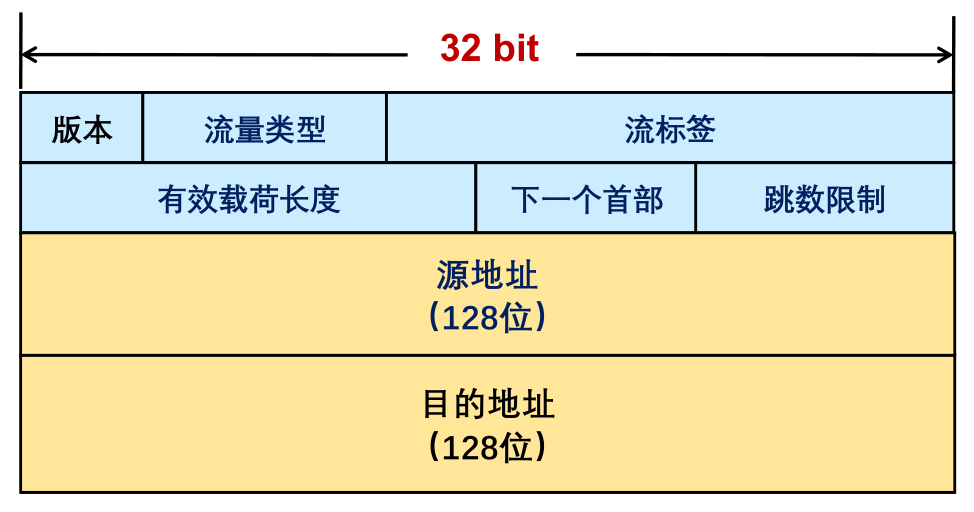

* 版本：4bit，协议版本号，值为6
* 流量类型：8bit，区分数据包的**服务类别**或优先级
  * 对应区分服务
* 流标签：20bit，标识同一个数据流
  * 进程和进程之间通信，通信的数据报就属于同一个流。在IPv4中，想要知道数据报属于哪一个流，需要使用5 tuple(源地址，目的地址，源端口号，目的端口号，传输层协议)。使用5 tuple需要同时知道网络层和传输层的信息，而使用流标签能让路由器更快地做出判断，增加了IP的传输效率。
* 有效载荷长度：16bit ，IPv6报头之后载荷的字节数（含扩展头），最大值64K
  * 对应IPv4的总长度
* 下一个首部：8bit ，IPv6报头后的协议类型，可能是TCP/UDP/ICMP等，也可能是扩展头
* 跳数限制：8bit ，类似IPv4的TTL，每次转发跳数减1，值为0时包将会被丢弃
  * 对应生存时间
* 源地址：128bit ，标识该报文的源地址
* 目的地址：128bit ，标识该报文的目的地址

IPv6头部相比IPv4减少的东西
* 没有首部校验和
  * TCP和UDP会做校验，校验时会加入pseudo header，即IP层的header。但是当数据从下层往上层传输的时候，应当把头部先去掉，但是由于IP的header非常重要，因此这里保留下来进行校验，避免IP地址被篡改等问题。
  * 由于传输层做了校验，IPv6就把校验去掉了
* 没有首部长度
  * IPv4有选项，但是IPv6没有。
  * 长度固定是为了IPv6的转发效率
  * IPv6中选项的功能与下一个首部有关
* 没有标识、标志与片偏移
  * IPv4中这三个与分片有关
  * IPv6为了效率，不允许在转发的过程中做分片。在发送之前就会找到合适的路径。
* 没有协议
  * IPv4中协议即上层使用的协议，如TCP，UDP，ICMP等
  * IPv6中该功能和下一个首部相关

### IPv6扩展头
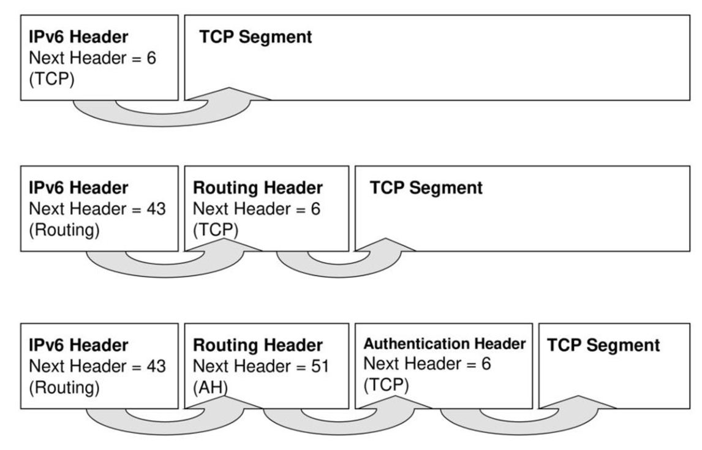

IPv6想要实现功能的扩充，可以在中间插入头部。