
解答：林昊、朱小志


**问题2**
图中，若选支路{1, 2, 4, 5, 6}为树支，则{1, 2, 6, 7}是基本割集。

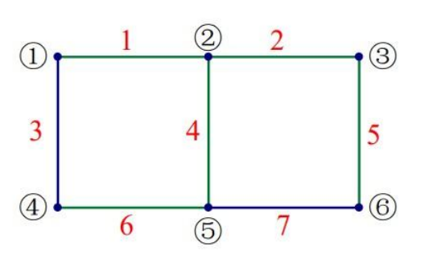

解答：

**False**。
基本割集只能包含一条树支。

**问题3**
图示电路中所有线性电阻的阻值相同，则图(a)的等效电阻$R_{ab}$更大。

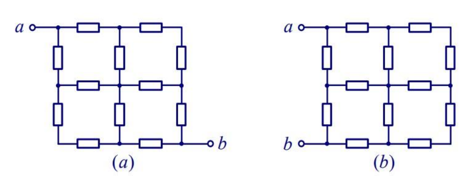

解答：

**True**
$$
(a)R_{eq}=\frac{1}{2}[R+\frac{1}{2}(2R+2R)+R]=\frac{3}{2}R
$$

$$
(b)R_{eq}=2R//[R+(2R)//(R+2R+R)+R]=\frac{5}{4}R
$$

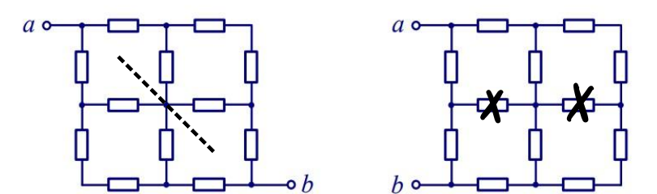

**问题4**
图示正弦稳态电路中功率表的读数与$2 \Omega$电阻吸收的有功功率相同。

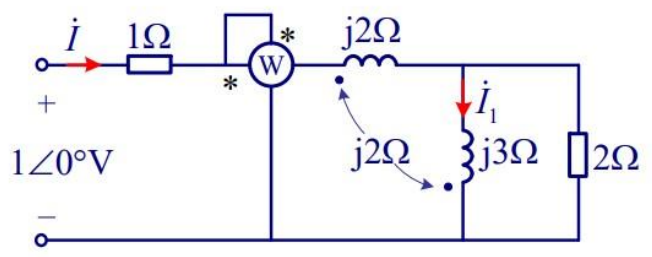

解答：

**True**
电感不消耗有功功率。

**问题5**
图示二端口网络若为对称二端口，则元件参数需满足 $R_1=(n^{2}-1)R_2$

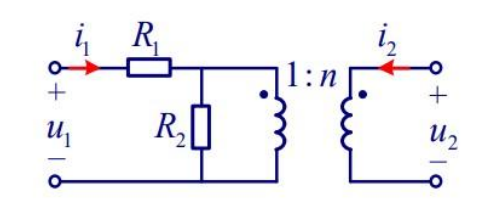

解答：

**True**

若网络为对称端口，当 $i_1=i_2\equiv i$，有 $u_1=u_2\equiv u$

$$
(1+n)\cdot i\cdot R_2=\frac{1}{n}u
$$

$$
iR_1=(1-\frac{1}{n})u
$$

将上两式相除，得到
$$
(1+n)\frac{R_1}{R_2}=\frac{1}{n-1}
$$

$$
R_1=(n^2-1)R_2
$$

**问题6**
若图示电路中 $R<5\Omega$，则此电路不存在谐振频率。 

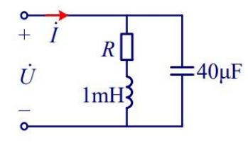

解答：

**False**

$$
Y=j\omega C+\frac{1}{j\omega L+R}=\frac{R}{\omega ^2L^2+R^2}+j\omega (C-\frac{L}{\omega ^2L^2+R^2})
$$

$$
\omega =\frac{1}{L}\sqrt{\frac{L}{C}-R^2}
$$

$$
\because \frac{L}{C}-R^2>0
$$

所以存在谐振频率。

**问题7**
图示电路中，N仅由线性电阻构成，图(a)中$I_1=1A，I_2=0.5A$，则图(b)中电压$U_1$为($\quad$)。

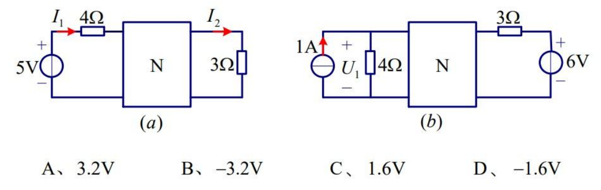

解答：

**A**

重画电路图如图：

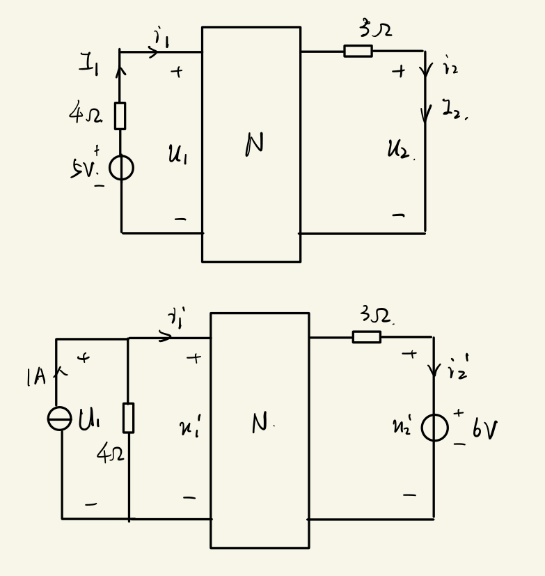

有
$$
\begin{aligned}
&i_1=I_1=1A \quad u_1=5-4\times 1=1V\\
&i_2=I_2=0.5A\quad u_2=0\\
&u_1'=4(1-i_1') \quad u_2'=6V
\end{aligned}
$$

利用特勒根定理
$$
-i_1u_1'+i_2u_2'=-i_1'u_1+i_2'u_2
$$

$$
\Rightarrow i_1'=\frac{1}{5}A \quad U_1=u_1'=\frac{16}{5}V
$$

**问题8**
图示电路中N为线性含源电阻电路，根据图(a)、(b)的情况，可得图(c)中的电压$U$为($\quad$ )。

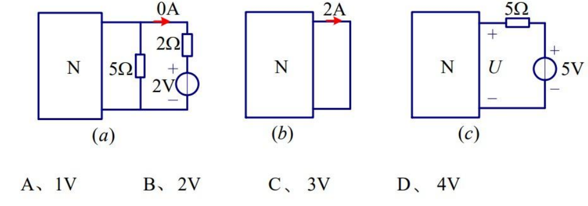

解答：

**C**

对N做戴维宁等效，记等效电阻为 $R_0$，等效电压为 $U_0$.
(a). 最右侧支路无电流，所以 $5\Omega$ 电阻上电流为 $2 /5=0.4A$
$$
U_0=0.4(R_0+5)
$$

(b). 
$$
U_0=2R_0
$$

由以上条件可以解得 $U_0=2.5V$，$R_0=1.25\Omega$

(c).
$$
\begin{aligned}
I=\frac{5-U_0}{R_0+5}=0.4A \\
U=5-5I=3V
\end{aligned}
$$

**问题9**
图示电路中$1\Omega$电阻吸收的功率为($\quad$ )。

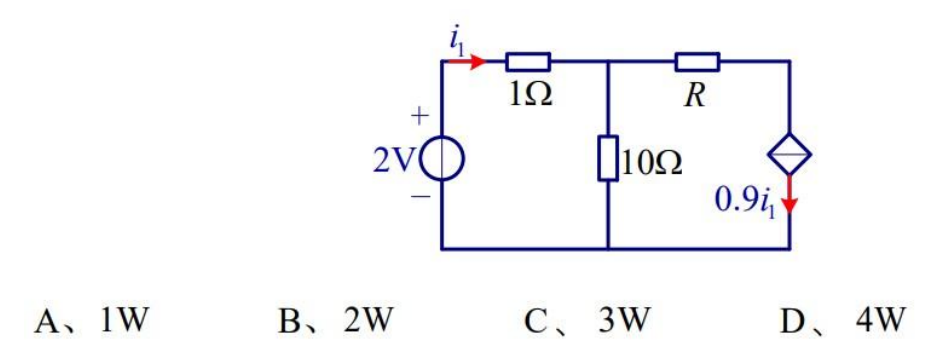

解答：

**A**

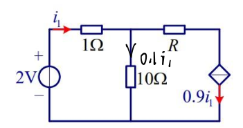

$$
1\times i_1+10\times 0.1i_1=2V \Rightarrow i_1=1A,P=1W
$$

**问题10**
图示电路中理想二极管两端电压U为($\quad$)。

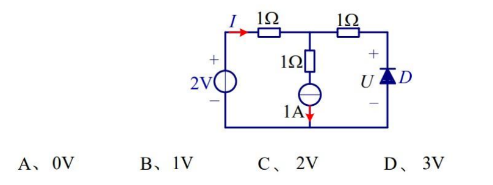

解答：

**B**

假设二极管不导通，则右侧支路无电流。则
$$
U=2-1\times 1=1V>0
$$

可以看出假设成立，$U=1V$

**问题11**
图示电路的短路电导参数为($\quad$)。

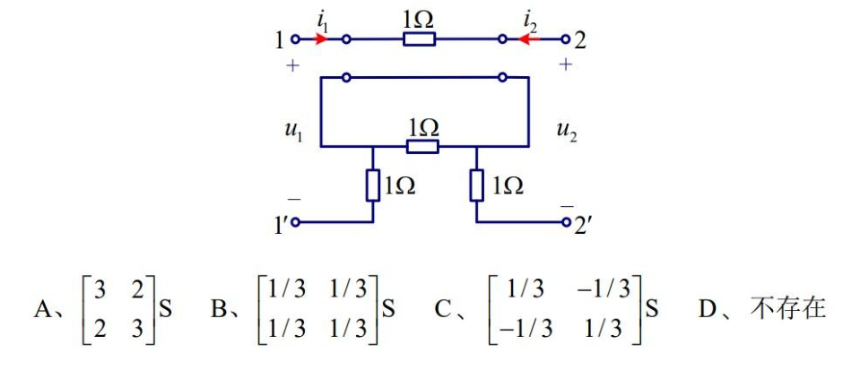

解答：

**D**

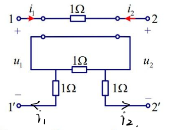

$$
\begin{cases}
    i_1+i_2=0 \\
    -u_1+i_1+u_2-i_2+i_1=0
\end{cases}\Rightarrow u_1=u_2+3i_1
$$

$$
\therefore \begin{pmatrix} i_1 \\ i_2\end{pmatrix} =
\begin{pmatrix} 
    \frac{1}{3} & -\frac{1}{3}\\ -\frac{1}{3} & \frac{1}{3}
\end{pmatrix} 
\begin{pmatrix} 
    u_1\\u_2 
\end{pmatrix} 
$$

**问题12**
图示电路在开关K打开前已达稳态。$t=0$时开关打开，则下列选项中<strong>错误</strong>的是 ($\quad$)。

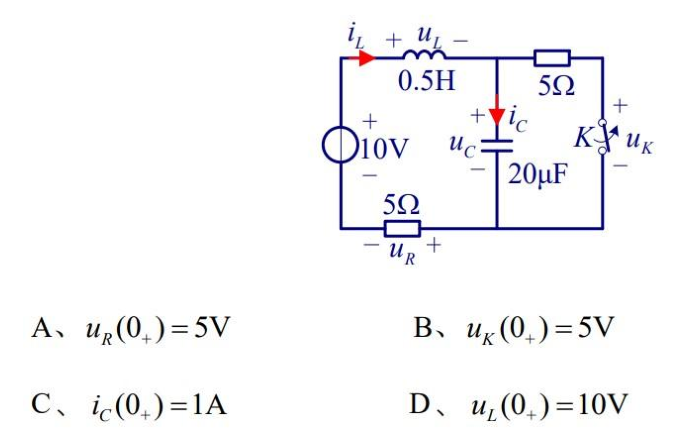

解答：

**D**

$$
i_{L}(0_{-})=1A \quad u_{C}(0_{-})=5V
$$

打开开关K，$i_{L}$ 和 $u_{C}$ 均为发生跳变
$$
\therefore  i_{L}(0_{+})=i_{L}(0_{-})=1A \quad u_{C}(0i_{+})=u_{C}(0_{-})=5V
$$

A.$u_{R}(0_{+})=5\Omega\times i_{L}(0_{+})=5V$，正确
B.$u_{K}(0_{+})=u_{C}(0_{+})=5V$，正确
C.$i_{C}(0_{+})=i_{L}(0_{+})=1A$，正确
D.$u_{L}(0_{+})=10V-u_{C}(0_{+})-u_{R}(0_{+})=0$，错误

**问题13**
图示电路的相应为($\quad$)。

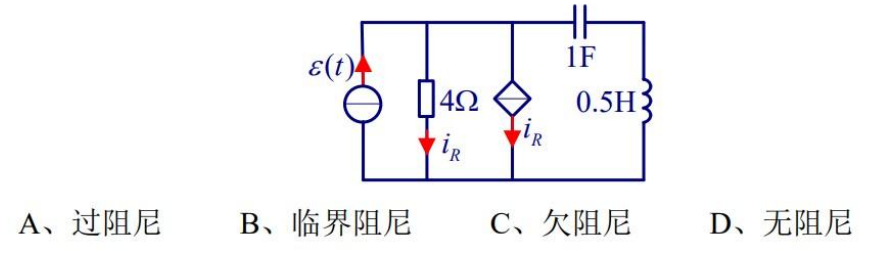

解答：

**A**

先将电路做如下等效变换

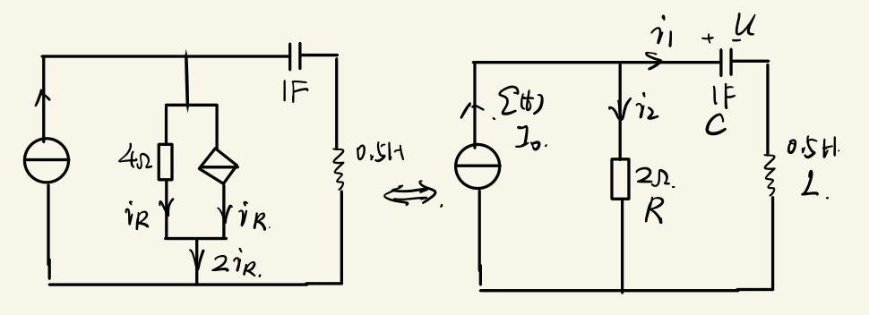

$$
\begin{aligned}
& i_1+i_2=I_0 \\
& i_1=C\frac{\mathrm{d}u}{\mathrm{d}t}\\
& Ri_2=u+L\frac{\mathrm{d}i_1}{\mathrm{d}t}
\end{aligned}
$$

$$
\Rightarrow LC\frac{\mathrm{d}^{2}u}{\mathrm{d}t^{2}}+RC\frac{\mathrm{d}u}{\mathrm{d}t}+u=RI_0
$$

$$
\Delta=(RC)^{2}-4LC=4-2>0
$$

因此为过阻尼。

**问题14**
图示有向图的降阶关联矩阵$\bm{A}$为($\quad$)。

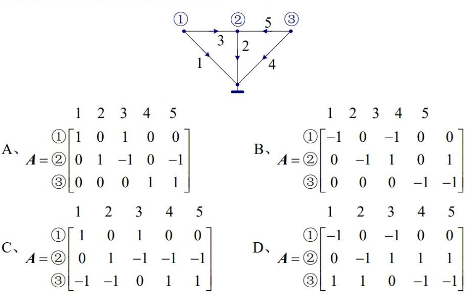

解答：

**A**

**问题15**
图示电路的节点电压方程($\quad$)。

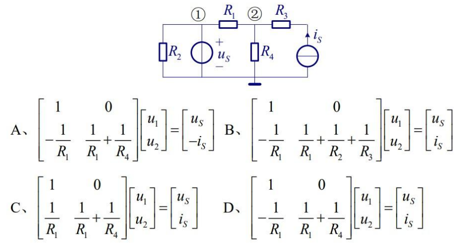

解答：

**D**

$$
u_1=u_s \\
(\frac{1}{R_1}+\frac{1}{R_4})u_2-\frac{1}{R_1}u_1-i_{s}=0
$$

将方程化成矩阵形式即可得到答案。

**问题16**
图示电路中理想运算放大器工作于线性区，则电路时间常数为($\quad$)。

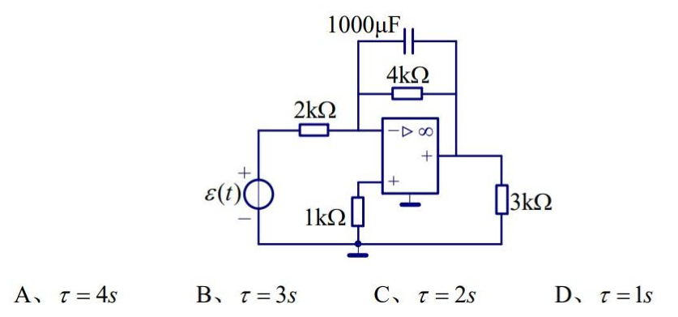

解答：

**A**

分析电路，可以看出电路上方流过的电流恒定为 $0.5mA$

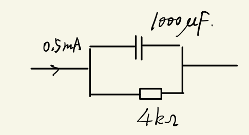

$$
\therefore \tau =RC=4k\Omega*1000\mu F=4s
$$

**问题17**
若图示电路外接 $\omega=1 rad/s$的正弦激励时的输入等效阻抗 $Z_{ab}=j4\Omega$，则方框中所接元件及其参数是($\quad$ )。

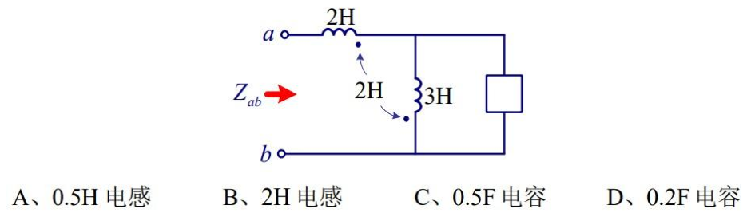

解答：

**B**

先去耦得到如图电路

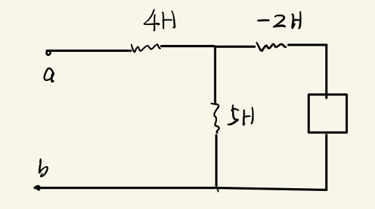

$$
Z_{ab}=\frac{(Z-2j)5j}{(Z-2j)+5j}+4j=4j\Rightarrow Z=2j
$$

因此框中应该是一个 $2H$ 的电感。

**问题18**
图示三相对称电阻性负载外接三相对称正序(UVW)电源，电源相电压有效值为200V，三相负载吸收的有功功率为1200W。则以下选项<strong>错误</strong>的是($\quad$ )。

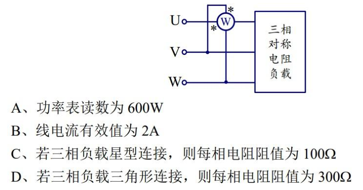

解答：

**A**

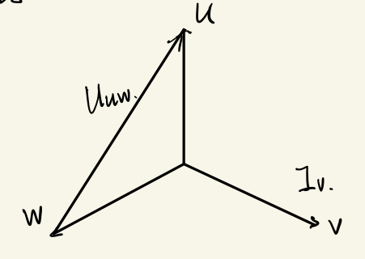

A. 如图所示，$U_{uw}$ 和 $I_{v}$ 垂直，功率为 $0$
B. 由于负载连接方式对线电流无影响，不妨设负载为星形连接。一个电阻有 $P_0=400W$。线电流等于负载端相电流 $$I=P /U=2A$$
C. 
$$
R=\frac{u^{2}}{P_0}=100 \Omega
$$

D.
$$
R=\frac{(\sqrt{3}U)^{2}}{P_0}=300\Omega
$$

**问题19**
图示电路中N是线性电阻网络。$t=0$ 时开关闭合，若 $u_{s}=2\varepsilon(t)V$，有<strong>全响应</strong> $u_{C}=8-4e^{-3t}V(t\ge 0)$，则网络函数 $\displaystyle H(s)=\frac{U_{C}(s)}{U_{S}(s)}$ 为($\quad$) 

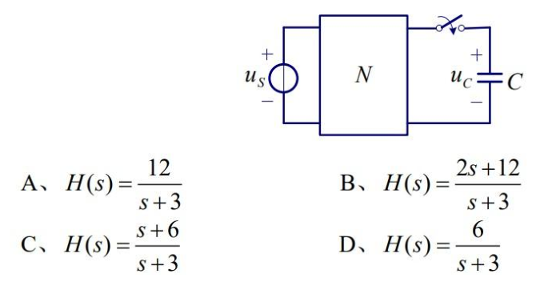

解答：

**A**

因为网络函数考虑的是一个零状态的运算电路，而电容的全响应为 $u_{C}=8-4e^{-3t}V(t\ge 0)$， 我们写出其零响应的形式，为 $u_{C}=8-8e^{-3t}V$。

$$
\therefore U_{C}(s)=\frac{8}{s}-\frac{8}{s+3}
$$

$$
U_{S}(s)=\frac{2}{s}
$$

$$
\Rightarrow H(s)=\frac{U_{C}(s)}{U_{S}(s)}=\frac{12}{s+3}
$$

**问题20**
图示二端口网络<strong>不存在</strong>以下哪种参数( $\quad$ )。

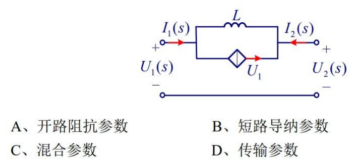

解答：

**A**

$$
I_1\left( s \right) +I_2(s)=0
$$

$$
U_1(s)-U_2(s)=[I_1(s)-U_1(s)]\cdot j\omega L
$$

而开路电阻参数的形式为
$$
\begin{pmatrix} 
    U_1 \\ U_2 
\end{pmatrix} =
\begin{pmatrix} 
    Z_{11}&Z_{12}\\ Z_{21} &Z_{22}
\end{pmatrix} 
\begin{pmatrix} 
    I_1\\ I_2 
\end{pmatrix} 
$$

可以看出由电路列出的两条方程无法写成开路电阻参数的形式。

**问题21**
图示电路中，理想运算放大器工作于线性区。欲使电流 $i_{L}$与负载电阻 $R_{L}$无关，则图中电阻元件参数需满足以下哪个条件($\quad$)。

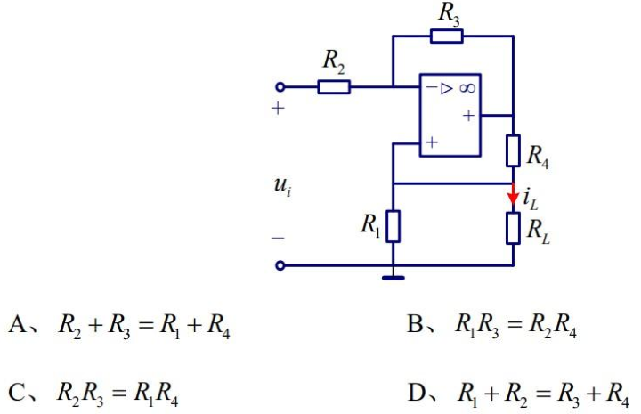

解答：

**B**

设 $R_2$ 上电流为 $i_2$，$R_4$ 上电流为 $i_4$
$$
i_2=\frac{u_1-i_LR_L}{R_2}
$$

$$
i_4=(i_{L}+i_{L}\frac{R_{L}}{R_1})
$$

$$
\begin{aligned}
u_i&=(R_2+R_3)i_2+R_4i_4+i_{L}R_{L} \\
&=(R_2+R_3)\frac{u_i-i_{L}R_{L}}{R_2}+R_4(i_{L}+i_{L}\frac{R_{L}}{R_1})+i_{L}R_{L} \tag{1}
\end{aligned}
$$

如果想让 $i_{L}$ 与 $R_{L}$ 无关，那么方程(1)中应当没有 $i_{L}R_{L}$ 的项。即
$$
-\frac{R_3+R_2}{R_2}\cdot i_{L}R_{L}+\frac{R_4}{R_1}i_{L}R_{L}+i_{L}R_{L}=0
$$

$$
\therefore R_1R_3=R_2R_4
$$

**问题22**
**(1) 计算题**
试求图示电路的最简等效电路。

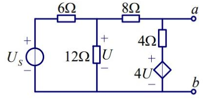

解答：

网孔电流法，设最左侧网孔有网孔电流 $i_2$，中间网孔 $i_1$，右侧假设 $ab$ 间接了电流源，电流 $i$。设以上网孔电流方向均为逆时针。

对于最左侧网孔
$$
12i_1-18i_2=U_S\,\,\Rightarrow \,\,i_1=\frac{18i_2+U_S}{12}
$$

对于中间网孔
$$
24i_1-4U-12i_2-4i=0,U=12\left( i_1-i_2 \right) \Rightarrow i=-6i_1+9i_2=-\frac{U_S}{2}
$$

从表达式中看出流入 $ab$ 端口的电流与 $ab$ 端口电压无关，为一个常数。最后得到等效电路为

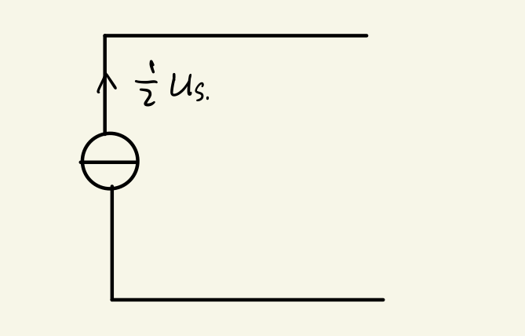

**(2)计算题**
图示电路中，$L_1=1H,L_2=2H,R=3\Omega$，试计算单位阶跃响应 $i_{R}$。

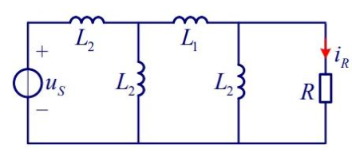

解答：

将电路左侧等效为诺顿电路
$$
Z_{eq}=\left( 2s \right) //\left[ s+\left( 2s \right) //\left( 2s \right) \right] =s
$$

$$
I_{S}(s)=\frac{1}{4s^{2}}
$$

从而解得电阻上电流
$$
I_R(s)=\frac{1}{4s^2}\cdot \frac{s}{s+3}=\frac{1}{12}\left( \frac{1}{s}-\frac{3}{s+3} \right) 
$$

$$
\therefore i_R\left( t \right) =\frac{1}{12}\left( 1-e^{-3t} \right) \varepsilon \left( t \right) 
$$

**(3)计算题**
图示电路中，$u_s=(1+\sqrt{2}\sin t+2\cos 2t)V$，试求电流 $i$ 的有效值。

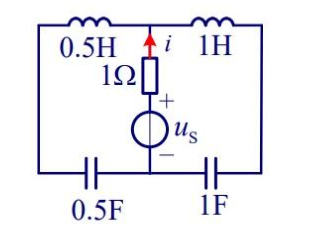

解答：

使用叠加定理，
$$
u_s=\sqrt{2}\sin t \Rightarrow i=\sqrt{2}\sin t
$$

$$
u_s=2\cos 2t \Rightarrow i=2\cos t
$$

$$
u_s=1 \Rightarrow i=0
$$

$$
\therefore i=\sqrt{2}\sin t+2\cos t
$$

$$
\therefore I=\sqrt{\left( \frac{\sqrt{2}}{\sqrt{2}} \right) ^2+\left( \frac{2}{\sqrt{2}} \right) ^2}A=\sqrt{3}A
$$

**(4)分析题**
图示电路中对称三相正序电源的相电压 $\dot{U}_{AN}=220 \angle 0 \degree V,Z_1=20\Omega,Z_2=(20+j40)\Omega$ 阻抗 $Z$ 为多大时可获得最大功率?并求此功率。

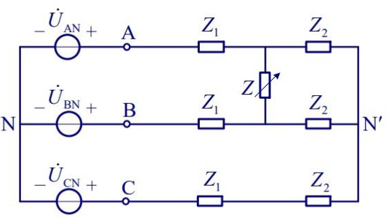

解答：

先将电路等效为戴维宁电路，然后利用 $Z=Z_{eq}^{*}$ 时功率最大，得到 $Z$。最后求出该最大功率。

等效电阻为
$$
Z_{eq}=\left( 2Z_1 \right) //\left( 2Z_2 \right) =40//\left( 40+80j \right) =30+10j
$$
 
$$
\Rightarrow Z=Z_{eq}^*=30-10j
$$

再求此时流过 $Z$ 的电流

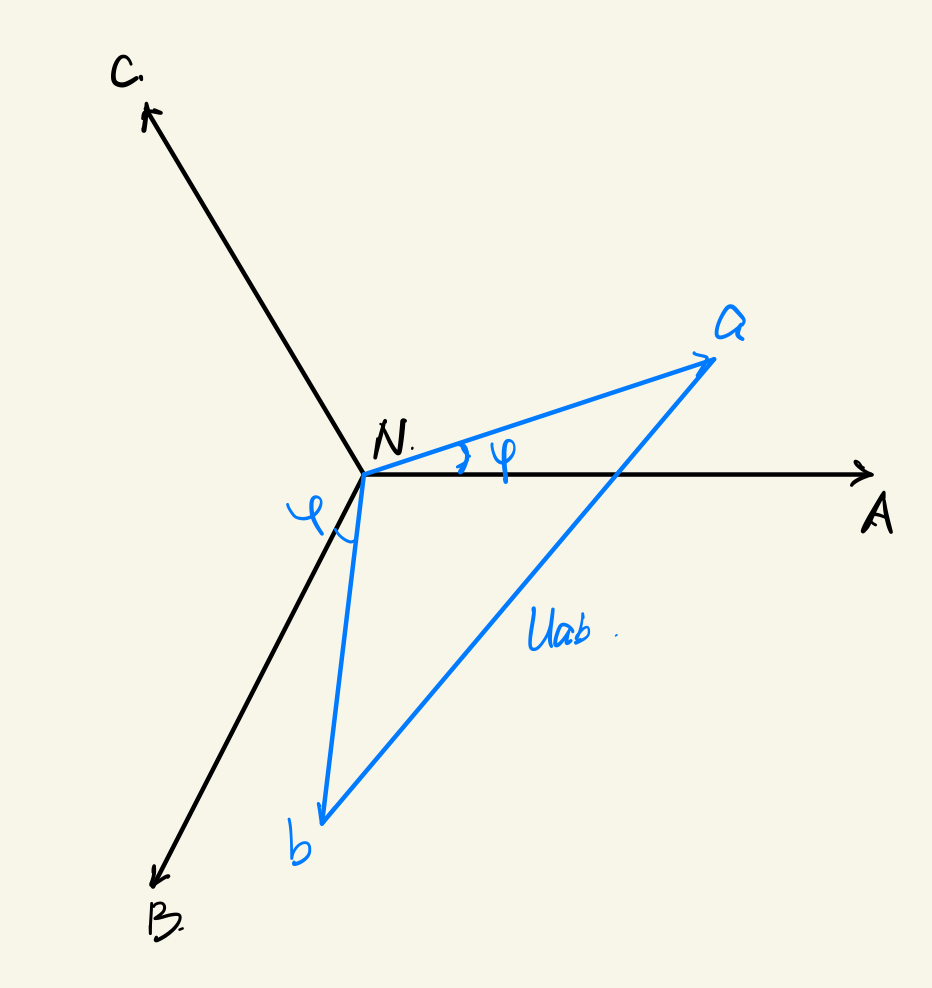

$$
U_a=\frac{Z_1}{Z_1+Z_2}U_{AN’}=55\sqrt{10}\angle \varphi ,\,\,\varphi =\arctan \frac{1}{3}
$$

$$
\therefore U_{ab}=22\sqrt{30}\angle \left( \varphi +30° \right) =U_{OC}
$$

$$
\,\,I=\frac{U_{OC}}{Z+Z_{eq}}=\frac{11\sqrt{30}}{12}\angle \left( \varphi +30° \right) ,U_Z=ZI=\frac{275}{3}\sqrt{3}\angle 30°
$$

最后得到功率
$$
S=P+jQ=U_ZI^*=\frac{3025}{12}\sqrt{10}\angle -\varphi \,\,
$$

$$
\Rightarrow P={Re}\left\{ S \right\} =\frac{3025}{12}\sqrt{10}\cos \left( -\varphi \right) =756.25
$$
