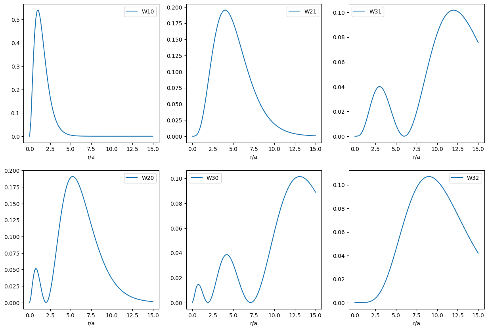

## 处理方法
### 定态薛定谔方程 
$$
[-\frac{\hbar^{2}}{2m}\nabla ^{2}+U(r)]\psi=E\psi
$$

其中 
$$
U(r)=-\frac{e^{2}}{4\pi \varepsilon_0 r}
$$

* 在直角坐标中
$$
\left[-\frac{\hbar^{2}}{2 m}\left(\frac{\partial^{2}}{\partial x^{2}}+\frac{\partial^{2}}{\partial y^{2}}+\frac{\partial^{2}}{\partial z^{2}}\right)+U(r)\right] \psi=E \psi \quad(r=\sqrt{x^{2}+y^{2}+z^{2}})
$$
* 在球坐标系中
$$
\nabla^{2}=\frac{1}{r^{2}} \frac{\partial}{\partial r}\left(r^{2} \frac{\partial}{\partial r}\right)+\frac{1}{r^{2} \sin \theta} \frac{\partial}{\partial \theta}\left(\sin \theta \frac{\partial}{\partial \theta}\right)+\frac{1}{r^{2} \sin ^{2} \theta} \frac{\partial^{2}}{\partial \varphi^{2}}=\frac{1}{r^{2}} \frac{\partial}{\partial r}\left(r^{2} \frac{\partial}{\partial r}\right)-\frac{1}{r^{2}} \frac{\hat{L}^{2}}{\hbar^{2}}
$$

其中 $\hat{L}^{2}$ 是角动量平方算符。
$$
\hat{L}^{2}=-\hbar^{2}\left[ \frac{1}{\sin \theta}\frac{\partial }{\partial \theta}\left( \sin \theta \frac{\partial }{\partial \theta} \right) +\frac{1}{\sin ^{2} \theta}\frac{\partial ^{2}}{\partial \varphi^{2}} \right]
$$

故最终得到球坐标系下的定态薛定谔方程为
$$
\left(-\frac{\hbar^{2}}{2 m r^{2}} \frac{\partial}{\partial r}\left(r^{2} \frac{\partial}{\partial r}\right)-\frac{e^{2}}{4 \pi \varepsilon_{0} r}\right) \psi+\frac{\hat{L}^{2}}{2 m r^{2}} \psi=E \psi 
$$

### 分离变量
设 $\psi=R(r)Y(\theta,\varphi)$，代入，得到
$$
\Rightarrow \frac{1}{R}\left(-\frac{\hbar^{2}}{2 m r^{2}} \frac{\partial}{\partial r}\left(r^{2} \frac{\partial}{\partial r}\right)-\frac{e^{2}}{4 \pi \varepsilon_{0} r}\right) R+\frac{1}{Y} \frac{\hat{L}^{2} Y}{2 m r^{2}}=E 
$$

然后再经过移项，把含有相同自变量的项移到同一边
$$
2 m r^{2} E-\frac{2 m r^{2}}{R}\left(-\frac{\hbar^{2}}{2 m r^{2}} \frac{\partial}{\partial r}\left(r^{2} \frac{\partial}{\partial r}\right)-\frac{e^{2}}{4 \pi \varepsilon_{0} r}\right) R=\frac{\hat{L}^{2} Y}{Y} \equiv C
$$

对于
$$
\frac{\hat{L}^{2} Y}{Y} = C \Rightarrow \hat{L}^{2}Y=CY
$$

可以看出是 $\hat{L}^{2}$ 的本征方程，同时考虑到 $Y$ 是关于 $\theta,\varphi$ 的函数，那么本征函数应当是球谐函数。即
$$
\hat{L}^{2}Y_{lm}(\theta,\varphi)=l(l+1)\hbar^{2}Y_{l m}(\theta,\varphi)
$$

得到本征值为 $l(l+1)\hbar^{2}=L^{2}$，$L=\sqrt{l(l+1)}\hbar$ 为角动量大小。

然后还要求解径向方程
$$
\left(\frac{\partial}{\partial r}\left(r^{2} \frac{\partial}{\partial r}\right)+\frac{2 m r^{2}}{\hbar^{2}}\left(E+\frac{e^{2}}{4 \pi \varepsilon_{0} r}\right)-l(l+1)\right) R(r)=0
$$

可以最终得到能量本征值 $E_n$ 和 $R_{nl}(r)$。

## 能量量子化
通过求解径向方程，利用波函数的有限性条件：$r\rightarrow 0$ 时 $R(r)$ 有限，$r \rightarrow \infty$ 时 $R\rightarrow 0(E<0)$，最终可以解得当粒子能量小于零的情况下（束缚态），仅当粒子能量 $E_n$ 取分立值时，波函数才满足上述要求。并且得到
$$
E_n=-\frac{me^{4}}{32\pi^{2}\varepsilon_0^{2}\hbar^{2}}\frac{1}{n^{2}}\thickapprox -13.6 \frac{1}{n^{2}}eV \quad n=1,2,3\cdots 
$$

符合实验结果。

当 $n=1,2,3$ 时的 $R_{nl}$(径向波函数)：
$$
\begin{array}{ll}
\displaystyle R_{10}=\frac{2}{a^{3 / 2}} e^{-r / a} &\displaystyle  R_{30}=\frac{2}{3 \sqrt{3} a^{3 / 2}}\left(1-\frac{2 r}{3 a}+\frac{2}{27}\left(\frac{r}{a}\right)^{2}\right) e^{-r / 3 a} \\\quad \\
\displaystyle R_{20}=\frac{1}{\sqrt{2} a^{3 / 2}}\left(1-\frac{r}{2 a}\right) e^{-r / 2 a} & \displaystyle R_{31}=\frac{8}{27 \sqrt{6} a^{3 / 2}}\left(1-\frac{r}{6 a}\right) e^{-r / 3 a} \cdot\left(\frac{r}{a}\right) \\ \quad \\
\displaystyle R_{21}=\frac{1}{2 \sqrt{6} a^{3 / 2}} \frac{r}{a} e^{-r / 2 a} &\displaystyle  R_{32}=\frac{4}{81 \sqrt{30} a^{3 / 2}}\left(\frac{r}{a}\right)^{2} e^{-r / 3 a}
\end{array}
$$

其中 $\displaystyle a=\frac{\varepsilon_0\hbar}{\pi m e^{2}}\thickapprox 0.05nm$，称为波尔半径。

## 电子轨道角动量量子化
通过求解薛定谔方程可以得到 $L=\sqrt{l(l+1)}\hbar$，而角量子数 $l$ 受主量子数 $n$ 限制，$l$ 的取值只能为 $0,1,2,3 \cdots  n-1$，对应的符号为 $s,p,d,f\cdots$。

回忆波尔理论，$L=n\hbar$，由此处可以知道波尔的假设是错误的，但是最终却能得到氢原子能级的正确的结果，这是因为氢原子的轨道假设同样是错误的，两个错误最终得到了正确的结果。

对于角动量在 $z$ 方向的分量(此处 $z$ 方向为外加磁场方向)，$L_z=m\hbar$，其中 $m=0,\pm 1,\pm 2\cdots \pm l$，为磁量子数，与原子光谱在外磁场中发生的分裂有关。在角动量 $L$ 大小一定的情况下 $L_z$ 取确定值，这体现了**角动量空间取向量子化**。

### Zeeman 效应
Zeeman效应指的是在磁场作用下氢原子从第一激发态向基态跃迁时光谱谱线一分为三。这与磁矩和外磁场相互作用有关。

电子磁矩与角动量关系为 $\displaystyle \vec{M}=-\frac{e}{2m}\vec{L}$，因此磁场与电子磁矩相互作用能为 
$$
W=-\vec{M}\cdot \vec{B}=-M_zB=\frac{e}{2m}L_zB=\frac{e}{2m}m\hbar B=
\begin{cases}
    \displaystyle \frac{e}{2m}\hbar B &m=1\\
    0 &m=0\\
    \displaystyle -\frac{e}{2m}\hbar B &m=-1
\end{cases}
$$

这几个相互作用能叠加在第一激发态的能量上，导致最后跃迁释放的能量有三个值，即能量分裂成三条。

## 氢原子定态波函数
$$
\psi_{nlm}(r,\theta,\varphi)=R_{nl}(r)Y_{l m}(\theta,\varphi)
$$

该波函数为 $(\hat{H},\hat{L}^{2},\hat{L}_z)$ 三个算符共同的本征函数。

### 沿径向概率密度
$$
\left\vert \psi(r,\theta,\varphi) \right\vert ^{2}\mathrm{d}V=\left\vert R_{nl}(t) \right\vert ^{2}\left\vert Y_{l m}(\theta,\varphi) \right\vert ^{2}r^{2}\mathrm{d}r\sin \theta \mathrm{d}\theta \mathrm{d}\varphi
$$

$$
\Rightarrow W_{nl}(r)\mathrm{d}r=\left[ \int\left\vert Y_{lm}(\theta,\varphi) \right\vert^{2} \mathrm{d}\Omega \right]\left\vert R_{nl}(r) \right\vert^{2} r^{2}\mathrm{d}r=\left\vert R_{nl}(r) \right\vert^{2} r^{2}\mathrm{d}r
$$

得到电子沿径向概率密度为 $W_{nl}(r)=\left\vert R_{nl}(r) \right\vert^{2} r^{2}$

### 立体角元概率密度
$$
W_{l m}(\theta,\varphi)\mathrm{d}\Omega=\left[ \int_{0}^{\infty}\left\vert R_{nl}(r) \right\vert^{2} r^{2}\mathrm{d}r \right] \left\vert Y_{lm}(\theta,\varphi) \right\vert^{2} \mathrm{d}\Omega=\left\vert Y_{lm}(\theta,\varphi) \right\vert^{2} \mathrm{d}\Omega
$$

得到电子在立体角元的概率密度为 $W_{l m}(\theta,\varphi)=\left\vert Y_{l m}(\theta,\varphi) \right\vert ^{2}$

## 电子自旋角动量及其空间量子化
这一点无法从薛定谔方程中得出，而是从实验中推出的。
### 斯特恩——盖拉赫实验
一束银原子通过非匀强磁场。考虑到银原子与磁场相互作用能 $W=-\vec{M}\cdot \vec{B}$，$\displaystyle \therefore F_z=\frac{\partial W}{\partial z}=M_z\frac{\partial B}{\partial z}$，银原子 $z$ 方向的受力情况与其磁矩的 $z$ 分量 $M_z$ 有关。

银原子核外电子排布式为 $Ag(Z=47) \quad 1s^{2}2s^{2}2p^{6}3s^{2}3p^{6}3d^{10}4s^{2}4p^{6}4d^{10}5s^{1}$，内层电子 $z$ 方向的角动量、磁矩矢量和为 $0$，最外层只有一个 $5s$ 电子，$l=0$。故银原子应不受 $z$ 方向的力，不偏转。但实际情况是，银原子束通过非均匀的磁场时，分裂成了两束。由此推测，电子还具有其他自由度。
#### 实验意义
* *进一步说明了空间量子化的存在*。因为原子沉积层不是连续一片，而是分开的线，说明角动量空间量子化的存在。
* *发现了新的矛盾*。揭示了原有理论的不足。
* *提供了原子的“态分离”技术*。（指的就是像实验中将银原子分成两半）

### 理论解释
乌伦贝克和古兹密特提出假设：电子不是质点，有固定的自旋角动量 $\vec{S}$ 和相应的自旋磁矩 $\vec{\mu}_{S}$，电子带负电，磁矩的方向和自旋的方向应相反。相对于外磁场方向 $z$，$\vec{S}$ 有向上和向下两种取法。

自旋虽然不能用经典的图像来理解，但仍然和角动量有关。自旋角动量无经典对应，是一种相对论效应。电子自旋是一种 “内禀” 运动，不是小球自转。

类比轨道角动量的量子化，可给出自旋角动量的量子化：
自旋角动量有：$S=\sqrt{s(s+1)}\hbar$，$S_z=m_{S}\hbar$，其中 $s$ 是自旋量子数，$m_{S}$ 是自旋磁量子数。类似 $m_{l}$ 有 $2l+1$ 种取法，$m_{S}$ 应有 $2s+1$ 种取法。

根据施 — 盖实验，最后银原子分成两条线，因此电子自旋磁量子数共有两种取法：
$$
2s+1=2\Rightarrow s=\frac{1}{2},\quad m_{S}=\pm \frac{1}{2}
$$

进而得到
$$
S=\sqrt{s(s+1)}\hbar = \frac{\sqrt{3}}{2}\hbar,\quad S_z=m_{S}\hbar=\pm \frac{1}{2}\hbar
$$

经过测量和计算（根据施 — 盖实验得到的数据），银原子（电子自旋）磁矩大小为
$$
\vec{M}_s=-\frac{e}{m}\vec{S}
$$

不同于轨道角动量与轨道磁矩的关系
$$
\vec{M}=-\frac{e}{2m}\vec{L}
$$

### 泡利不相容原理
* 费米子：自旋量子数为半奇数的粒子
* 玻色子：自旋量子数为整数的粒子

* **泡利不相容原理**：不能有两个电子具有相同的 $n,l,m_l,m_s$
* **玻色凝聚**：玻色子不受泡利不相容原理的限制，一个单粒子态可容纳多个玻色子