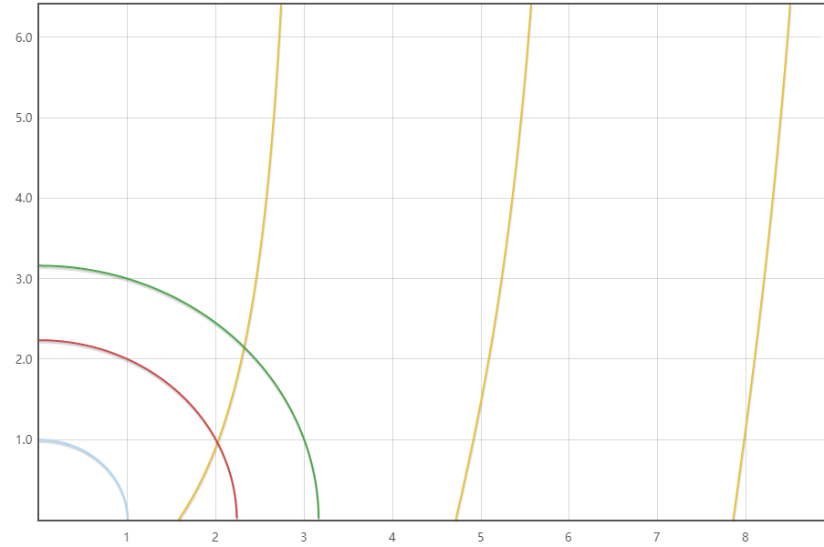
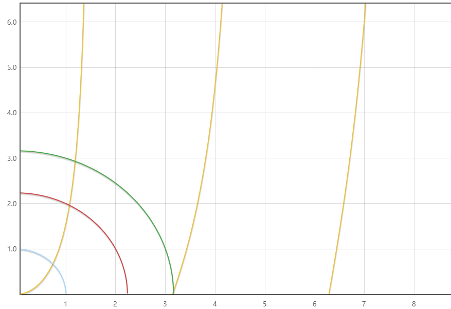

## 波函数求解
### 列微分方程
有限深势井函数为
$$
U(x)=\begin{cases}
    U_0 &\left\vert x \right\vert>a  \\
    0 &\left\vert x \right\vert<a 
\end{cases}
$$

势函数不显含时间，利用定态薛定谔方程
$$
\hat{H}\phi=E\phi \Rightarrow (-\frac{\hbar^{2}}{2m}+U(x))\phi=E\phi
$$

考虑势井内和势井外。在势井内
$$
\frac{\partial ^{2}\phi}{\partial x^{2}}+ \frac{2mE}{\hbar^{2}}\phi=0 \quad \left\vert x \right\vert <a
$$

在势井外
$$
\frac{\partial ^{2}\phi}{\partial x^{2}}+ \frac{2m}{\hbar^{2}}(E-U_0)\phi=0 \quad \left\vert x \right\vert >a
$$

讨论 $0<E<U_0$ 的情况(束缚态)。设 
$$
k^{2}=\frac{2mE}{\hbar^{2}} ,\quad k'^{2}=\frac{2m(U_0-E)}{\hbar^{2}}
$$

则
$$
\begin{aligned}
 \frac{\partial ^{2}\phi}{\partial x^{2}}+k^{2}\phi =0 \quad&\left\vert x \right\vert<a \\
 \frac{\partial ^{2}\phi}{\partial x^{2}}-k'^{2}\phi=0 \quad&\left\vert x \right\vert >a
\end{aligned}
$$

### 考虑波函数不发散
解为
$$
\phi=\begin{cases}
    A\sin (kx+\delta)\quad &\left\vert x \right\vert <a\\
    Be^{-k'x}+Ce^{k'x} \quad&\left\vert x \right\vert>a 
\end{cases}
$$

其中 $A,B,C,\delta$ 为待定常数。

由于波函数在 $\left\vert x \right\vert \rightarrow \infty$ 时不发散，$\left\vert x \right\vert >a$ 时的解可以写为
$$
\phi=\begin{cases}
    Be^{-k'x} \quad&x>a\\
    Ce^{k'x} \quad&x<a
\end{cases}
$$

### 波函数连续性
*在 $x=\pm a$ 处波函数及其导数连续*

Proof:
$$
\frac{\partial ^{2}\phi(x)}{\partial x^{2}}=-\frac{2m}{\hbar^{2}}[E-U(x)]\phi(x)
$$

考虑在 $x=a$ 的邻域积分
$$
\lim_{n \to 0^{+}}\int_{a-\varepsilon}^{a+\varepsilon} \frac{\partial ^{2}\phi(x)}{\partial x^{2}}\mathrm{d}x =\int _{a-\varepsilon}^{a+\varepsilon}-\frac{2m}{\hbar^{2}}[E-U(x)]\phi(x) \mathrm{d}x
$$

$$
\Rightarrow \phi'(a+0^{+})-\phi'(a-0^{-})=0
$$

即波函数一阶导数连续，因而 $\phi(x)$ 也连续。

在 $x=a$ 处
$$
\begin{cases}
A\sin (ka+\delta)=Be^{-k'a}\\
kA\cos (ka+\delta)=-k'Be^{-k'a}
\end{cases} \Rightarrow k\cot (ka+\delta)=-k'
$$

在 $x=-a$ 处
$$
\begin{cases}
    A\sin (-ka+\delta)=Ce^{-k'a} \\
    kA\cos (-ka+\delta)=k'Ce^{-k'a}
\end{cases} \Rightarrow k\cot (-ka+\delta)=k'
$$

由于 $k,k',a$ 都是由题目条件给定的，因此可以求出 $\delta$
$$
\begin{cases}
    k\cot (ka+\delta)=-k' \\
    k\cot (-ka+\delta)=k'
\end{cases} \Rightarrow \cot (ka+\delta)=-\cot (-ka+\delta)
$$

解得
$$
\delta=\begin{cases}
    n\pi \\
    (n+\frac{1}{2})\pi
\end{cases}\quad n=0,\pm 1,\pm 2\cdots 
$$

由于 $n$ 取不同的值对于波函数来说结果一样，因此此处取 $n=0$。$\therefore \delta=0$ 或 $\pi /2$

若取 $\delta=0$，有
$$
\phi=\begin{cases}
    A\sin kx &\left\vert x \right\vert <a\\
    Be^{-k'x} &x>a\\
    Ce^{k'x} &x<-a
\end{cases}
$$

考虑由连续性得到的式子，可以得到 $B=-C$，即
$$
\phi_{A}=\begin{cases}
    A\sin kx &\left\vert x \right\vert<a  \\
    Be^{-k'x} &x>a\\
    -Be^{k'x} &x<-a
\end{cases}
$$

### 宇称
宇称是函数在空间反演下表现出的特性。定义空间反演算符 $\hat{P}$ 为: $\hat{P}\psi(x)=\psi(-x)$

如果 $\hat{P}\psi(x)=\psi(-x)=\psi(x)$，称 $\psi(x)$ 具有确定的偶宇称；如果 $\hat{P}\psi(x)=\psi(-x)=-\psi(x)$，称 $\psi(x)$ 有确定的奇宇称。

因此在求解有限深势井薛定谔方程的时候，如果 $\delta=0$，则波函数有奇宇称；如果 $\delta=\pi /2$，则波函数有偶宇称。此时波函数中的未知数 $A,B$ 可以继续使用连续性条件加上归一化条件求出。

下面先考虑波函数有定态解的条件。
对于奇宇称 ($\delta=0$)，$k\cot ka=-k'$。令 $u=ka,v=k'a$，则方程写为 
$$
u\cot u=-v
$$

同时
$$
u^{2}+v^{2}=(k^{2}+k'^{2})a^{2}=\frac{2mU_0}{\hbar^{2}}a^{2}
$$

则可以通过作图的方式求出 $u$ 和 $v$

从图中可以看出，当 $\displaystyle \frac{2mU_0a^{2}}{\hbar^{2}}\ge \frac{\pi^{2}}{4}$ 时，才有第一奇宇称的束缚态。

同理，对于偶宇称 $(\delta=\pi /2)$，$k \tan ka=k'$。令 $u=ka,v=k'a$，则方程写为 
$$
u \tan u=u
$$

同时
$$
u^{2}+v^{2}=\frac{2mU_0}{\hbar^{2}}a^{2}
$$

则同样可以通过作图的方式求出 $u$ 和 $v$

可以看出无论 $U_0a^{2}$ 多小，总存在一束缚态，因此对一维方势阱总存在一个偶宇称的束缚态（基态）